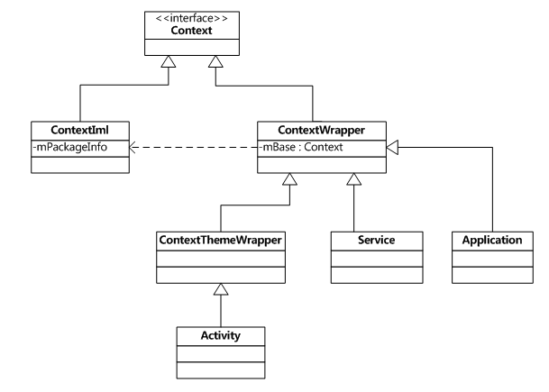

# 剖析Android中的Context类(1501210406 叶振旭)

在开发中，我们经常与Context进行打交道，然而，我们对它内部的原理、类结构关系却是“丈二和尚，摸不着头脑”。因此，它可谓是我们最熟悉的陌生人了。下面，我就试着揭开Context神秘的面纱。


# 一、Android中我们经常接触到Context的场景
1）在应用Tosat中，我们经常这样写：
Toast.makeText(MainActivity.this,”You clicked a button”, Toast.LENGTH_SHORT).show();
可以看到第一个参数就是Context，也就是Toast要求的上下文，由于活动本身就是一个Context对象，因此，直接传入MainActivity.this即可。

2）想实现从一个活动中跳转到其他活动，我们经常这样写：
Intent intent=new Intent( FirstActivity.this , SecondActivity.class)；
这个Intent的构造函数接收两个参数，第一个参数就是Context，即启动活动的上下文，第二个参数Class则是指定要跳转的目标活动。

3）发送一则广播时，我们经常这样写：
Intent intent=new Intent(“com.example.my_broadcast”);
context.sendBroadcast(intent); 
首先构建出一个Intent对象，把要发送的广播的值传入，然后调用Context类的sendBroadcast()方法将广播发送出去，这样监听com.example.my_broadcast这条广播的广播接收器就会收到信息。

4）接收一则广播时，我们经常这样写：
Public class my_broadcastReceiver extends BroadcastReceiver
{
 @Override
 Public void onReceiver(Context context ,Intent intent)
 { 
//这里你可以进行接收到广播后的行为。如简单显示已经接收到了广播。
   Toast.makeText(context, ”已经成功接收到广播了”, Toast.LENGTH_SHORT).show();
}
}
可以看到，这里onReceiver()方法的第一个参数便是context。

5）使用SharedPreferences存储数据。我们经常这样写：
SharedPreferences.Editor editor=getSharedPreferences(“data”,MODE_PRIVATE).edit();
editor.putString(“name”, “yezhenxu”);
editor.putInt(“age”, ”23”);
……
editor.commit();
通过Context类下的getSharedPreference()方法指定SharedPreference的文件名为data，并得当SharedPreferences.Editor对象，然后往editor添加数据,最后调用commit()方法进行提交，从而完成了数据存储的操作。
……

Context 就是用于获得系统资源的，我们所说的系统资源包括设备本身的信息，也有开发者提供的信息（类、包、资源文件等等……）。


# 二、Context是什么


## 2.1 SDK中对其说明如下：

1）Interface to global information about an application environment. 
它描述的是一个应用程序环境的信息，即上下文。

2）This is an abstract class whose implementation is provided by the Android system.
该类是一个抽象类(abstract class)，Android提供了该抽象类的具体实现类。

3）It allows access to application-specific resources and classes, as well as up-calls for application-level operations such as launching activities, broadcasting and receiving intents, etc.
通过它我们可以获取应用程序的资源和类，也包括一些应用级别操作，例如：启动一个Activity，发送广播，接受Intent信息等。


## 2.2 Context的作用

Context是一个抽象基类，我们通过它访问当前包的资源（getResources、getAssets）和启动其他组件（Activity、Service、Broadcast）以及得到各种服务（getSystemService），当然，通过Context能得到的不仅仅只有上述这些内容。Context提供了一个应用的运行环境，在Context的大环境里，应用才可以访问资源，才能完成和其他组件、服务的交互。

## 2.3 Context的类型


Context的类型有两种，一种是Activity Context，另一种是Application Context，这两种的区别就在于它们的生命周期不一样，一个是随着Activity的销毁而销毁，另一个是伴随整个Application。

### 2.3.1 Application Context

Application Context的生命周期是整个应用。在程序中，我们可以通过代码getApplicationContext();得到当前应用程序的application context。Application Context的生命周期为整个Application，所以如果是一些需要在整个应用期间都存在的资源，我们可以将它放进一个Application Context中，然后通过获取这个Context来使用它们。

### 2.3.2 Activity Context

这个Context的生命周期是和得到它的引用的Activity一样长，如果这个Activity结束了，那么，这个Context也会得到释放。它并不像我们上面的Application Context需要特意去获得，可以在一个Activity中使用this就可以获得当前Activity的Context。举个例子，如Toast.makeText(this,”clicked a button”Toast.LENGTH_LONG).show();，其中的this就是当前的Activity Context，但是，一味的使用this是很危险的，我们要注意的就是，在匿名内部类如果单纯只是使用this是会出错的，因为内部类中使用this得到的是内部类的对象引用，而不是我们要得到的外部类的引用，于是，这时候就必须使用类名.this这种方式，这种做法在按钮的事件监听中是特别要注意的。

### 2.3.3 Context导致的内存泄露

这里，我举两个例子来解释Context是如何导致内存泄露的。当然，泄露并不是真正意思的泄露，而是指内存不能被GC（垃圾回收机制回收），从而导致占用内存过大，发生Out of Memory，而被系统Kill的现象。只要类持有对外部类实例对象的引用，垃圾回收机制就不会回收该对象，就会出现内存泄露。

例1：我们要实现一个 ListView 展示信息的功能，为了自定义子 Item，我们需要传入 Context 来读取布局资源。

代码如下：
```
public class MyBaseAdapter extends BaseAdapter{
private Context mContext;

public MyBaseAdapter(Context context) {
mContext = context;
}
……
}

//设计完 BaseAdapter 以后，我们肯定要在 MainActivity 里面使用它了：
protected void onCreate(Bundle savedInstanceState) {
super.onCreate(savedInstanceState);
setContentView(R.layout.activity_main);

adapter = new MyBaseAdapter(this);

……
}

```
一般新手都会写出类似这样的代码，这样写都不会出现 Bug 对吧？事实上，这样的代码是会导致内存泄漏，为什么呢？
在这段代码中，我们将 Activity 的引用（this）传入 MyBaseAdapter，使得 MyBaseAdapter 持有对 Activity 的引用，那么相应地，我们也将持有 Activity 所获得的资源文件的引用。所以这些资源文件将无法被垃圾回收机制回收，造成内存泄漏的问题。

那么有什么解决办法呢？

我们只需要简单修改下代码：把private Context mContext;改成mContext = context.getApplicationContext(); 

或者把adapter = new MyBaseAdapter(this);改成adapter = new MyBaseAdapter(this.getApplication());就可以避免内存泄漏的问题。	

例2：Android官网提供的例子

在Android系统中，当我们进行了屏幕旋转，默认情况下，会销毁掉当前的Activity，并创建一个新的Activity并保持之前的状态。在这个过程中，Android系统会重新加载程序的UI视图和资源。假设我们有一个程序用到了一个很大的Bitmap图像，我们不想每次屏幕旋转时都重新加载这个Bitmap对象，最简单的办法就是将这个Bitmap对象使用static修饰。

代码如下：
```
private static Drawable sBackground;
@Override
protected void onCreate(Bundle state) {
super.onCreate(state);

TextView label = new TextView(this);
label.setText("Leaks are bad");

if (sBackground == null) {
sBackground = getDrawable(R.drawable.large_bitmap);
}
label.setBackgroundDrawable(sBackground); 

setContentView(label);
}

```
屏幕旋转的时候系统会销毁当前的activity。但是当drawable和view关联后（label.setBackgroundDrawable(sBackground);），drawable保存了view的引用，即sBackground保存了label的引用，而label保存了activity的引用。既然drawable不能销毁，它所引用和间接引用的都不能销毁，这样系统就没有办法销毁当前的activity，于是造成了内存泄露。GC对这种类型的内存泄露是无能为力的。

为了防止内存泄露，我们应该注意以下几点:

1）避免activity中的任何对象的生命周期长过activity，避免由于对象对 activity的引用导致activity不能正常被销毁；

2）对于生命周期长的对象，可以使用application context；

3）在引用静态资源，创建静态方法，单例模式等情况下，使用生命周期更长的Application的Context才不会导致内存泄漏；


# 三、Context类的继承情况

 

1）Activity类 、Service类 、Application类本质上都是Context的子类。

2） 你可以在android studio中跟踪Activity类的继承关系：把鼠标放到红色圈Activity处，如图1；然后按快捷键Ctrl+H ，便会看到如图2，显然Activity继承自ContextThemeWrepper，间接继承自Context。

图1

图2

3）如果你想更深层次的研究各个Context子类的源代码，你可以按快捷键F4进行跟踪。


# 四、下面通过代码具体分析Context类的情况


## 4.1 Context类

部分源代码如下：
```
public abstract class Context 
{
 // 启动一个新的activity
public abstract void startActivity(Intent intent);

// 广播一个intent 给所有感兴趣的接收者，异步机制
public abstract void sendBroadcast(Intent intent);

// 请求启动一个application service
public abstract ComponentName startService(Intent service);

// 请求停止一个application service
public abstract boolean stopService(Intent service);

// 获取应用程序包的AssetManager 实例
public abstract AssetManager getAssets();

// 获取应用程序包的Resources 实例
public abstract Resources getResources();

// 获取PackageManager 实例，以查看全局package 信息
public abstract PackageManager getPackageManager();

// 返回应用程序包名
public abstract String getPackageName();

// 返回应用程序信息
public abstract ApplicationInfo getApplicationInfo();

// 根据文件名获取SharedPreferences
public abstract SharedPreferences getSharedPreferences(String name,int mode);

//获取系统服务
public abstract Object getSystemService(@ServiceName @NonNull String name);
  ……
}

```
可以看出，Context类是一个抽象类，提供了一组通用的API。

## 4.2 ContextImpl类

该类实现了Context类的功能。

部分源代码如下：
```
class ContextImpl extends Context{  
//所有Application程序公用一个mPackageInfo对象  
ActivityThread.PackageInfo mPackageInfo; 
// Activity、Application、Service都是在ActivityThread中完成的。
//该函数的大部分功能都是直接调用其属性mPackageInfo完成的
@Override  
//得到系统服务对象
    public Object getSystemService(String name){  
        ...  
        else if (ACTIVITY_SERVICE.equals(name)) {  
            return getActivityManager();  
        }   
        else if (INPUT_METHOD_SERVICE.equals(name)) {  
            return InputMethodManager.getInstance(this);  
        }  
    }   
@Override  
    public void startActivity(Intent intent) {  
        ...  
        //开始启动一个Activity  
        mMainThread.getInstrumentation().execStartActivity(  
            getOuterContext(), mMainThread.getApplicationThread(), null, null, intent, -1);  
    }  
}  

```

## 4.3 ContextWrapper类

该类只是对Context类的一种包装，该类的构造函数包含了一个真正的Context引用，即ContextIml对象。

部分源代码如下：

```
public class ContextWrapper extends Context {  
    Context mBase; 
 //该属性指向一个ContextIml实例，一般在创建Application、Service、Activity时赋值 
 //创建Application、Service、Activity，会调用该方法给mBase属性赋值  
    protected void attachBaseContext(Context base) {  
        if (mBase != null) {  
            throw new IllegalStateException("Base context already set");  
        }  
        mBase = base;  
    }  
    @Override  
    public void startActivity(Intent intent) {  
        mBase.startActivity(intent); 
        //调用mBase实例方法  
    }  
}

```

## 4.4 ContextThemeWrapper类

该类内部包含了主题(Theme)相关的接口，即android:theme属性指定的。只有Activity需要主题，Service不需要主题，所以Service直接继承于ContextWrapper类。

部分源代码如下：
```
public class ContextThemeWrapper extends ContextWrapper {  
  //该属性指向一个ContextIml实例，一般在创建Application、Service、Activity时赋值  
     private Context mBase;  
 //mBase赋值方式同样有一下两种  
     public ContextThemeWrapper(Context base, int themeres) {  
            super(base);  
            mBase = base;  
            mThemeResource = themeres;  
     } 
     @Override  
     protected void attachBaseContext(Context newBase) {  
            super.attachBaseContext(newBase);  
            mBase = newBase;  
     }  
}  

```

# 五、Context何时被创建？

每一个应用程序在客户端都是从ActivityThread开始的，创建Context也在该类中完成。

应用程序创建Context实例有如下几种情况：

创建Application对象的时候， 而且整个App共一个Application对象；

创建Service对象的时候；

创建Activity对象的时候；

总Context实例个数：Service个数+Activity个数+1（Application对应的Context实例）

## 5.1创建Application对象的时机


每个应用程序在第一次启动时，都会首先创建Application对象。如果对应用程序启动一个Activity(startActivity)流程比较清楚的话，创建Application的时机在创建handleBindApplication()方法中，该函数位于 ActivityThread.java类中。

代码如下：
```
//创建Application时同时创建的ContextIml实例  
private final void handleBindApplication(AppBindData data){  
    ...  
    //创建Application对象  
    Application app = data.info.makeApplication(data.restrictedBackupMode, null);  
    ...  
}  

public Application makeApplication(boolean forceDefaultAppClass, Instrumentation instrumentation) {  
    ...  
    try {  
      java.lang.ClassLoader cl = getClassLoader();  
     ContextImpl appContext = new ContextImpl();    //创建一个ContextImpl对象实例  
     appContext.init(this, null, mActivityThread);
     //初始化该ContextIml实例的相关属性  
     //新建一个Application对象   
     app = mActivityThread.mInstrumentation.newApplication( cl, appClass, appContext);  
   appContext.setOuterContext(app);  //将该Application实例传递给该ContextImpl实例           
    }   
    ...  
}  

```

## 5.2创建Activity对象的时机

通过startActivity()或startActivityForResult()请求启动一个Activity时，如果系统检测需要新建一个Activity对象时，就会回调handleLaunchActivity()方法，该方法继而调用performLaunchActivity()方法，去创建一个Activity实例，并且回调onCreate()，onStart()方法等， 函数都位于 ActivityThread.java类。

代码如下：
```
//创建一个Activity实例时同时创建ContextIml实例  
private final void handleLaunchActivity(ActivityRecord r, Intent customIntent) {  
    ...  
    Activity a = performLaunchActivity(r, customIntent);  //启动一个Activity  
}  

private final Activity performLaunchActivity(ActivityRecord r, Intent customIntent) {  
    ...  
    Activity activity = null;  
    try {  
        //创建一个Activity对象实例  
        java.lang.ClassLoader cl = r.packageInfo.getClassLoader();  
        activity = mInstrumentation.newActivity(cl, component.getClassName(), r.intent);  
    }  
    if (activity != null) {  
       ContextImpl appContext = new ContextImpl();      //创建一个Activity实例  
    appContext.init(r.packageInfo, r.token, this);   //初始化该ContextIml实例的相关属性  
     appContext.setOuterContext(activity);  //将该Activity信息传递给该ContextImpl实例  
        ...  
    }  
    ...      
}  

```

## 5.3创建Service对象的时机

通过startService或者bindService时，如果系统检测到需要新创建一个Service实例，就会回调handleCreateService()方法，完成相关数据操作。handleCreateService()函数位于 ActivityThread.java类。

代码如下：
```
//创建一个Service实例时同时创建ContextIml实例  
private final void handleCreateService(CreateServiceData data){  
    ...  
    //创建一个Service实例  
    Service service = null;  
    try {  
        java.lang.ClassLoader cl = packageInfo.getClassLoader();  
        service = (Service) cl.loadClass(data.info.name).newInstance();  
    } catch (Exception e) {  
    }  
    ...  
    ContextImpl context = new ContextImpl(); //创建一个ContextImpl对象实例  
    context.init(packageInfo, null, this);   //初始化该ContextIml实例的相关属性  
    //获得我们之前创建的Application对象信息  
    Application app = packageInfo.makeApplication(false, mInstrumentation);  
    //将该Service信息传递给该ContextImpl实例  
    context.setOuterContext(service);  
    ...  
}  

```
