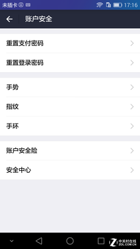
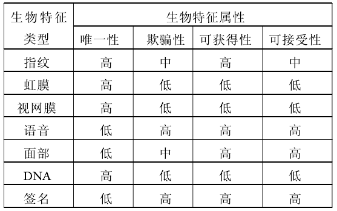
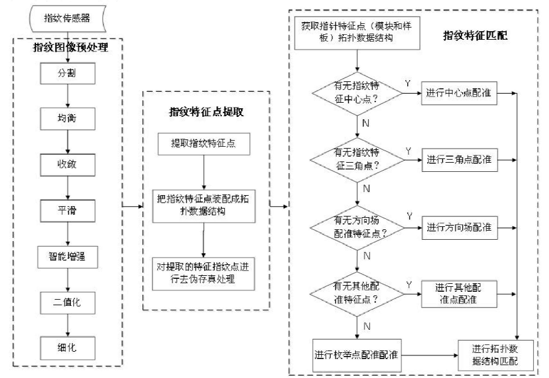
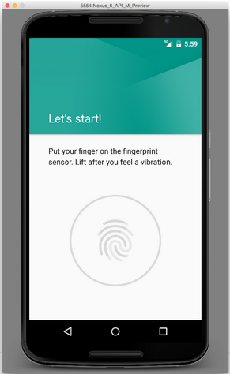
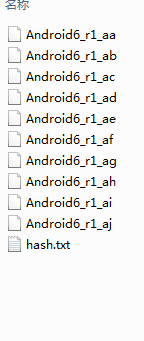
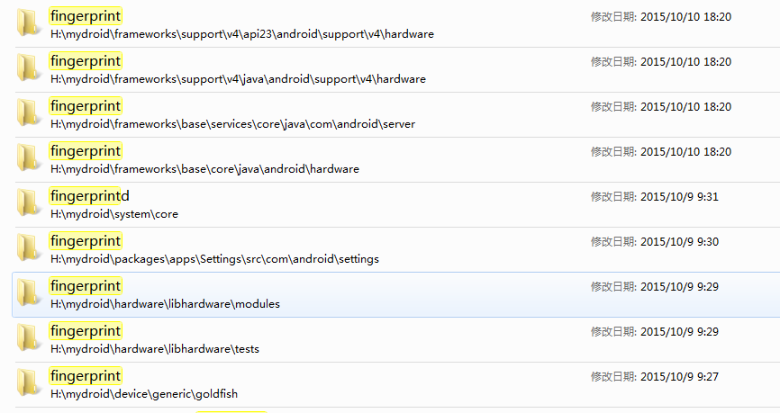
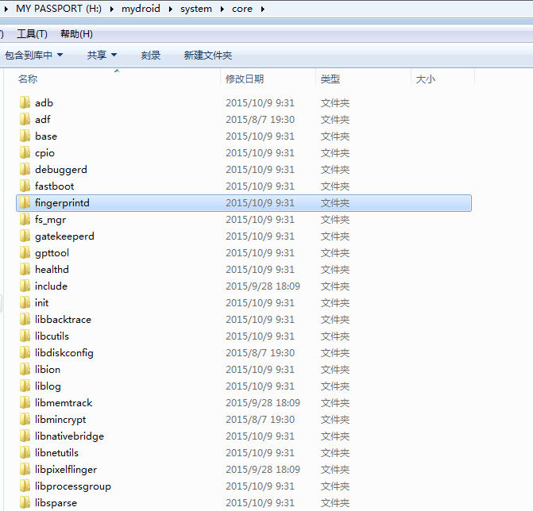
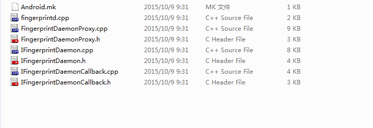
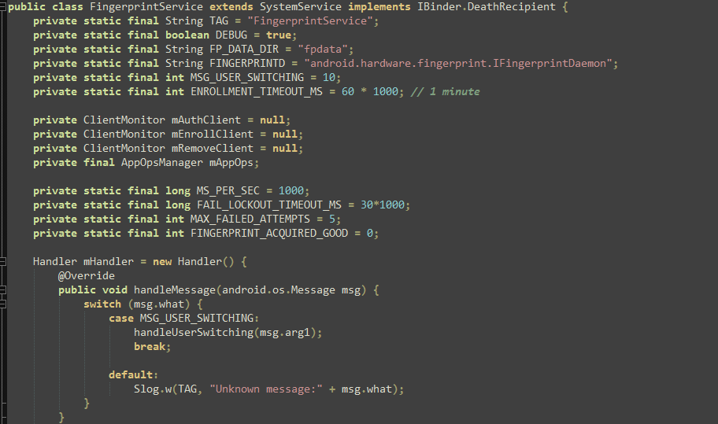

# Android 6.0 指纹识别功能详细分析(郭元歆)

## 引言
最近小米公司新出了一款手机红米note3十分受到大家的青睐，一方面原因可能是因为它比较廉价，但我认为最吸引眼球的是它是一款带有指纹识别的手机。2015年下半年出的手机基本都带有指纹识别功能，不管是炒得很热的360奇酷手机、魅族手机，还是“中华酷联”旗下的手机都开始加入指纹识别的功能，指纹识别似乎已经成标配，购买手机时考虑是否带有指纹识别功能似乎也成为了消费者的一个购物倾向。

指纹识别为何受到人们的青睐？答案似乎很明显，因为它比较方便，而且安全性也要比简单的数字密码要安全的多，但我想对于广大手机用户来说，如果能够通过手指按压直接解锁手机是要比解锁输入密码方便很多的。由于很多的原因吧，指纹识别越来越受到人们的重视。

Android 5.0对于ROM的优化是毋庸置疑的，令人诟病的Dalvik被替换为ART，操作系统的整体的感觉清爽了很多。但是Android 5.0并没有在操作内加入指纹识别的相关的支持，现在市面上Android 5.0手机的指纹识别都是一些基于Android的解决方案，并没有在系统深层次进行处理，这也是Android慢了ios一些的地方，但今年Google在Android的发布会上提出Android 6.0在其系统上添加了指纹识别的相关支持，这对于广大的Android粉丝来说真的算是一个很大的礼物。下面我对指纹识别以及Android 6.0系统中指纹识别的新特性进行分析。

##指纹识别是什么？
提到指纹识别我们就要先弄清楚什么事指纹，指纹为何能够做到区别性。

指纹，由于其具有终身不变性、唯一性和方便性，已几乎成为生物特征识别的代名词。指纹是指人的手指末端正面皮肤上凸凹不平产生的纹线。纹线有规律的排列形成不同的纹型。纹线的起点、终点、结合点和分叉点，称为指纹的细节特征点（minutiae）。

指纹识别即指通过比较不同指纹的细节特征点来进行鉴别。指纹识别技术涉及图像处理、模式识别、计算机视觉、数学形态学、小波分析等众多学科。由于每个人的指纹不同，就是同一人的十指之间，指纹也有明显区别，因此指纹可用于身份鉴定。由于每次捺印的方位不完全一样，着力点不同会带来不同程度的变形，又存在大量模糊指纹，如何正确提取特征和实现正确匹配，是指纹识别技术的关键。
 

###指纹识别的易用性
指纹识别功能提高了系统的易用性，不仅是解锁屏幕，它还可以用来设置一些快捷操作如：拍照、快捷打开程序等等，同时鉴于指纹识别的高区别性质，指纹识别不仅仅是对于功能的简化，更深层次的是安全级别的一个提高。

~~
   
指纹扫描认证功能在数款安卓智能手机上出现过，但相关模块与解决方案都来自第三方厂商，而非安卓内核或系统层面直接支持的产物。谷歌显然看到了相关技术的发展趋势，因此，6.0提供了来自谷歌的官方指纹API。顺带一提，苹果也为自己的TouchID指纹读取模块提供了类似的API。

###指纹识别的安全性
随着时代的发展网络支付等安全问题面临越来越多的问题，这传统的基于密码、加密算法和验证码的安全机制在安全性和方便性方面已经无法满足现有需求，甚至已经受到挑战。为了能够更好地确保系统的安全性和方便性，迫切需要寻找其他的技术。于是人们将目光转移到了生物特征识别技术上，因为人体某些生物特征各不相同并且不会发生变化以及很难遗失和仿制。目前被使用的生物识别技术主要有指纹、虹膜、视网膜、语音、面部、DNA以及签名，它们各自的性能以及优缺点如表所示：

 
 
每个人的指纹独一无二并且很难发生变化，此外，它不需要像密码那样需要记忆，真正做到了随时随地使用。目前已经有很多品种的低成本的指纹采集传感器供选择。指纹在采集的过程中对硬件系统的要求不高，指纹采集设备实现比较容易。目前已经有标准的指纹库供开发者使用，识别系统开发相对比较容易，实用性强。随着现代电子集成制造技术的提高，可以制造体积较小并且精度更高的指纹图像传感器。另外，快速可靠的指纹图像处理、识别算法也得到迅速发展，同时现代计算机运算速度越来越快，已经完全具备在微机上进行两个指纹的快速比对运算。可以说，目前指纹技术已经是非常成熟的生物识别技术，具有很大可靠性和实用性。

综上所述，当前指纹识别技术因其低成本识别率高而具有最为广阔的应用前景，已经达到实用化、产业化的程度。也正是因为指纹识别有如此多的好处，Google在2015年Android6.0发布会上指出Android6.0会在系统级别支持指纹识别功能，虽然相对Apple晚了一些但是对于广大的Android用户来说这是一个福音。

##指纹识别功能实现简介
指纹识别通过指纹传感器采集信息，进行指纹图像的预处理，然后进行特征点提取，最后进行特征匹配如下图所示：

 
 
通过指纹图像传感器采集到指纹图像经常会受到传感器本身误差、手指压力不同以及手指存在尘埃等众多因素影响，使得采集到的指纹图像的质量不够高。因此首先需要对指纹图像进行预处理，以便获得较为清晰的指纹图像并为后期的匹配做好准备工作。经过预处理后的指纹纹线被处理成单一象素点，接下来就可以对指纹图像进行特征提取以及特征装配。最后将获得的特征信息与指纹特征数据库中的指纹特征模板做一一对比，如果有匹配的指纹模板则提取出与之一一映射的身份信息，这样就可以进行身份论证。

##分析

###1.Android程序硬件访问机制简介：
在 Android 系统中，最上层的面向界面的应用程序使用 Java 语言编写，Java 编写的应用程序都运行在 Android 特有的虚拟机中。Android 系统是基于 Linux 内核构建，Linux 设备驱动程序程序使用 C 语言编写，且运行在 Linux 内核空间。用户空间访问硬件的方法是通过基于C库的系统调用来调用工作于内核空间的设备驱动程序，从而访问到硬件。显然使用 Java 语言开发的应用程序显然无法直接访问硬件。为了解决这个问题，在Android 系统中提供了硬件抽象层（HAL）来解决这个问题，硬件抽象层运行在用户空间并且使用 C/C++语言编写，它向下屏蔽了硬件驱动模块的实现细节，向上提供了硬件访问服务。

 
###2.Android系统HAL层定义分析
Android 系统为 HAL 层中的模块接口定义了规范，所有工作于 HAL的模块必须按照这个规范来编写模块接口，否则将无法正常访问硬件。

（1）硬件模块

Android 系统为 HAL 层中使用 struct hw_module_t结构来描述硬件模块，其定义如下：

    typedef struct hw_module_t {
        uint32_t tag;
        uint16_t module_api_version;
        #define version_major module_api_version
        uint16_t hal_api_version;
        #define version_minor hal_api_version
        const char *id;
        const char *name;
        const char *author;
        struct hw_module_methods_t* methods;
        void* dso;
        uint32_t reserved[32-7];
    }hw_module_t;

在 struct hw_device_t 结构中，成员 tag 必须初始化为 HARDWARE_ DEVICE_TAG；成员version 为 hw_device_t 的版本号；成员 method 指向指向硬件模块描述结构体的指针；成员close 为关闭设备的方法。

在编写硬件抽象层模块时，必须为抽象层模块自定义一个硬件抽象层描述结构，并且必须是 
struct hw_module_t 类型的变量作为它的第一个成员变量，否则该抽象层模块将无法正常工作。另外，在模块中使用自定义一个硬件抽象层描述结构定义一个变量时，它的名字必须为 HAL_MODULE_INFO_SYM（导出符号），它会在模块被加载时用到，否则该抽象层模块会因无法正在加载而无法正常工作。	
	

（2）硬件设备

在硬件抽象层中使用 struct hw_device_t 结构来描述硬件设备，其定义如下：

    typedef struct hw_device_t {
        uint32_t tag;
        uint32_t version;
        struct hw_module_t* module;
        uint32_t reserved[12];
        int (*close)(struct hw_device_t* device);
    } hw_device_t;  

在 struct hw_device_t 结构中，成员 tag 必须初始化为 HARDWARE_ DEVICE_TAG；成员version 为 hw_device_t 的版本号；成员 method 指向指向硬件模块描述结构体的指针；成员close 为关闭设备的方法。
	在编写硬件抽象层模块时，必须为模块所操作的硬件设备自定义一个硬件设备描述结
构，并且必须是 struct hw_device_t 类型的变量作为该硬件设备描述结构的第一个成员变量，否则该抽象层模块将无法正常工作。

（3）硬件抽象层模块的操作方法

在硬件抽象层中使用 struct hw_module_methods_t 结构描述一个硬件抽象层模块的操
作方法列表，其定义如下：

    typedef struct hw_module_methods_t {
        Int (*open)(const struct hw_module_t* module, const char* id,
        struct hw_device_t** device);
    } hw_module_methods_t;
    
struct hw_module_methods_t 结构中的 open 函数指针通常被赋值为硬件模块初始化函数，在该函数中通常需要为自定义硬件设备描述结构体分配内存，然后初始化其成员并且打开硬件设备，最后将自定义一个硬件设备描述结构的一个成员（struct hw_device_t 类型）保存到参数 device 中。否则该抽象层模块将无法正常工作。
以上是对于Android系统HAL层的详细分析。

###下面对Android6.0源码分析：

下面对比较特列的代码进行分析。因为代码量比较大，我将需要列示的代码列举在附录中供参看。

首先需要进行源代码的下载和获取，从官方网站下载了Android 6.0的源代码。

 
获取的代码需要在Linux系统下用cat 命令解压缩 。
进行合并后目录结构如下图：
 

 
其下面的指纹识别相关的目录结构：

 
可以看到不管是从系统内核级别还是硬件支持等方面Android 6.0 都对指纹识别添加了支持

目录：mydroid\system\core

 
Fingerprintd\

 
Android.mk  文件为Makefile文件

其内容如下

    LOCAL_PATH := $(call my-dir)
    include $(CLEAR_VARS)
    LOCAL_CFLAGS := -Wall -Wextra -Werror -Wunused
    LOCAL_SRC_FILES := \
    	FingerprintDaemonProxy.cpp \
    	IFingerprintDaemon.cpp \
    	IFingerprintDaemonCallback.cpp \
    	fingerprintd.cpp
    LOCAL_MODULE := fingerprintd
    LOCAL_SHARED_LIBRARIES := \
    	libbinder \
    	liblog \
    	libhardware \
    	libutils \
    	libkeystore_binder
    include $(BUILD_EXECUTABLE)
    
主要是对于这个功能的编译时一系列的规则来指定，哪些文件需要先编译，哪些文件需要后编译等。
 
 
fingerprintd.cpp  

系统中的指纹识别线程

    #define LOG_TAG "fingerprintd"
    #include <cutils/log.h>
    #include <utils/Log.h>
    #include <binder/IPCThreadState.h>
    #include <binder/IServiceManager.h>
    #include <binder/PermissionCache.h>
    #include <utils/String16.h>

    #include <keystore/IKeystoreService.h>
    #include <keystore/keystore.h> // for error codes

    #include <hardware/hardware.h>
    #include <hardware/fingerprint.h>
    #include <hardware/hw_auth_token.h>

    #include "FingerprintDaemonProxy.h"

    int main() {
        ALOGI("Starting " LOG_TAG);
        android::sp<android::IServiceManager> serviceManager = android::defaultServiceManager();
        android::sp<android::FingerprintDaemonProxy> proxy =
                android::FingerprintDaemonProxy::getInstance();
        android::status_t ret = serviceManager->addService(
                android::FingerprintDaemonProxy::descriptor, proxy);
        if (ret != android::OK) {
            ALOGE("Couldn't register " LOG_TAG " binder service!");
            return -1;
        }

        android::IPCThreadState::self()->joinThreadPool();
        ALOGI("Done");
        return 0;
    }
    
以上列举了两个Android6.0中系统内核中的代码，Android6.0把指纹识别当做一个单独的线程进行运作。可以预见这会对现在Android系统指纹识别的效率有一个质的飞跃。

H:\mydroid\frameworks\base\services\core\java\com\android\server\fingerprint
 

 
FingerprintService.java

多客户端时硬件抽象层（HAL）对于指纹识别的支持

解决了现阶段出现的多个客户端情况下指纹识别无法使用或者出现错误或者卡顿的情况，因为在6.0之前使用多为第三方的解决方案，而6.0将完全支持。

 
以上为FingerprintService.java部分代码。

##总结与展望
首先进行总结。本文首先介绍指纹识别技术的相关内容及其现状，可以看出未来指纹识别是不可或缺的一种功能，不管是Android 还是其他的系统，而且通过对比得出指纹识别是现阶段最安全而且最经济易用并且在技术上有一定成熟度，无论从成熟度还是实用性方面都明显优于其他生物识别技术。然后对于指纹识别进行了简单的介绍，并且对指纹识别的实现方法进行了介绍。接着对Android实现系统支持指纹识别的方法进行论述，首先介绍了Android的硬件访问机制，然后接着介绍Android HAL层在指纹识别中扮演的角色，并且介绍了其相关的函数定义和接口的规范。通过上面的准备工作，接下来我通过下载Android源代码，进行解压合并，分析其目录结构，可以充分看出Android6.0在指纹识别上的支持。并且通过代表性的几个源代码分析Android对于指纹识别的实现方法。以上是我做的主要工作。

指纹识别的展望。指纹识别越来越受到人们的重视，Android 6.0对指纹识别的支持是Google 2015年最大的战略，虽然在此前他们可能不看好，但是事实证明指纹识别不仅仅只是为了解锁手机，在安全方面，包括手机的防盗这些方面都扮演了重要的角色，相信未来，不仅仅是手机，汽车，乃至家电、家具对于安全方面要求上都可以通过指纹来，而且物联网现在发展迅速，指纹识别对于用户的安全起到了重要的作用。

##感想
经过一学期的学习，不仅让我对基本的Android编程有了提高，而且让我对Android这款操作系统也激起了很浓厚的兴趣，尤其在其优化等方面。相信不久的将来，Android会越来越好，特别感谢张老师的悉心教导，对学生的问题十分重视，这也是我们能够提高的重要原因，现阶段我对Android开发水平还只是基础阶段，但是已经有了一个良好的开端，相信以后我能够真正的了解并且能够运用学到的知识。
