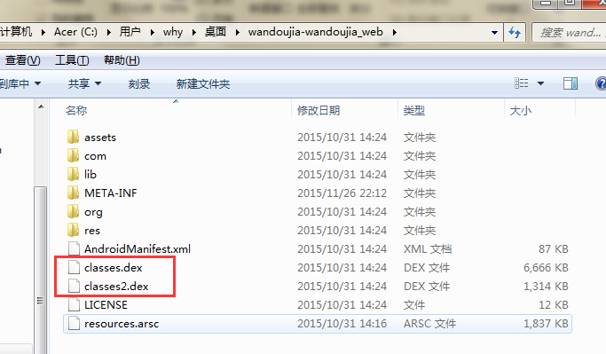

# Android MD5加密算法及混淆技术探究(1501210723 魏焓颖)

###1、android混淆技术
Android混淆是Android开发者经常使用的一种用于防止被反编译的常见手法。Android开发基于java语言的，很容易被别人反编译出来，一下就相当于裸奔了，特别是用于商业用途的时候，防止反编译是必要的措施。而Android混淆的确可以保证Android源代码的一定安全。
####1.1 Java类名、方法名混淆
Dalvik字节码包含了大量的调试信息，如类名、方法名、字段名、参数名、变量名等，使用反编译工具可以还原这些信息。由于类名、方法名等通常都会遵循一定的命名规范，破解者很容易根据这些信息来猜测代码功能，阅读起来就跟查看源代码一样。从Android 2.3开始，Google在SDK中加入了一款叫ProGuard的Android混淆工具，ProGuard会删除这些调试信息，并用无意义的字符序列来替换类名、方法名等，使得使用反编译出来的代码难以阅读，提升逆向难度。使用ProGuard 对Android混淆过后，反编译出来的类名和方法名无法阅读，但是反编译出来的功能代码仍然是非常容易阅读的，和源代码差不多，破解者仍通过阅读功能代码来自行标记类名、方法名等，然后逆向破解。
####1.2 Java代码混淆
通过对功能代码流程进行乱序混淆，实际运行时乱序Android混淆后的代码流程却和原始代码流程是一样的，但反编译出来的代码流程静态阅读时与原始流程有很大差异，使破解者很难通过静态分析理解代码功能，从而保护Android混淆代码不被逆向分析。比如，原始的代码流程是1->2->3->4->5->6->7，经过乱序Android混淆后静态反汇编查看到的代码流程可能变成2->7->5->1->6->4->3，实际运行时代码流程仍然是1->2->3->4->5->6->7。
####1.3 Dalvik字节码加密
将dex文件中的部分或全部Dalvik字节码加密，Android混淆，每次需要执行时由专门的Native代码负责动态解密和回填，静态反编译出来的代码已经无法阅读甚至无法反编译，动态调试也难以逆向分析。目前有这一技术的有 爱 加 密。
####1.4 Android apk加密
Android混淆可以保证源代码的一定安全，但是并不全面。Android apk加密技术包括：DEX加壳保护，DEX指令动态加载保护和高级源码混淆保护。其中DEX加壳保护通过将DEX文件隐藏，并生成一个类似于虚像的壳文件，阻止黑客利用反编译工具获取App源码。另外，爱 加 密 独有的so库保护，使得C/C++ 层面的代码安全也得到防护。加上资源文件保护（图片、音频等文件的防查看和防修改）、xml 主配文件保护（对主配文件进行二次签名）、内存保护等措施，可以基本保证App的动态和静态安全。

###2、	相关知识
####2.1	关于dex文件
APK是Android Package的缩写，即Android安装包(APK)。APK文件盒Symbian Sis或Sisx的文件格式差不多。通过将APK文件直接传到Android模拟器或Android手机中，然后执行并安装。APK文件和SIS一样，把Android Sdk编译的工程打包成一个安装程序文件，这个文件的格式为APK。
APK文件其实是ZIP格式的一个压缩包，但后缀名被修改为APK，通过UnZip解压后，我们就可以看见Dex文件，Dex是Dalvik VMexecutes的全称，即Android Dalvik执行程序，并非Java ME的字节码而是Dalvik字节码。
在Android平台中dalvikvm的执行文件被打包为APK格式，最终运行时就会被加载器解压然后获取编译后的android manifest.xml文件中的permission分支相关的安全访问，但是仍然拥有很多限制，如果你将APK文件传到/system/app文件夹下会发现执行是不受限制的。安装的文件可能不是这个文件夹，而在Android Rom中系统的APK文件默认会放入这个文件夹，它们拥有着Root权限。
接下来看一下，以豌豆荚APK为例，
 
下面进行解压缩，可以看到有了dex文件：
  
其中，META-INF文件夹一般存放apk的签名文件，res文件夹存放资源文件，AndroidManifest.xml是程序的全局配置文件，classes.dex是Dalvik下的可执行程序，resources.arsc是编译后的二进制资源文件。要想实现对apk文件的加壳脱壳首先得熟悉dex文件的结构，接下来就一步步的分析并熟悉dex文件。
Dex(Dalvik VM executes)即Anroid Dalvik虚拟机下的可执行程序，由Dalvik字节码组成，Dex文件的结构比较紧凑，但是还可以将其进一步优化成ODEX文件。Dex文件结构如下：
  
  
基本的DEX 头如下所示, 大小为112bytes(0x70字节).
 
typedefstruct DexHeader {
u1 magic[8]; /*includes version number */
u4 checksum; /*adler32 checksum */
u1 signature[kSHA1DigestLen]; /*SHA-1 hash */
u4 fileSize; /*length of entire file */
u4 headerSize; /*offset to start of next section */
u4 endianTag;
u4 linkSize;
u4 linkOff;
u4 mapOff;
u4 stringIdsSize;
u4 stringIdsOff;
u4 typeIdsSize;
u4 typeIdsOff;
u4 protoIdsSize;
u4 protoIdsOff;
u4 fieldIdsSize;
u4 fieldIdsOff;
u4 methodIdsSize;
u4 methodIdsOff;
u4 classDefsSize;
u4 classDefsOff;
u4 dataSize;
u4 dataOff;
}DexHeader;

对于Dex文件中的类，类数据之间的关系图如下：
  
对于每个类而言，都有一个class_def_item结构体，其中class_idx指明了这个类的类名，superclass_idx指明了这个类的父类，在这个class_def_item结构体中最重要的就是class_data_off这个字段，这个字段指出了这个类中所拥有的字段和方法，在混淆时需要先混淆类名，然后找到这个类所拥有的字段和方法进一步混淆。

####2.2	MD5加密算法
MD5，全称Message Digest algorithm 5，信息摘要算法，是一种基本的单向加密算法。它是一种非可逆加密，就是不可解密的加密方法。
MD5是一个安全的散列算法，输入两个不同的明文不会得到相同的输出值，根据输出值，不能得到原始的明文，即其过程不可逆；所以要解密MD5没有现成的算法，只能用穷举法，把可能出现的明文，用MD5算法散列之后，把得到的散列值和原始的数据形成一个一对一的映射表，通过比在表中比破解密码的MD5算法散列值，通过匹配从映射表中找出破解密码所对应的原始明文。
MD5的算法思想表示如下图：
  
关于MD5算法的java代码如下：
  

public static String getMD5(String str) {
    try {
        // 生成一个MD5加密计算摘要
        MessageDigest md = MessageDigest.getInstance("MD5");
        // 计算md5函数
        md.update(str.getBytes());
        // digest()最后确定返回md5 hash值，返回值为8为字符串。因为md5 hash值是16位的hex值，实际上就是8位的字符
        // BigInteger函数则将8位的字符串转换成16位hex值，用字符串来表示；得到字符串形式的hash值
        return new BigInteger(1, md.digest()).toString(16);
    } catch (Exception e) {
        throw new SpeedException("MD5加密出现错误");
    }
}

###3	设计实现
####3.1	系统总体架构
（1）系统主要由获取DEX的字段和方法，以及混淆字段和方法两部分组成：
   

（2）主要研究内容

   

####3.2	混淆规则
并不是所有的类，方法和字段都能被混淆，在使用proguard混淆代码时同样需要进行一系列的设定，指出哪些可以被混淆，哪些不能被混淆，常用的混淆规则有：
	Android系统组件（Activity，Service等）不能被混淆
	自定义view不能被混淆
	jni调用不能被混淆
	Android R文件不能被混淆
	Android Parcelable，需要使用android序列化的不能被混淆
	枚举类型不能被混淆
	某些资源文件不能被混淆
	不能混淆init函数

由于混淆规则很多，要实现proguard那样的混淆器并不容易，本次实现代码中进行了简化，主要目的在理解混淆的原理。

####3.3 关键代码
混淆之后需要重新计算Dex文件的头部中的signature和checksum，python代码如下：
def ReCalSignature(self):
        #4 + 4 + 4 + 20
        self.dex.seek(32)
        sigdata = self.dex.read()
        sha1 = hashlib.sha1()
        sha1.update(sigdata)
        print "signature:",sha1.hexdigest(),"\n",sha1.digest()
        
        self.dex.seek(12)
        self.dex.write(struct.pack("20s",sha1.digest()))
        
    
    def ReCalChecksum(self):
        self.dex.seek(12)
        checkdata = self.dex.read()
        checksum = zlib.adler32(checkdata)
        print "checksum:",checksum
        
        self.dex.seek(8)
        self.dex.write(struct.pack("i",checksum))
生成固定长度的随机字符串：
self.randomstr = ["a","b","c","d","e","f","g","h","i","j",\
                          "k","l","m","n","o","p","q","r","s","t",\
                          "u","v","w","x","y","z",\
                          "A","B","C","D","E","F","G","H","I","J",\
                          "K","L","M","N","O","P","Q","R","S","T",\
                          "U","V","W","X","Y","Z",\
                          "0","1","2","3","4","5","6","7","8","9"]# 62

   def GenRandomStr(self,len):
        
        while True:
            
            str = ""
            
            for i in range(len):
                num = random.randint(0,61)
                str = "".join([str,self.randomstr[num]])
            print str
            
            if self.usedstr.has_key(str): #防止重复
                continue
            else:
                self.usedstr[str] = 1
                break
        
        return str
在混淆类名是需要注意：类名中包含的包名不能被混淆，比如类名：Lcom/example/util/Signature;
这时Lcom/example/util/ 这一段是不能被混淆，并且最后的;也不能被混淆，所以需要被混淆的数据只有Signature。实现时可以从字符串后面往前找到第一个/，混淆长度中再减去1(;长度) 。
在混淆方法名和字段名时没有混淆类名时的那种限制，直接进行混淆即可。

####3.4 混淆效果
1）解压apk.用好压就能直接解压，获取到classes.dex文件
  
2）用dex2jar这个工具来生成classes_dex2jar文件.
 a,把刚刚解压出来的classes.dex文件放到dex2jar根目录，然后用dos命令定位到该目录，执行命令dex2jar.bat classes.dex直到done.
  
就会发现多了一个jar文件。
  
然后用jd-gui打开这个jar文件,就能看到项目的结构了

可以看到a.b.c这些被更改的类名，说明混淆成功

###4	参考资料
1）	Android studio代码混淆使用心得 http://www.softwareace.cn/?p=1151
2）	Dex混淆原理
http://burningcodes.net/dex%E6%B7%B7%E6%B7%86%E7%9A%84%E5%8E%9F%E7%90%86%E5%8F%8A%E5%AE%9E%E7%8E%B0/
3）	http://bbs.e4asoft.com/thread-21218-1-1.html
4）	http://blog.csdn.net/hytfly/article/details/24459257
5）	http://jingyan.baidu.com/article/72ee561ab02632e16138dff8.html
