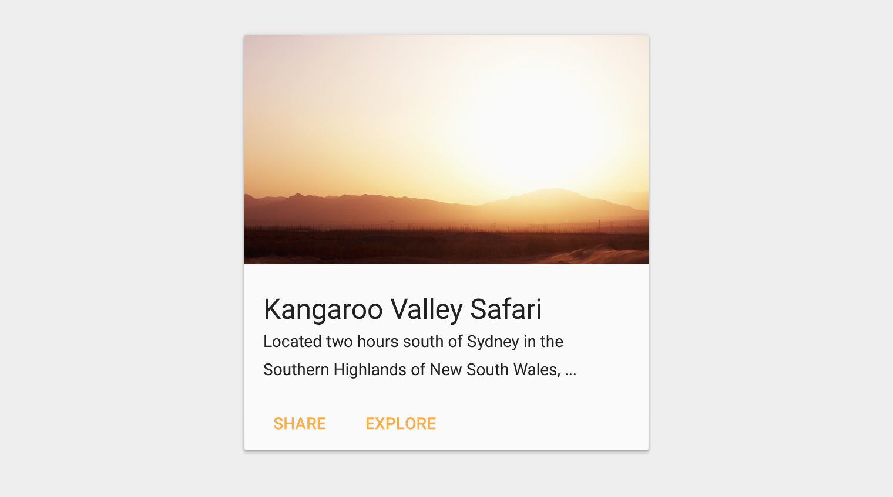
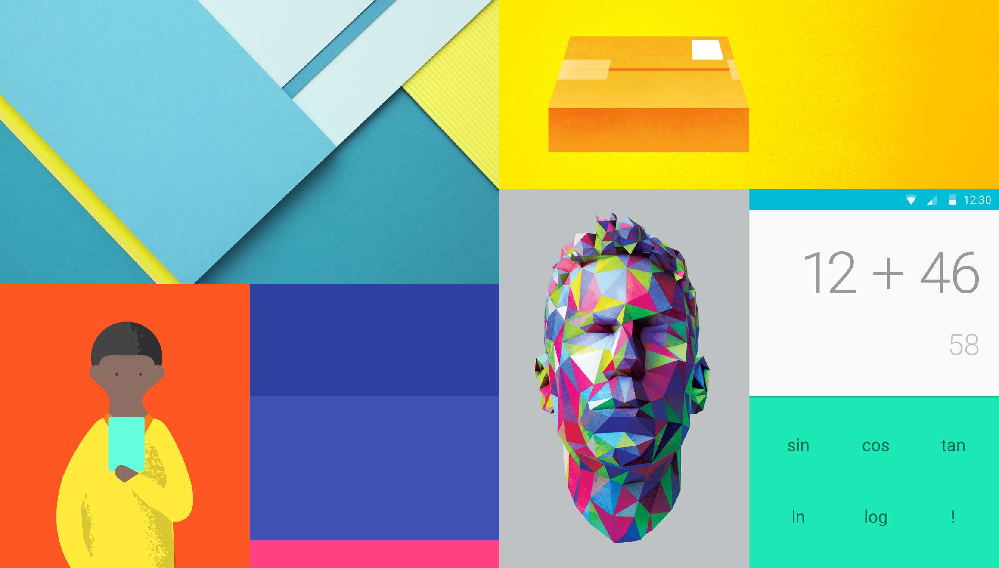

# Material Design与移动应用界面设计(1501210724 魏钊旸)

## 前言

> “设计是事物的内在灵魂，它不仅表现在外观，更表现在内涵。”

我们所面对的这个世界比历史上任何时候都要纷繁复杂，这导致我们必须以多样化的思维应对手中的工作。作为一个程序开发人员，我们所面对的问题已经不限于程序和代码层次，而更常见的，我们需要去考虑程序的外观、交互和用户体验，这几个方面在移动应用程序开发领域显得尤为重要——在功能大体一致的情况下，拥有良好界面和用户体验的应用程序将更会受到用户的欢迎，这也是为什么我们经常将应用开发者称之为“设计师”。但是，大部分的移动应用开发者并不具备良好的设计经验和设计技能，也很难找到提升应用程序用户体验的途径，这个时候，我们就需要业界的领导者、亦或是平台的提供者，给出一系列用于用户界面设计的建议，以方便应用开发者以一套统一的设计风格快速设计出良好时尚的应用界面。这就是Material Design等一些应用程序设计规范的来源。

## 从Holo到Material

这并不是Google第一次尝试确立设计规范。早在Gingerbread（Android 2.3）阶段，Google就已经开始尝试把应用软件的配色、界面布局等设计要素进行统一。Ice Cream Sandwich (Android 4.0）系统则正式带来了名为Holo的设计规范。这是一次好的尝试，它带来了以蓝色为主的配色风格以及突出线条、简易图形的交互元素准则。在某些程度上，Holo是Material Design的先导，Holo中包含的某些动画效果和视觉反馈仍然在现在的设计风格中得到沿用；但是Holo并不是一个成功的作品，它所呈现的视觉效果过于科技化，风格十分单一——最关键的是，人们并不理解Holo这种设计风格所包含的蕴意。短短两年后，Holo就被Material Design所替代。

这不是Google第一次在设计上栽跟头，作为一家以想象力和创造力的互联网公司，它们要为各种平台的各种产品进行用户界面设计。但是因为种种原因，他们所带来的杰作并不多见，很多产品的用户界面一变再变，某些软件的设计风格甚至于惨不忍睹。对于这些“精于技术，疏于艺术”的工程师而言，他们最大的问题在于，虽然他们已经称霸互联网行业十多年，但仍然不存在一种统一化的设计思维——他们才刚刚知道要做这样一件事。

> “设计并不是创造新事物，而是对于世界和生活的重新理解。”

至少在目前来说，一种成功的、受到大众欢迎的设计风格一定源自于人类的生活要素，人们不会对他们熟悉的东西感到陌生，而这种熟悉感是界面设计的精髓。Apple公司在三十年前就意识到了这一点并着力推广图形化界面，并在之后的年代中强调拟物化设计思维。

（现在的很多主流设计，实质上都是拟物化设计的一种延伸而不是替代。交互元素设计仍然离不开现实元素，超现实的设计风格很难受到大众的理解和欢迎。）

Material Design同样如此，它大量借鉴了日常生活中的元素来设计界面风格和动画效果。它是Google十多年来提出的首个完整的而且十分精美的设计风格。自2013年发布，Google已经开始在其各类产品中应用Material Design并公开了一系列详细的设计参考文档供开发者和设计师们参考。

至少在目前来看，它无疑是一种十分成熟而且具有吸引力的设计风格。不仅限于Android开发领域，很多网页和iOS开发者同样开始学习和使用Material Design。Google这次带来的虽然不是一款实质意义上的产品，但同样充满生命力和创造力，并能够以其独特的魅力和光彩来吸引着人们。

## 技术与设计，进步与革新

很多事物的进步和变革是需要先决条件的，移动设备的用户界面设计直到近些年猜得到飞速发展，这完全是得益于硬件水平的提升。事实上，移动设备在很长时间以来都是作为生活和工作的附属品，其地位远远不能和PC相提并论，直到Apple公司为世界带来了iPhone，人们才意识到移动设备（或称之为便携式设备）具有如此强大的潜力。当手机可以以极高的效率呈现视觉特效，并具备多重交互方式的时候，很多人意识到，界面设计的革命来了。

互联网技术的发展也在很大程度上影响着这一切。面对设备多样化和浏览器的性能提升，丰富的动画元素和响应式设计开始称为网页设计的主流。网页设计和移动应用设计在前端方面并无不同，它们可以相互渗透，相互替代。关键在于，作为现在的设计师或是开发者，如何能够快速实现一套时尚的、精致的用户界面？要知道，如今的知识体系异常复杂，很多程序开发人员很难去快速学习并掌握设计方面的知识。

这时，作为开发者，我们就需要一种设计语言来表达所要呈现的内容。之所以称之为语言，是因为与真实语言类似，我们同样需要一种成熟的表达方式，而且这种表达方式必须是成体系、有规范的。面向开发者的设计语言需要对其设计风格给出解释，并提供一套完整的设计规范以供开发者参考。

设计语言的好处是双向的。对于平台而言，它可以建立起统一的设计风格，增强整个系统的吸引力；而对于应用程序和开发者而言，设计语言可以为用户界面设计提供参考和灵感，减少在设计过程中的工作。实际上，目前主流的界面设计语言都拥有共通的一些地方，比如与iOS的拟物化设计风格类似，Material Design也鼓励从现实物品之中获取灵感；与Windows所推荐的Modern UI风格类似，Material Design同样希望大量采用卡片风格和亮丽的色彩。但是Material Design并不仅仅止步于界面的外观，它对于元素的动态效果和交互模式，以及整个用户界面设计风格所体现出的内涵都给出了可供参考的建议和规范，以方便应用开发者对应用的各个细节进行分析和设计。

然而我们需要注意的是，设计语言是具有时效性的，再美好的事物都会随着时间的流逝而被人们所厌倦，因此设计语言本身必须不断改进以符合时代特征。

## Card、Shadow和Material

那么，什么是Material Design？按照字面意思翻译是“材料设计”，但这里的Material并不能用“材料”来简单地概括。考虑一下用户界面中可用于承载内容的各种元素，比如说列表文字、图片以及按钮。在之前的设计过程中，我们往往采用最直观、最简便的方式来设计这些元素的外观。而在Material Design之中，这些元素具有一个统一的原型，这种原型拥有一致的视觉效果，其设计灵感来自于现实中的纸张和笔墨，相互之间存在简明的层次关系，我们把这种原型称之为Material——它并不是某种现实中所直接存在的物品，而更像是一种这类现实物品的隐喻。

举个例子来讲，大部分符合Material Design设计规范的用户界面中都会使用卡片来作为简短内容的呈现容器，这些卡片拥有统一的视觉外观以及与真实世界的卡片类似的交互体验和动态效果（如拖动、滑除）。
这种概念是如何而来的？Google在推出Material Design的时候展示了一些工程师们用来设计某些设计原型时所做的工作。他们并不是使用数字工具来进行设计，甚至没有使用画笔来进行画图，相反的，他们采用了非常原始也十分新颖的办法——使用剪纸和真实的光影效果。

（现在很多设计师们意识到，纯数字的设计模型依旧很难与真实的事物和场景相比，于是他们更多地会尝试采集真实世界中的范例来完成设计工作，比如Windows 10的默认壁纸和Apple Watch的动态壁纸。）

工程师们使用纸张真实呈现了他们头脑中的设计原型，然后通过不断调整成品之中各个元素之间的层次以及光照和阴影效果来观察设计作品的视觉效果，并希望得到一种能具有最良好的视觉体验的设计参数（光照角度、层次之间的距离等等）。

这种设计流程是成功的，设计完成的图标和设计原型不仅完美实现了原有的设计目标，也带来了充满吸引力和创造力的视觉效果。工程师们认为可以近一步将这种设计流程转化为一种设计语言，通过从现实物品上汲取灵感来创造出优美和谐的设计语言。

这就是Material的由来，Google希望将现实物品的某些概念带入用户界面设计，以此来减弱现实与数字世界之间的隔阂。Material可以良好地在虚拟的用户界面中呈现这些现实元素的概念，并能够承载和呈现更多的信息，以此来实现良好的用户体验。

## 立体化的视角和层次化的布局

Material Design的首个要点，就是强调元素的立体视觉效果。也就是说，Material Design希望设计师在屏幕上实现三维的视觉感受。一般而言，大部分设备的屏幕都是二维的，表现在界面设计上面，也就是元素的定位只有X和Y两个值。而Material Design引入了Z值，以此来描述元素的高度。也就是说，界面中的所有元素可以拥有不同的高度，而Material Design会通过修改元素的阴影效果和变形属性来呈现这种高度。

另外，在Material Design中，大部分元素都具有一定的厚度，这意味着元素本身会具有实体感，用户所见到的内容并不是呆板地存在于屏幕上，而是具有一定的真实感，甚至允许进行触摸和翻动。
使用立体化设计以及允许元素拥有厚度的理由，就是为了呈现一种层次化的布局。众所周知，我们所讨论的设计语言所面对的设计对象是承载内容的视觉元素，这些内容可能是图片、文字等等。为了合理安排这些内容之间的关系同时不会使用户产生疑惑和厌烦，适当地对内容进行分割是必要的。

在日常生活中，我们往往会把很多文件叠放在一起以节省桌面空间，而当我们需要查看信息时，就会翻动这些文件或是将它们散布在桌面上来寻找内容。这实际上就是一种层次化的信息安排方式。Material Design借鉴了这种模式，
通过拓展第三维度并使用层次化布局，Material Design可以允许视窗中存在更多的内容，而这些内容具有清晰的层次关系而且并不会使用户产生疑惑。

（在Android中，Material Design中对于各种元素的高度都有一定的限制，执行不同任务的元素会分别活动在不同的层次上，以此来呈现良好的视觉效果。）

层次化视图是Material Design最重要的一个要则，它说明了设计的方向以及视觉元素必须包含的某些属性，也是设计师们所研究和着力实现的目标。

## 卡片式外观与阴影

在Material Design之中使用最多的一种“Material”就是卡片，这是我们所最常见到的生活元素之一，在孩童时期我们就利用卡片来学习知识。卡片无论是在内容展示还是在交互友好度方面都有着胜过其他生活元素的地方，因此，我们使用卡片来作为用户界面的内容承载物。

在Material Design中，卡片是一种具有厚度、拥有阴影特效的元素容器，通常用来展示图片和文字，同时能够对用户的触摸、长按、滑动等交互动作产生反馈。将屏幕上的内容分割为卡片之后，用户界面将显得生动而充满吸引力。有经验的设计师会重逢利用精美的图片和亮丽的配色增强卡片的显示效果。

给元素带来卡片式外观最重要的属性就是元素的阴影特效，阴影特效在Material Design之中被反复强调，是因为这是一种体现元素立体视觉效果最有效率的方法。

在设计用户界面时，我们不可能也不应该用一些复杂的方法来呈现视觉要素，而是努力用一些友好的视觉特效体现设计意图。合适的阴影效果不仅可以增强元素的层次感和立体感，同时可以用来强调元素边界，体现光照效果。在Material Design中，元素的层次化关系和在视窗中的高度完全依靠阴影的属性来呈现，阴影对于现代化的用户界面设计至关重要。

阴影的设计十分复杂，元素的阴影属性会包含5个以上的参量，只有经过精心设计的阴影效果才能让人们感到满意，而在设计的过程中往往需要不断的尝试，并与真实世界中的阴影做比对才能得到良好的结果。

## 动画与交互动作

> “你所能见到的任何事物都不应该是凭空出现、突然消失的，正如你在现实世界中的感受一样”

为什么我们需要元素动画？因为现实世界告诉我们，物体不会凭空产生或是突然发生变化，而是只是从某种状态逐渐转变为另一种状态。受到这种习惯的影响，我们会对突然出现在视野中的事物感到不适应。在之前的用户界面设计中，受限于硬件水平，我们不会去给界面元素添加很多的动态效果；而随着硬件的发展，动态元素开始称为界面设计的核心——流畅、优美的动画效果会更容易受到用户的青睐，因此我们必须重视动画的设计和实现工作。

但动画的处理并不简单。由于元素动画包含的要素很多（时间曲线、时长、动画路径等等），这些要素直接影响动画给人带来的舒适感，因此必须小心谨慎来地进行设计工作。在Material Design中，用户界面中的动画必须具有如下几个特性：

* 与现实一致
* 具有连续性
* 体现某种意义

动画必须和人们的日常习惯相符合，比如浮现出的物体必定会随后落下，而运动的事物一定是具有加速度的。同时，动画效果一定会是连续的，不同元素的变化需要连续进行，间断性的、瞬发性的或是破碎的动画效果往往会极大地影响人们的感受。最后，用户界面中所出现的动画效果必须体现某种意义，这是Material Design的来源——体现现实物品的某种隐喻。我们往往会使用类似于卡片的滑动、反转，以及油墨的渐隐、扩散来设计动画效果。毫无意义的动画必须被抛弃，因为它们会使原本清晰易懂的用户界面变得复杂。

一般而言，根据动画在用户界面中的作用，我们可以将动画分为元素动态效果、渐变特效以及用户交互反馈几类。

### 元素动态效果

某些元素可以拥有一些简单的动态效果，用来表示功能的实现、数字的变化等等。这类动画往往比较精致小巧，但经常会给用户一种眼前一亮的感觉。一般我们可以使用动态图片来实现这种动画。

* 元素渐变特效

正如之前所说的，所有元素都不应该凭空出现和消失，因此它们一定需要具备某种渐变特效（Transitions），如按钮可以从屏幕下方浮现，菜单需要从屏幕一侧滑出。元素的渐变特效是整个用户界面动画设计的灵魂，也是设计的难点之一。

* 用户交互反馈

我们在设计用户界面时所希望实现的一个目标，就是界面中的元素能够和用户进行交流和对话，这种交流方式的实现就是通过对于用户操作的反馈。当某个元素被触摸时，它的外观一定需要发生某种变化。用户的所有合理的操作都应该具有相应的动态反馈，正如我们在现实中所体会到的一样。

动画的设计是当前界面设计的核心要素之一，也是Material Design的精髓所在。实现完美的动画效果不仅需要设计师和工程师们的共同努力，同时还要着力去体会和借鉴现实事物，以提升动画的合理性和感染力。

## 配色与字体

在以往的用户界面设计中，配色的选择是很有限的，白色和灰色是最常见的两种界面颜色，鲜有采用某些亮丽配色（如亮红色）的界面风格。Material Design的一个优点即在于它建议设计师们使用更为丰富的配色，用来体现应用程序的独特性和内涵。当然配色的选择也不是完全自由的，为了保证界面的美观性，我们只会选择某些具有亲和力的颜色作为界面的主要配色，并通过修改亮度和透明度来体现不同功能的区域（如状态栏）。

在开发Android移动应用程序过程中，界面设计的第一步就是首先设计应用的主题，而主题中的主要内容就是确立界面的配色风格以及界面各部件的颜色数值。我们往往会给界面上的某些重要的可交互元素（如浮动按钮）添加与主要配色不一致的颜色来凸显区别。此外，文字的颜色（一般是白色或黑色）需要和底色有着明显的对比关系，以免造成阅读方面的障碍。

对于用户界面而言，文字的呈现是非常重要的一部分。Android很早就推出了Roboto字体来确立整个系统的文字表现风格，这种文字风格也一直沿用至Material Design。总而言之，对于用户界面中的文字（不论何种语言），我们建议使用统一的、风格时尚的字体，这类字体的共同点是无衬线、线宽固定，风格与Roboto类似。对于正文内容，则建议尽量使用系统预置字体以增强一致性。

另外一点，对于某些常见的图标我们可以使用图标字体来实现，这不仅能节约应用程序的资源体积，也能保证图标在高分辨率屏幕上仍然不会失真。

## 指标与规范

作为一种设计规范，自然会要求设计师和开发者在设计过程中遵循一些数据性的指标，Material Design也不例外。为了能够设计出友好、精致、功能性齐备的用户界面，Material Design对于界面中各元素的位置、尺寸关系都有着较为严格的规定。

这些规定某种程度上是必须要遵循的，否则会很大程度上影响应用程序与系统环境的协调性，同时会让用户产生差异感。更重要的是，这些指标内容是经过设计师和工程师们长时间推敲的结果，能够很好在功能性和实用性方面取得平衡，因而值得我们参考和使用。

## 结语

设计是一门很深奥且复杂的学科，它不仅要求学习者拥有足够多的知识储备，还要通过不断的观察和实践来积累丰富的经验。在当前的程序开发领域中，界面设计已经成为了相当重要的一部分，需要开发人员进行不断的改进和创新。Material Design是一门成熟而且充满魅力的设计语言，值得我们去学习和探索，并在开发过程中借鉴和应用。

本文简述了Material Design的来源以及其包含的一些主要内容，关于其更详细的说明和设计参考范例，可访问[Material design](http://www.google.com/design/spec/material-design/introduction.html)网站进行近一步的了解。

## 参考信息

### 参考网站

[Android Developers](https://developer.android.com/index.html)

[Google Design](https://design.google.com/)

[Material design](http://www.google.com/design/spec/material-design/introduction.html)

[materialup](http://www.materialup.com)

### 图片来源

图1: [现代化的用户界面设计](3-creative-UI-designers-portfolios-2.jpg) © [www.hongkiat.com](www.hongkiat.com)

图2: Holo设计风格的用户界面 © www.webupd8.org

图3: Material Design设计风格的体现

图4: 面向多平台的Material Design

图5: 剪纸模型带来的设计灵感

图6: 用户界面的立体化视角

图7:

图8:

图9:

图10:

图11:

图12: 测试