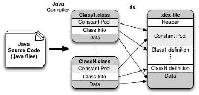
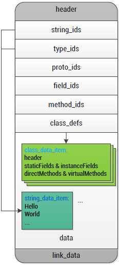
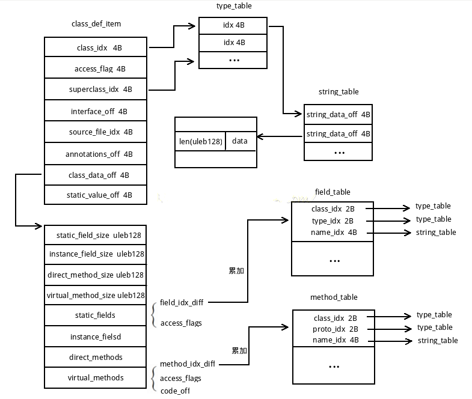
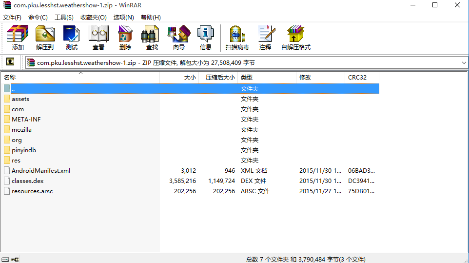
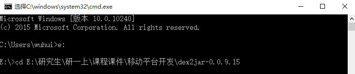
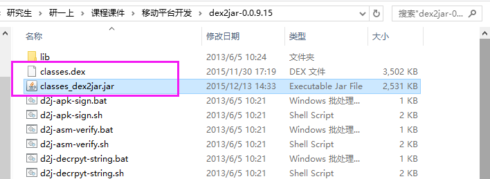
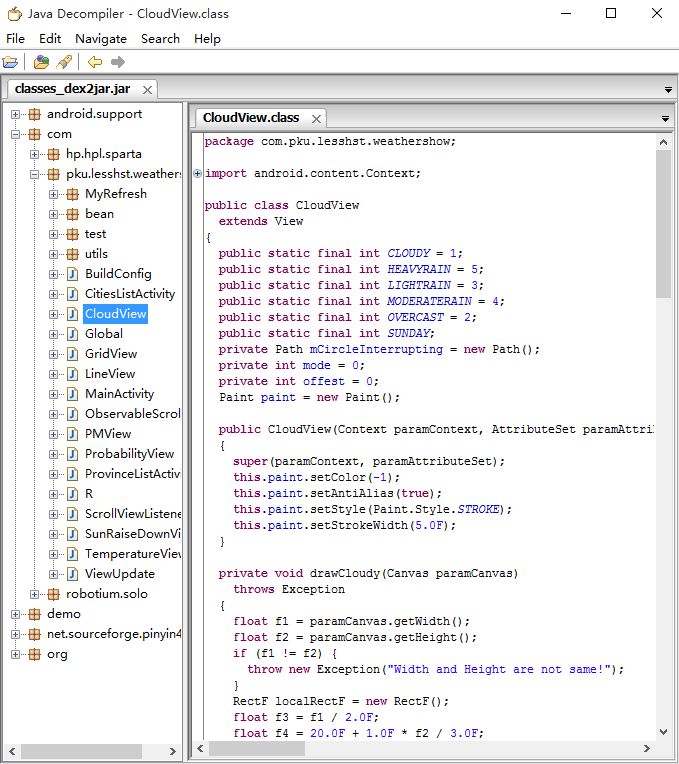

# Android DEX文件方法名混淆（1501210728吴辉）

##**1、简介**##
####1.1 背景  
&ensp;&ensp;&ensp;&ensp;随着信息技术的不断发展，尤其是近来各种智能终端的快速增长，对各种应用软件的可移植性或跨平台性能的要求越来越高。由此，例如java语言、perl语言、php语言等不将程序代码编译为二进制码可执行程序的编程语言的应用越来越广泛。  
&ensp;&ensp;&ensp;&ensp;这种不将程序代码编译为二进制码可执行程序的编程语言具有解释执行、跨平台等特性，尤其是其跨平台性，使开发人员摆脱了机器的束缚，可实现“一次编译，到处运行”。然而，正是由于利用这种编程语言编写的程序在运行时直接以程序语言代码或中间代码表示，这就导致采用非编译型编程语言编写的程序源代码容易被窃取。  
&ensp;&ensp;&ensp;&ensp;Android平台所使用的主流编程语言Java程序在运行前虽然需要经过编译，但并不会直接被编译成（二进制的）机器语言，而是编译成java字节码后，再通过Java虚拟机解释执行。更具体地，Java字节码文件是将采用Java语言编写的程序代码进行编译后产生的中间文件。它往往与Java虚拟机一起出现，是实现平台无关性的要素之一。因而，如何防止采用Java语言编写的程序被窃取的问题，则转化为如何更好地对Java字节码文件进行保护（加密）的问题。当前，Java编程语言工具并未对Java字节码采取有效保护措施。加之，Java字节码文件的结构本身的特点使其易于被反编译，源码易被窃取，故存在Java源码的安全问题。
####1.2 本文介绍
&ensp;&ensp;&ensp;&ensp;针对Java字节码的特点，出现了以下几种方法来保护Java字节码：1.字节混淆技术；2.数字水印技术等。但是，这些方法都不能很好的保护Java字节码。字节码混淆并不能完全防止反编译，只是增加了反编译后代码阅读的难度；而数字水印只能保证版权，并不能保证代码遭反编译后被其它开发者利用。然而，Android系统又采用了不同于传统虚拟机的Dalvik虚拟机。Dalvik基于寄存器实现，缩减了Java虚拟机的指令集。在Dalvik平台，Java应用程序被编译生成DEX文件，并载入运行。我们可以使用工具直接从dex机器码反编译回java源代码。任何人都可以通过这种方式获得并修改源码，插入恶意程序，因此，对于android应用本身是不安全的。  
&ensp;&ensp;&ensp;&ensp;本文采用MD5摘要算法，对DEX文件中的方法名进行加密，从而生成新的DEX文件，用它替换原DEX文件与安卓程序一起打包发布。由于该方法通过只针对APK文件中的DEX文件的关键信息(部分方法名)的加密保护，从而提高了加密和解密的执行效率。

##**2、基础知识**##
* ####**知识点1---Android代码混淆技术**####

&ensp;&ensp;&ensp;&ensp;代码混淆技术基本原理是使反编译工具反编译出来的代码人难以阅读，从而达到防止被逆向破解的目的。PC上的代码混淆技术已经很成熟，有加花指令、多态变形等技术手法，Android代码混淆技术才刚刚起步，目前已知的技术手法如下：  
&ensp;&ensp;&ensp;&ensp;**A.Java类名、方法名混淆**  
&ensp;&ensp;&ensp;&ensp;Dalvik字节码包含了大量的调试信息，如类名、方法名、字段名、参数名、变量名等，使用反编译工具可以还原这些信息。由于类名、方法名等通常都会遵循一定的命名规范，破解者很容易根据这些信息来猜测代码功能，阅读起来就跟查看源代码一样。从Android2.3开始，Google在SDK中加入了一款叫ProGuard的代码混淆工具，ProGuard会删除这些调试信息，并用无意义的字符序列来替换类名、方法名等，使得使用反编译出来的代码难以阅读，提升逆向难度。使用ProGuard混淆过过后，反编译出来的类名和方法名无法阅读，但是反编译出来的功能代码仍然是非常容易阅读的，和源代码差不多，破解者仍通过阅读功能代码来自行标记类名、方法名等，然后逆向破解。  
&ensp;&ensp;&ensp;&ensp;**B.Java代码混淆**  
&ensp;&ensp;&ensp;&ensp;通过对功能代码流程进行乱序混淆，实际运行时乱序混淆后的代码流程却和原始代码流程是一样的，但反编译出来的代码流程静态阅读时与原始流程有很大差异，使破解者很难通过静态分析理解代码功能，从而保护代码不被逆向分析。比如，原始的代码流程是1->2->3->4->5->6->7，经过乱序混淆后静态反汇编查看到的代码流程可能变成2->7->5->1->6->4->3，实际运行时代码流程仍然是1->2->3->4->5->6->7。目前使用这种代码混淆技术的Android保护工具有爱加密。  
&ensp;&ensp;&ensp;&ensp;**C.Dalvik字节码加密**   
&ensp;&ensp;&ensp;&ensp;将dex文件中的部分或全部Dalvik字节码加密，每次需要执行时由专门的Native代码负责动态解密和回填，静态反编译出来的代码已经无法阅读甚至无法反编译，动态调试也难以逆向分析。采用这种保护技术的Android保护工具有爱加密等。
  
* ####**知识点2---Dex文件**####

**A.文件结构**  

一个 APK 文件结构通常如下所示：    

| **文件结构**        | **含义**   |
| --------   | -----:  | 
| META-INF\ Jar |     文件中常可以看到|
| res\ |存放资源文件的目录|
| AndroidManifest.xml |程序全局配置文件|
| classes.dex| Dalvik 字节码|
| resources.arsc |编译后的二进制资源文件|
&ensp;&ensp;&ensp;&ensp;classes.dex文件是Android系统运行于Dalvik Virtua lMachine上的可执行文件，也是Android应用程序的核心所在，所以我们首先来看下DEX文件的结构，这样能够更好的理解后续的分析。从Java源文件（当然Android也支持JNI的调用方式）到生成Dex文件的基本映射关系如下图所示：  

&ensp;&ensp;&ensp;&ensp;Java源文件通过Java编译器生成class文件，再通过dx工具转换为classes.dex文件。Dex文件从整体上来看是个索引的结构，类名、方法名、字段名等信息都存储在常量池中，这样能够充分减少存储空间，一个 Dex 文件的基本结构如下图所示，相关结构声明定义在DexFile.h 中，在 AOSP 中的路径为/dalvik/libdex/DexFile.h。  

1.header:Dex文件头，包含magic字段、adler32校验值、SHA-1哈希值、string_ids的个数以及偏移地址等；  
2.StringId:定义了字符串数据的偏移；  
3.TypeId:表示应用程序代码中使用到的具体类型，如整型、字符串等，在Dalvik字节码中表示为I、Ljava/lang/Strin；  
4.ProtoId表示方法声明的结构体，shortyIdx是方法声明字符串，格式为返回值类型后紧跟参数列表类型，如方法声明为VI，表示返回值为 V（空，无返回值），参数为I（整型），所有的引用类型用L表示；  
5.FieldId:表示代码中的字段；  
6.MethodId:表示代码中使用的方法；  
7.ClassDef:该结构相对要复杂一些，定义了代码中的使用的类，以及相关的代码指令。 

**B.混淆原理**  
&ensp;&ensp;&ensp;&ensp;Dex文件中以类为核心，方法字段等数据都需要归属于某个类，所以在混淆时主要针对3类数据：
* 类名
* 方法名
* 字段名  

&ensp;&ensp;&ensp;&ensp;为了更好的理解Dex文件中的类，先让我们看看类数据之间的关系图：  

&ensp;&ensp;&ensp;&ensp;对于每个类而言，都有一个class_def_item结构体，其中class_idx指明了这个类的类名，superclass_idx指明了这个类的父类，在这个class_def_item结构体中最重要的就是class_data_off这个字段，这个字段指出了这个类中所拥有的字段和方法，在混淆时需要先混淆类名，然后找到这个类所拥有的字段和方法进一步混淆。  

**C.混淆规则**   
&ensp;&ensp;&ensp;&ensp;并不是所有的类，方法和字段都能被混淆，在使用MD5混淆代码时同样需要进行一系列的设定，指出哪些可以被混淆，哪些不能被混淆，常用的混淆规则有：  
* Android系统组件（Activity，Service等）不能被混淆
* 自定义view不能被混淆
* jni调用不能被混淆
* Android R文件不能被混淆
* Android Parcelable，需要使用android序列化的不能被混淆
* 枚举类型不能被混淆
* 不能混淆init函数
* 某些资源文件不能被混淆

由于混淆规则很多，要实现方法名混淆并不容易，本次实现代码中进行了简化，主要目的在理解混淆的原理。
* ####**知识点3---MD5加密算法**####

**1 概念**  
&ensp;&ensp;&ensp;&ensp;MD5的全称是Message-Digest Algorithm5(信息-摘要算法)，是让大容量信息在用数字签名软件签署私人密匙前被"压缩"成一种保密的格式(就是把一个任意长度的字节串变换成一定长的大整数)。Message-Digest泛指字节串(Message)的Hash变换，就是把一个任意长度的字节串变换成一定长的大整数。它是一个安全的散列算法，输入两个不同的明文不会得到相同的输出值，根据输出值，不能得到原始的明文，即其过程不可逆；所以要解密MD5没有现成的算法，只能用穷举法，把可能出现的明文，用MD5算法散列之后，把得到的散列值和原始的数据形成一个一对一的映射表，通过比在表中比破解密码的MD5算法散列值，通过匹配从映射表中找出破解密码所对应的原始明文。  
**2 加密原理**  
&ensp;&ensp;&ensp;&ensp;对MD5算法简要的叙述可以为：MD5以512位分组来处理输入的信息，且每一分组又被划分为16个32位子分组，经过了一系列的处理后，算法的输出由四个32位分组组成，将这四个32位分组级联后将生成一个128位散列值。  
&ensp;&ensp;&ensp;&ensp;在MD5算法中，首先需要对信息进行填充，使其位长对512求余的结果等于448。因此，信息的位长（Bits Length）将被扩展至Nx512+448，N为一个非负整数，N可以是零。填充的方法如下，在信息的后面填充一个1和无数个0，直到满足上面的条件时才停止用0对信息的填充。然后，在这个结果后面附加一个以64位二进制表示的填充前信息长度。经过这两步的处理，信息的位长=Nx512+448+64=(N+1)x512，即长度恰好是512的整数倍。

##**3、主要思路及步骤**##
**3.1 主要思路**
* 解析步骤，从待加密的Android应用软件的APK文件中解析出DEX文件；
* 加密步骤，对该DEX文件的全部或部分信息进行加密，生成加密后的DEX文件；
* 生成步骤，将该加密后的DEX文件替换加密前的所述DEX文件，生成对该DEX文件的全部或部分信息进行了加密的APK文件和对密钥进行MD5加密的摘要文件。

**3.2 实践步骤**  
1.解析步骤  
&ensp;&ensp;&ensp;&ensp;Android的安装文件是apk格式。APK是AndroidPackage的缩写。是由android sdk编译的工程打包生成的安装程序文件。
Apk其实是zip文件，但是后缀名被改成了.apk，通过解压就可以看到其中的文件。此处以我们的天气预报apk作为例子：    
  
Classes.dex和AndroidManifest.xml都可以直接看见了。Dex文件是DalvikVM executes的全称，即Android Dalvik执行程序，并非Java ME的字节码而是Dalvik字节码。  
&ensp;&ensp;&ensp;&ensp;先看看AndroidManifest.xml,用记事本打开后发现是乱码。再打开res文件夹下的layout的xml文件，发现也是乱码。再来看.dex文件，dex文件是可以转化成jar文件的，而jar文件同样是可以解压打开的。  
* 工具准备：  
&ensp;&ensp;&ensp;&ensp;apk反编译工具dex2jar，是将apk中的classes.dex转化成jar文件  
&ensp;&ensp;&ensp;&ensp;源码查看工具jdgui，是一个反编译工具，可以直接查看反编译后的jar包源代码  

* 把dex转化成jar文件  
&ensp;&ensp;&ensp;&ensp将classes.dex文件复制到dex2jar.bat所在文件夹（E:\研究生\研一上\课程课件\移动平台开发\dex2jar-0.0.9.15），在cmd下进入所在文件夹  
  
输入命令：dex2jar.bat classes.dex ，回车  
  
同目录下生成classes_dex2jar.jar  
  

* 查看源码  
&ensp;&ensp;&ensp;&ensp;进入jdgui文件夹双击jd-gui.exe，打开上面生成的jar包classes_dex2jar.jar，即可看到源代码了  

2.加密步骤

3.生成步骤

**3.3 实现效果**

##**4、参考资料**##
[1]  刘建培，卞佳丽，张晓杰．一种适用于Android系统的软件保护方法及系统:中国，CN201110180829[p].2015-12-13  
[2]代码混淆—android被反编译的两种解决方案  
http://blog.csdn.net/online1989/article/details/7058743  
[3]Android proguard代码混淆  
http://www.cnblogs.com/wangcan/p/3477840.html  
[4] Android Dex文件结构  
http://blog.csdn.net/pang3510726681/article/details/11610365  
[5]android逆向学习小结--CrackMe_1  
http://www.cnblogs.com/LittleHann/p/3374206.html  
[6]APK 的自我保护  
http://bbs.pediy.com/showthread.php?t=183116    
