#Android中的多线程下载原理（1501210887 陈善浩）
                           

### 1. 多线程下载介绍
    ####1.1 多线程背景知识
    多线程下载文件可以更快完成文件的下载，多线程下载文件之所以快，是因为其抢占的服务器资源多。如：假设服务器同时最多服务100个用户，在服务器中一条线程对应一个用户，100条线程在计算机种并非并发执行，而是由CPU划分时间片轮流执行，如果A应用使用了99条线程下载文件，那么想当于占用了99个用户的资源，假设一秒内CPU分配给每条线程的平均执行时间是10ms，A应用在服务器中一秒就得到了990ms得执行时间，而其他应用在一秒内只有10ms的执行时间。就如同一个水龙头，每秒出水量相等的情况下，放990毫秒的水肯定比放10毫秒的水要多。
    当然，下载的速度受带宽的限制，一定量的带宽决定了下载的总得速度的上限。
    ####1.2 多线程下载的实现过程
    在客户端进行下载的时候，第一步，在本地创建一个大小跟服务器文件相同大小的临时文件。第二步，计算分配几个线程去下载服务器上的资源，知道每个线程下载文件的位置。
    假设服务器上的资源大小是10byte，编号从0到9，现在开启三个线程去服务器上下载文件，那么，每个线程下载文件的大小就等于文件的长度除以线程的个数，也就是三个线程。所以，线程一下载的起始位置就是0到2；第二个线程下载的起始位置是3到5，对于最后一个线程，情况稍微特殊一点，下载的起始位置为6到文件的末尾。由此得到每一个线程下载的位置计算方式为：开始位置等于（线程id - 1）*每一块大小，结束位置等于线程id乘以每一块的大小减去1。
第三步，开启多个线程，在本例中就是开启三个线程，每一个线程下载对应位置的文件。如果所有的线程都把自己的数据下载完毕了，服务器上的资源就被下载到本地了。

###2. 多线程下载的代码实现
由于在Android中多线程下载和Java SE中多线程下载的环境一致，为便于测试，可在Java SE环境中进行代码编写、调试，测试成功后可讲代码移植到Android工程中去。示例代码中下载的文件放置在本地Tomcat应用程序服务器中。
首先，按照上面描述的步骤，连接服务器，获取一个文件，获取文件的长度，在本地创建一个大小跟服务器一样大的临时文件，代码如下：
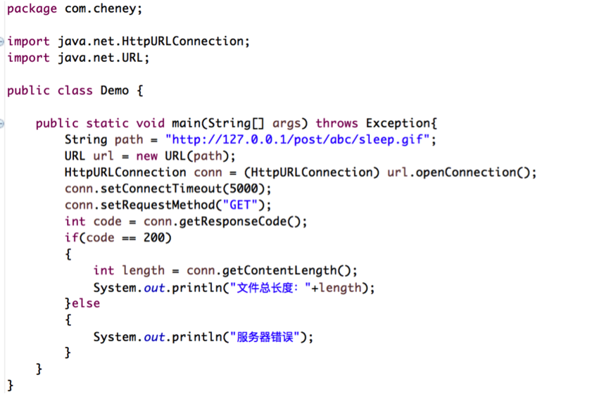
通过getContentLength()方法，可以得到文件的长度，通过控制台测试输出结果：
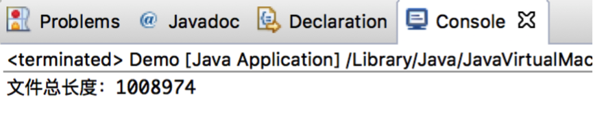
然后就是分配几个线程去下载服务器上的资源文件。假设本例中使用三个线程，那么就需要知道每个线程下载的文件的大小及起始位置。可以通过资源文件长度除以线程的个数得到每一个线程下载的文件大小。每个线程下载的起始位置可以通过上文中的公式计算，这里要注意最后一个线程下载的文件的位置，如果文件大小不能被整除，则需要对最后一个线程下载的终点位置做特殊处理。代码如下：
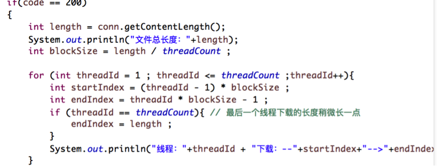
通过控制台打印测试输出，输出结果如下图：
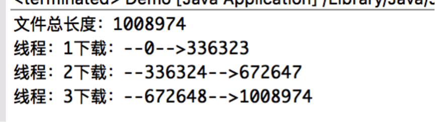
至此，完成了多线程下载的第二步，接下来需要开启多个线程，让每个线程去下载对应的文件。
开辟子线程，需要继承Thread类，并实现Thread中的run()方法。在线程中需要的几个参数包括：线程Id、线程下载开始位置、线程下载结束位置、下载的路径。在线程中定义以上几个成员变量，为了将参数传递进来，定义构造方法。代码如下：
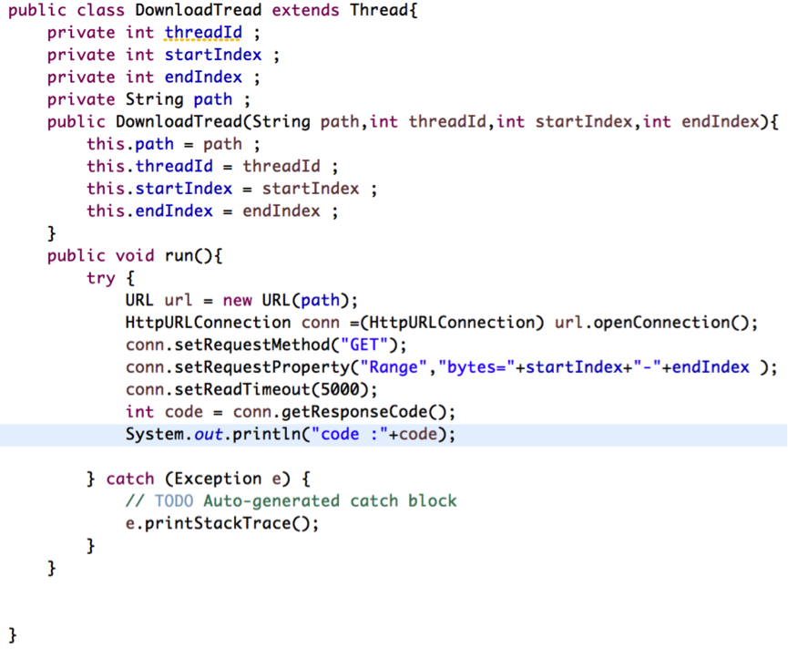
对于服务返回的状态码，如果是200，则代表从服务器请求全部的资源成功，如果是成功从服务器请求部分资源，则服务器返回的状态码为206。
在请求服务器资源的时候，如果使用getInputStream()这个方法，代表返回服务器全部的资源，如果只想从服务器上下载一部分的资源，需要通过一个特殊的Http请求头去指定，使用Http的Range头字段指定每条线程从文件的什么位置开始，下载到什么位置为止，如：指定从文件的2M位置开始下载，下载到（4M-1byte）的位置为止。
由于已经设置了文件的请求位置，则调用getInputStream(),返回的是当前位置对应文件的输入流。至此，前面的一些先决条件已准备好了，知道了服务器上文件分几段去下载，也知道了没段文件的位置，并且也拿到了文件的流。下载让这三个线程把服务器上的文件分别写到客户端上对应的位置。
为了能让不同的线程把同一个文件写到一个位置，这里需要用到Java文件的一个API:RandomAccessFile。即随机文件访问类。利用这个API可以让指针定位到文件的某个位置，然后从对应的位置开始写文件。在代码中首先需要利用这个API在本地创建一个和服务器上文件同样大小的临时文件。
对于RandomAccessFile这个类，此类的实例支持对随机访问文件的读取和写入。随机访问文件的行为类似存储在文件系统中的一个大型byte数组。存在向该隐含数组的光标或索引，成为文件指针；输入操作从文件指针开始读取字节，并随着对字节的读取而迁移此指针。如果随机访问文件以读取/写入模式创建，则输出操作也可用；输出从文件指针开始写入字节，并随着对字节的写入而前移此文件指针。
它构造方法中接收的两个参数，一个是文件名称，另一个是在随机访问文件在写时候的模式，mode参数指定用以打开文件的访问模式，允许的值及其含义为：“r”以只读的方式读取和写入；“rw”打开以便读取和写入，如果该文件尚不存在，则尝试创建该文件；“rws”打开以便读取和写入，对于“rw”，还要求对文件的内容或元数据的每个更新都同步写入到底层存储设备；“rwd”打开以便读取和写入，对于“rw”，还要求对文件内容的每个更新都同步写入底层存储设备。
当我们在主线程中得到了服务器中文件的长度后，接下来就可以在主线程中去使用randomAccessFile这个API去创建这个与服务器上源文件同样大小的临时文件了。代码如下：
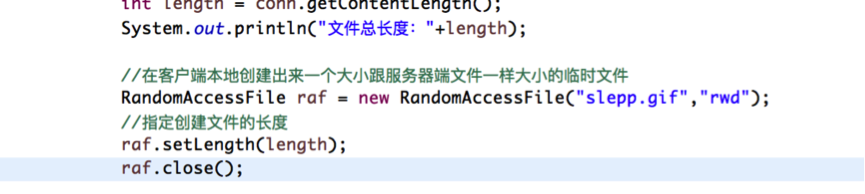
在子线程中代码如下：
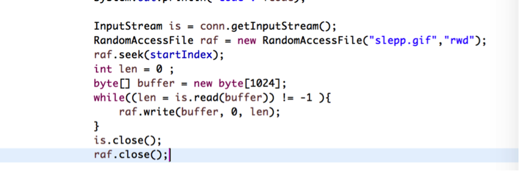
seek()方法表示在随机写文件的时候从哪个位置开始写，多线程在下载的时候，第一个线程的下载位置是文件的开头，第二个线程的下载位置应该是从第二个线程开始的地方存取文件。这样，就可以在线程中去开辟子线程了。
运行程序，控制台打印结果如下：
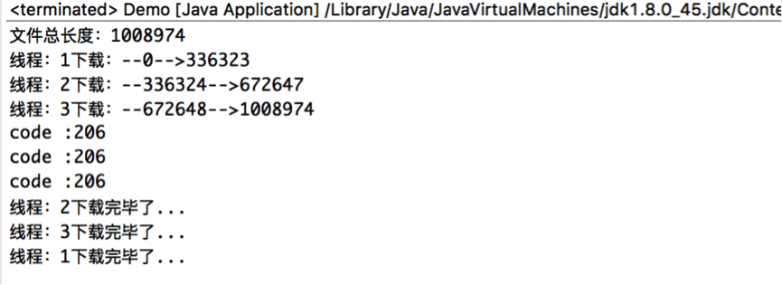
服务器返回的状态码为206，说明是从服务器端成功地下载了部分的文件。
在工程里面可以看到文件已经从服务器端下载下来了，如图：
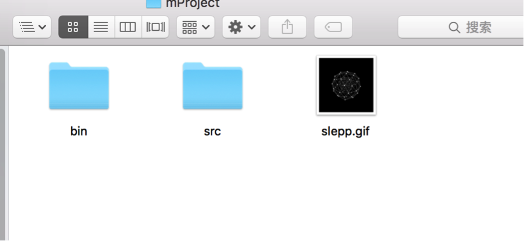

###3. 断点下载
在从服务器下载文件的过程中，如果出现断电或者其他意外情况终止下载，如果希望在下次再次打开下载的时候能从上次未下载完成的位置继续下载，这就需要引入断点下载技术,需要让子线程分别去记住已经下载的长度。
可以通过读写文件的方式来下载文件，在开始下载的时候，首先让下载的子线程去读取已经下载到的文件，从中来读取已经下载的进度。
定义一个文件，用来记录当前线程下载的数据长度。代码如下：
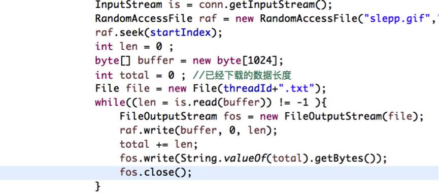
为了记录已经下载的文件长度记录，需要在每个线程开始的地方去检查是否存在记录下载长度的文件，如果存在，读取这个文件的数据，把它添加到开始下载的位置里面去。代码如下：
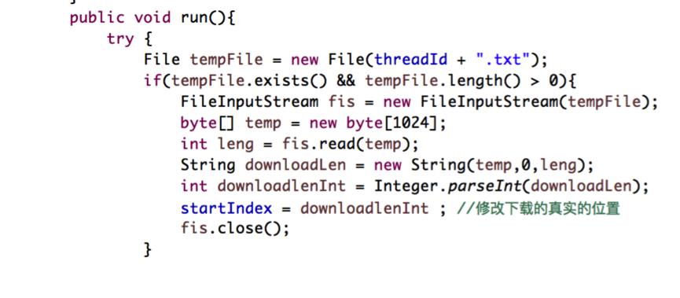
运行程序，先让程序下载一部分，停掉程序，打印日志输出结果：
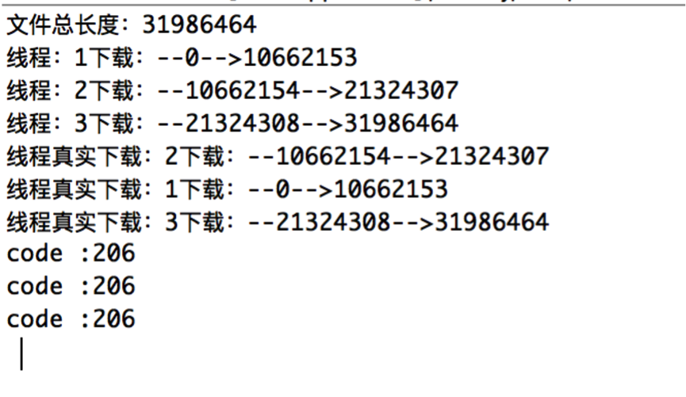
再次运行程序，输出结果如下：
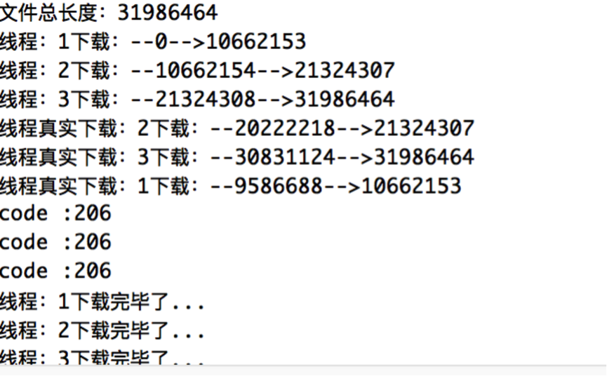
可以看到第二次运行程序下载文件的时候，线程的真实下载开始位置发生了变化，即从上次下载结束的地方读取已经下载到的文件的长度，从这个位置开始继续下载。至此，断点下载代码部分已完成。
当文件下载完毕后，需要将下载记录清除掉。代码如下：
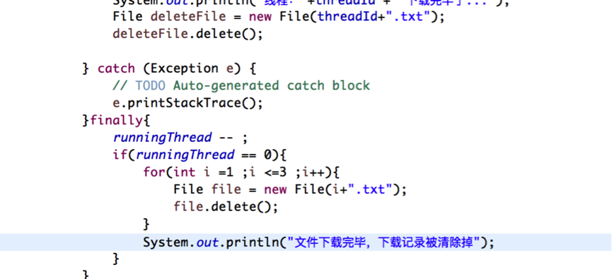
###4. 代码移植到Android工程中
上文Demo中将文件下载的记录存到文件中，如果将代码移植到Android中，需要将此记录保存到Android中的数据库中，每次从数据库中读取数据。
界面如下：
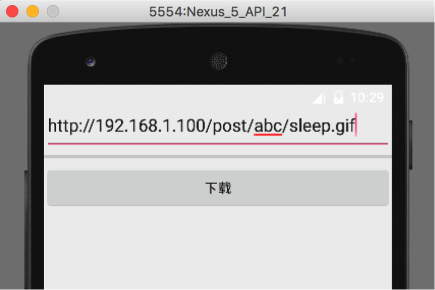
点击下载，可以看到下载成功，文件保存到sdcard中。
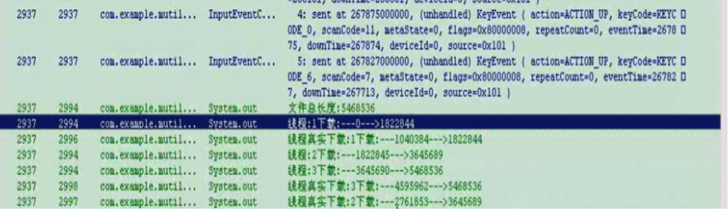
小结：使用randomAccessFile类在发出请求协议的时候加上参数Range,可以定位下载文件的开始位置和结束位置,下载数据的时候,记录每条线程已经下载的数据量和线程id,现在文件的url作为下载文件的一个标识,对下载信息做持久化,可以存入数据库,文件,网络等,当开始下载文件的时候,检查数据库没有没这个下载地址的下载信息,没有的话,就开始下载,如果有这个下载地址的信息,就计算他的线程数,如果之前下载的线程数与当前下载任务的线程数一致的话.重新开始下载.如果有下载信息,并且线程数一样的话,发送请求的时候可以使用上面的Range参数,他的对应值就是开始下载的位置和结束下载的位置。
