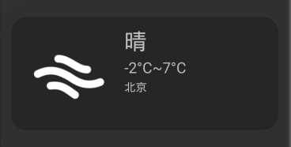

# Android的图形与图像处理（1501210918 黄凯凯）

## 1 图片显示与使用

### 1.1 Drawable对象
在天气应用开发过程中，我们使用的大部分图片都是用ImageView来显示，或者是作为Button、Window等组建的背景。从资源角度而言，我们还可以使用XML文件定义的Drawable对象。

例如在天气应用中，我们需要一个四角为圆弧的矩形，我们可以以XML文件格式来定义如下：

    <shape
    xmlns:android="http://schemas.android.com/apk/res/android"
    android:shape="rectangle">
    <!-- 填充的颜色 -->
    <solid android:color="#33000000" />
    <!-- 设置按钮的四个角为弧形 -->
    <!-- android:radius 弧形的半径 -->
    <corners android:radius="20dip" />
    <!-- padding：Button里面的文字与Button边界的间隔 -->
    <padding
        android:left="10dp"
        android:top="10dp"
        android:right="10dp"
        android:bottom="10dp"
        />
    </shape>
    
之后将其当作普通的图片文件放入res目录中，就可以在应用中使用它，比如作为桌面插件的背景。效果如下：

### 1.2 Bitmap对象
Bitmap是Android系统中的图像处理的最重要类之一。用它可以获取图像文件信息，进行图像剪切、旋转、缩放等操作，并可以指定格式保存图像文件。

Bitmap代表一个位图，可以对其进行一系列位图变换操作。一般情况下，我们将图片放在/res/drawable目录下，就可以在程序中通过相应资源ID获取封装了Bitmap对象的BitmapDrawable对象，它可以通过XML方式对原始位图进行拉伸、对齐、抗锯齿等处理。两者转换如下：

    //把Bitmap对象包装成BitmapDrawable对象
    BitmapDrawable drawable = new BitmapDrawable(bitmap);
    //获取BitmapDrawbale包装的Bitmap对象
    Bitmap bitmap = drawable.getBitmap();
    
除了使用drawable对象来创建Bitmap对象以外，Bitmap本身也可以调用create方法被创建，或者使用BitmFactoty创建。BitmapFactory是一个辅助的工具类，它提供了大量static方法，用于从不同数据源来解析、创建Bitmap对象。例如，如果Android应用需要访问其他存储路径（如SD卡）里的图片，就需要借助BitmapFactory，我们也可以通过它用给定资源ID获取创建Bitmap对象。
    
    //通过文件路径创建Bitmap对象
    Bitmap bitmap = BitmapFactory.decodeFile(path); 
    //通过资源ID创建Bitmap对象
    Bitmap bitmap = BitmapFactory.decodeResource(res,R.drawable.pic_id);
    
由于手机内存小，为防止系统不停解析创建Bitmap而来不及回收内存导致OutOfMemory错误。Android为Bitmap提供了isRecycle()和recycle()两个方法，前者用于判断是否被回收，后者实现Bitmap的强制回收。

## 2 图像绘制
在使用已有图片之外，Android应用还常常需要在运行时动态地生成图片，这就需要借助于Android的绘图支持了。

绘制图像的基本思路是，创建一个View或SurfaceView类，重写onDraw()方法。这里会设计到一个绘图API：Canas。Canvas代表“依附”于指定View的画布，提供了一系列的绘制方法，如矩形、圆、椭圆、点、线、文字、坐标转换等。其主要一些方法如下：

| 方法名称 | 描述 |
| -- | -- |
| drawText(String text,float x,float,y,Paint paint) | 画文本 |
| drawPiont(float x,float y,Paint paint) | 画点 |
| drawLine(float startX,float startY,float stopX,float stopY,Paint paint) | 画线 |
| drawCircle(float cx,float cy,float radius,Paint paint) | 画圆 |
| drawRect(rectF rect,Paint paint) | 画矩形 |
| drawRoundRect(rectF rect,float rx,float ry,Paint pait) | 圆角矩形 |
| clipRect(float left,float top,float right,float bottom) | 裁剪矩形 |
| clipRefion(Region region) | 裁剪区域 |

Canvas只是实现在画布上绘制简单规则图形，若要丰富图像内容，还需要使用其他API，例如，要对图案颜色、纹理、透明度、笔触等属性做设置就需要使用Paint，Paint代表Canvas上的画笔，主要用于设置绘制风格，从上面的Canvas方法中，我们也可以看到，绘制图像必须要使用Paint，其主要方法如下表所示。

| 方法名称 | 描述 |
| -- | -- |
| Paint() | 构造方法 |
| setColor(int color) | 设置颜色 |
| setStrokeWidth(float width) | 设置线宽 |
| setTextAlign(Paint paint,Align align) | 设置文字对齐 |
| setTextSize(float textsize) | 设置文字尺寸 |
| setShader(Shader shader) | 设置渐变 |
| setAlpha(int a)| 设置alpha值 |
| reset() | 复位 |

除此以外，要绘制任意图形要用Path类，它主要实现点之间的连线；自定义颜色用Color类；等等。

## 3 图形特效

### 3.1 图形变换
图形变换，一般是指图形的平移、旋转、缩放、倾斜等效果。Maxtrix是Android提供的一个矩形工具类，不仅可用于控制图形的平移、旋转、缩放、倾斜变换，也可控制View组件进行平移、旋转和缩放等。有一点需要注意的是，Maxtrix本身并不能对图像或组件进行变换，而是通过与其他API结合来控制图形、组件的变换。

使用Matrix控制图形或组件变换的 步骤如下：
1. 获取Matrix对象，这个既可以是新创建的，也可以是封装在其他类中的；
2. 调用Matrix的方法进行平移、旋转、缩放、倾斜等效果；
3. 将程序对所做的变换应用到指定图形或组件中。

一旦对Matrix进行了变换，下一步便是应用该Matrix对图形进行控制(变换)。比如Canvas提供了一个drawBitmap(Bitmap bitmap,Matrix matrix,Paint paint)方法，调用该方法就可以在绘制bitmap时应用Matrix上的变换。

### 3.2 图像扭曲
Android提供了Canvas的drawBitmapMesh()方法实现对位图进行扭曲效果

### 3.3 使用Shader进行填充
Android不仅可以使用颜色来填充图形，也可以使用Shader对象来指定渲染效果来填充图形。Shader本身是一个抽象类，它提高了以下几个子类来实现填充效果：
* BitmapShader：使用位图平铺的渲染效果
* LinerGradient：使用线性渐变来填充图形
* RaidialGradient：使用圆形渐变来填充图形
* SweepGradient：使用角度渐变来填充图形
* ComposeShader：使用组合渲染效果来填充图形

## 4 在Android中使用OpenCV

## 5 总结

