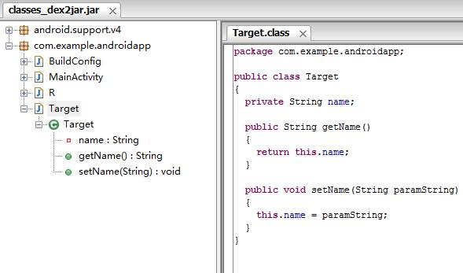

# Android代码混淆(1501210963 马熠东)
1、简介

Java是一种跨平台的、解释型语言，Java源代码编译成中间“字节码”存储于class文件中。由于跨平台的需要，Java字节码中包括了很多源代码信息，如变量名、方法名，并且通过这些名称来访问变量和方法，这些符号带有许多语义信息，容易被反编译成Java源代码。为了防止这种现象，我们可以使用混淆器对Java字节码进行混淆。

Android是一种基于Linux的自由及开放源代码的操作系统，主要使用于移动设备，如智能手机和平板电脑，由Google公司和开放手机联盟领导及开发。Android上的APP绝大部分是使用Java语言开发，编译时会编译成Dalvik字节码（即dex文件），运行时由Android自带的Davik虚拟机解释执行。由Java开发的APP很容易被逆向破解，目前市面上已有的Java程序反编译工具有baksmali、jd-gui、apktool等。为防止APP被逆向破解，对抗反编译工具成为重要手段，常见方法有：使反编译工具无法正常运行、代码混淆等。

2、意义

混淆就是对发布出去的程序进行重新组织和处理，使得处理后的代码与处理前代码完成相同的功能，而混淆后的代码很难被反编译，即使反编译成功也很难得出程序的真正语义。被混淆过的程序代码，仍然遵照原来的档案格式和指令集，执行结果也与混淆前一样，只是混淆器将代码中的所有变量、函数、类的名称变为简短的英文字母代号，在缺乏相应的函数名和程序注释的况下，即使被反编译，也将难以阅读。同时混淆是不可逆的，在混淆的过程中一些不影响正常运行的信息将永久丢失，这些信息的丢失使程序变得更加难以理解。

混淆器不仅能保护代码，还能精简编译后程序的大小。由于缩短变量和函数名以及丢失部分信息， 编译后jar文件体积大约能减少25% ，这对网络传输成本是有一定意义的。

3、简单示例

新建Android工程，主活动MainActivity，代码如下：

新建Target.java，Target类将作为混淆的对象，代码如下：

生成apk文件，并解压出classes.dex文件

使用dex2jar进行反编译，生成classes_dex2jar.jar包

使用jd-gui查看编译后的代码，如下：

在混淆代码之前，我们能很清楚的反编译出Android应用的源代码

接下来，我们将使用Android项目工程中的proguard-project.txt，project-properties文件进行代码混淆，首先修改project-properties文件，去除proguard.config那行的注释，并修改：
Proguard.config= ./proguard-project.txt  .即指定混淆文件是项目中的proguard-project.txt

修改proguard-project.txt文件，添加如下内容：

然后，继续之前的反编译步骤，得到如下结果：

可见，文件名被混淆成了一系列的字母，混淆成功。

4、其他Android代码混淆技术

以上实例所代表的技术是，Java类名、方法名混淆。

另外，还有其他的Android代码混淆技术：

Java代码混淆。通过对功能代码流程进行乱序混淆，实际运行时乱序混淆后的代码流程却和原始代码流程是一样的，但反编译出来的代码流程静态阅读时与原始流程有很大差异，使破解者很难通过静态分析理解代码功能，从而保护代码不被逆向分析。比如，原始的代码流程是1->2->3->4->5->6->7，经过乱序混淆后静态反汇编查看到的代码流程可能变成2->7->5->1->6->4->3，实际运行时代码流程仍然是1->2->3->4->5->6->7。

Dalvik。将dex文件中的部分或全部Dalvik字节码加密，每次需要执行时由专门的Native代码负责动态解密和回填，静态反编译出来的代码已经无法阅读甚至无法反编译，动态调试也难以逆向分析。

这两种技术方法，爱加密都可以做到。感兴趣的同学可以尝试一下。