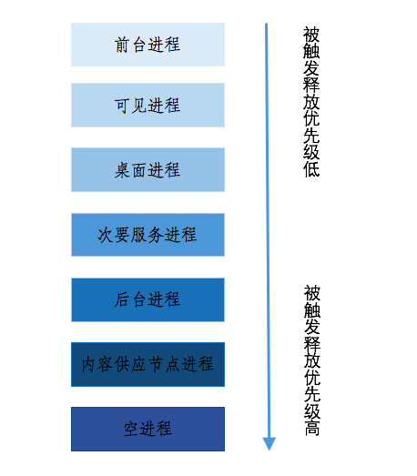
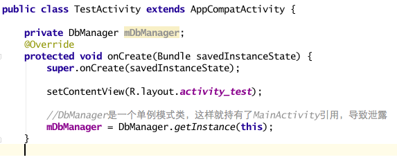
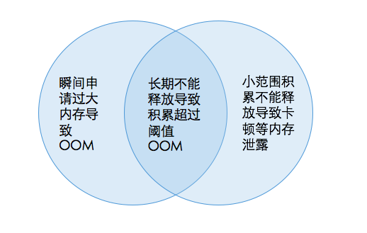

# Android应用开发内存性能分析与优化（宁旭冉）

# 摘要

世界上占有率最大手机平台Android，引发了一场移动互联网的开发热潮。尽管智能手机硬件配置越发高端，安卓应用开发的内存性能优化依然是非常重要的问题。

Android系统是Google在Linux内核基础上开发的，对移动设备进行了特殊优化的开源操作系统。特别是在内存管理机制上，针对移动终端资源特点及移动App应用特点进行了优化。为了应用能够更加稳定得运行在Android操作系统之上，应用开发者需要根据Android操作系统的特性，有针对性的优化自己的应用。通过避免内存泄漏、避免内存溢出、并针对LMK机制和位图资源做出优化等方法优化性能，以达到更好的用户体验。

当然，内存优化要有一个度，不能一味的优化，亦不能置之不理。

# 1 引言
Android目前已经是世界上占有率最大的手机平台，引发了一场移动互联网的开发热潮，其前景也被越来越多的人看好。Android 开发者的门槛也越来越高,无论编写的程序所为何求，性能的问题都是其中的关键。技术在不断发展，工具也不断在强大，本文自然不会覆盖所有性能优化及分析，只针对安卓应用开发中内存性能优化作分析。

# 2 背景

随着技术的发展，智能手机硬件配置越来越高，可是它和现在的PC相比，其运算能力，续航能力，存储空间等都还是受到很大的限制，同时用户对手机的体验要求远远高于PC的桌面应用程序。以上理由，足以需要开发人员更加专心去实现和优化自己的代码了。选择合适的算法和数据结构永远是开发人员最先应该考虑的事情。同时，我们应该时刻牢记，写出高效代码的两条基本的原则：（1）不要做不必要的事；（2）不要分配不必要的内存。

Android 是嵌入式设备，嵌入式设备核心关注点之一就是内存资源。虽然随着安卓设备的发展，硬件不断升级，内存已经不再是紧缺的了。但是在很多高端配置的Android设备上，有些应用还是会导致系统的卡顿。内存性能优化分析是非常重要的性能问题。

　　我从本学期开始接触Android开发，结合自己的一点开发经验，同时参考了Google的优化文档和诸多技术文档给出的意见，完成本论文。

# 3 Android内存管理原理
## 3.1 系统级内存管理
### 3.1.1 Android 与 Linux
Android系统是Google在Linux内核基础上开发的，对移动设备进行了特殊优化的开源操作系统。特别是在内存管理机制上，针对移动终端资源特点及移动App应用特点进行了优化。Linux在进程停止后就结束该进程，而Android把这些停止的进程都保留在内存中，直到系统需要更多内存时才选择性的释放一些。保留在内存中的进程默认（不包含后台Service与Thread等单独UI线程的进程）不会影响整体系统的性能（速度与电量等），且当再次启动这些保留在内存的进程时可以明显提高启动速度，不需要再去加载。

### 3.1.2 Android 进程回收 （LMK）

在上节提到，为了应用再次启动时的启动速度，当用户退出一个程序后，Android 操作系统仍然会将这个程序保存在内存中。当系统内存出现不足时，Android 系统会按照一定的优先级，对运行中的程序进行回收，以释放内存。

如下图所示，Android操作系统中将进程分为六类，空进程（EMPTY_APP）、内容供应节点（CONTENT_PROVIDER）、后台进程（HIDDEN_APP）、次要服务进程（SECONDARY_SERVER）、可视进程（VISIBLE_APP）和前台进程（FOREGROUND_APP）的顺序，逐一对进程进行回收。

前台进程：一些系统进程和正在屏幕显示的进程，譬如当前App等；

可见进程：不在前台且用户依然可见的进程，譬如输入法等；

桌面进程：launcher，保证多任务切换不重启自己；

次要服务进程：一些在运行的服务，譬如Email的服务等，但拨号不是次要服务，时主要的功能；

后台进程：从前台按home键小时到后台的进程；

内容供应节点进程：ContentProvider没有程序实体，譬如邮件EmailProvider；

空进程：按back等返回的进程，仅仅为了下次启动快速等操作。

## 3.2 应用级内存管理：
### 3.2.1 操作系统限制
绝大多数Android 应用程序本质上是一个java进程，运行在Linux内核上的Dalvik虚拟机中，每个Android应用的虚拟机均为各自独立的，因此android又类似于java内存管理。
### 3.2.2  垃圾收集GC（Garbage Collector）
垃圾回收机制使开发人员不必手工释放不需要的对象或内存区域，Java虚拟机可以跟踪内存中的所有对象，当对象不再被使用（引用数降为0）时，将对象标为垃圾对象，并在合适的时候将对象释放，并回收其占用的内存空间，从而极大地减少了内存泄漏发生的可能性。垃圾回收对于系统性能有着较高的影响。

但是要注意的一点就是在Android系统中执行垃圾回收操作时，包括UI线程在内的所有线程都必须暂停，等垃圾回收操作完成之后其他线程才能继续运行。
### 3.2.3 位图（bitmap）资源
客户端应用为了良好的视觉体验，经常使用大量的图片进行美化，图片在内存中以位图（bitmap）对象来存放。bitmap对象对内存的占用仅与图片的长宽像素数有关，与原图的图片格式或压缩比例无关。因此，压缩jpg图片的质量，而不减少图片尺寸，是无法降低该图片占用的内存量的。

# 4 开发优化建议
在第三章描述了Android 操作系统的内存管理机制以及Android操作系统对于Android应用的各种限制，为了应用能够更加稳定得运行在Android操作系统之上，应用开发者需要根据Android操作系统的特性，有针对性的优化自己的应用。
## 4.1 Android内存泄露性能及优化建议
根据关于Android的内存管理原理的深入了解，我对于Android应用开发中常出现的一种内存问题—-内存泄露和内存溢出进行了分析。
### 4.1.1 Android应用内存泄露概念
在Java中有些对象的生命周期是有限的，当它们完成了特定的逻辑后将会被垃圾回收；但是，如果在对象的生命周期本来该被垃圾回收时这个对象还被别的对象所持有引用，那就会导致内存泄漏；这样的后果就是随着我们的应用被长时间使用，他所占用的内存越来越大。
如下就是一个最常见简单的泄露例子：

可以看见，上面例子中我们让一个单例模式的对象持有了当前Activity的强引用，那在当前Acvitivy执行完onDestroy()后，这个Activity就无法得到垃圾回收，也就造成了内存泄露。

### 4.1.2 内存泄露引发的问题，
常见的内存泄露导致问题如下：

	•	应用卡顿，响应速度慢，内存占用高时JVM虚拟机会频繁触发GC;
	
	•	应用被从后台进程变为空进程（也就是超过了阈值）；
	
	•	应用莫名的崩溃；
	
造成内存泄露泄露的最核心原理就是一个对象持有了超过自己生命周期以外的对象强引用导致该对象无法被正常垃圾回收；可以发现，应用内存泄露是个相当棘手重要的问题，我们必须重视。

### 4.1.3 规避内存泄露建议
开发人员在开发过程中就应该养成良好的习惯和敏锐的嗅觉，所以下面给出一些应用开发中常见的规避内存泄露建议：

1. Context使用不当造成内存泄露：不要对一个Activity Context保持长生命周期的引用，尽量在一切可以使用应用ApplicationContext代替Context的地方进行替换。

2. 非静态内部类的静态实例容易造成内存泄漏：即一个类中如果不能够控制它其中内部类的生命周期，譬如Activity中的一些特殊Handler等，则尽量使用静态类和弱引用来处理，譬如ViewRoot的实现。

3. 警惕线程未终止造成的内存泄露：譬如在Activity中关联了一个生命周期超过Activity的Thread，在退出Activity时切记结束线程。一个典型的例子就是HandlerThread的run方法是一个死循环，它不会自己结束，线程的生命周期超过了Activity生命周期，我们必须手动在Activity的销毁方法中中调运thread.getLooper().quit();才不会泄露。

4. 对象的注册与反注册没有成对出现造成的内存泄露：譬如注册广播接收器、注册观察者，譬如数据库的监听等。

5. 创建与关闭没有成对出现造成的泄露：譬如Cursor资源必须手动关闭，WebView必须手动销毁，流等对象必须手动关闭等。

6. 不要在执行频率很高的方法或者循环中创建对象，可以使用HashTable等创建一组对象容器从容器中取那些对象，而不用每次new与释放。

7. 避免代码设计模式的错误造成内存泄露：譬如循环引用，A持有B，B持有C，C持有A，这样的设计谁都得不到释放。

8. 采用StringBuilder处理字符串累加：String是固定长的字符串对象，因此累加String对象会导致String对象的频繁创建，尽量采用StringBuilder来处理字符串的累加。

## 4.2 Android内存溢出性能及优化建议
介绍了Android应用开发的内存泄露，下面谈谈内存溢出（OOM）。其实可以认为内存溢出与内存泄露是交集关系，具体如下图：

### 4.2.1 Android应用内存溢出概念
上面我们探讨了Android内存管理和应用开发中的内存泄露问题，可以知道内存泄露一般影响就是导致应用卡顿，但是极端的影响是使应用挂掉。内存分配是有一个阈值的，超过阈值就会出问题，这里我们就来看看这个问题—–内存溢出（OOM–OutOfMemoryError）。

内存溢出的主要导致原因有如下几类：

	•	应用代码存在内存泄露，长时间积累无法释放导致OOM；
	
	•	应用的某些逻辑操作疯狂的消耗掉大量内存，譬如加载一张不经过处理的超大超高清图片等，导致超过阈值OOM；
	
可以发现，无论哪种类型，导致内存溢出的核心原因就是应用的内存超过了阈值。
### 4.2.2 Android应用规避内存溢出建议
等待OOM发生是为时已晚的事，我们应该在开发时就尽量避免OOM的发生。至于如何在开发中规避OOM，如下下面给出一些应用开发中常见建议：

	•	不要加载过大的Bitmap对象：譬如对于类似图片加载我们要通过BitmapFactory.Options设置图片的一些采样比率和复用等，也可以使用fresco或Glide开源库进行加载。
	
	•	优化界面交互过程中频繁的内存使用：譬如在列表等操作中只加载可见区域的Bitmap、滑动时不加载、停止滑动后再开始加载。
	
	•	有些地方避免使用强引用，替换为弱引用等操作。
	
	•	避免各种内存泄露的存在导致OOM。
	
	•	对批量加载等操作进行缓存设计，譬如列表图片显示，Adapter的convertView缓存等。
	
	•	尽可能的复用资源：譬如系统本身有很多字符串、颜色、图片、动画、样式以及简单布局等资源可供我们直接使用，我们自己也要尽量复用style等资源达到节约内存。
	
	•	对于有缓存等存在的应用尽量实现onLowMemory()和onTrimMemory()方法。
	
	•	尽量使用线程池替代多线程操作，这样可以节约内存及CPU占用率。
	
	•	尽量管理好自己的Service、Thread等后台的生命周期，不要浪费内存占用。
	
	•	尽可能的不要使用依赖注入。
	
	•	尽量在做一些大内存分配等可疑内存操作时进行try catch操作，避免不必要的应用闪退。
	
	•	尽量的优化自己的代码，减少冗余，进行编译打包等优化对齐处理，避免类加载时浪费内存。

## 4.3 针对LMK机制的优化建议
	•   尽量提高进程的优先级。在应用实现一个Service，可以讲进程变为次要服务，在LMK机制中拥有较高的优先级，可以降低LMK命中的几率。

	•   应用进入后台运行时，尽量在应用中保留一个Activity，因为在相同优先级的情况下，所有 Activity 均已关闭的进程会优先被回收。

	•   依赖于其它优先级高的进程。例如：当某个通信录应用正在向另外一个前台进程（通过CONTENT PROVIDER提供）提供通信录内容时，即使这个通信录应用没有任何 UI在屏幕上显示，所有Activity也已近关闭、且CONTENT PROVIDER进程优先级不高，操作系统仍然不会回收这个通讯录应用，因为此时通讯录应用享有前台进程相同的优先级。
##4.4 针对位图（bitmap）资源
Android 中存储 bitmap 数据的内存区域是有限的，而且需要与其他应用程序共享，即使申请的内存总量仍在虚拟机的限额之内，也可能因为其他应用产生了过多bitmap数据而导致内存不足。因此小心地使用bitmap对象，不仅可以使自己的应用程序更加稳定，也会使其在android运行环境上执行的其它应用更加稳定。

	•   及时回收：当应用不再使用某个bitmap对象时，尽快调用recycle()释放bitmap占用的内存空间。
	
	•   捕获异常：在产生bitmap对象的地方捕捉OutOfMemoryError错误，能够有效地减少因为内存不足造成的应用程序崩溃。
	
	•   同样的图片避免生成多个bitmap对象：很多情况下，可能需要在一个Activity里多次用到同一张图片（如好友里表的默认头像等）。此时应该尽量使用同一个bitmap对象，不应新建多个bitmap对象，避免内存的浪费。
	
	•   尽量避免使用大图片：根据图片显示区域的大小，使用bitmap factory options 设置inSampleSize 缩小图片，可以有效地减少大图片对内存的影响。
#5 总结
无论是什么电子设备的开发，内存问题永远都是一个很深奥、无底洞的话题，本文的这些内存分析建议也单单只是Android应用开发中一些常见的场景而已，真正的达到合理的优化还是需要很多知识和功底的。
合理的应用架构设计、设计风格选择、开源Lib选择、代码逻辑规范等都会决定到应用的内存性能，我们必须时刻头脑清醒的意识到这些问题潜在的风险与优劣，因为内存优化必须要有一个度，不能一味的优化，亦不能置之不理。