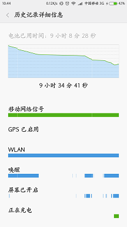
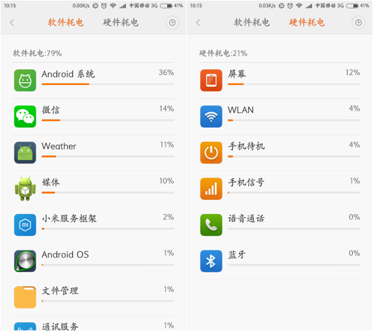
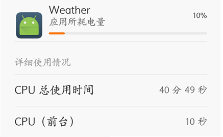
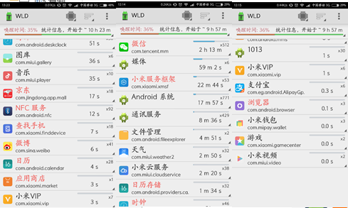
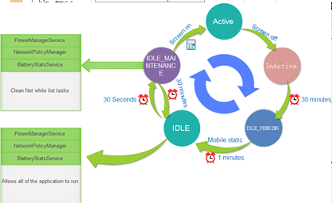

# 安卓app和耗电（李少斐1501210939）


# 摘要


短短几年，智能手机的销量就超过了功能手机，占领了手机销量的大部分市场。当然，智能手机相比功能手机有太多太多的好处和优势。通过智能手机我们可以做到以前PC才能完成的工作。由此，是智能手机将通讯与互联网二者结合在一起，进入了移动互联网时代。
然而智能手机也并非完美的，功能手机依然存在。其中一个重要的原因就在于，相比较于功能机来说，智能手机的耗电量实在是太大了。关于智能手机的耗电的问题，一直是智能手机关注的重点。本文，则通过一些数据，分析安卓系统app的耗电。


# 一、	安卓手机耗电统计方法。
## 1.1.	基础概念
手机有众多部件组成，包括CPU、屏幕、WLAN、GPS、蓝牙、通信信号等，所以说，安卓手机的总耗电指各个部件消耗电量的总和。

## 1.2.	查看方式
* 
直接通过电池管理查看
在手机的设置->电量和性能中，可以查看电池使用情况，如下图:

 
 
* 
使用系统提供的API获得电池使用信息
安卓系统可以通过PowerUsageSummary.java文件中提供的processAppUsage() 和processMiscUsage()方法获得硬件和软件耗电信息信息，上面所给出的也就是通过此方法获得的数据的显示。
PowerUsageSummary.java的源码可以通过http://androidxref.com/4.0.3_r1/xref/packages/apps/Settings/src/com/android/settings/fuelgauge/PowerUsageSummary.java  获得。


# 二、	对安卓手机耗电的简单统计
在上一节中给出了一段时间内手机耗电的统计。软件耗电软件耗电主要指软件在运行中CPU时的耗电。硬件耗电指的是其他的硬件部分（如屏幕、WLAN、蓝牙等）耗电的统计。

## 2.1	硬件耗电
在硬件耗电中，屏幕、待机、信号等部分不能改变，而WLAN、蓝牙、GPS等则可以根据需要开启。
安卓APP可以通关过在Androidmainfest.xml中加入

```
<uses-permission android:name="ANDROID.PERMISSION.CHANGE_NETWORK_STATE"/>
<uses-permission android:name="ANDROID.PERMISSION.CHANGE_WIFI_STATE"/>

```
来改变网络状态，或者通过
```
<uses-permissionandroid:name="ANDROID.PERMISSION.BLUETOOTH_PRIVILEGED"/>
```
链接主动蓝牙设备。虽然方便，但搜索使得耗电增加，因此不推荐使用。

## 2.2	软件耗电


 在上一节的软件耗电中，排名最高的Android系统是一系列系统软件的集合，而之后的微信和Weather两个软件占的比例相当高。
以Weather为例：

 
Weather APP只在前台运行了10秒，但在后台占用了40分钟的CPU时间。主要是因为weather的桌面控件需要调用服务，每秒回执行一次桌面空间的刷新，导致占用大量的CPU时间。Service的滥用导致了CPU的无效运算。
这样众多无效的操作占用了众多的CPU时间，使得安卓耗电严重增多。

# 三、	安卓WakeLock机制


Android为了确保应用程序中关键代码的正确执行，提供了Wake Lock的API，使得应用程序有权限通过代码阻止APP进入休眠状态。这样，即使用户摁下Power键将屏幕关闭，APP依然可以保持运行。这个功能的作用是为了特定的APP能够在锁屏时依然能够为用户提供服务，例如：音乐（听音乐并不需要开启屏幕）、导航（我们也不需要全程盯着屏幕但地图，只需要关键时刻提醒一下）、通讯与服务（需要在熄屏状态也能接听电话和短信）等。

## 3.1	WakeLock的实现


安卓提供了5种类型的WakeLock，分别是
* 
PARTIAL_WAKE_LOCK->设备CPU 持续运转，屏幕和键盘背光允许关闭，普通应用可以获取
* 
SCREEN_DIM_WAKE_LOCK->不建议使用
* 
SCREEN_BRIGHT_WAKE_LOCK->不建议使用
* 
FULL_WAKE_LOCK->不建议设用
* 
PROXIMITY_SCREEN_OFF_WAKE_LOCK->只有系统APP才有权使用

通过使用WakeLock，可以防止
例如，用户在通话过程中，并不希望设备休眠（否则便不能通话），同时也没必要使屏幕长亮，因此通话应用一般需要申请WakeLock来保证自身运行，则需要在ProximitySensor（通话停用的某个class）的updateProximitySensorMode方法中完成，如下：

```
private final PowerManager mPowerManager;  
private final PowerManager.WakeLock mProximityWakeLock;  
mPowerManager = (PowerManager)context.getSystemService(Context.POWER_SERVICE);  
if (mPowerManager.isWakeLockLevelSupported(PowerManager.PROXIMITY_SCREEN_OFF_WAKE_LOCK)) {  
    mProximityWakeLock = mPowerManager.newWakeLock(PowerManager.PROXIMITY_SCREEN_OFF_WAKE_LOCK, TAG);  
    // 申请WakeLock  
    mProximityWakeLock.acquire();  
    // 释放WakeLock  
    int flags = (screenOnImmediately ? 0 : PowerManager.WAIT_FOR_PROXIMITY_NEGATIVE);  
    mProximityWakeLock.release(flags);  
    }

```


## 3.2	WakeLock的使用


安卓系统为了增加续航时间，在一定时间内手机没有操作的情况下，屏幕会逐渐变暗，之后便会自动关闭屏幕，使CPU进入低耗状态，以减少CPU耗电。事实上，新手机在不安装第三方应用的情况下，可以待机很长时间。
当然，安卓系统的设计者并没有完全阻止熄屏状态CPU等设备的运行，WakeLock机制保证了在特殊状态下APP对CPU的使用，如：
* 
保持通话
* 
APP消息推送，及时收到新信息

用户可以及时收到各种消息。

## 3.3	WakeLock的一些问题


安卓系统本身耗电量并不大，但是装上第三方APP之后，由于众多原因，APP频繁的使用WakeLock会使得安卓系统的耗电严重增加。
首先，这里使用Wakelock Detector APP对安卓手机中APP的WakeLock进行统计，如下图：
   
   
如上图所示，在统计时间的近10小时时间内微信APP共有512次唤醒，这也正是第一节中微信在软件耗电统计所占重大比例的原因。

通过WakeLock机制能够带来方便、快速的同时，第三方APP频繁的使用和某些APP滥用权限也带来了大量开销。增加不必要的消耗，较少了电池续航。

# 四、	安卓性能与省电优化


基于上述的耗电情况，可以通过APP开发中一些细节，在一定程度上减少耗电。

## 4.1	编程习惯，通过使用一些性能更有的方法


* 
安卓APP基本使用Java开发语言。Java语言是运行在Java虚拟机JVM之上，通过JVM特性来优化，如：


* * 
减少异常的使用

* * 
合理使用变量和修饰符

* * 
适当的算法


* 

UI布局优化
* * 
减少布局层数
* * 
使用RelativeLayout来代替LinearLayout（RelativeLayout性能更优）
* * 
采用<include>标签共享重用布局等


## 4.2	Service优化


Android应用开发中，难免会遇到service开发。Service在后台运行，和其他组件一样，都是运行在主线程中，因此不能用它来做耗时的请求或者动作。你可以在服务中开一个线程，在线程中做耗时动作。

* 
Service状态检查

由于Service不可见，当Service没有及时关闭时在后台运行，必会增加耗电。如第二节中讲的Weather APP，正是由于Service没有关闭导致耗电巨大。

* 
用IntentService代替Service开发

在多数情况下，使用IntentService可在运行完毕后自动停止，减少耗电。

* 
定时任务Alarm机制

有些情况下当需要周期的进行某些动作时，可以使用Timer类和Alarm机制。但当CPU进入下会面状态时Timer便无法执行。而Alarm则无此情况。同时在Android 4.4之后，Alarm通过一些优化，将临近的几个任务同时执行，降低CPU被唤醒的次数，延长点出使用时间。


## 4.3	Wakelock优化


在多数情况下，为可保证提供高质量的服务或一些其他原因，多数APP会使用Wakelock机制以便进行推送消息。但是，频繁的推送也会成为一种负担。例如，微信会以5分钟为周期发送心跳链接，这意味着每天有进300次从待机状态被唤醒。同样，向QQ、微博等软件同样为5分钟左右。更严重的是嘀嘀打车每小时就唤醒进100次。如此频繁的唤醒，严重影响系统的使用。

安卓开发中应通过合理的使用Wakelock，减少欢迎次数。
同时在安卓4.4中提供了两个新接口：准时定时器和非准时定时器，使用非准时定时器的唤醒可以被监视，并同意执行。因此，有些第三方应用如“绿色守护”和定制安卓系统“miui”可以通过监视来统一进行处理以较少唤醒。


## 4.4	Job Scheduler API


Google 经过测试发现，每次唤醒设备，1-2秒的时候，都会消耗2分钟的待机电量，可见每次唤醒设备的时候，不仅仅是点亮了屏幕，系统也在后台处理很多事情。而Android L（5.0） 版本为了解决这个问题，使用了一个新的API JobScheduler ，这个东西可以让系统批处理一些不重要的APP 请求，研发人员也可以使用这个API 减少自己APP 的不必要操作。

也就是说，对于一些不太重要的推送任务，可以把该任务放到JobScheduler中，而JobScheduler可以根据不同的情况在合适的时间来执行这些任务。


# 五、	Doze and App Standby


在Android M（6.0）中，加入了Doze模式，可以将暂时不用的应用转入低功耗状态，避免在后台运行。而当用户再次使用该APP或者手机充电时就会恢复。这样来减少电量的消耗。
在Doze模式会划分为5种状态，分别为：
* 
ACTIVE：活跃状态
* 
INACTIVE：关闭屏幕之后，进入非活动状态
* 
IDLE_PENDING：非活动30分钟后，进入待处理状态
* 
IDLE：1分钟后进入空闲状态
* 
IDLE_MAINTENANCE：再30分种后，处理挂起的任务

 
图片：Doze状态转换（http://www.zhihu.com/question/30764750/answer/57651718）

通过在不同状态之间转换，适当的减少APP的使用，减少非不要的任务来增长手机续航。

# 六、	总结


相比较于IOS系统，安卓手机机型众多，各种配置不同为安卓开发带来了很多麻烦，同时由于种种原因 ，安卓开发中各种APP的功能也比较复杂，给用户带来了不变。

在安卓开发的过程中，应该尽量避免频繁的请求和其他操作，尽量降低过度使用资源。不仅应该给用户提供更全面的服务，也不能因为这些服务到来更多的麻烦。

# 七、	参考引用


http://www.cnblogs.com/hyddd/p/4402621.html
http://blog.csdn.net/jdsjlzx/article/details/44600477
http://read.haosou.com/article/?id=359c6955673b1faaa2be5ce47e0bc1dd
http://www.zhihu.com/question/24360587
http://www.ithome.com/html/android/153978.htm
http://www.zhihu.com/question/30764750/answer/57651718


