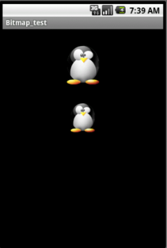

# 安卓图形图像处理（1501210927 孔祥稀）

图形图像的处理技术在android 中非常重要，特别是在开发2D游戏或其他应用程序时，都离不开图形图像处理技术的支持。本文档将对安卓中的图形图像处理技术进行详细介绍。
1.Android绘图的基石--常用绘图类
在Android中，绘制图像时，最常应用的就是Paint类、Canvas类、Bitmap类和BitmapFactory类。下面对这四个类进行简单的介绍。
1.1Paint类
Paint类代表画笔，用来描述图形的颜色和风格，如线宽，颜色，透明度和填充效果等信息。使用Paint类时首先要创建该类的对象，这可以通过该类提供的构造方法来实现。通常情况下，只需要使用Paint（）方法来创建一个使用默认设置的Paint对象：
Paint paint=new Paint();
Paint类的常用方法
setARGB(int a,int r,int g,int b)：
用于设置颜色，各参数值0~255的整数，分别用于表示透明度、红色、绿色和蓝色值。
setColor(int color)：
用于设置颜色，参数color可以通过Color类提供的颜色常量指定，也可以通过Color.rgb(int red,int green,int blue)方法指定。
setAlpha(int a)：
用于设置透明度，值为0~255的整数。
setAntiAlias(boolean aa)：
用于指定是否使用抗锯齿功能，如果使用会使绘图速度变慢。
setDither(boolean dither)：
用于指定是否使用图像抖动处理，如果使用会使图像颜色更加饱满，更加清晰。
setPathEffect(PathEffect effect)：
用于设置绘制路径时的路径效果，例如点划线。
setShader(Shader shader)：
用于设置渐变，可以使用LinearGradient（线性渐变）、RadialGradient（径向渐变）或者SweepGradient（角度渐变）。
setShadowLayer(float radius,float dx,float dy,int color)：
用于设置阴影，参数radius为阴影的角度，dx和dy为阴影在x轴和y轴上的距离，Color为阴影的颜色。如果参数radius的值为0，那么就将没有阴影。
setStrokeCap(Paint.Cap cap)：
用于当画笔的填充样式为STROKE或FILL_AND_STROKE时，设置笔刷的图形样式，参数值可以是Cap.BUTT、Cap.ROUND或Cap.SQUARE。主要体现在线的端点上。
setStrokeJoin(Paint.Join join):
用于设置画笔转弯处的连接风格，参数值为Join.BEVEL，Join.MITER或Join.ROUND。
setStrokeWidth（float width）：
用于设置笔触的宽度。
setStyle（Paint.Style style）：
设置填充风格，参数为Style.FILL,Style.FILL_AND_STROKE或Style.STROKE。
setXfermode（Xfermode xfermode）：
设置图像重叠时的处理方式，如合并，取交集并集，常用来制作橡皮擦除效果。

例：分别定义一个径向渐变，线性渐变，角度渐变的画笔，用这三支画笔绘制三个矩形。

```
import android.support.v7.app.AppCompatActivity;
import android.os.Bundle;
import android.view.Menu;
import android.view.MenuItem;


import android.app.Activity;
import android.content.Context;
import android.graphics.Canvas;
import android.graphics.Color;
import android.graphics.LinearGradient;
import android.graphics.Paint;
import android.graphics.RadialGradient;
import android.graphics.Shader;
import android.graphics.SweepGradient;
import android.os.Bundle;
import android.view.View;
import android.widget.FrameLayout;

public class MainActivity extends Activity {

    @Override
    public void onCreate(Bundle savedInstanceState) {
        super.onCreate(savedInstanceState);
        setContentView(R.layout.activity_main);
        FrameLayout ll=(FrameLayout)findViewById(R.id.frameLayout1);
        ll.addView(new MyView(this));
    }
    public class MyView extends View{

        public MyView(Context context) {
            super(context);
        }

        @Override
        protected void onDraw(Canvas canvas) {
            Paint paint=new Paint();         //定义一个默认的画笔
            //线性渐变
            Shader shader=new LinearGradient(0, 0, 50, 50, Color.RED, Color.GREEN, Shader.TileMode.MIRROR);
            paint.setShader(shader);   //为画笔设置渐变器
            canvas.drawRect(10, 70, 100, 150, paint);  //绘制矩形
            //径向渐变
            shader=new RadialGradient(160, 110, 50, Color.RED, Color.GREEN, Shader.TileMode.MIRROR);
            paint.setShader(shader);   //为画笔设置渐变器
            canvas.drawRect(115,70,205,150, paint);    //绘制矩形
            //角度渐变
            shader=new SweepGradient(265,110,new int[]{Color.RED,Color.GREEN,Color.BLUE},null);
            paint.setShader(shader);
            canvas.drawRect(220, 70, 310, 150, paint); //绘制矩形

            super.onDraw(canvas);
        }


    }
}
```
程序运行效果如图所示：


1.2Canvas 类
 Canvas，在英语中，这个单词的意思是帆布。在Android中，则把Canvas当做画布，只要我们借助设置好的画笔(Paint类)就可以在画布上绘制我们想要的任何东西；另外它也是显示位图(Bitmap类)的核心类。随用户的喜好，Canvas还可设置一些关于画布的属性，比如，画布的颜色、尺寸等。Canvas提供了如下一些方法：
Canvas(): 创建一个空的画布，可以使用setBitmap()方法来设置绘制具体的画布。
Canvas(Bitmap bitmap): 以bitmap对象创建一个画布，则将内容都绘制在bitmap上，因此bitmap不得为null。
Canvas(GL gl): 在绘制3D效果时使用，与OpenGL相关。
       drawColor: 设置Canvas的背景颜色。
    setBitmap:  设置具体画布。
    clipRect: 设置显示区域，即设置裁剪区。
    isOpaque:检测是否支持透明。
    rotate:  旋转画布
    translate：移动画布
    scale：缩放画布
    setViewport:  设置画布中显示窗口。
    skew:  设置偏移量。
    restore: 用来恢复上一次save之前的状态
    save：用来保存Canvas的当前状态
canvas.drawRect(RectF,Paint)
用于画矩形，第一个参数为图形显示区域，第二个参数为画笔，设置好图形显示区域Rect和画笔Paint后，即可画图；

canvas.drawRoundRect(RectF, float, float, Paint) 
用于画圆角矩形，第一个参数为图形显示区域，第二个参数和第三个参数分别是水平圆角半径和垂直圆角半径。

canvas.drawLine(startX, startY, stopX, stopY, paint)：
前四个参数的类型均为float，最后一个参数类型为Paint。表示用画笔paint从点（startX,startY）到点（stopX,stopY）画一条直线；

canvas.drawArc(oval, startAngle, sweepAngle, useCenter, paint)：
第一个参数oval为RectF类型，即圆弧显示区域，startAngle和sweepAngle均为float类型，分别表示圆弧起始角度和圆弧度数,3点钟方向为0度，useCenter设置是否显示圆心，boolean类型，paint为画笔；

canvas.drawCircle(float,float, float, Paint)
用于画圆，前两个参数代表圆心坐标，第三个参数为圆半径，第四个参数是画笔；

下面将通过一个具体的例子来说明如何创建用于绘图的画布。
例：Canvas画布做出一个安卓机器人图形。

```
import android.graphics.Canvas;
 
 
public interface  drawGraphics {
public void  draw(Canvas canvas);
}

import android.content.Context;
import  android.graphics.Canvas;
import android.graphics.Color;
import android.graphics.Paint;
import android.view.View;
public classGameView  extends View  implements  Runnable{
      //声明Paint对象
       private  Paint mPaint= null;
       privatedrawGraphics drawGraphics= null;
       public GameView(Context context) {
            super(context);
           // TODOAuto-generated constructor stub
           //构建对象
           mPaint= new Paint();
           //开启线程
           new  Thread(this).start();
       }
       public void  onDraw(Canvas canvas) {
           super.onDraw(canvas);
           //设置画布为黑色背景
           //canvas.drawColor(Color.BLACK);
           //消除锯齿
           mPaint.setAntiAlias(true);
          //设置图形为空心
           mPaint.setStyle(Paint.Style.STROKE);
           //绘制空心几何图形
           drawGraphics=  new  DrawCircle();
           drawGraphics.draw(canvas);
           drawGraphics=  new  DrawLine();
           drawGraphics.draw(canvas);
           drawGraphics= newDrawRect();
           drawGraphics.draw(canvas);
       }
 
        
          @Override
          public void run() {
               // TODOAuto-generated method stub
               while(!Thread.currentThread().isInterrupted()) {
                    try{
                          Thread.sleep(1000);
                    } catch(InterruptedException e) {
                      // TODO: handle exception
                      Thread.currentThread().interrupt();
                    }
                     //使用postInvalidate 可以直接在线程中更新界面
                      postInvalidate(); 
               }
         }
 
}

//DrawRect.java
import android.graphics.Canvas;
import android.graphics.Color;
import android.graphics.Paint;
import android.graphics.RectF;
public class DrawRect  implements  drawGraphics{
       private  Paint paint=  null;
       public DrawRect(){
       paint= new  Paint();
}
         @Override
         public void  draw(Canvas canvas) {
             // TODOAuto-generated method stub
             //定义圆角矩形对象
             RectF rectF1 = newRectF(120,170,370,500);
             RectF rectF2 = newRectF(40,150,90,400);
             RectF rectF3 = newRectF(390,150,440,400);
             RectF rectF4 = newRectF(140,520,200,650);
             RectF rectF5 = newRectF(290,520,350,650);
             paint.setAntiAlias(true);
             //设置画笔颜色为BLUE
             paint.setColor(Color.GREEN);
             //在画布上绘制圆角矩形/圆弧/直线
             canvas.drawRoundRect(rectF1, 20, 20, paint);
             canvas.drawRoundRect(rectF2, 20, 20, paint);
             canvas.drawRoundRect(rectF3, 20, 20, paint);
             canvas.drawRoundRect(rectF4, 20, 20, paint);
             canvas.drawRoundRect(rectF5, 20, 20, paint);
        }
}

//DrawLine.java
import android.graphics.Canvas;
import  android.graphics.Color;
import android.graphics.Paint;
public class DrawLine  implements  drawGraphics{
 private Paint paint=  null;
        public  DrawLine(){
           paint=  new  Paint();
       }
              @Override
        publicvoiddraw(Canvas canvas) {
            // TODOAuto-generated method stub
            paint.setAntiAlias(true);
            //绘制直线
            paint.setColor(Color.GREEN);
            //设置线条粗细
            paint.setStrokeWidth(12);
            canvas.drawLine(120,40,170,90, paint);
            canvas.drawLine(320,90,370,40, paint);
       }
}

//DrawCircle.java
import android.graphics.Canvas;
import  android.graphics.Color;
import  android.graphics.Paint;
import android.graphics.RectF;
public class DrawCircle  implements  drawGraphics{
        private  Paint paint=  null;
        private  Paint paint_eye=  null;
 
        public  DrawCircle(){
        paint= new  Paint();
        paint_eye= new  Paint();
}
        @Override
        public  void draw(Canvas canvas) {
             // TODOAuto-generated method stub
             //绘制圆形(圆心x，圆心y，半径r，画笔p)
             paint_eye.setAntiAlias(true);
             paint.setAntiAlias(true);
             RectF rectF = newRectF(120,60,370,240);
             paint_eye.setColor(Color.WHITE);
             paint.setColor(Color.GREEN);
             canvas.drawCircle(190, 110, 18, paint_eye);
             canvas.drawCircle(300, 110, 18, paint_eye);
             canvas.drawArc(rectF, 180, 180,true, paint);
        }
}

//GameStart.java
package  com.scgm.android.drawable;
import  android.app.Activity;
import android.os.Bundle; 
public class GameStart  extends  Activity {
      private  GameView mGameView=  null; 
      @Override
      public  void  onCreate(Bundle  savedInstanceState) { 
          super.onCreate(savedInstanceState);
          this.mGameView= newGameView(this);
          setContentView(mGameView);
      }
}
```

程序运行结果如图所示：


1.3 Bitmap类
    Bitmap类代表位图，它是Android系统中图像处理最重要的类之一。使用它不仅可以获取图像文件信息，进行图像剪切，旋转，缩放等操作，还可以指定格式保存文件。Bitmap实现在android.graphics包中。但是Bitmap类的构造函数是私有的，外面并不能实例化，只能是通过JNI实例化。这必然是某个辅助类提供了创建Bitmap的接口，而这个类的实现通过JNI接口来实例化Bitmap的，这个类就是BitmapFactory。
BitMap类常用方法：
public void recycle()
回收位图占用的内存空间，把位图标记为Dead 
public final boolean isRecycled()
判断位图内存是否已释放 
public final int getWidth()
获取位图的宽度 
public final int getHeight()
获取位图的高度 
public final boolean isMutable()
图片是否可修改 
public int getScaledWidth(Canvas canvas)
获取指定密度转换后的图像的宽度 
public int getScaledHeight(Canvas canvas)
获取指定密度转换后的图像的高度 
public boolean compress(CompressFormat format, int quality, OutputStream stream)
按指定的图片格式以及画质，将图片转换为输出流。
format：Bitmap.CompressFormat.PNG或Bitmap.CompressFormat.JPEG 
quality：画质，0-100.0表示最低画质压缩，100以最高画质压缩。对于PNG等无损格式的图片，会忽略此项设置。  
public static Bitmap createBitmap(Bitmap src)
以src为原图生成不可变得新图像 
public static Bitmap createScaledBitmap(Bitmap src, int dstWidth, 
int dstHeight, boolean filter)
以src为原图，创建新的图像，指定新图像的高宽以及是否可变。
public static Bitmap createBitmap(int width, int height, Config config)
创建指定格式、大小的位图 
public static Bitmap createBitmap(Bitmap source, int x, int y, int width, int height)
以source为原图，创建新的图片，指定起始坐标以及新图像的高宽。 
BitmapFactory工厂类常用方法： 
public boolean inJustDecodeBounds（）
如果设置为true，不获取图片，不分配内存，但会返回图片的高度宽度信息。 
public int inSampleSize（）
图片缩放的倍数。如果设为4，则宽和高都为原来的1/4，则图是原来的1/16。
public int outWidth（）
获取图片的宽度值 
public int outHeight（）
获取图片的高度值 
public int inDensity（）
用于位图的像素压缩比 
public int inTargetDensity（）
用于目标位图的像素压缩比（要生成的位图）
public boolean inScaled（）
设置为true时进行图片压缩，从inDensity到inTargetDensity。
public static Bitmap decodeFile(String pathName, Options opts) 
public static Bitmap decodeFile(String pathName) 
读取一个资源文件得到一个位图。如果位图数据不能被解码，或者opts参数只请求大小信息时，则返回NuLL。 
public static Bitmap decodeResource(Resources res, int id) 
public static Bitmap decodeResource(Resources res, int id, Options opts) 
从输入流中解码位图 
public static Bitmap decodeStream(InputStream is) 
从字节数组中解码生成不可变的位图
下面通过几个例子详细介绍Bitmap的用法
一、图片圆角处理
    在Android中可以很容通过图像叠加的规则为图片添加圆角效果。正常情况下，在已有的图像上绘图时将会在其上面添加一层新的图形。如果绘图时使用的Paint是完全不透明的，那么它将完全遮挡住下面的图像，如果Paint是部分透明的，那么它将会对重叠部分图像的颜色叠加处理。通过PorterDuffXfermode规则可以设置绘制图像时的叠加规则。PorterDuffXfermode是非常强大的转换模式，使用它可以设置图像叠加的Porter-Duff规则，来控制Paint如何与Canvas上已有的图像进行叠加。下面列举了常用的12条Porter-Duff规则及其表示的含义：

PorterDuff.Mode.CLEAR 清除画布上图像
PorterDuff.Mode.SRC 显示上层图像
PorterDuff.Mode.DST 显示下层图像
PorterDuff.Mode.SRC_OVER上下层图像都显示，下层居上显示
PorterDuff.Mode.DST_OVER 上下层都显示,下层居上显示
PorterDuff.Mode.SRC_IN 取两层图像交集部分,只显示上层图像
PorterDuff.Mode.DST_IN 取两层图像交集部分,只显示下层图像
PorterDuff.Mode.SRC_OUT 取上层图像非交集部分
PorterDuff.Mode.DST_OUT 取下层图像非交集部分
PorterDuff.Mode.SRC_ATOP 取下层图像非交集部分与上层图像交集部分
PorterDuff.Mode.DST_ATOP 取上层图像非交集部分与下层图像交集部分
PorterDuff.Mode.XOR 取两层图像的非交集部分
下面使用PorterDuff.Mode.SRC_IN规则来给图片添加圆角效果，主要的思路是先绘制一个圆角矩形，然后在上面绘制图像，取图像与圆角矩形的交集部分，只保留图像。代码如下：

```
//图片圆角处理  
public Bitmap getRoundedBitmap() {
    Bitmap mBitmap = BitmapFactory.decodeResource(getResources(), R.drawable.frame);
    //创建新的位图  
    Bitmap bgBitmap = Bitmap.createBitmap(mBitmap.getWidth(), mBitmap.getHeight(), Config.ARGB_8888);
    //把创建的位图作为画板  
    Canvas mCanvas = new Canvas(bgBitmap);
    Paint mPaint = new Paint();
    Rect mRect = new Rect(0, 0, mBitmap.getWidth(), mBitmap.getHeight());
    RectF mRectF = new RectF(mRect);
    //设置圆角半径为20  
    float roundPx = 15;
    mPaint.setAntiAlias(true);
    //先绘制圆角矩形  
    mCanvas.drawRoundRect(mRectF, roundPx, roundPx, mPaint);
    //设置图像的叠加模式  
    mPaint.setXfermode(new PorterDuffXfermode(PorterDuff.Mode.SRC_IN));
    //绘制图像  
    mCanvas.drawBitmap(mBitmap, mRect, mRect, mPaint);
    return bgBitmap;
}
```

程序运行效果如下图所示：


二、图片灰化处理
在Android中可以通过ColorMatrix类实现图像处理软件中的滤镜效果，通过ColorMatrix类可以对位图中的每个像素进行变换处理，达到特殊的滤镜效果，下面通过一个例子来介绍如何通过ColorMatrix对图像进行灰化处理，Java代码如下：
```
//图片灰化处理  
public Bitmap getGrayBitmap() {
    Bitmap mBitmap = BitmapFactory.decodeResource(getResources(), R.drawable.android);
    Bitmap mGrayBitmap = Bitmap.createBitmap(mBitmap.getWidth(), mBitmap.getHeight(), Bitmap.Config.ARGB_8888);
    Canvas mCanvas = new Canvas(mGrayBitmap);
    Paint mPaint = new Paint();
    //创建颜色变换矩阵  
    ColorMatrix mColorMatrix = new ColorMatrix();
    //设置灰度影响范围  
    mColorMatrix.setSaturation(0);
    //创建颜色过滤矩阵  
    ColorMatrixColorFilter mColorFilter = new ColorMatrixColorFilter(mColorMatrix);
    //设置画笔的颜色过滤矩阵  
    mPaint.setColorFilter(mColorFilter);
    //使用处理后的画笔绘制图像  
    mCanvas.drawBitmap(mBitmap, 0, 0, mPaint);
    return mGrayBitmap;
}  
```
效果如下图所示：


三．提取图像Alpha位图
Android中的ARGB_8888类型的位图由Alpha（透明度）、Red（红）、Green（绿）、Blue（蓝）四部分组成，其中Alpha部分也就是常说的Alpha通道，它控制图像的透明度。在Android中Bitmap类提供了extractAlpha()方法，可以把位图中的Alpha部分提取出来作为一个新的位图，然后与填充颜色后的Paint结合重新绘制一个新图像。下面通过一个例子来说明Bitmap类的extractAlpha()方法的使用，Java代码如下：
```
//提取图像Alpha位图  
public Bitmap getAlphaBitmap() {
    BitmapDrawable mBitmapDrawable = (BitmapDrawable) getResources().getDrawable(R.drawable.enemy_infantry_ninja);
    Bitmap mBitmap = mBitmapDrawable.getBitmap();
    //BitmapDrawable的getIntrinsicWidth（）方法，Bitmap的getWidth（）方法  
    //注意这两个方法的区别  
    //Bitmap mAlphaBitmap = Bitmap.createBitmap(mBitmapDrawable.getIntrinsicWidth(), mBitmapDrawable.getIntrinsicHeight(), Config.ARGB_8888);  
    Bitmap mAlphaBitmap = Bitmap.createBitmap(mBitmap.getWidth(), mBitmap.getHeight(), Bitmap.Config.ARGB_8888);
    Canvas mCanvas = new Canvas(mAlphaBitmap);
    Paint mPaint = new Paint();
    mPaint.setColor(Color.BLUE);
    //从原位图中提取只包含alpha的位图  
    Bitmap alphaBitmap = mBitmap.extractAlpha();
    //在画布上（mAlphaBitmap）绘制alpha位图  
    mCanvas.drawBitmap(alphaBitmap, 0, 0, mPaint);
    return mAlphaBitmap;
}  
```
效果如下图所示：


三．图像变换
Android开发框架提供了一个坐标变换矩阵Matrix类，它可以与Bitmap类的createBitmap方法结合使用，对图像进行缩放、旋转、扭曲等变换处理。图像变换操作就是对坐标变换矩阵进行矩阵乘法运算，Matrix类中提供了一些简便的方法如preScale、postScale、preRotate、postRotate、preSkrew、postSkrew、preTranslate、postTranslate等封装了矩阵的运算，它们与Bitmap类的createBitmap方法结合使用可以很容易地对图像进行缩放、旋转、扭曲、平移操作。
图像缩放
    使用Matrix类preScale或者postScale可以对图像进行缩放操作，它的两个参数分别为x和y坐标缩放比例，下面使用preScale对图像进行放大0.75倍，Java代码如下：
    
 ```
 // getScaleBitmap
public Bitmap getScaleBitmap() {
    BitmapDrawable mBitmapDrawable = (BitmapDrawable) getResources().getDrawable(R.drawable.pet);
    Bitmap mBitmap = mBitmapDrawable.getBitmap();
    int width = mBitmap.getWidth();
    int height = mBitmap.getHeight();
    Matrix matrix = new Matrix();
    matrix.preScale(0.75f, 0.75f);
    Bitmap mScaleBitmap = Bitmap.createBitmap(mBitmap, 0, 0, width, height, matrix, true);
    return mScaleBitmap;
}
 ```
 
程序运行结果如下：



图片旋转
使用Matrix类preRotate或者postRotate可以对图像进行旋转操作，它只有一个参数表示旋转的角度，下面使用preRotate对图像顺时针旋转30度，Java代码如下：
    
 ```
//getRotatedBitmap  
public Bitmap getRotatedBitmap() {
BitmapDrawable mBitmapDrawable = (BitmapDrawable) getResources().getDrawable(R.drawable.pet);
Bitmap mBitmap = mBitmapDrawable.getBitmap();
int width = mBitmap.getWidth();
int height = mBitmap.getHeight();
Matrix matrix = new Matrix();
matrix.preRotate(45);
Bitmap mRotateBitmap = Bitmap.createBitmap(mBitmap, 0, 0, width, height, matrix, true);
return mRotateBitmap;
}  
```
效果如下图所示：


3）图像倾斜
使用Matrix类preSkew或者postSkew可以对图像进行倾斜操作，它的两个参数分别为x和y坐标倾斜度，下面使用preSkew对图像进行倾斜变换，Java代码如下：
```
//getScrewBitmap  
public Bitmap getScrewBitmap() {
    BitmapDrawable mBitmapDrawable = (BitmapDrawable) getResources().getDrawable(R.drawable.pet);
    Bitmap mBitmap = mBitmapDrawable.getBitmap();
    int width = mBitmap.getWidth();
    int height = mBitmap.getHeight();
    Matrix matrix = new Matrix();
    matrix.preSkew(1.0f, 0.15f);
    Bitmap mScrewBitmap = Bitmap.createBitmap(mBitmap, 0, 0, width, height, matrix, true);
    return mScrewBitmap;
}  
```

效果如下图所示：

 
    
 4）图像倒影
 为图像添加倒影效果之后，图像看起来会有立体感，更有真实感，在Android中使用Matrix类可以很容易实现图像的倒影效果。主要是Matrix的preScale方法的使用，给它设置负数缩放比例，图像就会进行反转。然后通过设置Shader添加渐变效果。Java代码如下：
    
```
//getReflectedBitmap  
private Bitmap getReflectedBitmap() {
    BitmapDrawable mBitmapDrawable = (BitmapDrawable) getResources().getDrawable(R.drawable.pet);
    Bitmap mBitmap = mBitmapDrawable.getBitmap();
    int width = mBitmap.getWidth();
    int height = mBitmap.getHeight();
    Matrix matrix = new Matrix();
    // 图片缩放，x轴变为原来的1倍，y轴为-1倍,实现图片的反转  
    matrix.preScale(1, -1);
    //创建反转后的图片Bitmap对象，图片高是原图的一半。  
    //Bitmap mInverseBitmap = Bitmap.createBitmap(mBitmap, 0, height/2, width, height/2, matrix, false);  
    //创建标准的Bitmap对象，宽和原图一致，高是原图的1.5倍。  
    //注意两种createBitmap的不同  
    //Bitmap mReflectedBitmap = Bitmap.createBitmap(width, height*3/2, Config.ARGB_8888);  
    Bitmap mInverseBitmap = Bitmap.createBitmap(mBitmap, 0, 0, width, height, matrix, false);
    Bitmap mReflectedBitmap = Bitmap.createBitmap(width, height*2, Config.ARGB_8888);
    // 把新建的位图作为画板  
    Canvas mCanvas = new Canvas(mReflectedBitmap);
    //绘制图片  
    mCanvas.drawBitmap(mBitmap, 0, 0, null);
    mCanvas.drawBitmap(mInverseBitmap, 0, height, null);
    //添加倒影的渐变效果  
    Paint mPaint = new Paint();
    Shader mShader = new LinearGradient(0, height, 0, mReflectedBitmap.getHeight(), 0x70ffffff, 0x00ffffff, TileMode.MIRROR);
    mPaint.setShader(mShader);
    //设置叠加模式  
    mPaint.setXfermode(new PorterDuffXfermode(PorterDuff.Mode.DST_IN));
    //绘制遮罩效果  
    mCanvas.drawRect(0, height, width, mReflectedBitmap.getHeight(), mPaint);
    return mReflectedBitmap;
}
```

效果如下图所示：


    