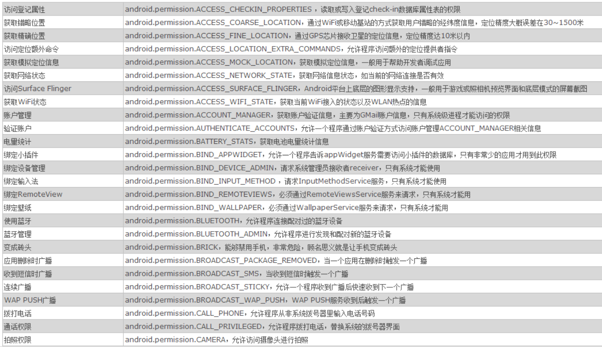

# Andriod权限机制（1501211048朱思敏）

作者：朱思敏<br>
学号：1501211048<br>
学院：北京大学软件与微电子学院


# 1、 Android 安全机制概述

Android 是一个权限分离的系统 。 这是利用 Linux 已有的权限管理机制，通过为每一个 Application 分配不同的 uid 和 gid ， 从而使得不同的 Application 之间的私有数据和访问（ native 以及 java 层通过这种 sandbox 机制，都可以）达到隔离的目的 。 与此 同时， Android 还 在此基础上进行扩展，提供了 permission 机制，它主要是用来对 Application 可以执行的某些具体操作进行权限细分和访问控制，同时提供了 per-URI permission 机制，用来提供对某些特定的数据块进行 ad-hoc 方式的访问。

## 1.1 uid、gid、gids


在 Android 上，一个用户 UID 标示一个应用程序。应用程序在安装时被分配用户 UID，应用程序在设备上的存续期间内，用户 UID 保持不变。对于普通的应用程序，GID即等于UID。GIDS 是由框架在 Application 安装过程中生成，与 Application 申请的具体权限相关。 如果 Application 申请的相应的 permission 被 granted ，而且有对应的GIDS， 那么 这个Application 的 gids 中将 包含这个 gids。记住权限(GIDS)是关于允许或限制应用程序（而不是用户）访问设备资源。

## 1.2 Android的权限规则


### 1.2.1 Android中的apk必须签名


这种签名不是基于权威证书的，不会决定某个应用允不允许安装，而是一种自签名证书。
重要的是，android系统有的权限是基于签名的。比如：system等级的权限有专门对应的签名，签名不对，权限也就获取不到。
默认生成的APK文件是debug签名的。获取system权限时用到的签名。

### 1.2.2 基于UserID的进程级别的安全机制


进程有独立的地址空间，进程与进程间默认是不能互相访问的，Android通过为每一个apk分配唯一的linux userID来实现，名称为"app_"加一个数字，比如app_43不同的UserID，运行在不同的进程，所以apk之间默认便不能相互访问。

Android提供了如下的一种机制，可以使两个apk打破前面讲的这种壁垒。
在AndroidManifest.xml中利用sharedUserId属性给不同的package分配相同的userID，通过这样做，两个package可以被当做同一个程序，
系统会分配给两个程序相同的UserID。当然，基于安全考虑，两个apk需要相同的签名，否则没有验证也就没有意义了。

### 1.2.3默认apk生成的数据对外是不可见的


实现方法是：Android会为程序存储的数据分配该程序的UserID。
借助于Linux严格的文件系统访问权限，便实现了apk之间不能相互访问似有数据的机制。


## 2、 Android permission 管理机制
Android 框架提供一套默认的权限存储在android.anifest.permission 类中，同时也允许我们自己定义新的权限。我们在写应用程序时声明权限，程序安装时新权限被引入系统。权限授权在应用程序被安装时执行。当在设备上安装应用程序时，程序将请求完成任务必需的权限集合。被请求的权限列单显示在设备屏幕上以待用户审查只有用户同意授权后，程序才会被安装，该应用程序获得所有被请求的权限。所以，Android 系统实施的主要安全准则是应用程序只有得到权限许可后，才能执行可能会影响到系统其它部分的操作。每个权限被定义成一个字符串，用来传达权限以执行某个特殊的操作。所有权限可以分为两个类别:一种是执行程序时被应用程序所请求的权限，一种是应用程序的组件之间通信时被其它组件请求的权限。开发者通过在AndroidManifest.xml文件中编写权限标签来定义以上两种类别的权限策略。如果没有在AndroidManifest.xml文件中相应申明，则会运行错误且提示：java.lang.SecurityException: Permission Denial ...<br>
一个权限主要包含三个方面的信息：权限的名称；属于的权限组；保护级别。一个权限组是指把权限按照功能分成的不同的集合。每一个权限组包含若干具体权限。每个权限通过 protectionLevel 来标识保护级别： normal ， dangerous ， signature ， signatureorsystem 。不同的保护级别代表了程序要使用此权限时的认证方式。 normal 的权限只要申请了就可以使用；dangerous的权限在安装时需要用户确认才可以使用； signature 和 signatureorsystem 的权限需要使用者的 app和系统使用同一个数字证书。系统的那个权限，就是用的```<permission>```来定义好的，那么，谁要想使用，只需要对应的添加```<user-permission。```即可.<br> 
<permission   

    android:description="string resource"  
    android:icon="drawable resource"  
    android:label="string resource"  
    android:name="string"  
    android:permissionGroup="string"  
    android:protectionLevel=["normal" | "dangerous" |   
    "signature" | "signatureOrSystem"] />  ```
    android:description:  描述这个权限所针对的操作及用户授予这个权限的后果 
android:label:   权限的一个简短描述 
android:name: 权限的唯一标识，一般都是使用 报名加权限名 
android:permissionGroup: 权限所属权限组的名称 
android:protectionLevel: 权限的等级
normal: 是最低的等级，声明次权限的app，系统会默认授予次权限，不会提示用户 dangerous:  权限对应的操作有安全风险，系统在安装声明此类权限的app时会提示用户 signature:  权限表明的操作只针对使用同一个证书签名的app开放 
signatureOrSystem: 与signature类似，只是增加了rom中自带的app的声明
 注：android:name 属性是必须的，其他的可选，未写的系统会指定默认值。
 常见的权限举例如下：
