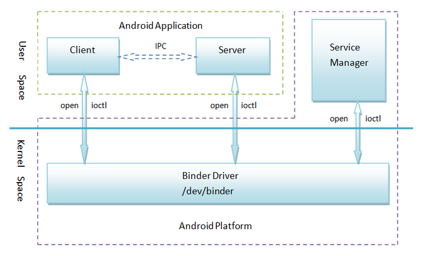
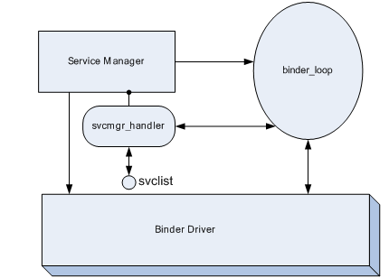
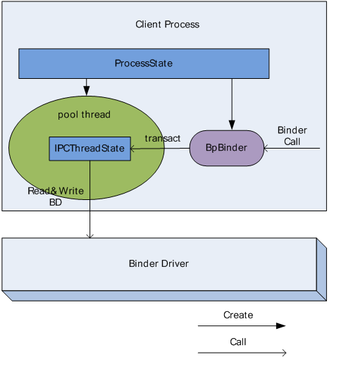
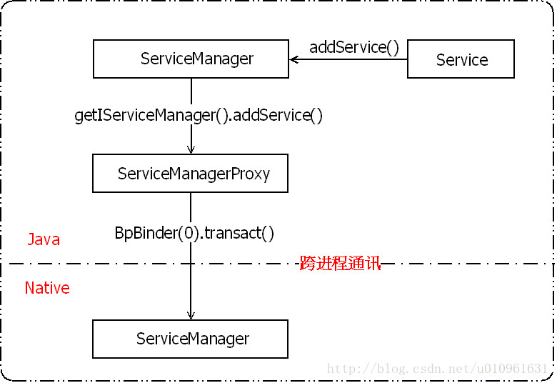
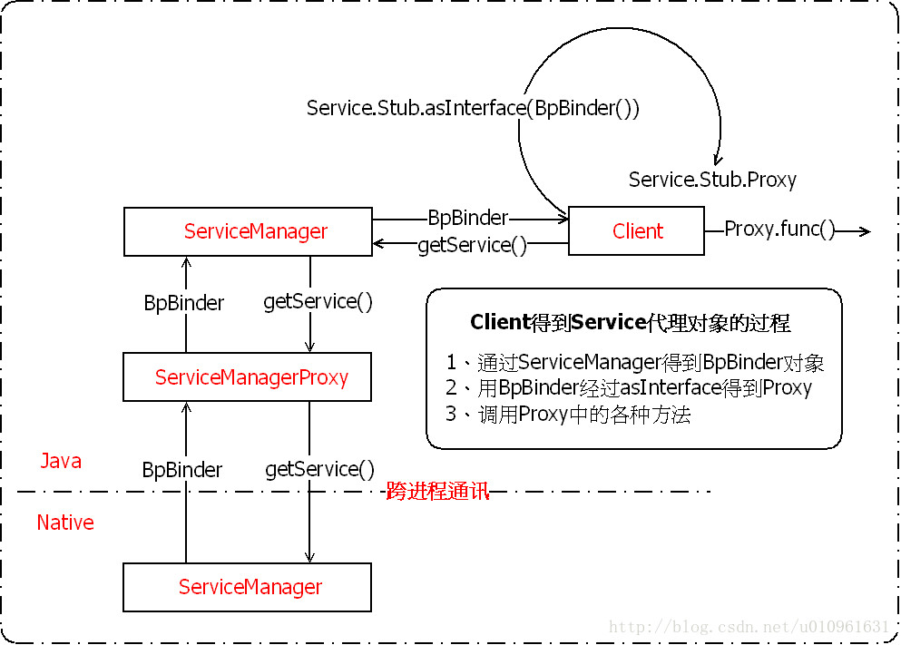
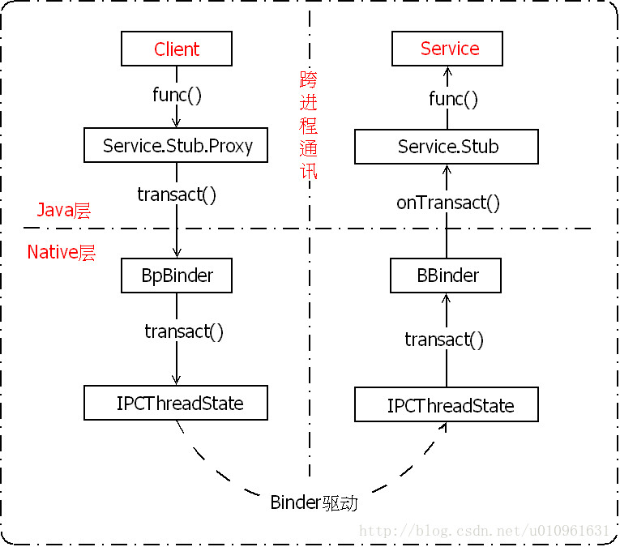

# Android Binder机制(1501210451 张志康)

学号：1501210451  姓名：张志康  专业：集成电路工程

# 
本文主要分析native层和Java层的Android binder通信机制。

binder是Android最为常见的进程通信机制之一，其驱动和通信库是binder的核心，分别由C和C++编写，应用程序通过JNI同底层库进行关联，也就是native层驱动和通信库通过Java层包装后被Java层调用。

源代码网址：http://androidxref.com/4.2_r1/

参考博客：http://blog.csdn.net/coding_glacier/article/details/7520199

**一、native层整体通信流程**

* **通信流程概要** 

    在探究binder通信流程之前，首先我们需要了解Binder机制的四个组件：Client、Server、Service Manager和Binder驱动程序。关系如图：
    
    
    应用程序最终目的是完成Client组件和Server组件之间的通信。ServiceManger对于大家而言是一个公共接入点，0便是ServiceManger的句柄值。

    从表面看通信建立的流程便是注册和获取的过程： 
    1、client通过参数（Parcel包）传递进行通信请求；
    
    2、在收到通信请求时，Server组件需要通过0这个句柄值访问ServiceManger，在ServiceManger中注册一个binder实体。并关联一个字符串；
    
    3、Client组件通过0这个标识去访问ServiceManger，通过一个字符去查询Server组件的引用，此ServiceManger将Server注册的binder实体的一个引用传递给Client端，此时client便可根据这个引用同server进行通信了。
    
    由以上可知，在收到请求时server将一个binder实体传递给C进程，而client得到的只是binder的一个引用，进而调用binder实体的函数。BpBinder和BBinder分别代表binder 的引用和实体，它们均继承自IBinder类。
    
    在描述具体流程之前我们先来了解binder通信中需要用到的三个主要基类：
    
    1.基类IInterface：
    为server端提供接口，它的子类声明了service能够实现的所有的方法；
    
    2.基类IBinder
    BBinder与BpBinder均为IBinder的子类，因此可以看出IBinder定义了binder IPC的通信协议，BBinder与BpBinder在这个协议框架内进行的收和发操作，构建了基本的binder IPC机制。
    
    3.基类BpRefBase
    client端在查询SM获得所需的的BpBinder后，BpRefBase负责管理当前获得的BpBinder实例。
    
* **ServiceManger**

    首先我们来了解一下在通信流程中ServiceManger所做的工作。
    
	ServiceManger是一个linux级进程，是一个service管理器（service向SM注册是，service就是一个client，而ServiceManger便是server），即我们前边提到的：每一个service被使用之前，均要向ServiceManger注册，客户端通过查询ServiceManger是否存在此服务来获取service的handle（标识符）。
	    ServiceManger入口函数为：service_manager.c
        位于：/frameworks/base/cmds/servicemanager/

        270int main(int argc, char **argv)
        271{
        272    struct binder_state *bs;
        273    void *svcmgr = BINDER_SERVICE_MANAGER;
        274
        275    bs = binder_open(128*1024);
        276	
        277    if (binder_become_context_manager(bs)) {
        278        ALOGE("cannot become context manager (%s)\n", strerror(errno));
        279        return -1;
        280    }
        281
        282    svcmgr_handle = svcmgr;
        283    binder_loop(bs, svcmgr_handler);
        284    return 0;
        285}
        主要工作：
            1. 初始化binder，打开/dev/binder设备，在内存中为binder映射128Kb空间。
        bs = binder_open(128*1024);
        其中binder_open位于binder.c中，源代码为：
        94struct binder_state *binder_open(unsigned mapsize)
        95{
        96    struct binder_state *bs;
        97
        98    bs = malloc(sizeof(*bs));
        99    if (!bs) {
        100        errno = ENOMEM;
        101        return 0;
        102    }
        103
        104    bs->fd = open("/dev/binder", O_RDWR);
        105    ……
        127    return 0;
        128}
            2. 指定SM对于代理binder的handle为0，即client尝试同SM通信时创建一个handle为0的代理binder。
        void *svcmgr = BINDER_SERVICE_MANAGER;
        svcmgr_handle = svcmgr;
        其中BINDER_SERVICE_MANAGER在binder.h中被指定为0：
        #define BINDER_SERVICE_MANAGER ((void*) 0)
            3. 通知binder driver(BD)使SM成为BD的context manager；
        if (binder_become_context_manager(bs)) {
        LOGE("cannot become context manager (%s)/n", strerror(errno));
        return -1;
        }
        binder_become_context_manager(bs)源码位于binder.c中：
        	int binder_become_context_manager(struct binder_state *bs)
        138{
        139    return ioctl(bs->fd, BINDER_SET_CONTEXT_MGR, 0);
        140}
            4.进入一个死循环，不断读取内核的binder    driver，查看是否有对service的操作请求，如果有调用svcmgr_handler来处理请求操作：
        binder_loop(bs, svcmgr_handler);
        binder_loop(,)源码位于binder.c中：
        void binder_loop(struct binder_state *bs, binder_handler func)
        358{
        359    int res;
        360    struct binder_write_read bwr;
        361    unsigned readbuf[32];
        362	……
        391    }
        392}
            5.维护一个svclist列表来存储service的信息。
        	源码位于service_manager.c：
        int svcmgr_handler(struct binder_state *bs,
        202                   struct binder_txn *txn,
        203                   struct binder_io *msg,
        204                   struct binder_io *reply)
        205{
        206    struct svcinfo *si;
        207    ……
        268}

* **ProcessState**

    ProcessState是每个进程在使用Binder通信时都需要维护的，用来描述当前进程的binder状态。

    ProcessState主要完成两个功能：
    
    1.创建一个thread负责与内核中的binder模块进行通信（Poolthread）。
    
    在Binder IPC中，所有进程均会启动一个thread来负责与binder来直接通信，也就是不断读写binder，这个线程主体是一个IPCThreadState对象（具体介绍见第4节）。

	        Poolthread启动方式：ProcessState::self()->startThreadPool();
        /frameworks/native/libs/binder/ProcessState.cpp
        136void ProcessState::startThreadPool()
        137{
        138    AutoMutex _l(mLock);
        139    if (!mThreadPoolStarted) {
        140        mThreadPoolStarted = true;
        141        spawnPooledThread(true);
        142    }
        143}

	2.为知道的handle创建一个BpBinder对象，并管理进程中所有的BpBinder对象。
	
    BpBinder在第一节已经提到，其主要功能是负责client向BD发送调用请求的数据，是client端binder通信的核心，通过调用transact向BD发送调用请求的数据。
    
	ProcessState通过如下函数获取BpBinder对象：
	
	        /frameworks/native/libs/binder/ProcessState.cpp
        	sp<IBinder> ProcessState::getContextObject(const sp<IBinder>& caller)
        90{
        91    return getStrongProxyForHandle(0);
        92}

        sp<IBinder> ProcessState::getStrongProxyForHandle(int32_t handle)
        184{
        185    sp<IBinder> result;
        186
        187    AutoMutex _l(mLock);
        188
        189    handle_entry* e = lookupHandleLocked(handle);
		……
        210    return result;
        211}

        ProcessState::handle_entry* ProcessState::lookupHandleLocked(int32_t handle)
        171{
        172    const size_t N=mHandleToObject.size();
        173    if (N <= (size_t)handle) {
        174        handle_entry e;
        175        e.binder = NULL;
        176        e.refs = NULL;
        177        status_t err = mHandleToObject.insertAt(e, N, handle+1-N);
        178        if (err < NO_ERROR) return NULL;
        179    }
            180    return &mHandleToObject.editItemAt(handle);
        181}

    在获取BpBinder对象的过程中，ProcessState会维护一个BpBinder的vecto：mHandleToObject(具体调用过程见上述源代码)。
    
    创建一个BpBinder实例时，回去查询mHandleToObject，如果对应的handler以及有binder指针，就不再创建，否则创建并插入到mHandlerToObject中（具体代码见上述的lookupHandleLocked）。
    
    BpBinder构造函数位于/frameworks/native/libs/binder/BpBinder.cpp：
    
        	BpBinder::BpBinder(int32_t handle)
        90    : mHandle(handle)
        91    , mAlive(1)
        92    , mObitsSent(0)
        93    , mObituaries(NULL)
        94{
        95    ALOGV("Creating BpBinder %p handle %d\n", this, mHandle);
        96
        97    extendObjectLifetime(OBJECT_LIFETIME_WEAK);
        98    IPCThreadState::self()->incWeakHandle(handle);
        99}
        
    通过此构造函数我们可以发现：BpBinder会将通信中server的handle记录下来。当有数据发送时，会把数据的发送目标通知BD。
    
        	
* **IPCThreadState**

    IPCThreadState也是一个单例模式，由上边我们已知每个进程维护一个ProcessState实例，且ProcessState只启动一个Pool thread，因此一个进程之后启动一个Pool thread。
    
    IPCThreadState实际内容为：

        void IPCThreadState::joinThreadPool(bool isMain)
        421{
        422    LOG_THREADPOOL("**** THREAD %p (PID %d) IS JOINING THE THREAD POOL\n", (void*)pthread_self(), getpid());
        423
        424    mOut.writeInt32(isMain ? BC_ENTER_LOOPER : BC_REGISTER_LOOPER);        
        429    set_sched_policy(mMyThreadId, SP_FOREGROUND); 
        431    status_t result;
        432    do {
        433        int32_t cmd;
        436        if (mIn.dataPosition() >= mIn.dataSize()) {
        437            size_t numPending = mPendingWeakDerefs.size();
        438            if (numPending > 0) {
        439                for (size_t i = 0; i < numPending; i++) {
        440                    RefBase::weakref_type* refs = mPendingWeakDerefs[i];
        441                    refs->decWeak(mProcess.get());
        442                }
        443                mPendingWeakDerefs.clear();
        444            }
        446            numPending = mPendingStrongDerefs.size();
        447            if (numPending > 0) {
        448                for (size_t i = 0; i < numPending; i++) {
        449                    BBinder* obj = mPendingStrongDerefs[i];
        450                    obj->decStrong(mProcess.get());
        451                }
        452                mPendingStrongDerefs.clear();
        453            }
        454        }
        457        result = talkWithDriver();
        458        if (result >= NO_ERROR) {
        459            size_t IN = mIn.dataAvail();
        460            if (IN < sizeof(int32_t)) continue;
        461            cmd = mIn.readInt32();
        462            IF_LOG_COMMANDS() {
        463                alog << "Processing top-level Command: "
        464                    << getReturnString(cmd) << endl;
        465            }
        468            result = executeCommand(cmd);
        469        }
        482        if(result == TIMED_OUT && !isMain)         {
        483            break;
        484        }
        485    } while (result != -ECONNREFUSED && result != -EBADF);
        486
        487    LOG_THREADPOOL("**** THREAD %p (PID %d)         IS LEAVING THE THREAD POOL err=%p\n",
        488        (void*)pthread_self(), getpid(), (void*)result);
        489
        490    mOut.writeInt32(BC_EXIT_LOOPER);
        491    talkWithDriver(false);
        492}
    ProcessState中有2个Parcel成员（mIn和mOut），由以上代码可见，Pool Thread会不断查询BD中是否有数据可读，若有，则保存在mIn；不停检查mOut是否有数据需要向BD发送，若有，则写入BD。
    
    根据第三节提到的：BpBinder通过调用transact向BD发送调用请求的数据，也就是说ProcessState中生成的BpBinder实例通过调用IPCThreadState的transact函数来向mOut中写入数据，这样的话这个binder IPC过程的client端的调用请求的发送过程就讲述完毕。
    
    IPCThreadState有两个重要的函数，talkWithDriver函数负责从BD读写数据，executeCommand函数负责解析并执行mIn中的数据。
    

*  **两个接口类**

 1.BpINTERFACE

	 client在获得server端service时，server端向client提供一个接口，client在这个接口基础上创建一个BpINTERFACE，使用此对象，client端的应用能够像本地调用一样直接调用server端的方法，而不必关系binder IPC实现。
	 
	    BpINTERFACE原型如下：
        /frameworks/native/include/binder/IInterface.h 
        62template<typename INTERFACE>
        63class BpInterface : public INTERFACE, public BpRefBase
        64{
        65public:
        66                                BpInterface(const sp<IBinder>& remote);
        67
        68protected:
        69    virtual IBinder*            onAsBinder();
        70};
        
可见，BpINTERFACE继承自INTERFACE、BpRefBase。
    
BpINTERFACE既实现了service中各方法的本地操作，将每个方法的参数以Parcel的形式发送给BD。同时又将BpBinder作为了自己的成员来管理，将BpBinder存储在mRemote中，BpServiceManager通过调用BpRefBase的remote()来获得BpBinder指针。
    
    
 2. BnINTERFACE	
	
        同样位于/frameworks/native/include/binder/IInterface.h 
        49template<typename INTERFACE>
        50class BnInterface : public INTERFACE, public BBinder
        51{
        52public:
        53    virtual sp<IInterface>      queryLocalInterface(const String16& _descriptor);
        54    virtual const String16&     getInterfaceDescriptor() const;
        55
        56protected:
        57    virtual IBinder*            onAsBinder();
        58};
        
由代码可知，BnInterface继承自INTERFACE、BBinder。
class BBinder : public
IBinder，由此可见，server端的binder操作及状态维护是通过BBinder来实现的。BBinder即为binder的本质。
    
	
 3.接口类总结
	
由上节的描述及刚才对于两个接口类源代码分析可知：BpBinder是client端用于创建消息发送的机制，而BBinder是server端用于接口消息的通道。

BpBinder是client创建的用于消息发送的代理，其transact函数用于向IPCThreadState发送消息，通知其有消息要发送给BD，部分源代码如下：

	/frameworks/native/libs/binder/BpBinder.cpp
    status_t BpBinder::transact(
    160    uint32_t code, const Parcel& data, Parcel* reply, uint32_t flags)
    161{
    163    if (mAlive) {
    164        status_t status = IPCThreadState::self()->transact(
    165            mHandle, code, data, reply, flags);
    166        if (status == DEAD_OBJECT) mAlive = 0;
    167        return status;
    168    }
    170    return DEAD_OBJECT;
    207        }
    209        default:
    210            return UNKNOWN_TRANSACTION;
    211    }
    212}
由BBinder的源码可知，其作用是当IPCThreadState收到BD消息时，通过transact方法将其传递给它的子类BnSERVICE的onTransact函数执行server端的操作。部分源码如下：

        /frameworks/native/libs/binder/Binder.cpp
    	status_t BBinder::transact(
        98    uint32_t code, const Parcel& data, Parcel* reply, uint32_t flags)
        99{
        100    data.setDataPosition(0); 
        102    status_t err = NO_ERROR;
        103    switch (code) {
        104        case PING_TRANSACTION:
        105            reply->writeInt32(pingBinder());
        106            break;
        107        default:
        108            err = onTransact(code, data, reply, flags);
        109            break;
        110    }
        112    if (reply != NULL) {
        113        reply->setDataPosition(0);
        114    }
        116    return err;
        117}
        
由上述可知，BpINTERFACE，BnINTERFACE均来自同一接口类IINTERFACE，由此保证了service方法在C/S两端的一致性。

* **writeStrongBinder和readStrongBinder**

 

1. writeStrongBinder是client将一个binder传送给server时需要调用的函数。

        具体源码如下：
    	status_t Parcel::writeStrongBinder(const     sp<IBinder>& val)
    	681{
    	682    return flatten_binder(ProcessState::self(), val, this);
    	683}
    	flatten_binder为：
        status_t flatten_binder(const sp<ProcessState>& proc,
        const sp<IBinder>& binder, Parcel* out)
        {
            flat_binder_object obj;
        
            obj.flags = 0x7f | FLAT_BINDER_FLAG_ACCEPTS_FDS;
            if (binder != NULL) {
                IBinder *local = binder->localBinder();
                if (!local) {
                    BpBinder *proxy = binder->remoteBinder();
                if (proxy == NULL) {
                    LOGE("null proxy");
            }
            const int32_t handle = proxy ? proxy->handle() : 0;
            obj.type = BINDER_TYPE_HANDLE;
            obj.handle = handle;
            obj.cookie = NULL;
        } else {
            obj.type = BINDER_TYPE_BINDER;
            obj.binder = local->getWeakRefs();
            obj.cookie = local;
        }
        } else {
            obj.type = BINDER_TYPE_BINDER;
            obj.binder = NULL;
            obj.cookie = NULL;
        } 
        return finish_flatten_binder(binder, obj, out);
        }
  下边举例说明，addService源码为：
    	/frameworks/native/libs/binder/IServiceManager.cpp
    	virtual status_t addService(const String16& name,     const sp<IBinder>& service,
        155            bool allowIsolated)
        156    {
        157        Parcel data, reply;
        158        data.writeInterfaceToken(IServiceManager::getInterfaceDescriptor());
        159        data.writeString16(name);
        160        data.writeStrongBinder(service);
        161        data.writeInt32(allowIsolated ? 1 : 0);
        162        status_t err =         remote()->transact(ADD_SERVICE_TRANSACTION, data, &reply);
        163        return err == NO_ERROR ? reply.readExceptionCode() : err;
        164    }
  由上述代码块可知，写入到parcel的binder类型为BINDER_TYPE_BINDER，然而SM收到的Service的binder类型必须为BINDER_TYPE_HANDLE才会将其添加到svclist中，因此说，addService开始传递的binder类型为BINDER_TYPE_BINDER然而SM收到的binder类型为BINDER_TYPE_HANDLE，中间经历了一个改变，代码如下：
        	drivers/staging/android/Binder.c
    	static void binder_transaction(struct binder_proc *proc,
                   struct binder_thread *thread,
                   struct binder_transaction_data *tr, int reply){
        	……
            if (fp->type == BINDER_TYPE_BINDER)
           fp->type = BINDER_TYPE_HANDLE;
         else
              fp->type = BINDER_TYPE_WEAK_HANDLE;
        fp->handle = ref->desc;
        ……
        }
  由以上函数可知，SM只保存了Service binder的handle和name，当client需要和Service通信时，如何才能获得Service得binder呢？需要由readStrongBinder来完成。
2. readStrongBinder

  Client向server请求时，server向BD发送一个binder返回给SM(保存handle和name)，当IPCThreadState收到由返回的parcel时，client通过这一函数将这个server返回给SM的binder读出。

        源码为：
        /frameworks/native/libs/binder/Parcel.cpp
        sp<IBinder> Parcel::readStrongBinder() const
        1041{
        1042    sp<IBinder> val;
        1043    unflatten_binder(ProcessState::self(), *this,      &val);
        1044    return val;
        1045}

        unflatten_binder为：
        status_t unflatten_binder(const sp<ProcessState>& proc,
        237    const Parcel& in, sp<IBinder>* out)
        238{
        239    const flat_binder_object* flat = in.readObject(false);
        240
        241    if (flat) {
        242        switch (flat->type) {
        243            case BINDER_TYPE_BINDER:
        244                *out = static_cast<IBinder*>(flat->cookie);
        245                return finish_unflatten_binder(NULL, *flat, in);
        246            case BINDER_TYPE_HANDLE:
        247                *out = proc->getStrongProxyForHandle(flat->handle);
        248                return finish_unflatten_binder(
        249                    static_cast<BpBinder*>(out->get()),         *flat, in);
        250        }
        251    }
        252    return BAD_TYPE;
        253}
        
由如上源码可知：发现如果server返回的binder类型为BINDER_TYPE_BINDER的话，直接获取这个binder；如果server返回的binder类型为BINDER_TYPE_HANDLE时，那么需要重新创建一个BpBinder返回给client。Client通过获得SMhandle来重新构建代理binder与server进行通信。

至此，native通信机制已构建完毕。
  

**二、Java层的binder机制**

*下边来解析一下java层对于binder的封装过程，分四部分来进行介绍：Java层ServiceManager的结构、如何注册一个Service、如何得到一个Service、Service代理对象方法的过程。*
   
***ServiceManager的结构:**

      在Java层，ServiceManager的函数源码为：
	    /frameworks/base/core/java/android/os/ServiceManager.java
	    public final class ServiceManager {
        36        } 
        49    public static IBinder getService(String name) {
        50        
        61    }
        62
        70    public static void addService(String name, IBinder service) {
        71       
        76    }
        77
        87    public static void addService(String name, IBinder service, boolean allowIsolated) {
        93    }
        94
        99    public static IBinder checkService(String name) {
        111    }
        112
        116    public static String[] listServices() throws RemoteException {
        117        
        123    }
        124
        133    public static void initServiceCache(Map<String, IBinder> cache) {
        134        
        138    }
由源码可知，ServiceManager没有继承其他类，下边我们来分析ServiceManager管理binder通信的流程。

* **在Java层注册Service：**

  通过ServiceManager的addService()可注册自己，其传输了两个参数：String name, IBinder service，分别为name和BBinder的子类对象，跟native层ServiceManager中Service的注册方法相一致。

	    具体源码如下：
	    public static void addService(String name, IBinder service) {
        71        try {
        72            getIServiceManager().addService(name, service, false);
        73        } catch (RemoteException e) {
        74            Log.e(TAG, "error in addService", e);
        75        }
        76    }
        
  getIServiceManager().addService表明将此操作请求转发给了getIServiceManager()，返回一个IServiceManger类型的sServiceManager对象，源码如下：

    	private static IServiceManager getIServiceManager() {
        34        if (sServiceManager != null) {
        35            return sServiceManager;
        36        }
        39        sServiceManager = ServiceManagerNative.asInterface(BinderInternal.getContextObject());
        40        return sServiceManager;
        41    }
        
  BinderInternal.getContextObject在native层得到BpBinder对象。

  ServiceManagerNative.asInterface
  将BpBinder封装为Java层可用的ServiceManagerProxy对象。

  下面来通过源码具体分析BpBinder封装为ServiceManagerProxy的过程：

	static public IServiceManager asInterface(IBinder obj)
        34    {
        35        if (obj == null) {
        36            return null;
        37        }
        38        IServiceManager in =
        39            (IServiceManager)obj.queryLocalInterface(descriptor);
        40        if (in != null) {
        41            return in;
        42        }
        43
        44        return new ServiceManagerProxy(obj);
        45    }
    
  由源码可知，通过asInterface的转换，BpBinder对象生成了ServiceManagerProxy对象。也就是说getIServiceManager()得到的是一个ServiceManagerProxy对象，那么ServiceManagerProxy又是什么，下边来具体分析一下。

        class ServiceManagerProxy implements IServiceManager {
        110    public ServiceManagerProxy(IBinder remote) {
        111        mRemote = remote;
        112    }
        114    public IBinder asBinder() {
        115        return mRemote;
        116    }
        118    public IBinder getService(String name) throws RemoteException {
        119        
        128    }
        130    public IBinder checkService(String name) throws RemoteException {
        131        
        140    }
        142    public void addService(String name, IBinder service, boolean allowIsolated)
        143            throws RemoteException {
        144       
        153    }
        155    public String[] listServices() throws RemoteException {
        156        
        182    }
        184    public void setPermissionController(IPermissionController controller)
        185            throws RemoteException {
        186        
        193    }
        195    private IBinder mRemote;
        196}
        
  由源码可知，ServiceManagerProxy继承自IServiceManager，提供add、get、list、check等方法。由以上分析可知，通过getIServiceManager的便可得到ServiceManagerProxy对象，调用其addService方法便可进行注册，addService源码如下：

        public void addService(String name, IBinder     service, boolean allowIsolated)
        143            throws RemoteException {
        144        Parcel data = Parcel.obtain();
        145        Parcel reply = Parcel.obtain();
        146        data.writeInterfaceToken(IServiceManager.descriptor);
        147        data.writeString(name);
        148        data.writeStrongBinder(service);
        149        data.writeInt(allowIsolated ? 1 : 0);
        150        mRemote.transact(ADD_SERVICE_TRANSACTION, data, reply, 0);
        151        reply.recycle();
        152        data.recycle();
        153    }
        
  可知，将name和Service对象封装到Parcel中，调用transact()方法送出，并将当前操作标记为ADD_SERVICE_TRANSACTION，根据上一章提到的内容，transact()便会调用到BpBinder中，此时便进入到native层的使用，这部分内容已经在上一章节分析完毕，具体流程图如下：

* **客户端得到一个Service：**

  主要流程如下：通过Java层的ServerManager得到相应的Service，然后通过asInterface()将得到的对象转为客户端可直接调用的代理对象，然后调用代理对象的updateAdnRecordsEfBySearch()方法。

        具体分析如下：
        首先，通过ServerManager得到相应的BpBinder对象。
        源码位于ServerManager.java中
        public static IBinder getService(String name) {
        50        try {
        51            IBinder service = sCache.get(name);
        52            if (service != null) {
        53                return service;
        54            } else {
        55                return getIServiceManager().getService(name);
        56            }
        57        } catch (RemoteException e) {
        58            Log.e(TAG, "error in getService", e);
        59        }
        60        return null;
        61    }
        可见，调用getIServiceManager()对象的getService()方法，代码如下。
        private static IServiceManager getIServiceManager() {
        34        if (sServiceManager != null) {
        35            return sServiceManager;
        36        }
        37
        38        // Find the service manager
        39        sServiceManager = ServiceManagerNative.asInterface(BinderInternal.getContextObject());
        40        return sServiceManager;
        41    }
        
        
  可知通过IServiceManager得到的是一个ServiceManager在Java层的代理对象，下边来分析此代理对象的getService(     )方法。

        /frameworks/base/core/java/android/os/ServiceManagerNative.java
        public IBinder getService(String name) throws RemoteException {
        119        Parcel data = Parcel.obtain();
        120        Parcel reply = Parcel.obtain();
        121        data.writeInterfaceToken(IServiceManager.descriptor);
        122        data.writeString(name);
        123        mRemote.transact(GET_SERVICE_TRANSACTION, data, reply, 0);
        124        IBinder binder = reply.readStrongBinder();
        125        reply.recycle();
        126        data.recycle();
        127        return binder;
        128    }
        
  可见，getService请求被转交给native层，由上一章分析可知，native层得到请求后会将目标Service的BpBinder返回给客户端，得到BpBinder对象后，通过asInterface()得到一个Proxy对象，客户端便通过这个代理类调用服务端定义的各种方法。具体客户端得到Service的流程图如下：

   

**三、总结**

**Binder通信整体流程图如下：**

