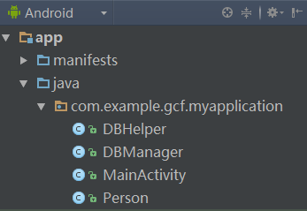

# Android Binder机制(1501210451 张志康)

    学号：1501210451  姓名：张志康  专业：集成电路工程

本文主要分析native层和Java层的Android binder通信机制。
binder是Android最为常见的进程通信机制之一，其驱动和通信库是binder的核心，分别由C和C++编写，应用程序通过JNI同底层库进行关联，也就是native层驱动和通信库通过Java层包装后被Java层调用。

源代码网址：http://androidxref.com/4.2_r1/

参考博客：http://blog.csdn.net/coding_glacier/article/details/7520199

**一、native层整体通信流程**

*简要介绍本模块所要完成的功能。*

**二、基础知识**

*简要介绍本模块所需掌握的基础知识*
   
* 通信流程概要：

     在探究binder通信流程之前，首先我们需要了解Binder机制的四个组件：Client、Server、Service Manager和Binder驱动程序。关系如图：
     
    
    应用程序最终目的是完成Client组件和Server组件之间的通信。ServiceManger对于大家而言是一个公共接入点，0便是ServiceManger的句柄值。
    
    从表面看通信建立的流程便是注册和获取的过程： 
    
    1、client通过参数（Parcel包）传递进行通信请求；
    2、在收到通信请求时，Server组件需要通过0这个句柄值访问ServiceManger，在ServiceManger中注册一个binder实体。并关联一个字符串；
    3、Client组件通过0这个标识去访问ServiceManger，通过一个字符去查询Server组件的引用，此ServiceManger将Server注册的binder实体的一个引用传递给Client端，此时client便可根据这个引用同server进行通信了。

* 知识点2：

      知识点介绍

* 知识点3：

      知识点介绍

   

**三、主要思路及步骤**

**3.1 主要思路**

*简要介绍主要思路*

**3.2 实践步骤**

*详细描述开发的具体步骤*

**四、常见问题及注意事项**

*详细描述本部分的常遇到的问题以及开发过程中的注意事项*

