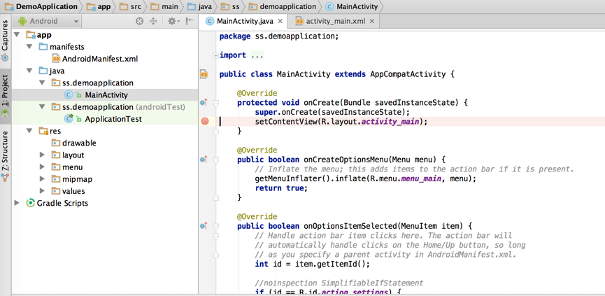

# Android 的进程和线程（1501210969 彭正宇）

　　为了方便程序员学习和开发安卓程序，google在设计安卓的时候，刻意淡化了进程和线程的概念，给开发人员提供的是使用组件进行快速开发带UI界面的程序的开发模式。一般开发人员常用的android四大组件，Activity、Service、Broadcast Receiver、Content Provider，便是这种形式。Android开发，强调通过图形界面与用户进行交换。因此，很多开发人员，对于安卓进程和线程，都没有一个全面而具体的掌握。本文的目的就是对安卓进程和线程进行一些基础性的介绍，帮助大家在日后能够更好地进行安卓开发。

### Android进程的基本知识

　　对于Android中的进程运行的基本情况，通过几个实验来进行简单的介绍。

　　首先，在Android Studio中，新建了一个只有一个空白activity的测试程序。

点击Run按钮启动该程序，通过Android Device Monitor观察程序启动后的运行状态。可以看到，系统为该测试程序新建了一个主进程。观察该进程拥有的线程，除了我们熟悉的main线程之外，还有一些其他的线程也在启动时被创建了。

可以看到，运行一个只拥有一个空白activity的程序，在程序被正常启动之后，android系统在后台会新建一系列的线程，通过这些被新建的线程，该应用程序才能完成进程间通信等操作。

这里主要介绍一下main线程。main线程是应用程序进程中的主线程，它的主要责任是负责处理UI事件，而且只有该线程才能处理UI事件。该线程一般也被称为UI线程。Android中的所有组件都是在指定的进程中的主线程中实例化的，对组件的系统调用也是由主线程发出的。每个实例不会建立新的线程。

Android的UI操作被称为UI单线程模式。因为UI线程的操作不是线程安全的（在UI线程进行UI界面刷新的同时，其他线程也在进行UI界面刷新的话，就会导致界面刷新的操作不能同步，这被称为线程不安全）,并且对UI事件，比如用户点击控件，刷新UI界面等操作，都必须通过UI线程进行处理，这就意味着对组件的调用都是通过UI线程进行的，响应的回调方法也是在UI线程中运行的。其他线程是不能去更新UI控件的，否则就会报错：不能在非UI线程中去更新UI控件。

在确保只通过UI线程去访问UI控件的同时，也需要注意，我们编写的代码不能阻塞UI线程。当在UI线程中进行某些耗时的操作时，将会阻塞UI线程，一般阻塞超过5秒就会显示一个ANR （Application Not Responding）对话框。

因此，对于需要长时间处理的操作，android提供了Handler Message机制和AsyncTask等方法帮助实现异步操作。

在启动activity的时候，在onCreate方法上打一个断点，可以观察到它是如何被启动的。

这里通过函数调用的堆栈信息，分析应用程序的进程被启动过程的具体流程。

由上图可以看到，android应用程序进程的主线程是通过ZygoteInit的main函数创建的。进程创建完成之后，Android应用程序就会在这个进程中将ActivityThread类加载进来，然后执行它的main函数，这个main函数就是进程执行消息循环的地方，也就是一般意义上的程序入口点，类似于C的main函数。

在android系统中，应用程序的进程一般都是通过Zygote进程fork出来的子进程，zygote进程的主体就是ZygoteInit。

在android系统启动后，就会创建zygote进程,然后由zygote进程fork出ActivityManagerService系统进程。ActivityManagerService用于管理Activity和其他的组件的运行状态，包括组件的开启，关闭等一系列操作。在需要启动一个应用程序时，系统首先会调用ActivityManagerService，由ActivityManagerService与Zygote进程进行通信，请求Zygote进程fork一个子进程出来，作为这个即将要启动的应用程序的进程。
当主进程创立后，再通过ActivityThread创建应用程序的主线程，由ActivityThread.main打开应用程序的消息循环。

观察ZygoteInit的main方法，它主要作了三件事情，

1.调用registerZygoteSocket函数创建了一个socket接口，用来和 ActivityManagerService通讯，

2.调用startSystemServer函数来启动SystemServer组件，

3.调用 runSelectLoopMode函数进入一个无限循环在前面创建的socket接口上等待ActivityManagerService请求创建新的应用程序进程。

ActivityThread管理应用进程的主线程的执行，并根据AMS的要求（通过IApplicationThread接口，AMS为Client、ActivityThread.ApplicationThread为Server）负责调度和执行activities、broadcasts和其它操作。
### Android进程的管理

Android的组件运行在哪个进程中是可以被配置的。组件一般会运行在当前进程中，但是也可以通过AndroidManifest.xml文件，设置组件被运行在哪个进程中。

查询android官方文档，可以看到，有一个 process属性来指定组件运行在哪个进程之中。通过设置这个属性，可以配置不同的组件运行在不同的进程之中，也可以让不同的组件运行在相同的进程中。application元素也有一个process属性，用来指定所有的组件的默认属性。

通过设置AndroidManifest.xml文件中的process属性，启动一个独立的service，可以看到系统中现在存在2个进程。

调用stopservice函数，把运行在独立进程的service关闭。可以观察到，虽然服务已经被Destory，但是运行服务的进程仍然独立存在，并没有被销毁。

Android会尽量保留一个正在运行进程，在内存资源出现不足时，Android会尝试停止一些进程从而释放足够的资源给其他新的进程使用。

Android会根据进程中运行的组件类别以及组件的状态来判断该进程的重要性，Android会首先停止那些不重要的进程。按照重要性从高到低一共有五个级别：

 

　　前台进程

　　前台进程是用户当前正在使用的进程。只有一些前台进程可以在任何时候都存在。他们是最后一个被结束的，当内存低到根本连他们都不能运行的时候。一般来说， 在这种情况下，设备会进行内存调度，中止一些前台进程来保持对用户交互的响应。

 

　　如果有以下的情形的那么就是前台进程：  

　　这个进程运行着一个正在和用户交互的Activity（这个Activity的onResume()方法被调用）。

　　这个进程里有绑定到当前正在和用户交互的确Activity的一个service。

　　这个进程里有一个service对象，这个service对象正在执行一个它的生命周期的回调函数(onCreate(), onStart(), onDestroy())

　　这个进程里有一个正在的onReceive()方法的BroadCastReiver对象。

　　可见进程

　　可见进程不包含前台的组件但是会在屏幕上显示一个可见的进程是的重要程度很高，除非前台进程需要获取它的资源，不然不会被中止。

　　如果有如下的一种情形就是可见进程： 

　　这个进程中含有一个不位于前台的Activity，但是仍然对用户是可见的(这个Activity的onPause()方法被调用)，这是很可能发生的，例如，如果前台Activity是一个对话框的话，就会允许在它后面看到前一个Activity。

　　这个进程里有一个绑定到一个可见的Activity的Service。

　　服务进程

　　运行着一个通过startService() 方法启动的service，这个service不属于上面提到的2种更高重要性的。service所在的进程虽然对用户不是直接可见的，但是他们执行了用户非常关注的任务（比如播放mp3，从网络下载数据）。只要前台进程和可见进程有足够的内存，系统不会回收他们。
 

　　后台进程

　　运行着一个对用户不可见的activity（调用过 onStop() 方法).这些进程对用户体验没有直接的影响，可以在服务进程、可见进程、前台进 程需要内存的时候回收。通常，系统中会有很多不可见进程在运行，他们被保存在LRU (least recently used) 列表中，以便内存不足的时候被第一时间回收。如果一个activity正 确的执行了它的生命周期，关闭这个进程对于用户体验没有太大的影响。

　　空进程

　　未运行任何程序组件。运行这些进程的唯一原因是作为一个缓存，缩短下次程序需要重新使用的启动时间。系统经常中止这些进程，这样可以调节程序缓存和系统缓存的平衡。

　　Android 对进程的重要性评级的时候，选取它最高的级别。例如，如果一个进程含有一个service和一个可视activity，进程将被归入一个可视进程而不是service进程。

　　另外，当被另外的一个进程依赖的时候，某个进程的级别可能会增高。一个为其他进程服务的进程永远不会比被服务的进程重要级低。因为服务进程比后台activity进程重要级高，因此一个要进行耗时工作的activity最好启动一个service来做这个工作，而不是开启一个子进程――特别是这个操作需要的时间比activity存在的时间还要长的时候。例如，在后台播放音乐，向网上上传摄像头拍到的图片，使用service可以使进程最少获取到“服务进程”级别的重要级，而不用考虑activity目前是什么状态。broadcast receivers做费时的工作的时候，也应该启用一个服务而不是开一个线程。
　　

### Android的线程管理

Android应用程序是通过消息来驱动的，在Android系统中，特地使用了消息队列方便线程的管理，通过Messge、Handler、Looper来实现消息循环机制。

Message：消息，其中包含了消息ID，消息处理对象以及处理的数据等，由MessageQueue统一列队，终由Handler处理。

Handler：处理者，负责Message的发送及处理。使用Handler时，需要实现handleMessage(Message msg)方法来对特定的Message进行处理，例如更新UI等。

MessageQueue：消息队列，用来存放Handler发送过来的消息，并按照FIFO规则执行。当然，存放Message并非实际意义的保存，而是将Message以链表的方式串联起来的，等待Looper的抽取。

Looper：消息泵，不断地从MessageQueue中抽取Message执行。因此，一个MessageQueue需要一个Looper。

Thread：线程，负责调度整个消息循环，即消息循环的执行场所。

Android系统在启动的时候会为Activity创建一个消息队列和消息循环（Looper）。

Handler的作用是把消息加入特定的（Looper）消息队列中，并分发和处理该消息队列中的消息。构造Handler的时候可以指定一个Looper对象，如果不指定则利用当前线程的Looper创建。

一个Activity中可以创建多个工作线程或者其他的组件，如果这些线程或者组件把他们的消息放入Activity的主线程消息队列，那么该消息就会在主线程中处理了。因为主线程一般负责界面的更新操作，并且Android系统中的weget不是线程安全的，所以这种方式可以很好的实现Android界面更新。在Android系统中这种方式有着广泛的运用。

那么另外一个线程怎样把消息放入主线程的消息队列呢？答案是通过Handle对象，只要Handler对象以主线程的Looper创建，那么调用Handler的sendMessage等接口，将会把消息放入队列都将是放入主线程的消息队列。并且将会在Handler主线程中调用该handler的handleMessage接口来处理消息。

以上就是android进程和线程的一些基础知识，个人认为，虽然在平时开发的适合这些基础知识可能并不能对编写应用程序带来显著性的提高，但是多了解一些android程序运行的原理和思想，对于我们日后进行程序的设计、优化和调试都是有帮助的。

参考：

Android 之 zygote 与进程创建
http://blog.csdn.net/xieqibao/article/details/6581975

Android系统进程Zygote启动过程的源代码分析
http://blog.csdn.net/luoshengyang/article/details/6768304

Android进程与线程基本知识
http://www.cnblogs.com/hanyonglu/archive/2012/04/12/2443262.html

Android中的Handler, Looper, MessageQueue和Thread
http://www.cnblogs.com/xirihanlin/archive/2011/04/11/2012746.html

Android消息处理机制(Handler、Looper、MessageQueue与Message)
http://www.cnblogs.com/angeldevil/p/3340644.html