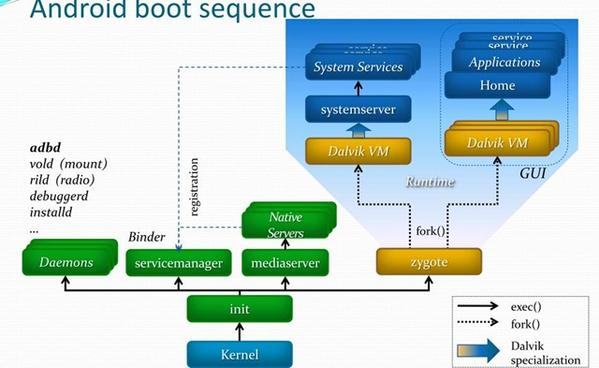

# Android framework 浅析 （潘启慧 1501210967）

**Android Framework 启动过程 **

 Android手机系统本质上是一个基于Linux的应用程序，它以Linux系统为内核。系统的启动过程包括Linux内核启动和Android框架启动两个阶段
 
**一、Linux内核启动**
   1、装载引导程序bootloader
      Linux内核启动时首先装载执行bootloader引导程序，装载完成后进入内核程序。
   2、加载Linux内核
      Linux内核加载主要包括初始化kernel核心（内存初始化，打开中断，初始化进程表等）、初始化驱动、启动内核后台（daemons)线程、安装根（root)文件系统等。
      Linux加载的最后阶段启动执行第一个用户级进程init（内核引导参数上一般都会设置“init=/init”，由kernel自动执行，PID为1，是所有进程的父进程）。由此进入Android框架的启动阶段。
      
**二、Android框架启动**
      Android框架的启动始于init进程。启动过程可以分为以下几个主要的阶段：
   1、init进程启动
   2、init.rc脚本启动
   3、zygote服务启动
   4、System Server进程启动
   5、Home应用启动
   
 其总体框架运行流程如图所示：
  
  
  1、init进程启动

     init进程是Android系统的入口，它会以后台进程（daemon）的形式一直存在。该进程的程序源码在目录system/core/init中，入口函数是init.c:main()。主要有如下功能：
    　　1）创建/安装设备文件/进程文件/系统文件节点；
    　　2）解析init.rc和init.hardware.rc；
    　　3）启动脚本中指定的服务，执行指定的命令或动作；
    　　4）作为守护进程循环检查是否有action需要执行、是否需要重启某服务等。
         详细代码可以参考init.c中入口函数main的实现。
  2、init.rc脚本启动

     init.rc文件是Android系统的重要配置文件，位于/system/core/rootdir/目录中。主要功能是定义了系统启动时需要执行的一系列action及service：执行特定动作、设置环境变量和属性和执行特定的service。该脚本在init进程的init.c:main函数中解析并启动。
     需要重点说明的是init.rc脚本文件配置了一些重要的服务，init进程通过创建子进程启动这些服务，这里创建的service都属于native服务，运行在Linux空间，通过socket向上层提供特定的服务，并以守护进程的方式运行在后台。
     通过init.rc脚本系统启动了以下几个重要的服务：
      1）servicemanager:启动binder IPC，管理所有的Android系统服务
      2）mountd:设备安装Daemon，负责设备安装及状态通知
      3）debuggerd:启动debug system，处理调试进程的请求
      4）rild:启动radio interface layer daemon服务，处理电话相关的事件和请求
      5）mediaserver:启动AudioFlinger,MediaPlayerService and CameraService，负责多媒体播放相关的功能，包括音视频解码、显示输出
      6）zygote:进程孵化器，启动Android Java VMRuntime和启动systemserver，负责Android应用进程的孵化工作
3、zygote服务启动

      zygote进程孵化了所有的Android应用进程，是Android Framework的基础，该进程的启动也标志着Framework框架初始化启动的开始。zygote服务进程的主要功能：

       1）注册底层功能的JNI函数到虚拟机
       2）预加载java类和资源
       3）fork并启动System Server核心进程
       4）作为守护进程监听处理“孵化新进程”的请求
4、System Server进程启动       

     SystemServer进程在Android的运行环境中扮演了“神经中枢”的作用，Android应用能够直接交互的大部分系统服务都在该进程中运行，如WindowManagerServer、ActivityManagerSystemService、PackageManagerServer等，这些系统服务都是以独立线程的方式存在于SystemServer进程中。System Server进程的主要功能：

     1）加载android servers底层函数库
     2）启动android系统中的native服务
     3）创建、注册并启动Android的系统服务，在独立线程中运行
     4）创建Looper消息循环，处理System Server进程中的事件消息

     在zygote进程中调用函数startSystemServer()创建和启动Server进程，进程首先执行的函数是SystemServer.java:main()。该函数函数实现的主要逻辑为：
     1）加载android_servers函数库
     2）启动native服务：
      调用本地函数init1()实现，该函数的源码位于文件frameworks/base/services/jni/com_android_server_systemService.cpp中，涉及的函数system_init()实现在文件frameworks/base/cmds/system_server/library/system_init.cpp中。
     3）启动Android系统的各种系统服务：
     调用函数init2()实现，该函数首先创建了一个ServerThread对象，该对象是一个线程，然后直接运行该线程，如以下代码所示：

       public static final void init2() {
            Slog.i(TAG, "Entered the Android system server!");
            Thread thr = new ServerThread();
            thr.setName("android.server.ServerThread");
            thr.start();
        }
         从ServerThread的run()方法内部开始真正启动各种服务线程。
             ---创建Android系统服务对象,并注册到ServiceManager
             ---在SystemServer进程中建立Looper消息循环：通过Looper.prepare和Looper.loop来实现
    　　 ---系统就绪通知：调用systemReady()通知各个服务

      System Server进程启动过程中最核心的一步是“启动Android系统的各种系统服务”，这些系统服务构成了整个Android框架的基础（如图所示），通过Binder IPC为上层应用提供各种功能。介绍下几个重要系统服务的功能。

       1）ActivityManagerService

            Activity管理服务，主要功能包括：
            ---统一管理和调度各应用程序的Activity，维护系统中运行的所有应用Task和Activity
            ---内存管理：应用程序关闭时对应进程还在运行，当系统内存不足时根据策略kill掉优先级较低进程
            ---进程管理：维护和管理系统中运行的所有进程，并提供了查询进程信息的API
            ---Provider、Service和Broadcast管理和调度

      2）WindowManagerService

            窗口管理服务，主要功能包括为应用程序分配窗口，并管理这些窗口。包括分配窗口的大小、调节各窗口的叠放次序、隐藏或者显示窗口，程序退出时删除窗口。

      3）PackageManagerService

            程序包管理服务，主要功能为：
             ---根据intent查找匹配的Activity、Provider以及Service
             ---进行权限检查，即当应用程序调用某个需要一定权限的函数时，系统能够判断调用者是否具备该权限
             ---提供安装、删除应用程序的API

      4）NotificationManagerService

            通知管理服务，负责管理和通知后台事件的发生等，这个和statusbar服务结合在一起，一般会在statusbar上添加响应图标。用户可以通过这知道系统后台发生了什么事情。

      5）AudioService

            音频管理服务，AudioFlinger的上层管理封装，主要是音量、音效、声道及铃声等的管理。

      6）TelephonyRegistry

            电话服务管理，用于监听和上报电话状态，包括来电、通话、信号变化等。

       到这里，Android Framework的启动已经完成，框架中提供的各种服务也已经就绪，可以正常运行并响应处理应用的各种操作请求。
       
**android Framework中几个重要的服务**
    
**ActivityManagerService** 简称AMS ，是Android核心功能之一，在上面已经简单列出了它的功能，主要功能包括：

    ---统一管理和调度各应用程序的Activity，维护系统中运行的所有应用Task和Activity
    ---内存管理：应用程序关闭时对应进程还在运行，当系统内存不足时根据策略kill掉优先级较低进程
    ---进程管理：维护和管理系统中运行的所有进程，并提供了查询进程信息的API
    ---Provider、Service和Broadcast管理和调度

Activity的调度：
    各应用进程要启动新的Activity或者停止当前的Activity，都要首先报告给AmS,AmS在内部为所有应用进程都做了记录，当AmS接到启动或停止的报告时，首先更新内部记录，然后再通知相应客户进程运行或者停止指定的Activity。由于AmS内部有所有Activity的记录，也就理所当然地能够调度这些Activity，并根据Activity和系统内存的状态自动杀死后台的Activity。
    具体来讲，启动一个Activity有以下几种方式。
— 在应用程序中调用startActivity()启动指定的Activity。
— 在Home程序中单击一个应用图标，启动新的Activity。
— 按“Back”键，结束当前Activity，自动启动上一个Activity。
— 长按“Home”键，显示出当前任务列表，从中选择一个启动。