# Android 界面布局分析（1501210662 盛意林）

作者：盛意林

学号：1501210662

学院：北京大学软件与微电子学院

  摘要：相信大家对andriod界面都不陌生呢。一款漂亮的软件必然是需
  
  要界面优雅、交互友好的UI的呢。今天主要跟大家讲一讲UI界面布局的几
  
  种方式，主要有线性布局(LinearLayout)、框架布局(FrameLayout)、表格布局
  
  (TableLayout)、相对布局(RelativeLayout)、绝对布局(AbsoluteLayout)
  
  、网格布局(GridLayout)、自定义布局 (custom-layout) 希望对您有所帮助。
  
关键词：布局


# 1.andriod的几大布局

##  ①.线性布局(LinearLayout)
##  ②.框架布局(FrameLayout)
##  ③.表格布局(TableLayout)
##  ④.相对布局(RelativeLayout)
##  ⑤.绝对布局(AbsoluteLayout)
##  ⑥.网格布局(GridLayout)
##  ⑦.自定义布局 (custom-layout) 


---

##一、线性布局(LinearLayout)
先看图：

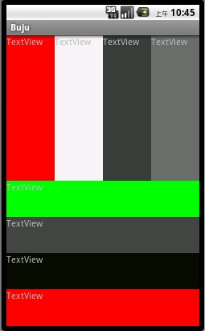

LinearLayout是线性布局控件：要么横向排布，要么竖向排布

线性布局的整体布局方式包括了垂直和水平，这个也是必须指定的呢。

android:orientation：vertical (垂直方向) ：
 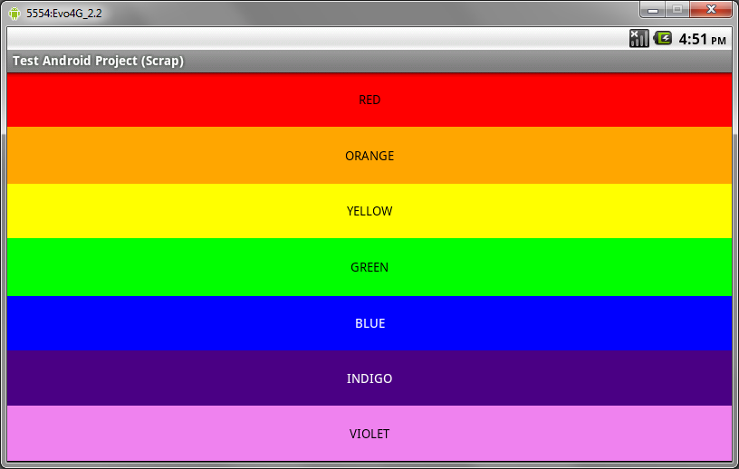
   
 horizontal(水平方向)：
 
 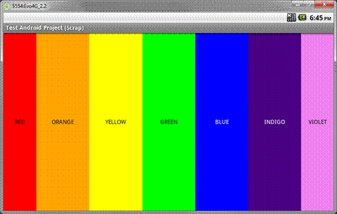


接下来请看一个例子：

```   
<?xml version="1.0" encoding="utf-8"?>
<LinearLayout xmlns:android="http://schemas.android.com/apk/res/android"
	android:orientation="vertical"
    android:layout_width="fill_parent"
    android:layout_height="fill_parent"
    >
   <EditText
       android:id="@+id/edtInput"
       android:layout_width="fill_parent"
       android:layout_height="wrap_content"
       android:text="@+string/hello_world"
       />

    <Button
        android:id="@+id/myButton"
        android:layout_width="fill_parent"
        android:layout_height="wrap_content"
        />

    <TextView
		android:id="@+id/firstText"
		android:text="TextView第一行"
		android:gravity="center_vertical"
		android:textSize="15pt"
		android:background="#aa0000"
		android:layout_width="fill_parent"
		android:layout_height="wrap_content"
		android:layout_weight="10000"
        android:singleLine="true"/>
	<TextView
		android:id="@+id/secondText"
		android:text="TextView第二行"
		android:gravity="center_vertical"
		android:textSize="15pt"
		android:background="#0000aa"
		android:layout_width="fill_parent"
		android:layout_height="wrap_content"
		android:layout_weight="1"/>
    
</LinearLayout>

```

运行效果：

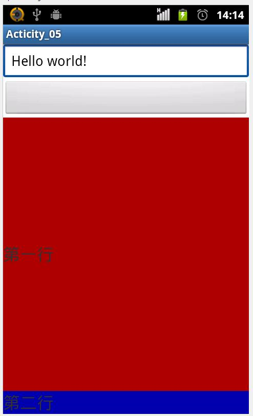


解析下具体的参数：
    
 
		代码编辑提示快捷键:	Alt+/

		id="@+id/edtInput",ID 是连接UI 与代码的桥梁
		layout_width="fill_parent" ，自动填充至屏幕宽度
		layout_width="wrap_content" ，自动填充为控件大小
		
		在LinearLayout 里面的控件，按照水平或者垂直排列：
			orientation="horizontal" ：水平排列；
			orientation=" vertical" ：垂直排列
			
		android:id  —— 为控件指定相应的ID
		android:text —— 指定控件当中显示的文字，需要注意的是，这里尽量使用strings.xml文件当中的字符串
		android:grivity —— 指定控件的基本位置，比如说居中，居右等位置
		android:textSize —— 指定控件当中字体的大小
		android:background —— 指定该控件所使用的背景色,RGB命名法 
		android:width —— 指定控件的宽度
		android:height —— 指定控件的高度
		android:padding* —— 指定控件的内边距，也就是说控件当中的内容
		android:sigleLine —— 如果设置为真的话，则将控件的内容在同一行当中进行显示
						

 
 
## 线性不居中的常用属性：

android:gravity------------设置的是控件自身上面的内容位置

android:layout_gravity-----设置控件本身相对于父控件的显示位置

android:layout_weight----- 给控件分配剩余空间

对于gravity 和layoutgravity 且看下面的代码
```
<LinearLayout  
   xmlns:android="http://schemas.android.com/apk/res/android"  
   android:orientation="vertical"  
   android:layout_width="fill_parent"  
  android:layout_height="fill_parent">  
 <EditText  
    android:layout_width="wrap_content"  
      android:gravity="center"  
      android:layout_height="wrap_content"  
       android:text="one"  
       android:layout_gravity="right"/>  
</LinearLayout>  

```
运行效果图:

  
  
 - One是相对于button而言是居中排列的，而button相对于大的view来说又是靠右排列的呢。

###  layout_weight属性

这个属性比较有趣：如果感兴趣建议看一下：
[android:layout_weight的真实含义](http://blog.csdn.net/yanzi1225627/article/details/24667299)

    一般来讲Google官方推荐，当使用weight属性时，将width设为0dip即可，

     效果跟设成wrap_content是一样的。这样weight就可以理解为占比了！

##另需要注意的是:

    当 android:orientation="vertical"  时，只有水平方向的设置才起作用，垂直方向的设置不起作用。
    即：left，right，center_horizontal 是生效的。
    当 android:orientation="horizontal" 时， 只有垂直方向的设置才起作用，水平方向的设置不起作用。
    即：top，bottom，center_vertical 是生效的。

## 二、框架布局(FrameLayout)

简单来说，框架布局管理器(FrameLayout)是将组件都放在屏幕的左上角，所有的组件是层叠显示的.

我们先来看一个例子：
```
<?xml version="1.0" encoding="utf-8"?>
<FrameLayout xmlns:android="http://schemas.android.com/apk/res/android"
    android:layout_width="fill_parent"
    android:layout_height="fill_parent"
    android:orientation="vertical" >
    <ImageView
        android:id="@+id/img"
        android:layout_width="wrap_content"
        android:layout_height="wrap_content"
        android:contentDescription="这是一个图片"
        android:src="@drawable/ic_launcher" />
    <TextView
        android:id="@+id/text"
        android:layout_width="wrap_content"
        android:layout_height="wrap_content"
        android:text="这是提示文字" />
    <Button android:id="@+id/btn" 
        android:layout_width="wrap_content"
        android:layout_height="wrap_content"
        android:text="这是按钮"/>
</FrameLayout>

```
运行效果：

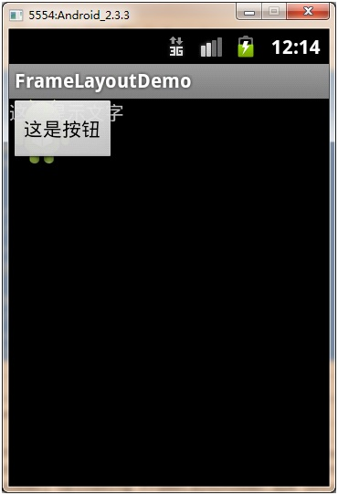

可以看的出来，是按照顺序依次将控件显示在左上角的呢。似乎framelayout的动态效果，比如动画的时候能体现出其作用。

可以参考：[Android应用开发之FrameLayout （帧布局）+小鸟飞翔案例
](http://www.linuxidc.com/Linux/2011-12/49200p2.htm)


## 三、表格布局(TableLayout)
  先看一个例子：
  ```
  <?xml version="1.0" encoding="utf-8"?>
  <TableLayout xmlns:android="http://schemas.android.com/apk/res/android"
    android:layout_width="match_parent"
    android:layout_height="match_parent" 
    android:stretchColumns="*"
    >

    <TextView
        android:id="@+id/textView1"
        android:layout_width="wrap_content"
        android:layout_height="30dp"
        android:text="0" 
        
        android:gravity="right|center_vertical"

        />

    <TableRow
        android:id="@+id/tableRow1"
        android:layout_width="wrap_content"
        android:layout_height="wrap_content" >

        <Button
            android:id="@+id/button1"
            android:layout_width="wrap_content"
            android:layout_height="wrap_content"
            android:text="7" />

        <Button
            android:id="@+id/button2"
            android:layout_width="wrap_content"
            android:layout_height="wrap_content"
            android:text="8" />

        <Button
            android:id="@+id/button3"
            android:layout_width="wrap_content"
            android:layout_height="wrap_content"
            android:text="9" />

        <Button
            android:id="@+id/button4"
            android:layout_width="wrap_content"
            android:layout_height="wrap_content"
            android:text="/" />

    </TableRow>
    <TableRow
        android:id="@+id/tableRow2"
        android:layout_width="wrap_content"
        android:layout_height="wrap_content" >

        <Button
            android:id="@+id/button5"
            android:layout_width="wrap_content"
            android:layout_height="wrap_content"
            android:text="4" />

        <Button
            android:id="@+id/button6"
            android:layout_width="wrap_content"
            android:layout_height="wrap_content"
            android:text="5" />

        <Button
            android:id="@+id/button7"
            android:layout_width="wrap_content"
            android:layout_height="wrap_content"
            android:text="6" />

        <Button
            android:id="@+id/button8"
            android:layout_width="wrap_content"
            android:layout_height="wrap_content"
            android:text="*" />

    </TableRow>
     <TableRow
        android:id="@+id/tableRow3"
        android:layout_width="wrap_content"
        android:layout_height="wrap_content" >

        <Button
            android:id="@+id/button9"
            android:layout_width="wrap_content"
            android:layout_height="wrap_content"
            android:text="1" />

        <Button
            android:id="@+id/button10"
            android:layout_width="wrap_content"
            android:layout_height="wrap_content"
            android:text="2" />

        <Button
            android:id="@+id/button11"
            android:layout_width="wrap_content"
            android:layout_height="wrap_content"
            android:text="3" />

        <Button
            android:id="@+id/button12"
            android:layout_width="wrap_content"
            android:layout_height="wrap_content"
            android:text="-" />

    </TableRow>
     <TableRow
        android:id="@+id/tableRow4"
        android:layout_width="wrap_content"
        android:layout_height="wrap_content" >

        <Button
            android:id="@+id/button13"
            android:layout_width="wrap_content"
            android:layout_height="wrap_content"
            android:text="0" />

        <Button
            android:id="@+id/button14"
            android:layout_width="wrap_content"
            android:layout_height="wrap_content"
            android:text="." />

        <Button
            android:id="@+id/button15"
            android:layout_width="wrap_content"
            android:layout_height="wrap_content"
            android:text="+" />

        <Button
            android:id="@+id/button16"
            android:layout_width="wrap_content"
            android:layout_height="wrap_content"
            android:text="=" />

    </TableRow>

     <Button
         android:id="@+id/button17"
         android:layout_width="wrap_content"
         android:layout_height="wrap_content"
         android:text="clear" />

</TableLayout>
  ```
 运行效果:
 
 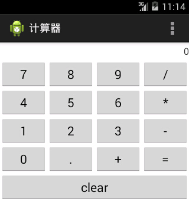
 
 
    可以看出此计算器的布局是6行4列的，一个<TableRow>......</TableRow>
    整体是一行，而列数是其中所有<TableRow>中列数最多的数目 。
    如果没有<TableRow>，则占一行，请对应上图分析。


###我们接下来再看一个例子：

```
<LinearLayout xmlns:android="http://schemas.android.com/apk/res/android"
    xmlns:tools="http://schemas.android.com/tools"
    android:layout_width="match_parent"
    android:layout_height="match_parent"
    android:orientation="vertical"
    tools:context=".AndroidTableLayoutActivity" >
 
    <!-- 定义第一个表格，指定第2列允许收缩，第3列允许拉伸 -->
 
    <TableLayout
        android:id="@+id/tablelayout01"
        android:layout_width="match_parent"
        android:layout_height="wrap_content"
        android:shrinkColumns="1"
        android:stretchColumns="2" >
 
        <!-- 直接添加按钮，自己占用一行 -->
 
        <Button
            android:id="@+id/btn01"
            android:layout_width="wrap_content"
            android:layout_height="wrap_content"
            android:text="独自一行" >
        </Button>
 
        <TableRow>
 
            <Button
                android:id="@+id/btn02"
                android:layout_width="wrap_content"
                android:layout_height="wrap_content"
                android:text="普通" >
            </Button>
 
            <Button
                android:id="@+id/btn03"
                android:layout_width="wrap_content"
                android:layout_height="wrap_content"
                android:text="允许被收缩允许被收缩允许被收缩允许被收缩" >
            </Button>
 
            <Button
                android:id="@+id/btn04"
                android:layout_width="wrap_content"
                android:layout_height="wrap_content"
                android:text="允许被拉伸允许被拉伸允许被拉伸" >
            </Button>
        </TableRow>
    </TableLayout>
    <!-- 定义第2个表格，指定第2列隐藏 -->
 
    <TableLayout
        android:id="@+id/tablelayout02"
        android:layout_width="match_parent"
        android:layout_height="wrap_content"
        android:collapseColumns="1" >
 
        <TableRow>
 
            <Button
                android:id="@+id/btn05"
                android:layout_width="wrap_content"
                android:layout_height="wrap_content"
                android:text="普通" >
            </Button>
 
            <Button
                android:id="@+id/btn06"
                android:layout_width="wrap_content"
                android:layout_height="wrap_content"
                android:text="被隐藏列" >
            </Button>
 
            <Button
                android:id="@+id/btn07"
                android:layout_width="wrap_content"
                android:layout_height="wrap_content"
                android:text="允许被拉伸" >
            </Button>
        </TableRow>
    </TableLayout>
    <!-- 定义第3个表格，指定第2列填满空白 -->
 
    <TableLayout
        android:id="@+id/tablelayout03"
        android:layout_width="match_parent"
        android:layout_height="wrap_content"
        android:stretchColumns="1" >
 
        <TableRow>
 
            <Button
                android:id="@+id/btn08"
                android:layout_width="wrap_content"
                android:layout_height="wrap_content"
                android:text="普通" >
            </Button>
 
            <Button
                android:id="@+id/btn09"
                android:layout_width="wrap_content"
                android:layout_height="wrap_content"
                android:text="填满剩余空白" >
            </Button>
        </TableRow>
    </TableLayout>
    <!-- 定义第3个表格，指定第2列横跨2列 -->
 
    <TableLayout
        android:id="@+id/tablelayout04"
        android:layout_width="match_parent"
        android:layout_height="wrap_content" >
 
        <TableRow>
 
            <Button
                android:id="@+id/btn10"
                android:layout_width="wrap_content"
                android:layout_height="wrap_content"
                android:text="普通" >
            </Button>
 
            <Button
                android:id="@+id/btn11"
                android:layout_width="wrap_content"
                android:layout_height="wrap_content"
                android:layout_column="2"
                android:text="填满剩余空白" >
            </Button>
        </TableRow>
    </TableLayout>
 
</LinearLayout>

```
运行效果图：

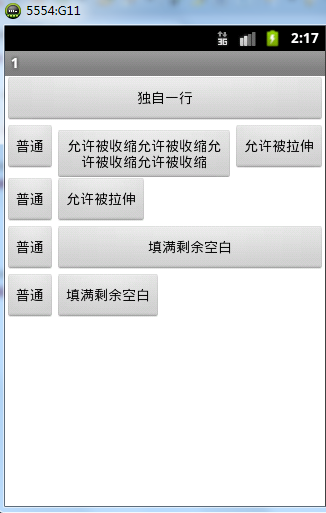


    主要是注意三个属性：
    
    android:collapseColumns：以第0行为序，隐藏指定的列
    
    android:shrinkColumns：以第0行为序，自动延伸指定的列填充可用部分
    
    android:stretchColumns：以第0行为序，尽量把指定的列填充空白部分


    　1.android:collapseColumns：//隐藏指定的列
            ①设置 TableLayout 内的 TableRow 中需要隐藏的列的列索引，多个用“,”隔开 
            ②以第0行为序，隐藏指定的列：把android:collapseColumns=0,3 意思是把第0和第3列隐藏 

      2.android:shrinkColumns：//收缩指定的列以适合屏幕、不会挤出屏幕          
            ① 设置 TableLayout 内的 TableRow 中需要收缩（为了使其他列不会被挤到屏幕   外，此列会自动收缩）的列的列索引，多个用“,”隔开 
            ② 以第0行为序，当LayoutRow里面的控件还没有布满布局时，shrinkColumns不起作用。
      3.android:stretchColumns：//尽量把指定的列表填充空白部分                 
             ①设置 TableLayout 内的 TableRow中需要拉伸（该列会拉伸到所有可用空间）的列的列索引，多列个用“,”隔开（多列 每列填充空隙大小一样）
             ② 以第0行为序，尽量把指定的列填充空白部分:设置stretchColumns=2，5，第1，4列被尽量填充同时向右填充,直到2，5被压挤到最后边)。 


## 四、相对布局(RelativeLayout)
相对布局 RelativeLayout 允许子元素指定它们相对于其父元素或兄弟元素的位置，它

灵活性很大，这是实际布局中最常用的布局方式之一。

我们先来看一个例子：
```
<RelativeLayout xmlns:android="http://schemas.android.com/apk/res/android"
    xmlns:tools="http://schemas.android.com/tools"
    android:layout_width="match_parent"
    android:layout_height="match_parent"
    android:paddingBottom="@dimen/activity_vertical_margin"
    android:paddingLeft="@dimen/activity_horizontal_margin"
    android:paddingRight="@dimen/activity_horizontal_margin"
    android:paddingTop="@dimen/activity_vertical_margin"
    tools:context=".MainActivity" >

    <Button
        android:id="@+id/btn1" 
    	android:layout_height="wrap_content"
    	android:layout_width="wrap_content"
    	android:text="Button"    
    />
    <Button
        android:paddingLeft="100dp" 
    	android:layout_height="wrap_content"
    	android:layout_width="wrap_content"
    	android:text="Button"
    	android:layout_toRightOf="@id/btn1"    
    />
    
    
    
    
	<Button
	    android:id="@+id/btn2" 
		android:layout_height="wrap_content"
		android:layout_width="wrap_content"
		android:text="Button"
		android:layout_alignParentBottom="true"    
	/>
	<Button
	    android:layout_marginLeft="100dp" 
    	android:layout_height="wrap_content"
    	android:layout_width="wrap_content"
    	android:text="Button"
    	android:layout_toRightOf="@id/btn2" 
    	android:layout_alignParentBottom="true"   
    />
    
</RelativeLayout>
```
运行结果如图：

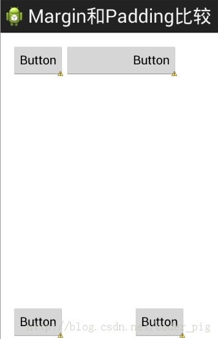

## 下面是常用的一些属性

RelativeLayout用到的一些重要的属性：

* 第一类:属性值为true或false

    android:layout_centerHrizontal 水平居中
    
    android:layout_centerVertical 垂直居中
    
    android:layout_centerInparent 相对于父元素完全居中
    
    android:layout_alignParentBottom 贴紧父元素的下边缘
    
    android:layout_alignParentLeft 贴紧父元素的左边缘
    
    android:layout_alignParentRight 贴紧父元素的右边缘
    
    android:layout_alignParentTop 贴紧父元素的上边缘
    
    android:layout_alignWithParentIfMissing 
    
    如果对应的兄弟元素找不到的话就以父元素做参照物

* 第二类：属性值必须为id的引用名“@id/id-name”

    android:layout_below 在某元素的下方
    
    android:layout_above 在某元素的的上方
    
    android:layout_toLeftOf 在某元素的左边
    
    android:layout_toRightOf 在某元素的右边
    
    android:layout_alignTop 本元素的上边缘和某元素的的上边缘对齐
    
    android:layout_alignLeft 本元素的左边缘和某元素的的左边缘对齐
    
    android:layout_alignBottom 本元素的下边缘和某元素的的下边缘对齐
    
    android:layout_alignRight 本元素的右边缘和某元素的的右边缘对齐

* 第三类：属性值为具体的像素值，如30dip，40px

    android:layout_marginBottom 离某元素底边缘的距离
    
    android:layout_marginLeft 离某元素左边缘的距离
    
    android:layout_marginRight 离某元素右边缘的距离
    
    android:layout_marginTop 离某元素上边缘的距离

### 另：

    android:gravity　
    
    android:gravity属性是对该view 内容的限定．比如一个button 上面的text. 你可以设置该text 在view的靠左，靠右等位置．以button为例，android:gravity="right"则button上面的文字靠右
    
    android:layout_gravity
    
    android:layout_gravity是用来设置该view相对与起父view 的位置．比如一个button 在linearlayout里，你想把该button放在靠左、靠右等位置就可以通过该属性设置．以button为例，android:layout_gravity="right"则button靠右


## 此外，还有另外一种分类的方式：


* 相对于兄弟元素

    android:layout_below="@id/aaa"：在指定View的下方
    
    android:layout_above="@id/xxx"：在指定View的上方
    
    android:layout_toLeftOf="@id/bbb"：在指定View的左边
    
    android:layout_toRightOf="@id/cccc"：在指定View的右边

* 相对于父元素

    android:layout_alignParentLeft="true"：在父元素内左边
    
    android:layout_alignParentRight="true"：在父元素内右边
    
    android:layout_alignParentTop="true"：在父元素内顶部
    
    android:layout_alignParentBottom="true"：在父元素内底部

* 对齐方式

    android:layout_centerInParent="true"：居中布局
    
    android:layout_centerVertical="true"：水平居中布局
    
    android:layout_centerHorizontal="true"：垂直居中布局
    
    android:layout_alignTop="@id/xxx"：与指定View的上边界一致
    
    android:layout_alignBottom="@id/xxx"：与指定View下边界一致
    
    android:layout_alignLeft="@id/xxx"：与指定View的左边界一致
    
    android:layout_alignRight="@id/xxx"：与指定View的右边界一致

* 间隔

    android:layout_marginBottom=""; 离某元素底边缘的距离
    
    android:layout_marginLeft=""; 离某元素左边缘的距离
    
    android:layout_marginRight ="";离某元素右边缘的距离
    
    android:layout_marginTop=""; 离某元素上边缘的距离
    
    android:layout_paddingBottom=""; 离父元素底边缘的距离
    
    android:layout_paddingLeft=""; 离父元素左边缘的距离
    
    android:layout_paddingRight ="";离父元素右边缘的距离
    
    android:layout_paddingTop=""; 离父元素上边缘的距离


    另注：
    
    关于margin 与padding 的区别问题：
    
    padding是站在父view的角度描述问题，是自己的内容与其父控件的边之间的距离。margin则是站在自己的角度描述问题，
    
    自己与旁边的某个组件的距离，如果同一级只有一个view，那么它的效果基
    
    本上就和padding一样了


再来看一个综合的例子：
    
    <?xml version="1.0" encoding="utf-8"?>
    <RelativeLayout xmlns:android="http://schemas.android.com/apk/res/android"
        android:layout_width="fill_parent"
        android:layout_height="fill_parent"
        android:paddingLeft="16dp"
        android:paddingRight="16dp">
        <EditText
            android:id="@+id/name"
            android:layout_width="fill_parent"
            android:layout_height="wrap_content"
            android:hint="@string/reminder"/>
        <Spinner
            android:id="@+id/dates"
            android:layout_width="0dp"
            android:layout_height="wrap_content"
            android:layout_below="@id/name"
            android:layout_alignParentLeft="true"
            android:layout_toLeftOf="@+id/times"/>
        <Spinner
            android:id="@id/times"
            android:layout_width="96dp"
            android:layout_height="wrap_content"
            android:layout_below="@id/name"
            android:layout_alignParentRight="true"/>
        <Button
            android:layout_width="96dp"
            android:layout_height="wrap_content"
            android:layout_below="@id/times"
            android:layout_alignParentRight="true"
            android:text="@string/done"/>
    </RelativeLayout>
    
效果图如下：

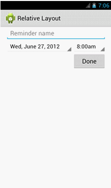


## 五、绝对布局(AbsoluteLayout)

绝对布局相对来说非常简单，只要在控件中用android:layout_x和android:layout_y属性

指定控件横纵坐标就可以了

常用属性：

android:layout_x  --------组件x坐标

android:layout_y ---------组件y坐标

用的很少，几乎已经淘汰啦。

我们简单的一起来看一个例子:

    <?xml version="1.0" encoding="utf-8"?>

     <AbsoluteLayout android:id="@+id/AbsoluteLayout01" 
         android:layout_width="match_parent" 
         android:layout_height="match_parent" 
         xmlns:android="http://schemas.android.com/apk/res/android">
         <TextView android:id="@+id/label"
             android:layout_x="40dip" 
             android:layout_y="40dip" 
             android:layout_height="wrap_content"
             android:layout_width="wrap_content" 
             android:text="用户名：">
         </TextView>
         <EditText android:id="@+id/entry"
             android:layout_x="40dip" 
             android:layout_y="60dip" 
             android:layout_height="wrap_content"
             android:layout_width="150dip">
         </EditText>
         <Button android:id="@+id/ok"
             android:layout_width="70dip"
             android:layout_height="wrap_content"
             android:layout_x="40dip" 
             android:layout_y="120dip" 
             android:text="确认">
         </Button>
         <Button android:id="@+id/cancel" 
             android:layout_width="70dip"
             android:layout_height="wrap_content" 
             android:layout_x="120dip" 
             android:layout_y="120dip" 
             android:text="取消">
         </Button>
     </AbsoluteLayout> 

运行效果图：

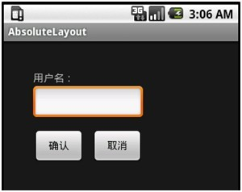


## 六、网格布局(GridLayout)
网格布局(GridLayout)是Android 4.0以后引入的一个新的布局,

和前面介绍的TableLayout(表格布局) 有点类似,不过他有很多前者没有的东西,

也相对来说更好使用。


我们先一起来看一个例子先：

    <GridLayout xmlns:android="http://schemas.android.com/apk/res/android"
        xmlns:tools="http://schemas.android.com/tools"
        android:id="@+id/GridLayout1"
        android:layout_width="wrap_content"
        android:layout_height="wrap_content"
        android:columnCount="4"
        android:orientation="horizontal"
        android:rowCount="6" >
    
        <TextView
            android:layout_columnSpan="4"
            android:layout_gravity="fill"
            android:layout_marginLeft="5dp"
            android:layout_marginRight="5dp"
            android:background="#FFCCCC"
            android:text="0"
            android:textSize="50sp" />
    
        <Button
            android:layout_columnSpan="2"
            android:layout_gravity="fill"
            android:text="回退" />
    
        <Button
            android:layout_columnSpan="2"
            android:layout_gravity="fill"
            android:text="清空" />
    
        <Button android:text="+" />
    
        <Button android:text="1" />
    
        <Button android:text="2" />
    
        <Button android:text="3" />
    
        <Button android:text="-" />
    
        <Button android:text="4" />
    
        <Button android:text="5" />
    
        <Button android:text="6" />
    
        <Button android:text="*" />
    
        <Button android:text="7" />
    
        <Button android:text="8" />
    
        <Button android:text="9" />
    
        <Button android:text="/" />
    
        <Button
            android:layout_width="wrap_content"
            android:text="." />
    
        <Button android:text="0" />
    
        <Button android:text="=" />
    
    </GridLayout> 


运行效果图：

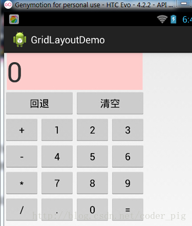

###下图比较好的展示了Gridlayout的相关属性设置:

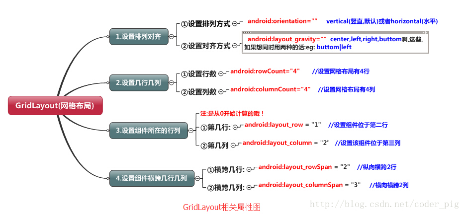

解析:

代码很简单,只是回退与清楚按钮横跨两列,而其他的都是直接添加的,默认每个组件都是

占一行一列,另外还有一点要注意的:

我们通过:android:layout_rowSpan与android:layout_columnSpan设置了组件横跨

多行或者多列的话,如果你要让组件填满横越过的行或列的话,需要添加下面这个属性:

android:layout_gravity = "fill"！就像这个计算机显示数字的部分!

    用法归纳:
    
    ①GridLayout使用虚细线将布局划分为行,列和单元格,同时也支持在行,列上进行交错排列
    
    ②使用流程:
    
    step 1:先定义组件的对其方式 android:orientation  水平或者竖直,设置多少行与多少列
    
    step 2:设置组件所在的行或者列,记得是从0开始算的,不设置默认每个组件占一行一列
    
    step 3:设置组件横跨几行或者几列;设置完毕后,需要在设置一个填充:android:layout_gravity = "fill"


---

##      结束语
非常
