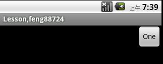

# Android 界面布局分析（1501210662 盛意林）

作者：盛意林

学号：1501210662

学院：北京大学软件与微电子学院

  相信大家对andriod界面都不陌生呢。一款漂亮的软件必然是需
  
  要界面优雅、交互友好的UI的呢。今天主要跟大家讲一讲两个方
  
  面的内容，一是UI界面布局的几种方式，二是浅谈一下Android布
  
  局优化的信息，希望对您有所帮助。
  


# 1.andriod的几大布局

##  ①.线性布局(LinearLayout)
##  ②.框架布局(FrameLayout)
##  ③.表格布局(TableLayout)
##  ④.相对布局(RelativeLayout)
##  ⑤.绝对布局(AbsoluteLayout)
##  ⑥.和网格布局(GridLayout)
##  ⑦.自定义布局 (custom-layout) 

# 2.Android布局优化


---

##一、线性布局(LinearLayout)
先看图：


LinearLayout是线性布局控件：要么横向排布，要么竖向排布

线性布局的整体布局方式包括了垂直和水平，这个也是必须指定的呢。

android:orientation：vertical (垂直方向) ：
 
   
 horizontal(水平方向)：
 
 


接下来请看一个例子：

```   
<?xml version="1.0" encoding="utf-8"?>
<LinearLayout xmlns:android="http://schemas.android.com/apk/res/android"
	android:orientation="vertical"
    android:layout_width="fill_parent"
    android:layout_height="fill_parent"
    >
   <EditText
       android:id="@+id/edtInput"
       android:layout_width="fill_parent"
       android:layout_height="wrap_content"
       android:text="@+string/hello_world"
       />

    <Button
        android:id="@+id/myButton"
        android:layout_width="fill_parent"
        android:layout_height="wrap_content"
        />

    <TextView
		android:id="@+id/firstText"
		android:text="TextView第一行"
		android:gravity="center_vertical"
		android:textSize="15pt"
		android:background="#aa0000"
		android:layout_width="fill_parent"
		android:layout_height="wrap_content"
		android:layout_weight="10000"
        android:singleLine="true"/>
	<TextView
		android:id="@+id/secondText"
		android:text="TextView第二行"
		android:gravity="center_vertical"
		android:textSize="15pt"
		android:background="#0000aa"
		android:layout_width="fill_parent"
		android:layout_height="wrap_content"
		android:layout_weight="1"/>
    
</LinearLayout>

```

运行效果：


解析下具体的参数：
    
 
		代码编辑提示快捷键:	Alt+/

		id="@+id/edtInput",ID 是连接UI 与代码的桥梁
		layout_width="fill_parent" ，自动填充至屏幕宽度
		layout_width="wrap_content" ，自动填充为控件大小
		
		在LinearLayout 里面的控件，按照水平或者垂直排列：
			orientation="horizontal" ：水平排列；
			orientation=" vertical" ：垂直排列
			
		android:id  —— 为控件指定相应的ID
		android:text —— 指定控件当中显示的文字，需要注意的是，这里尽量使用strings.xml文件当中的字符串
		android:grivity —— 指定控件的基本位置，比如说居中，居右等位置
		android:textSize —— 指定控件当中字体的大小
		android:background —— 指定该控件所使用的背景色,RGB命名法 
		android:width —— 指定控件的宽度
		android:height —— 指定控件的高度
		android:padding* —— 指定控件的内边距，也就是说控件当中的内容
		android:sigleLine —— 如果设置为真的话，则将控件的内容在同一行当中进行显示
						

 
 
## 线性不居中的常用属性：

android:gravity------------设置的是控件自身上面的内容位置

android:layout_gravity-----设置控件本身相对于父控件的显示位置

android:layout_weight----- 给控件分配剩余空间

对于gravity 和layoutgravity 且看下面的代码
```
<LinearLayout  
   xmlns:android="http://schemas.android.com/apk/res/android"  
   android:orientation="vertical"  
   android:layout_width="fill_parent"  
  android:layout_height="fill_parent">  
 <EditText  
    android:layout_width="wrap_content"  
      android:gravity="center"  
      android:layout_height="wrap_content"  
       android:text="one"  
       android:layout_gravity="right"/>  
</LinearLayout>  

```
运行效果图:

  
  
 - One是相对于button而言是居中排列的，而button相对于大的view来说又是靠右排列的呢。

###  layout_weight属性

这个属性比较有趣：如果感兴趣建议看一下：
[android:layout_weight的真实含义](http://blog.csdn.net/yanzi1225627/article/details/24667299)

    一般来讲Google官方推荐，当使用weight属性时，将width设为0dip即可，

     效果跟设成wrap_content是一样的。这样weight就可以理解为占比了！

##另需要注意的是:

    当 android:orientation="vertical"  时，只有水平方向的设置才起作用，垂直方向的设置不起作用。
    即：left，right，center_horizontal 是生效的。
    当 android:orientation="horizontal" 时， 只有垂直方向的设置才起作用，水平方向的设置不起作用。
    即：top，bottom，center_vertical 是生效的。

## 二、框架布局(FrameLayout)

简单来说，框架布局管理器(FrameLayout)是将组件都放在屏幕的左上角，所有的组件是层叠显示的.

我们先来看一个例子：
```
<?xml version="1.0" encoding="utf-8"?>
<FrameLayout xmlns:android="http://schemas.android.com/apk/res/android"
    android:layout_width="fill_parent"
    android:layout_height="fill_parent"
    android:orientation="vertical" >
    <ImageView
        android:id="@+id/img"
        android:layout_width="wrap_content"
        android:layout_height="wrap_content"
        android:contentDescription="这是一个图片"
        android:src="@drawable/ic_launcher" />
    <TextView
        android:id="@+id/text"
        android:layout_width="wrap_content"
        android:layout_height="wrap_content"
        android:text="这是提示文字" />
    <Button android:id="@+id/btn" 
        android:layout_width="wrap_content"
        android:layout_height="wrap_content"
        android:text="这是按钮"/>
</FrameLayout>

```
运行效果：


可以看的出来，是按照顺序依次将控件显示在左上角的呢。似乎framelayout的动态效果，比如动画的时候能体现出其作用。

可以参考：[Android应用开发之FrameLayout （帧布局）+小鸟飞翔案例
](http://www.linuxidc.com/Linux/2011-12/49200p2.htm)


## 三、表格布局(TableLayout)


结束语
[sdfsdfdsf](www.daidu.com)
# sdfdsf 


## sdfsdfsd

sdfsdfsdfsd
### sdfdsfsdf* 
* sdfsdfsdf
1. sdfsdfdsf
2. sdfsdfds
1. 
dsfsdfds

---
1. 
sdfsadfasdf

1. sdfsdfdsf

2. sdfsdfds
3. sdfdsf

sdfsdfsdfsdf

| sdfsdf:afdsadfadsf | aaaaa |
| --| - -       |
| sdfdsf | 1:2 |


