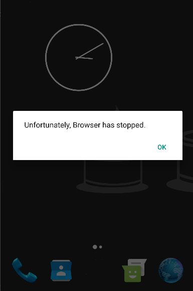
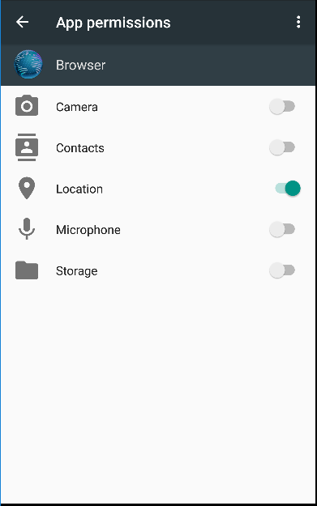
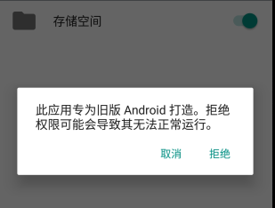

# Android M权限管理机制分析（1501211038 章佘林）

# 一 绪论


2015年8月，谷歌正式推出了安卓6.0系统，这次发布的全新安卓版本增加了很多功能。为了适应最新的潮流，谷歌在6.0中添加了系统的指纹识别功能；根据谷歌自身的特色，google now 的性能也得到了大幅度的提升，now on tap使其在搜索方面取得了很大的领先优势；而为了解决安卓一直以来的权限被滥用以及后台程序占用系统资源消耗内存等痼疾，此次谷歌也采取了强硬的手段，推出了全新的权限管理模式和应用休眠机制，从目前的测试来看，这两项措施取得了很有效的成果。应用程序无法直接在首次安装时就获取所有权限，而是需要对权限进行申明，用户同意之后才可以获取权限，而用户在安装程序之后也可以随时修改应用的权限，十分方便；而应用休眠机制则可以检测用户状态，当屏幕关闭之后一段时间，系统就会暂时关闭应用程序的后台请求，释放被占用的内存，有效的延长了待机时间。

与以往开发者可以直接在AndroidManifest中直接声明应用程序所需的权限不同，在安卓6.0中，只有一部分通用权限可以在Manifest中声明，除此以外，开发者还需要添加对敏感权限的使用申请，这就意味着开发者不得不在使用到某项权限时，先调用相应的接口来向用户请求权限。
新版的权限管理功能同时也能向下兼容低版本的应用，这意味着程序可以在一开始的时候获取所有权限，但是用户仍然可以在系统设置中随时取消这些权限。
当未获取到权限时，程序会发生未知的错误：

 

此时，需要用户在授权页面将相应的权限赋予给应用程序，才能够继续运行：




这样自然会产生很不好的用户体验，因此开发者必须及时将自己的程序针对6.0进行一定的修改，才能避免出现类似的问题。


---

# 二 新的权限管理规则
* **声明权限**

   应用在开发时需要在AndroidManifest.xml文件中声明应用在运行时可能需要的权限，这与旧版本的Android平台应用开发基本一致。
* **权限组**

    Android 根据应用权限的类型将权限分为了不同的权限组，如CONTACT权限组包括了读取和写入用户通讯录等相关权限。
* **有限制的在安装时取得的权限**

    在用户安装或更新应用时系统将使应用取得相应的权限，这种权限仅限在PROTECTION_NORMAL级别的权限。如闹铃和联网权限属于PROTECTION_NORMAL级别，它们将在应用安装时自动被获取。
     PROTECTION_NORMAL 类权限依然可以在manifest中直接声明：
    ```android.permission.ACCESS_LOCATION_EXTRA_COMMANDS
android.permission.ACCESS_NETWORK_STATE
android.permission.ACCESS_NOTIFICATION_POLICY
android.permission.ACCESS_WIFI_STATE
android.permission.ACCESS_WIMAX_STATE
android.permission.BLUETOOTH
android.permission.BLUETOOTH_ADMIN
android.permission.BROADCAST_STICKY
android.permission.CHANGE_NETWORK_STATE
android.permission.CHANGE_WIFI_MULTICAST_STATE
android.permission.CHANGE_WIFI_STATE
android.permission.CHANGE_WIMAX_STATE
android.permission.DISABLE_KEYGUARD
android.permission.EXPAND_STATUS_BAR
android.permission.FLASHLIGHT
android.permission.GET_ACCOUNTS
android.permission.GET_PACKAGE_SIZE
android.permission.INTERNET
android.permission.KILL_BACKGROUND_PROCESSES
android.permission.MODIFY_AUDIO_SETTINGS
android.permission.NFC
android.permission.READ_SYNC_SETTINGS
android.permission.READ_SYNC_STATS
android.permission.RECEIVE_BOOT_COMPLETED
android.permission.REORDER_TASKS
android.permission.REQUEST_INSTALL_PACKAGES
android.permission.SET_TIME_ZONE
android.permission.SET_WALLPAPER
android.permission.SET_WALLPAPER_HINTS
android.permission.SUBSCRIBED_FEEDS_READ
android.permission.TRANSMIT_IR
android.permission.USE_FINGERPRINT
android.permission.VIBRATE
android.permission.WAKE_LOCK
android.permission.WRITE_SYNC_SETTINGS
com.android.alarm.permission.SET_ALARM
com.android.launcher.permission.INSTALL_SHORTCUT
com.android.launcher.permission.UNINSTALL_SHORTCUT
```
    
* **用户在运行时控制的权限**

    当应用需要取得某项权限时，系统会弹出一个对话框通知用户是否允许取得相应的权限，通过回调函数通知应用是否取得了相应的权限。如果用户允许获得权限，那么应用将获得相应权限控制范围内所有的功能。


这种新的权限管理模型要求开发者在设计应用时遵循以下几项原则:

* **总是去检查相关权限**
 
    当应用需要作出需要权限的相关操作时，总是需要去检查应用是否已经被授权获得了相应的权限

* **小心处理权限缺失**

    当应用无法取得相关权限时，需要处理好权限缺失后的相关动作。例如：如果该操作仅仅是应用的附加功能，那么权限的缺失不会造成整个应用的停止。但是如果该操作为整个应用的核心，那么就需要及时地通知用户获取相关的权限，以免应用无法正常运行 
    
* **权限是可以被随时废除**

    用户在应用运行时可以随时地取消应用已获取的权限，这种操作并不会通知应用，所以如第一条所述，在进行一些有限制性的操作时要总是去检查应用是不是已经获取了相应的权限


---


# 三 天气预报程序针对Android M进行优化 
```
android {
    useLibrary 'org.apache.http.legacy'
    compileSdkVersion 23
    buildToolsVersion "23.0.0"

    defaultConfig {
        applicationId "cn.ed.pku.sean.weather"
        minSdkVersion 19
        targetSdkVersion 23
        versionCode 1
        versionName "1.0"
    }
    buildTypes {
     .......
    }
}```


---

    

# 四 Android M 应用开发建议


### 1. 旧版本程序在marshmallow上的兼容运行
当用户安装为低版本的安卓开发的应用时，为了避免出现异常，应用程序依然可以像以往一样获取所需要的权限而不需要用户的许可。但是，用户依然可以在程序安装完成之后，在应用设置中随时取消这些设置。
由于之前的开发人员没有考虑过权限处理的问题，因此用户取消这些权限可能会引发强制关闭等问题。系统在用户试图取消低版本程序的权限时，会弹出对话框提醒用户这样可能导致的问题：


### 2. 每次使用权限时都应当首先检查是否获得了权限。


