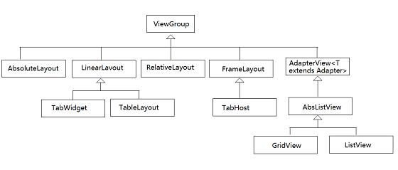
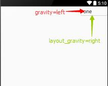
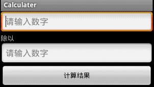
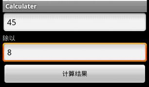
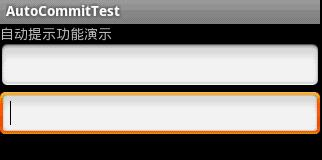
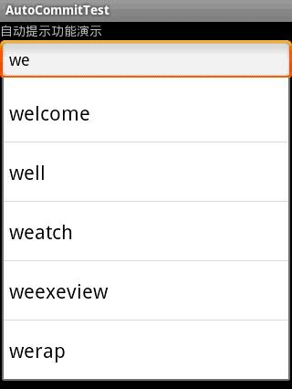
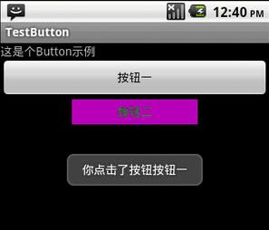
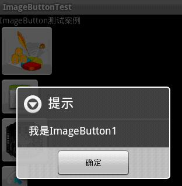
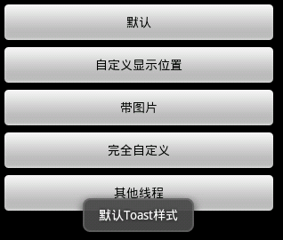

# android UI布局和控件(1501210515董雪)

## 摘要
本文主要对Android开发中的UI界面进行介绍和演示。在一个Android应用中，界面决定人的第一印象，所以掌握界面设计是一个不可或缺的技能。谈到UI，那么Layout是开发中的一个很重要环节，Layout是组成UI不可缺少的一部分，本文会通过5种布局方式来进行详细介绍。此外对于Android的UI控件相信大家都不会陌生，通常我们大都会用到哪个会到网上搜索，对UI控件的也是一知半解，本文将所有的UI控件的集合起来，供大家参考查阅。

## Android UI 布局

android的布局方式有五种，分别是：LinearLayout（线性布局）、FrameLayout（单帧布局）、RelativeLayout（相对布局）、AbsoluteLayout（绝对布局）和TableLayout（表格布局）。

android的布局之间可以互相嵌套。

所有的布局方式都可以归类为ViewGroup的5个类别，即ViewGroup的5个直接子类(即:所说的五种布局方式)。其它的一些布局都扩展自这5个类。


下面讲述5种布局：
### 1.Linear Layout (线性布局)
线性布局是Android布局中最简单的布局，也是最常用，最实用的布局。

android:orientation线形布局的对齐方式 ： vertical(垂直) 和 horizontal(水平)

LayoutParams中的特殊参数:

```
layout_weight  权值
layout_gravity 相对于父元素的重力值(默认top|left)：
(top|bottom|left|right|center_vertical|fill_vertical |center_ horizontal 
|fill_ horizontal | center| fill)
```
LinearLayout有两个非常相似的属性：
```
android:gravity
android:layout_gravity
```
他们的区别在于：

* 
android:gravity属性是对该view中内容的限定．比如一个button 上面的text. 你可以设置该text相对于view的靠左，靠右等位置．
* 
android:layout_gravity是用来设置该view相对与父view的位置．比如一个button在linearlayout里，你想把该button放在linearlayout里靠左、靠右等位置就可以通过该属性设置．

android:gravity用于设置View中内容相对于View组件的对齐方式，而android:layout_gravity用于设置View组件相对于Container的对齐方式。

原理跟android:paddingLeft、android:layout_marginLeft有点类似。如果在按钮上同时设置这两个属性。

```
android:paddingLeft="30px"  按钮上设置的内容离按钮左边边界30个像素
android:layout_marginLeft="30px"  整个按钮离左边设置的内容30个像素
```

下面回到正题， 我们可以通过设置android:gravity=”center”来让EditText中的文字在EditText组件中居中显示；

同时我们设置EditText的android:layout_gravity=”right”来让EditText组件在LinearLayout中居右显示。看下效果：



```
<LinearLayout
    xmlns:android="http://schemas.android.com/apk/res/android"
    android:orientation="vertical"
    android:layout_width="fill_parent"
    android:layout_height="fill_parent" >
    <EditText
        android:layout_width="wrap_content"
        android:gravity="left"
        android:layout_height="wrap_content"
        android:text="one"
        android:layout_gravity="right"/>
</LinearLayout>
```


### 2.Relative Layout (相对布局)
RelativeLayout允许子元素指定他们相对于其它元素或父元素的位置（通过ID 指定）。因此，你可以以右对齐，或上下，或置于屏幕中央的形式来 排列两个元素。元素按顺序排列，因此如果第一个元素在屏幕的中央，那么相对于这个元素的其它元素将以屏幕中央的相对位置来排列。如果使用XML 来指定这个 layout ，在你定义它之前，被关联的元素必须定义。

这个布局是最灵活的布局，因此复杂的布局我们多用这个布局。

#### LayoutParams中特殊的参数 :

*  
属性值为true或false
```
android:layout_centerHrizontal            水平居中
android:layout_centerVertical             垂直居中
android:layout_centerInparent             相对于父元素完全居中
android:layout_alignParentBottom          贴紧父元素的下边缘
android:layout_alignParentLeft            贴紧父元素的左边缘
android:layout_alignParentRight           贴紧父元素的右边缘
android:layout_alignParentTop             贴紧父元素的上边缘
android:layout_alignWithParentIfMissing   若找不到兄弟元素以父元素做参照物
```
* 
属性值必须为id的引用名”@id/id-name”
```
android:layout_below               在某元素的下方
android:layout_above               在某元素的上方
android:layout_toLeftOf            在某元素的左边
android:layout_toRightOf           在某元素的右边
android:layout_alignBaseLine       该控件的baseline和给定ID的控件的Baseline对齐
android:layout_alignTop            本元素的上边缘和某元素的的上边缘对齐
android:layout_alignLeft           本元素的左边缘和某元素的的左边缘对齐
android:layout_alignBottom         本元素的下边缘和某元素的的下边缘对齐
android:layout_alignRight          本元素的右边缘和某元素的的右边缘对齐
```

* 
属性值为具体的像素值，如30dip，40px
```
android:layout_marginBottom        离某元素底边缘的距离
android:layout_marginLeft          离某元素左边缘的距离
android:layout_marginRight         离某元素右边缘的距离
android:layout_marginTop           离某元素上边缘的距离
```

### 3.TableLayout (表格布局)

TableLayout 将子元素的位置分配到行或列中。一个TableLayout 由许多的TableRow 组成，每个TableRow 都会定义一个 row（事实上，你可以定义其它的子对象）。

TableLayout 容器不会显示row 、cloumns 或cell 的边框线。每个row拥有0个或多个的cell；每个cell 拥有一个View对象。

表格由列和行组成许多的单元格。表格允许单元格为空。单元格不能跨列，这与HTML 中的不一样。

特殊的参数：    

```
android:stretchColumns  伸展的列的索引
android:shrinkColumns   收缩的列的索引
android:collapseColumns 倒塌的列的索引(即销毁)
```

表示两行两列的一个表格。 android:gravity=”center”书面解释是权重比。其实就是让它居中显示。

它还可以动态添加里面的每行每列。如下代码所示:

```
TableLayout tableLayout = (TableLayout) findViewById(R.id.table01);
TableRow tableRow = new TableRow(this);
TextView temp = new TextView(this);
temp.setText("text的值");
tableRow.addView(temp);
```
android:stretchColumns=”1,2,3,4″ 它的意思就是自动拉伸1,2,3,4列。

### 4.AbsoluteLayout (绝对布局)
AbsoluteLayout可以让子元素指定准确的x/y坐标值，并显示在屏幕上。(0, 0)为左上角，当向下或向右移动时，坐标值将变大。

AbsoluteLayout没有页边框，允许元素之间互相重叠（尽管不推荐）。我们通常不推荐使用

AbsoluteLayout，除非你有正当理由要使用它，因为它使界面代码太过刚性，以至于在不同的设备上可能不能很好地工作。

LayoutParams中特殊的参数 :
```
layout_x   x方向的坐标
layout_y   y方向的坐标
```

### 5.FrameLayout ( 帧布局 )
FrameLayout是最简单的一个布局对象。它被定制为你屏幕上的一个空白备用区域，之后你可以在其中填充一个单一对象。比如，一张你要发布的图片。所有的子元素将会固定在屏幕的左上角；你不能为FrameLayout中的一个子元素指定一个位置。后一个子元素将会直接在前 一个子元素之上进行覆盖填充，把它们部份或全部挡住（除非后一个子元素是透明的）。

里面可以放多个控件，不过控件的位置都是相对位置

LayoutParams中特殊的参数 :

layout_gravity 相对于父元素的重力值(用法同LinearLayout)


### 注意事项：


各布局不要乱用各自的属性。比如把属于AbsoluteLayout布局的
``` android:layout_x ```和```android:layout_y```
用到LinearLayout布局或RelativeLayout布局，或者把RelativeLayout布局的 below，rightof等属性应用到其他布局中。这样做虽然不会报错，但是根本达不到我们需要的效果。

关于``` android:layout_width=”fill_parent”```和``` android:layout_height=”wrap_content”``` ，这是对每个布局宽和高的设置。```wrap_content```,可表示随着其中控件的不同而改变这个布局的宽度或高度，类似于自动设置宽和高,```fill_parent``` 使布局填充整个屏幕，另外还有一种```match_parent```，它本质上和 ```fill_parent ```一样，并从API Level8开始替代fill_parent。


## Android UI 控件
* 
**TextView（文本框）**

TextView比较简单，不能够用来进行编辑，只能够用来显示信息

布局文件里的一些常用的XML属性
```
android:gravity---用来设置控件内文本的对齐方式
android:layout_gravity---相对于父控件来说，用于设置控件的对齐方式
android:text---用来设置控件文本信息
android:layout_width---用来设置控件的宽度
android:layout_height---用来设置控件的高度
android:background---用来设置控件的背景色
android:textColor---用来设置控件内文本的颜色
android:textSize---用来设置控件的文本字体大小
```
android:width和android:height---功能与android:layout_width相似
区别：android:layout_width只能设置fill_parent(横向填充整个屏幕)或

wrap_content(横向填充控件本身大小)
android:width设置具体控件的横向大小单位是像素

例如：TextView显示,


main.xml布局文件如下：
```
<?xml version="1.0" encoding="utf-8"?>
<LinearLayout xmlns:android="http://schemas.android.com/apk/res/android"
    android:orientation="vertical"
    android:layout_width="fill_parent"
    android:layout_height="fill_parent"
    >
<TextView  
    android:layout_width="fill_parent" 
    android:layout_height="wrap_content" 
    android:text="@string/hello"
    />
</LinearLayout>
```
* 
**EditText(编辑框)**

EditText是可编辑的文本框。
在用户没有输入的时候，我们默认在编辑框中显示“请输入数字”的提示，要实现这一功能很简单，秩序哟啊“EditText.setHint("请输入数字")”或者在XML布局文件上写上“android:hint="请输入数字"”即可

下面通过一个简单的计算器来说明EditText的使用

calculater.java源文件
```
package org.dx.calculate;
 
import android.app.Activity;
import android.content.Intent;
import android.os.Bundle;
import android.view.Menu;
import android.view.MenuItem;
import android.view.View;
import android.view.View.OnClickListener;
import android.widget.Button;
import android.widget.EditText;
import android.widget.TextView;
import android.widget.Toast;
 
public class Calculater extends Activity {
    /** Called when the activity is first created. */
        private EditText numberone;
        private EditText numbertwo;
        private Button mybutton;
        private TextView symbol;
    @Override
    public void onCreate(Bundle savedInstanceState) {
        super.onCreate(savedInstanceState);
        setContentView(R.layout.main);
        numberone=(EditText)findViewById(R.id.numberone);
        numbertwo=(EditText)findViewById(R.id.numbertwo);
        mybutton=(Button)findViewById(R.id.mybutton);
        symbol=(TextView)findViewById(R.id.symbol);
        mybutton.setOnClickListener(new Calculate());
 
    }
 
    @Override
        public boolean onCreateOptionsMenu(Menu menu) {
                // TODO Auto-generated method stub
            menu.add(0, 1, 1, R.string.exit);
            menu.add(0,2,2,R.string.about);
                return super.onCreateOptionsMenu(menu);
        }
 
        @Override
        public boolean onOptionsItemSelected(MenuItem item) {
                // TODO Auto-generated method stub
                if(item.getItemId()==1)
                {
                        finish();
                }
                else if(item.getItemId()==2)
                {
                        Toast.makeText(this, "亲爱的你可知，我有多么思念你！", Toast.LENGTH_SHORT).show();
                }
                return super.onOptionsItemSelected(item);
        }
 
        class Calculate implements OnClickListener
    {
                @Override
                public void onClick(View v) {
                        // TODO Auto-generated method stub
                        String number1=numberone.getText().toString();
                        String number2=numbertwo.getText().toString();
                        Intent intent=new Intent();
                        intent.putExtra("num1",number1);
                        intent.putExtra("num2", number2);
                        intent.setClass(Calculater.this,Result.class);
                        Calculater.this.startActivity(intent);
                }
    }
}
 
```
Result.java源文件
```
package org.dx.calculate;
 
import android.app.Activity;
import android.content.Intent;
import android.os.Bundle;
import android.widget.TextView;
 
public class Result extends Activity {
        private TextView textview;
        public void onCreate(Bundle savedInstanceState)
        {
                super.onCreate(savedInstanceState);
                setContentView(R.layout.result);
                textview=(TextView)findViewById(R.id.textview);
                Intent intent=getIntent();
                String numberone=intent.getStringExtra("num1");
                String numbertwo=intent.getStringExtra("num2");
                Double d1=Double.parseDouble(numberone);
                Double d2=Double.parseDouble(numbertwo);
                Double result=d1/d2;
                
                textview.setText(numberone+" / "+numbertwo+" = "+result);
        }
}

```
main.xml布局文件
```
<?xml version="1.0" encoding="utf-8"?>
<LinearLayout xmlns:android="http://schemas.android.com/apk/res/android"
    android:orientation="vertical"
    android:layout_width="fill_parent"
    android:layout_height="fill_parent"
    >
    <EditText
            android:layout_width="fill_parent"
            android:layout_height="wrap_content"
            android:id="@+id/numberone"
            android:hint="请输入数字"
    />
    <TextView
            android:layout_width="fill_parent"
            android:layout_height="wrap_content"
            android:id="@+id/symbol"
            android:text="@string/symbol"
    />
    <EditText
            android:layout_width="fill_parent"
            android:layout_height="wrap_content"
            android:id="@+id/numbertwo"
            android:hint="请输入数字"
    />
    <Button
            android:layout_width="fill_parent"
            android:layout_height="wrap_content"
            android:id="@+id/mybutton"
            android:text="@string/calculate"
    />
</LinearLayout>
```
result.xml布局文件，用于显示结果
```
<?xml version="1.0" encoding="utf-8"?>
<LinearLayout
  xmlns:android="http://schemas.android.com/apk/res/android"
  android:layout_width="wrap_content"
  android:layout_height="wrap_content">
  <TextView
          android:layout_width="fill_parent"
          android:layout_height="wrap_content"
          android:id="@+id/textview"
  />
</LinearLayout>

strings.xml文件

<?xml version="1.0" encoding="utf-8"?>
<resources>
    <string name="hello">Hello World, Calculater!</string>
    <string name="app_name">Calculater</string>
    <string name="symbol">除以</string>
    <string name="calculate">计算结果</string>
    <string name="result">计算结果</string>
    <string name="exit">退出</string>
    <string name="about">帮助</string>
</resources>

```

运行结果：






* **AutoCompleteTextView（自动提示）**

AutoCompleteTextView的功能类似于百度或者Google在搜索栏输入信息的时候，弹出的与输入信息接近的提示信息。

1）简介

继承自AutoCompleteTextView，延长AutoCompleteTextView的长度，你必须要提供一个MultiAutoCompleteTextView.Tokenizer来区分不同的子串

2）重要方法
```
enoughToFilter()：当文本长度超过阈值时过滤
performValidation()：代替验证整个文本，这个子类方法验证每个单独的文字标记
setTokenizer(MultiAutoCompleteTextView.Tokenizer t)：用户正在输入时，tokenizer设置将用于确定文本相关范围内
```

3）使用须知

* 布局文件


```
<MultiAutoCompleteTextView 
android:id="@+id/edit1" 
android:layout_width="match_parent" 
android:layout_height="wrap_content" />
```

* 程序

实例化适配器

```
ArrayAdapter<String> adapter = new ArrayAdapter<String>(this,android.R.layout.simple_dropdown_item_1line, strs);
```
设置适配器
```
  　　edit.setAdapter(adapter);
```
确定范围
```
　　　　edit1.setTokenizer(new MultiAutoCompleteTextView.CommaTokenizer())
```

下面是个例子 

AutoCommitTest.java
```
package org.dx.auto;

import android.app.Activity;
import android.os.Bundle;
import android.widget.ArrayAdapter;
import android.widget.AutoCompleteTextView;
import android.widget.MultiAutoCompleteTextView;

public class AutoCommitTest extends Activity {
    /** Called when the activity is first created. */
        private static final String[] autoString=new String[]{"welcome","well",
                "weatch","weexeview","werap"};                                     
    @Override
    public void onCreate(Bundle savedInstanceState) {
        super.onCreate(savedInstanceState);
        setContentView(R.layout.main);
        //关联关键字
        ArrayAdapter<String> adapter=new ArrayAdapter<String>(this,
                        android.R.layout.simple_dropdown_item_1line,
                        autoString);
        AutoCompleteTextView autocomplete=(AutoCompleteTextView)findViewById(R.id.auto);
        autocomplete.setAdapter(adapter);
        MultiAutoCompleteTextView multi=(MultiAutoCompleteTextView) findViewById(R.id.multi);
        //将adapter添加到AutoCompleteTextView中
        multi.setAdapter(adapter);
        multi.setTokenizer(new MultiAutoCompleteTextView.CommaTokenizer());
    }
}
```
main.xml
```
<?xml version="1.0" encoding="utf-8"?>
<LinearLayout xmlns:android="http://schemas.android.com/apk/res/android"
    android:orientation="vertical"
    android:layout_width="fill_parent"
    android:layout_height="fill_parent"
    >
<TextView  
    android:layout_width="fill_parent" 
    android:layout_height="wrap_content" 
    android:text="自动提示功能演示"
    />
<AutoCompleteTextView
        android:id="@+id/auto"
        android:layout_width="fill_parent"
        android:layout_height="wrap_content"
/>
<MultiAutoCompleteTextView
        android:id="@+id/multi"
        android:layout_width="fill_parent"
        android:layout_height="wrap_content"
/>
</LinearLayout>
```
效果图：





* ** Button（按钮）**

Button，就是按钮，是android中应用最多的组件之一，Button有两种用法，一种是XML中配置，另一种是在程序中直接使用
在XML布局文件里，会遇到如下一些单位
```
px：是屏幕的像素点
in：英寸
mm：毫米
pt：磅，1/72 英寸
dp：一个基于density的抽象单位，如果一个160dpi的屏幕，1dp=1px
dip：等同于dp
sp：同dp相似，但还会根据用户的字体大小偏好来缩放。
```
建议使用sp作为文本的单位，其它用dip

例子：
main.xml
```
<?xml version="1.0" encoding="utf-8"?>
<LinearLayout xmlns:android="http://schemas.android.com/apk/res/android"
    android:orientation="vertical"
    android:layout_width="fill_parent"
    android:layout_height="fill_parent"
    >
<TextView  
    android:layout_width="fill_parent" 
    android:layout_height="wrap_content" 
    android:text="这是个Button示例"
    />
<Button
        android:layout_width="fill_parent"------充满父控件
        android:layout_height="wrap_content"------充满内容
        android:id="@+id/button1"----设置button的ID
        android:text="按钮一"    ------设置按钮的文本显示信息，也可以用string
/>
<Button
        android:layout_width="150dip"---按钮二的宽度
        android:layout_height="30dip"---按钮二的高度
        android:background="#aa00aa"---设置按钮背景颜色
        android:textColor="#00aa00"---设置按钮二里的文本颜色
        android:layout_gravity="center"---设置控件居中显示，注意：android:gravity="center"表是文本在控件中居中显示
        android:id="@+id/button2"
        android:text="按钮二"
/>
</LinearLayout>
 
```
TestButton.java
```
package org.dx.button;
 
import android.app.Activity;
import android.os.Bundle;
import android.view.Gravity;
import android.view.View;
import android.widget.Button;
import android.widget.Toast;
 
public class TestButton extends Activity {
    /** Called when the activity is first created. */
        private Button btn1,btn2;
    @Override
    public void onCreate(Bundle savedInstanceState) {
        super.onCreate(savedInstanceState);
        setContentView(R.layout.main);
        btn1=(Button)findViewById(R.id.button1);---获得父控件id
        btn2=(Button)findViewById(R.id.button2);
        //为控件设置监听，当点击了按钮一，就弹出一个提示，当点击按钮二，退出程序
        btn1.setOnClickListener(new Button.OnClickListener()
        {
 
                        @Override
                        public void onClick(View arg0) {
                                // TODO Auto-generated method stub
                                Toast toast=Toast.makeText(TestButton.this, "你点击了按钮"+btn1.getText().toString(), Toast.LENGTH_SHORT);
                                toast.setGravity(Gravity.TOP,0,150);
                                toast.show();
                        }
                
        });
        btn2.setOnClickListener(new Button.OnClickListener()
        {
 
                        @Override
                        public void onClick(View v) {
                                // TODO Auto-generated method stub
                                TestButton.this.finish();
                        }
                
        });
    }
}
 
```
效果图



* **ImageButton(带图标的按钮) **


除了Android系统自带的Button按钮一万，还提供了带图标的按钮ImageButton

要制作带图标的按钮，首先要在布局文件中定义ImageButton，然后通过setImageDrawable方法来设置要显示的图标。

注意：
我们可以在布局文件中就直接设置按钮的图标，如
``` 
android:src="@drawable/icon1" 
```
我们也可以在程序中设置自定义图标
``` 
imgbtn3.setImageDrawable(getResources().getDrawable(R.drawable.icon2)); 
```
我们还可以使用系统自带的图标
``` 
imgbtn4.setImageDrawable(getResources().getDrawable(android.R.drawable.sym_call_incoming)); 
```

设置完按钮的图标后，需要为按钮设置监听setOnClickListener，以此捕获事件并处理

下面的例子讲述的是当点击按钮1、2、3、4的时候，会弹出对应的dialog，

ImageButtonTest.java

```
package org.dx.imagebutton;

import android.app.Activity;
import android.app.AlertDialog;
import android.app.Dialog;
import android.content.DialogInterface;
import android.os.Bundle;
import android.view.View;
import android.widget.Button;
import android.widget.ImageButton;
import android.widget.TextView;

public class ImageButtonTest extends Activity {
    /** Called when the activity is first created. */
        TextView textview;
        ImageButton imgbtn1;
        ImageButton imgbtn2;
        ImageButton imgbtn3;
        ImageButton imgbtn4;
    @Override
    public void onCreate(Bundle savedInstanceState) {
        super.onCreate(savedInstanceState);
        setContentView(R.layout.main);
        
        textview=(TextView)findViewById(R.id.textview);
        //分别取得4个ImageButton对象
        imgbtn1=(ImageButton)findViewById(R.id.imagebutton1);
        imgbtn2=(ImageButton)findViewById(R.id.imagebutton2);
        imgbtn3=(ImageButton)findViewById(R.id.imagebutton3);
        imgbtn4=(ImageButton)findViewById(R.id.imagebutton4);
        
        //分别为ImageButton设置图标
        //imgbtn1已经在main.xml布局中设置了图标，所以就不在这里设置了（设置图标即可在程序中设置，也可在布局文件中设置）
        imgbtn2.setImageDrawable(getResources().getDrawable(R.drawable.icon));//在程序中设置图标
        imgbtn3.setImageDrawable(getResources().getDrawable(R.drawable.icon2));
        imgbtn4.setImageDrawable(getResources().getDrawable(android.R.drawable.sym_call_incoming));//设置系统图标
        
        //下面为各个按钮设置事件监听
        imgbtn1.setOnClickListener(new Button.OnClickListener()
        {
                        @Override
                        public void onClick(View v) {
                                // TODO Auto-generated method stub
                                Dialog dialog=new AlertDialog.Builder(ImageButtonTest.this)
                                .setTitle("提示")
                                .setMessage("我是ImageButton1")
                                .setPositiveButton("确定",new DialogInterface.OnClickListener() {
                                        
                                        @Override
                                        public void onClick(DialogInterface dialog, int which) {
                                                // TODO Auto-generated method stub
                                                //相应的处理操作
                                        }
                                }).create();
                                dialog.show();
                        }
                
        });
        
        imgbtn2.setOnClickListener(new Button.OnClickListener()
        {
                         @Override
                        public void onClick(View v) {
                                // TODO Auto-generated method stub
                                Dialog dialog=new AlertDialog.Builder(ImageButtonTest.this)
                                .setTitle("提示")
                                .setMessage("我是ImageButton2")
                                .setPositiveButton("确定",new DialogInterface.OnClickListener() {
                                        
                                        @Override
                                        public void onClick(DialogInterface dialog, int which) {
                                                // TODO Auto-generated method stub
                                                //相应的处理操作
                                        }
                                }).create();
                                dialog.show();
                        }
                
        });
        
        imgbtn3.setOnClickListener(new Button.OnClickListener()
        {
                         @Override
                        public void onClick(View v) {
                                // TODO Auto-generated method stub
                                Dialog dialog=new AlertDialog.Builder(ImageButtonTest.this)
                                .setTitle("提示")
                                .setMessage("我是ImageButton3")
                                .setPositiveButton("确定",new DialogInterface.OnClickListener() {
                                        
                                        @Override
                                        public void onClick(DialogInterface dialog, int which) {
                                                // TODO Auto-generated method stub
                                                //相应的处理操作
                                        }
                                }).create();
                                dialog.show();
                        }
                
        });
    }
}
```
main.xml

```
<?xml version="1.0" encoding="utf-8"?>
<LinearLayout xmlns:android="http://schemas.android.com/apk/res/android"
    android:orientation="vertical"
    android:layout_width="fill_parent"
    android:layout_height="fill_parent"
    >
<TextView  
        android:id="@+id/textview"
    android:layout_width="fill_parent" 
    android:layout_height="wrap_content" 
    android:text="ImageButton测试案例"
    />
<ImageButton
        android:id="@+id/imagebutton1"
        android:layout_width="wrap_content"
        android:layout_height="wrap_content"
        android:src="@drawable/icon1"
/>
<ImageButton
        android:id="@+id/imagebutton2"
        android:layout_width="wrap_content"
        android:layout_height="wrap_content"
/>
<ImageButton
        android:id="@+id/imagebutton3"
        android:layout_width="wrap_content"
        android:layout_height="wrap_content"
/>
<ImageButton
        android:id="@+id/imagebutton4"
        android:layout_width="wrap_content"
        android:layout_height="wrap_content"
/>
</LinearLayout>

```
效果图：



* 
**CheckBox（多选按钮）**

多选按钮CheckBox的可以实现多项选择，我们可以现在布局文件中定义多选按钮，然后对每一个多选按钮进行事件监听
setOnCheckedChangeListener，通过isChecked来判断选项是否被选中


* 
**ToggleButton（多选按钮）**

ToggleButton 会显示一个按钮，选中/取消选中状态。它基本上是一个开/关按钮的指示灯。


* 
**RadioButton（单选按钮）**

单选按钮RadioButton在Android平台上也应用的非常多，比如一些选择项的时候，会用到单选按钮，实现单选按钮由两部分组成，也就是RadioButton和RadioGroup配合使用

RadioButton的单选按钮;
RadioGroup是单选组合框，用于将RadioButton框起来；
在没有RadioGroup的情况下，RadioButton可以全部都选中；
当多个RadioButton被RadioGroup包含的情况下，RadioButton只可以选择一个；

*  **ProgressDialog**

进度条用于显示任务的进度。例如。当你从互联网上上传或下载的东西，这更好地显示下载进度/上传给用户。

在Android中有一类叫做ProgressDialog，允许创建进度条。为了做到这一点，需要实例化这个类的一个对象。其语法如下：

ProgressDialog progress = new ProgressDialog(this);
现在，可以设置此对话框的某些属性。比如，它的风格，文本等
```
progress.setMessage("Downloading Music :) ");
progress.setProgressStyle(ProgressDialog.STYLE_HORIZONTAL);
progress.setIndeterminate(true);
```
*
**Spinner（下拉列表）**

当在某个网站注册账号的时候，网站会让我们提供性别，生日，城市等信息，为了方便，就提供了一个下拉列表供我们选择，在Android也同样有这样的功能，这就是Spinner下拉列表.

在编码的同时，首先需要在布局中定时Spinner组件，然后将可选内容通过ArrayAdapter和下拉列表连接起来，最后要获得用户选择的选项，我们需要设计事件监听器setOnItemSelectedListener并实现onItemSelected，从而获得用户所选择的内容，最后通过setVisibility方法设置当前的显示项。


* **Toast（提示）**

Toast用于向用户显示一些帮助/提示。下面我做了5中效果，来说明Toast的强大，定义一个属于你自己的Toast。
注意：

LENGTH_LONG---长时间显示视图或文本提示
LENGTH_SHORT---短时间显示视图或文本提示
setGravity(int gravity,int xOffset,int yOffset)---设置提示应该在屏幕上的显示的位置
setDuration(int duartion)---设置提示显示的持续时间

默认效果


 
* **DatePicker,TimePicker（日期和时间）**

日期和时间是任何手机平台都有的功能，Android也如此。
DatePicker：用来实现日期（年月日）
TimePicker：用来实现时间（时分秒）

Calendar：日历是设定年度日期对象和一个整数字段之间转换的抽象基类，如，月，日，小时等。
例如
```
final Calendar calendar=Calendar.getInstance();
  mYear=calendar.get(Calendar.YEAR);---获取年份
  mMonth=calendar.get(Calendar.MONTH);---获取月份
  mDay=calendar.get(Calendar.DAY_OF_MONTH);---获取日
  mHour=calendar.get(Calendar.HOUR_OF_DAY);---获取时
  mMinute=calendar.get(Calendar.MINUTE);---获取分
```

TimePickerDialog、DatePickerDialog是对话框形式的时间类。


* **TabWidget（切换卡）**

Tab选项卡类似与电话本的界面，通过多个标签切换不同的内容，要实现这个效果，首先要知道TabHost，它是一个用来存放多个Tab标签的容器，每一个Tab都可以对应自己的布局，比如，电话本中的Tab布局就是一个线性布局

要使用TabHost，首先要通过getTabHost方法获取TabHost的对象，然后通过addTab方法来向TabHost中添加Tab，当然每个Tab在切换时都会产生一个事件，要捕捉这个事件，需要设置TabActivity的事件监听setOnTabChangedListener。


## 小结

UI布局、控件的知识点比较多、零碎，但是不需要每一个都记住，我们在了解了UI布局、常用的UI控件后可以根据自己的需要在用到某些控件时再去具体查阅代码和学习。当给出一个界面图的时候我们首先要学会进行布局，然后将对应的具体控件放进去，这是我们应该具备的基本能力。
