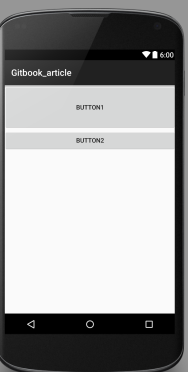
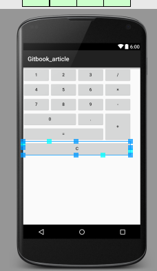

# android UI布局设计(丁泽武 1501210893)


一、简介
1. 背景
    如今的手机端APP是以惊人的速度在增加，随着APP数量的无限放大，
    相同功能的APP也是越来越多。如音乐的APP有豆瓣电台、网易云音乐、酷我、
    多米等等。而这么多的应用，在初次映入眼帘的时候，是什么吸引了用户呢？是什么是用户继续使用下去呢？毫无疑问，这将是UI设计。一个好的UI设计不能决定一个APP是否成功，因为决定APP成功的最终元素肯定是业务和性能。但是一个好的UI给了你的软件一个强大的竞争力。Android虽然在智能手机市场份额上远高于iOS，但是近几年谷歌PlayStore的应用数量却低于AppStore。随着安卓系统的不断扩张，谷歌Play Store的应用数量也飞涨。根据应用跟踪平台appFigures今天发布的报告，2014年Google Play应用商店增加的新应用数量首次超过苹果App Store，开发者社区增长连续第三年超过苹果，开发者数量达到38.8万。面对如此大的市场，好的UI设计有着战略性作用。

1. 主要内容
    * 
    布局类
        1. FrameLayout
            
            FrameLayout是最简单的布局管理器，他所做的是将新的子视图放在前一个parent视图的左上角(默认)，可以通过gravity属性来改变他的位置，并且有可能覆盖上一个父视图。

        1. LinearLayout
        
            LinearLayout是按照垂直或者水平的方向来排列每一个子视图。一个水平方向的布局是一个视图行，垂直方向的为一个视图列。
        
        1. RelativeLaout
            
            RelativeLayout是根据相对位置来布局，笔者认为是用处最广最灵活的。可以根据自己的布局需要灵活的使用。
            
        1. GridLayout
        
            GridLayout是在Android 4.0之后引入的，用法极其灵活，可以简化布局。
            
        1. AbsoluteLayout
        
            AbsoluteLayout是按照绝对坐标来布局组件。
            
    * 
    XML外部资源定义
    
        1. 可扩展标记语言，标准通用标记语言的子集，是一种用于标记电子文件使其具有结构性的标记语言。是Internet环境中跨平台的、依赖于内容的技术，也是当今处理分布式结构信息的有效工具。XML文件在网络数据传输中跟JSON格式一样，是属于轻量级的数据存储和传输的载体。而在android等开发中，XML格式更多的是一种配置文件，在UI设计中，layout_xml文件可以有效的将布局从表示层从视图和代码中分离出来，可以达到解耦的作用，使得程序可读性更强。而且当数据和需求更改时，通过XML文件更容易适应新的更改。
        
            
            

二、布局类详解及应用
    
        *  FrameLayout
            1. 详解
                1.1定义
                FrameLayout是帧布局，整个界面对于FrameLayout来说是一块备用的空白区域，区域的大小由最大的子视图决定，换句话说，如果各个视图的大小一样，则只显示最后一个加载的子视图，前面的全部被覆盖。
                1.2属性
                FrameLayout是比较简单的布局，所以属性比较少。如下
                    * layout_width
                        组件的宽度：可以是fill-parent或者是warp-content
                    * layout_height
                        组件的高度：可以是fill-parent或者是warp-content
                    * layout_marginLeft
                        组件跟左边缘的距离
                    * layout_marginTop
                        组件跟顶部的距离
                    * layout_marginRight
                        组件跟右边缘的距离
                    * layout_marginBottom
                        组件跟底部的距离
                    * layout_gravity
                        组件内部的位置
            
            2. 应用
                下面的实例通过四个视图来展示FrameLayout的基本用法。通过实例我们可以发现，视图默认都是在左上角。
                
               ```
               <FrameLayout xmlns:android="http://schemas.android.com/apk/res/android"
                xmlns:tools="http://schemas.android.com/tools"
                android:layout_width="fill_parent"
                android:layout_height="fill_parent">
                <TextView
                android:layout_width="fill_parent"
                android:layout_height="wrap_content"
                android:textSize="100sp"
                android:textColor="#000ff0"
                android:text="最底下的视图"/>
                <TextView
                android:layout_width="fill_parent"
                android:layout_height="wrap_content"
                android:textSize="70sp"
                android:textColor="#f77700"
                android:text="第二层视图"/>
                <TextView
                android:layout_width="fill_parent"
                android:layout_height="wrap_content"
                android:textSize="30sp"
                android:textColor="#f6666f"
                android:text="第三层视图"/>
                <TextView
                android:layout_width="fill_parent"
                android:layout_height="wrap_content"
                android:textSize="50sp"
                android:textColor="#000000"
                android:text="第四层视图"/>
                </FrameLayout>
               ```
               通过下面的第一个截图可以看到UI的设计情况，这个时候我们没有使用layout_gravity，现在我们给第四个视图增加一个layout_gravity属性值为right.会发现视图在parent的宽度大小的右边。因为第四层视图的android:layout_width="fill_parent"的宽度是fill_parent。
            3.截图
            
            
            
    
        *  RelativeLayout
            
            1. 详解
                1.1定义
                RelativeLayout是一种相对布局，各布局之间相互依赖。是一种最常用也最为灵活的布局。
                1.2属性
                //相对于给定的组件ID
                android:layout_above 将该控件的底部置于给定ID的控件之上;

                android:layout_below 将该控件的底部置于给定ID的控件之下;
                
                android:layout_toLeftOf    将该控件的右边缘与给定ID的控件左边缘对齐;
                
                android:layout_toRightOf  将该控件的左边缘与给定ID的控件右边缘对齐;
                
                android:layout_alignBaseline  将该控件的baseline与给定ID的baseline对齐;
                
                android:layout_alignTop        将该控件的顶部边缘与给定ID的顶部边缘对齐;
                
                android:layout_alignBottom   将该控件的底部边缘与给定ID的底部边缘对齐;
                
                android:layout_alignLeft        将该控件的左边缘与给定ID的左边缘对齐;
                
                android:layout_alignRight      将该控件的右边缘与给定ID的右边缘对齐;
                
                // 相对于父组件
                
                android:layout_alignParentTop      如果为true,将该控件的顶部与其父控件的顶部对齐;
                
                android:layout_alignParentBottom 如果为true,将该控件的底部与其父控件的底部对齐;
                
                android:layout_alignParentLeft      如果为true,将该控件的左部与其父控件的左部对齐;
                
                android:layout_alignParentRight    如果为true,将该控件的右部与其父控件的右部对齐;
                
                // 居中
                
                android:layout_centerHorizontal 如果为true,将该控件的置于水平居中;
                
                android:layout_centerVertical     如果为true,将该控件的置于垂直居中;
                
                android:layout_centerInParent   如果为true,将该控件的置于父控件的中央;
                
                // 指定移动像素
                
                android:layout_marginTop      上偏移的值;
                
                android:layout_marginBottom 下偏移的值;
                
                android:layout_marginLeft 　　左偏移的值;
                
                android:layout_marginRight 　 右偏移的值;
            
            
            2. 应用 
            
                下面通过一个例子来说明相对布局的应用。显示的是两个Button的相对布局，如果是在LinearLayout中button2会因为排在界面外面而不显示出来。在FrameLayout中会将前一个视图覆盖。即button2会覆盖button1.
                ```
                <?xml version="1.0" encoding="utf-8"?>
                <RelativeLayout xmlns:android="http://schemas.android.com/apk/res/android"
                    android:layout_width="match_parent" android:layout_height="match_parent">
                    <Button
                        android:layout_width="fill_parent"
                        android:layout_height="100dip"
                        android:text="button1"
                        android:id="@+id/button1"/>
                    <Button
                        android:layout_width="fill_parent"
                        android:layout_height="wrap_content"
                        android:text="button2"
                        android:layout_below="@id/button1"
                        android:id="@+id/button2"/>
                </RelativeLayout>
                
                ```
            3.截图
            

        
        *  LinearLayout
        
            1.详解
                1.1定义
                    * LinearLayout是线性布局控件，它包含的子控件将以横向或竖向的方式排列，根据XM组件排列的顺序流水排列。
                1.2属性
                    *android:layout_width
                    *android:layout_height
                    *android:layout_weight
                        相比FrameLayout,LinearLayout多了一个android:layout_weight，这个属性是干嘛的呢？当水平排放的时候，显示了各组件的比例问题。android:layout_weight属性可以解决，在下面的应用中我们对这个不同点进行解析。
                    *android:layout_gravity
                    *android:layout_margin
                    *android:layout_marginLeft
                    *android:layout_marginTop
                    *android:layout_marginRight
                    *android:layout_marginBottom
            
            2.应用
                下面通过一个小例子来说明android:layout_weight的作用，比如两个TextView，比例需求为1：2.这样就可以使用。
                ```
                <?xml version="1.0" encoding="utf-8"?>
                <LinearLayout xmlns:android="http://schemas.android.com/apk/res/android"
                android:layout_width="match_parent"
                android:layout_height="match_parent"
                android:orientation="horizontal">
                <TextView
                    android:layout_width="wrap_content"
                    android:layout_height="fill_parent"
                    android:layout_weight="1"
                    android:background="#f77700"/>
                <TextView
                android:layout_width="wrap_content"
                android:layout_height="fill_parent"
                android:layout_weight="2"
                android:background="#f6666f"/>
                </LinearLayout>
                
                ```
                在上面的代码中，第一个TextView的weight值为1，第二个值为2.这样就将水平的界面分为3份，第一个占用一份，第二个占两份。
            3.截图
                
            
            4.关于android:layout_weight的扩展应用
                *比如在搜索框之类的组件。我们不难发现，左边或者右边缘是一个搜索按钮，其余部分全是搜索框。这样就可以用到android:layout_weight属性来分配位置。使得达到目的。
         
        *  GridLayout
            
            1.详解
                1.1定义
                如果你想实现计算器这样的Table形式的应用UI，可以考虑使用Grid网格布局。可以轻松的将界面设置为N*M部分。
                1.2属性
                列举几个重要的属性
                android:orientation 方向
                android:rowCount 定义行数
                android:columnCount 定义列数
                layout_columnSpan 占用几列
                layout_rowSpan 占用几行
            2.应用
                以一个计算器来展示Grid布局。笔者认为计算器这类的UI设计使用Grid布局是最佳了。方便快速又理想。
                ```
                <?xml version="1.0" encoding="utf-8"?>
                <GridLayout xmlns:android="http://schemas.android.com/apk/res/android"
                    android:layout_width="wrap_content"
                    android:layout_height="wrap_content"
                    android:orientation="horizontal"
                    android:rowCount="6"
                    android:columnCount="4" >
                    　　<Button
                    android:id="@+id/one"
                    android:text="1"/>
                    　　<Button
                    android:id="@+id/two"
                    android:text="2"/>
                    　　<Button
                    android:id="@+id/three"
                    android:text="3"/>
                    　　<Button
                    android:id="@+id/devide"
                    android:text="/"/>
                    　　<Button
                    android:id="@+id/four"
                    android:text="4"/>
                    　　<Button
                    android:id="@+id/five"
                    android:text="5"/>
                    　　<Button
                    android:id="@+id/six"
                    android:text="6"/>
                    　　<Button
                    android:id="@+id/multiply"
                    android:text="×"/>
                    　　<Button
                    android:id="@+id/seven"
                    android:text="7"/>
                    　　<Button
                    android:id="@+id/eight"
                    android:text="8"/>
                    　　<Button
                    android:id="@+id/nine"
                    android:text="9"/>
                    <Button
                        android:id="@+id/minus"
                        android:text="-"/>
                    <Button
                        android:id="@+id/zero"
                        android:layout_columnSpan="2"
                        android:layout_gravity="fill"
                        android:text="0"/>
                    　　<Button
                    android:id="@+id/point"
                    android:text="."/>
                    <Button
                        android:id="@+id/plus"
                        android:layout_rowSpan="2"
                        android:layout_gravity="fill"
                        android:text="+"/>
                    <Button
                        android:id="@+id/equal"
                        android:layout_columnSpan="3"
                        android:layout_gravity="fill"
                        android:text="="/>
                    <Button
                        android:id="@+id/clear"
                        android:layout_columnSpan="4"
                        android:layout_rowSpan="2"
                        android:layout_gravity="fill"
                        android:text="C"/>
                </GridLayout>
                
                ```
                如果是使用其他布局来实现这个UI的话，会稍微复杂一点，并且没这么灵活和方便。
            3.截图
            
            
        *  AbsoluteLayout
        
            1.详解
                1.1定义
                绝对定位AbsoluteLayout，又可以叫做坐标布局，可以直接指定子元素的绝对位置，这种布局简单直接，直观性强，但是由于手机屏幕尺寸差别比较大，使用绝对定位的适应性会比较差。
                因为这种布局非常不灵活，所以不准备多说。
            
            2.应用
            
            
三、XML布局文件详解及应用

    
        * 详解
            1.定义
             XML为扩展标记语言 (Extensible Markup Language, XML) ，用于标记电子文件使其具有结构性的标记语言，可以用来标记数据、定义数据类型，是一种允许用户对自己的标记语言进行定义的源语言。 XML使用DTD(document type definition)文档类型定义来组织数据;格式统一，跨平台和语言，早已成为业界公认的标准。
            XML是标准通用标记语言 (SGML) 的子集，非常适合 Web 传输。XML 提供统一的方法来描述和交换独立于应用程序或供应商的结构化数据。
            2.XML布局和JSON
            正是由于XML的通用性，以及轻量级和便捷性。在许多方面都使用XML作为配置文件，与之对比的为JSON，为什么JSON不作为很多软件的配置文件，有其一定的道理,因为JSON在使用方便第一并不是得人心，很多人不愿意去使用，没有XML的通用性强。第二，是由于JSON在WEB Service1的推广中还是处于初级阶段，所以在软件前后端交互的时候，XML作为配置文件更为合理。
            3.XML注意事项
            创建 XML 时，要确保开始和结束标记的大小写是一致的。如果大小写不一致，在使用或查看 XML 时将出现错误。例如，如果大小写不一致，Internet Explorer 将不能显示文件的内容，但它会显示开始和结束标记不一致的消息。
        
        * 应用
            在应用方面，在部分二中的几种Layout的实现就是用的XML配置文件来作为分离。而android项目自带的各种配置文件也是XML.在这里就不做过多的叙述了。读者自行去实践使用和发现。
        


四、UI设计常见问题
    1.屏幕适配问题
        1.1背景
        由于安卓是开放的，并不是像Apple一样是封闭的，所以生产安卓手机的厂商的配置属性大小等等是很不相同的。根据2014年OSM（OpenSignalMaps）发布的一份关于安卓碎片化报告中指出，2012年支持安卓的设备有3997种。相对于苹果只有顶多10多种是多么庞大的数据，如果你以为安卓到4000就停止更新，你就大错特错了。因为2013年就到了11800多种。2014年甚至到了19000种。这么多的设备。屏幕的大小更是各异。这就涉及到了屏幕适配问题。
        1.2相关概念信息
        关于屏幕适配问题，我们首先要弄懂的是几个重要的概念。面对屏幕尺寸、分辨率、像素密度、dp、dip等等众多术语概念，我想很多人是搞不清楚的。
            1.21屏幕尺寸、屏幕分辨率、屏幕像素密度
                *屏幕尺寸：屏幕尺寸是对角线的长度，英寸是屏幕长度的单位，一英寸等于2.54厘米
                *屏幕分辨率：这个跟电脑的1333*768是一个意思。但是跟电脑相反。电脑是横向的像素乘以纵向的像素，也就是生活中说的宽度乘以高度。而手机是纵向像素点乘以横向像素。像素的单位是px，1px等于1个像素点。
                *屏幕像素密度为dpi.dot per inch的简写。
            1.22dp、dip、px、sp之间的关系
                *dp和dip均为density independent pixels的缩写。翻译过来的意思为密度无关像素。在安卓中规定如果一英寸有160个像素，则像素密度为160dpi。以160dpi为基准，1dip等于1px。依次类推。
            1.23xxdpi、xdpi、hdpi、mdpi如何计算如何使用
                *这些都是对不同像素密度范围的适配，在安卓的res配置文件中均会有。这样对于不同的像素密度就会做到自适应匹配。
                *其中xxdpi对应的dpi为320~480dpi.
                *xdpi对应的为240dpi~320dpi
                *hdpi对应的是160dpi到240dpi
                *mdpi对应的像素密度为120dpi到160dpi
        1.3小结
        经过了以上关于屏幕适配的相关概念介绍，大家肯定对屏幕适配有了更深的理解，为APP UI设置一个LOGO的时候，一定要针对不同的设备做好适配。这样才能使得不同设备的用户都体验到一样的效果。
        
    

五、总结
    首先对于安卓设备的UI布局设计的技术文章，我的出发点是以使用者的身份来出发的。现在使用手机的人多的使用了成千种软件APP，少的也有几十种到1百多不等。通过对一些用户的了解，我发现UI设计有着可以四两拨千斤的位置。因为很多用户说如果一个APP的 UI设计做的很差的话，会极大的影响使用的兴趣。这让我开始研究UI的各个方面。发现内容不多，但是做起来其实很难。因为UI设计的是由用户来决定好不好的。并不能根据一个人的观点去妄加评测。这就是很难得地方，好比一幅画，一部电影。每个人的观点并不相同。
    收集了用户的信息之后，再从开发者的角度来谈UI设计。首先你的UI不能太复杂，要简单明了。简单明了的UI会给用户快速上手的机会。会让用户体会到其中的乐趣。然后当用户去使用的时候，UI的流畅度也上升到了战略的高度。一个UI如果时常卡住，这是一个很坏的体验。这个将涉及到多线程编程的道理，在这里不多赘述。感兴趣的可以去了解。多线程就是将应用后台尽量从主界面剥夺出去，这样的话，不会给主界面造成很大的压力。
    技术文章中如果出现不正确和不妥的地方，还望指出。谢谢。
    


六、引用

[1](http://www.cocoachina.com/android/20151030/13971.html)
[2]Android 4高级编程(第3版) Reto Meier著


    


