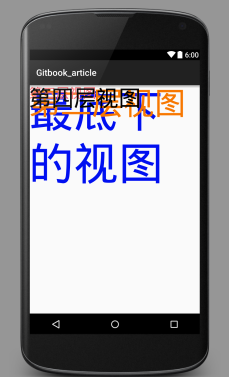
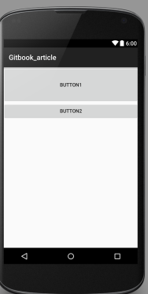
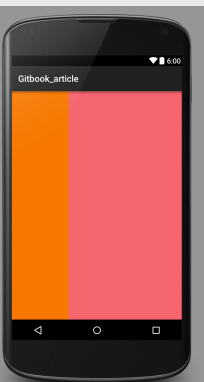

# android UI布局设计(丁泽武 1501210893)


一、简介
1. 背景
    如今的手机端APP是以惊人的速度在增加，随着APP数量的无限放大，
    相同功能的APP也是越来越多。如音乐的APP有豆瓣电台、网易云音乐、酷我、
    多米等等。而这么多的应用，在初次映入眼帘的时候，是什么吸引了用户呢？是什么是用户继续使用下去呢？毫无疑问，这将是UI设计。一个好的UI设计不能决定一个APP是否成功，因为决定APP成功的最终元素肯定是业务和性能。但是一个好的UI给了你的软件一个强大的竞争力。Android虽然在智能手机市场份额上远高于iOS，但是近几年谷歌PlayStore的应用数量却低于AppStore。随着安卓系统的不断扩张，谷歌Play Store的应用数量也飞涨。根据应用跟踪平台appFigures今天发布的报告，2014年Google Play应用商店增加的新应用数量首次超过苹果App Store，开发者社区增长连续第三年超过苹果，开发者数量达到38.8万。面对如此大的市场，好的UI设计有着战略性作用。

1. 主要内容
    * 
    布局类
        1. FrameLayout
            
            FrameLayout是最简单的布局管理器，他所做的是将新的子视图放在前一个parent视图的左上角(默认)，可以通过gravity属性来改变他的位置，并且有可能覆盖上一个父视图。

        1. LinearLayout
        
            LinearLayout是按照垂直或者水平的方向来排列每一个子视图。一个水平方向的布局是一个视图行，垂直方向的为一个视图列。
        
        1. RelativeLaout
            
            RelativeLayout是根据相对位置来布局，笔者认为是用处最广最灵活的。可以根据自己的布局需要灵活的使用。
            
        1. GridLayout
        
            GridLayout是在Android 4.0之后引入的，用法极其灵活，可以简化布局。
            
        1. AbsoluteLayout
        
            AbsoluteLayout是按照绝对坐标来布局组件。
            
    * 
    XML外部资源定义
    
        1. 可扩展标记语言，标准通用标记语言的子集，是一种用于标记电子文件使其具有结构性的标记语言。是Internet环境中跨平台的、依赖于内容的技术，也是当今处理分布式结构信息的有效工具。XML文件在网络数据传输中跟JSON格式一样，是属于轻量级的数据存储和传输的载体。而在android等开发中，XML格式更多的是一种配置文件，在UI设计中，layout_xml文件可以有效的将布局从表示层从视图和代码中分离出来，可以达到解耦的作用，使得程序可读性更强。而且当数据和需求更改时，通过XML文件更容易适应新的更改。
        
            
            

二、布局类详解及应用
    
        *  FrameLayout
            1. 详解
                1.1定义
                FrameLayout是帧布局，整个界面对于FrameLayout来说是一块备用的空白区域，区域的大小由最大的子视图决定，换句话说，如果各个视图的大小一样，则只显示最后一个加载的子视图，前面的全部被覆盖。
                1.2属性
                FrameLayout是比较简单的布局，所以属性比较少。如下
                    * layout_width
                        组件的宽度：可以是fill-parent或者是warp-content
                    * layout_height
                        组件的高度：可以是fill-parent或者是warp-content
                    * layout_marginLeft
                        组件跟左边缘的距离
                    * layout_marginTop
                        组件跟顶部的距离
                    * layout_marginRight
                        组件跟右边缘的距离
                    * layout_marginBottom
                        组件跟底部的距离
                    * layout_gravity
                        组件内部的位置
            
            2. 应用
                下面的实例通过四个视图来展示FrameLayout的基本用法。通过实例我们可以发现，视图默认都是在左上角。
                
               ```
               <FrameLayout xmlns:android="http://schemas.android.com/apk/res/android"
                xmlns:tools="http://schemas.android.com/tools"
                android:layout_width="fill_parent"
                android:layout_height="fill_parent">
                <TextView
                android:layout_width="fill_parent"
                android:layout_height="wrap_content"
                android:textSize="100sp"
                android:textColor="#000ff0"
                android:text="最底下的视图"/>
                <TextView
                android:layout_width="fill_parent"
                android:layout_height="wrap_content"
                android:textSize="70sp"
                android:textColor="#f77700"
                android:text="第二层视图"/>
                <TextView
                android:layout_width="fill_parent"
                android:layout_height="wrap_content"
                android:textSize="30sp"
                android:textColor="#f6666f"
                android:text="第三层视图"/>
                <TextView
                android:layout_width="fill_parent"
                android:layout_height="wrap_content"
                android:textSize="50sp"
                android:textColor="#000000"
                android:text="第四层视图"/>
                </FrameLayout>
               ```
               通过下面的第一个截图可以看到UI的设计情况，这个时候我们没有使用layout_gravity，现在我们给第四个视图增加一个layout_gravity属性值为right.会发现视图在parent的宽度大小的右边。因为第四层视图的android:layout_width="fill_parent"的宽度是fill_parent。
            3.截图
            
            
            
    
        *  RelativeLayout
            
            1. 详解
                1.1定义
                RelativeLayout是一种相对布局，各布局之间相互依赖。是一种最常用也最为灵活的布局。
                1.2属性
                //相对于给定的组件ID
                android:layout_above 将该控件的底部置于给定ID的控件之上;

                android:layout_below 将该控件的底部置于给定ID的控件之下;
                
                android:layout_toLeftOf    将该控件的右边缘与给定ID的控件左边缘对齐;
                
                android:layout_toRightOf  将该控件的左边缘与给定ID的控件右边缘对齐;
                
                android:layout_alignBaseline  将该控件的baseline与给定ID的baseline对齐;
                
                android:layout_alignTop        将该控件的顶部边缘与给定ID的顶部边缘对齐;
                
                android:layout_alignBottom   将该控件的底部边缘与给定ID的底部边缘对齐;
                
                android:layout_alignLeft        将该控件的左边缘与给定ID的左边缘对齐;
                
                android:layout_alignRight      将该控件的右边缘与给定ID的右边缘对齐;
                
                // 相对于父组件
                
                android:layout_alignParentTop      如果为true,将该控件的顶部与其父控件的顶部对齐;
                
                android:layout_alignParentBottom 如果为true,将该控件的底部与其父控件的底部对齐;
                
                android:layout_alignParentLeft      如果为true,将该控件的左部与其父控件的左部对齐;
                
                android:layout_alignParentRight    如果为true,将该控件的右部与其父控件的右部对齐;
                
                // 居中
                
                android:layout_centerHorizontal 如果为true,将该控件的置于水平居中;
                
                android:layout_centerVertical     如果为true,将该控件的置于垂直居中;
                
                android:layout_centerInParent   如果为true,将该控件的置于父控件的中央;
                
                // 指定移动像素
                
                android:layout_marginTop      上偏移的值;
                
                android:layout_marginBottom 下偏移的值;
                
                android:layout_marginLeft 　　左偏移的值;
                
                android:layout_marginRight 　 右偏移的值;
            
            
            2. 应用 
            
                下面通过一个例子来说明相对布局的应用。显示的是两个Button的相对布局，如果是在LinearLayout中button2会因为排在界面外面而不显示出来。在FrameLayout中会将前一个视图覆盖。即button2会覆盖button1.
                ```
                <?xml version="1.0" encoding="utf-8"?>
                <RelativeLayout xmlns:android="http://schemas.android.com/apk/res/android"
                    android:layout_width="match_parent" android:layout_height="match_parent">
                    <Button
                        android:layout_width="fill_parent"
                        android:layout_height="100dip"
                        android:text="button1"
                        android:id="@+id/button1"/>
                    <Button
                        android:layout_width="fill_parent"
                        android:layout_height="wrap_content"
                        android:text="button2"
                        android:layout_below="@id/button1"
                        android:id="@+id/button2"/>
                </RelativeLayout>
                
                ```
            3.截图
            

        
        *  LinearLayout
        
            1.详解
                1.1定义
                    * LinearLayout是线性布局控件，它包含的子控件将以横向或竖向的方式排列，根据XM组件排列的顺序流水排列。
                1.2属性
                    *android:layout_width
                    *android:layout_height
                    *android:layout_weight
                        相比FrameLayout,LinearLayout多了一个android:layout_weight，这个属性是干嘛的呢？当水平排放的时候，显示了各组件的比例问题。android:layout_weight属性可以解决，在下面的应用中我们对这个不同点进行解析。
                    *android:layout_gravity
                    *android:layout_margin
                    *android:layout_marginLeft
                    *android:layout_marginTop
                    *android:layout_marginRight
                    *android:layout_marginBottom
            
            2.应用
                下面通过一个小例子来说明android:layout_weight的作用，比如两个TextView，比例需求为1：2.这样就可以使用。
                ```
                <?xml version="1.0" encoding="utf-8"?>
                <LinearLayout xmlns:android="http://schemas.android.com/apk/res/android"
                android:layout_width="match_parent"
                android:layout_height="match_parent"
                android:orientation="horizontal">
                <TextView
                    android:layout_width="wrap_content"
                    android:layout_height="fill_parent"
                    android:layout_weight="1"
                    android:background="#f77700"/>
                <TextView
                android:layout_width="wrap_content"
                android:layout_height="fill_parent"
                android:layout_weight="2"
                android:background="#f6666f"/>
                </LinearLayout>
                
                ```
                在上面的代码中，第一个TextView的weight值为1，第二个值为2.这样就将水平的界面分为3份，第一个占用一份，第二个占两份。
            3.截图
                
            
            4.关于android:layout_weight的扩展应用
                *比如在搜索框之类的组件。我们不难发现，左边或者右边缘是一个搜索按钮，其余部分全是搜索框。这样就可以用到android:layout_weight属性来分配位置。使得达到目的。
         
        *  GridLayout
            
            1.详解
            
            2.应用
        
        *  AbsoluteLayout
        
            1.详解
            
            2.应用
            
            
三、XML布局文件详解及应用

    
        * 详解
        
        * 应用
        
        
        
        
        
        
        
四、UI高级设计


五、UI优化

六、总结


    


