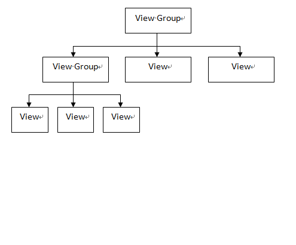

# Android UI组件使用及分析（1501211017 杨宗睿）

姓名：杨宗睿

学号：1501211017

专业：软件工程

# 1Android 用户界面设计

## 1.1 用户界面设计概述
随着移动互联网技术的发展，智能手机越来越普及。伴随着开发成本的降低以及技术的进步，越来越多的人进入Android程序开发行业。有数据显示，Android系统的市场占有率也居高不下，预示着Android系统的可用性在逐步提高，智能手机越来越离不开Android系统。

作为Android程序开发者，在开发程序时不光要注重程序功能的设计，同时还要关注用户界面的开发。UI，即用户界面设计，主要功能是为用户提供人机交互的界面。如何设计可以吸引更多新用户以及可以给用户带来方便、愉快，让用户满意的界面已经成为软件设计与开发人员深入研究的主题。

## 1.2	 视图组件与容器组件
Android给开发人员提供了大量功能丰富的组件，在进行界面开发时开发者只需要将不同功能的组件进行组合即可实现大部分功能。Android界面最主要的功能除了为用户展示可视化的数据，还有一个重要的功能就是相应用户的动作，例如键盘输入和手指触摸。为了实现上述功能，Android还使用事件响应机制以确保界面能够相应用户的交互操作。

通过查阅Android文档可知，AndroidUI组件主要存放于Android.view以及Android.weight包中，如图1所示：

**图1 图形用户界面的组件层次**
Android的所有UI组件都是View类的子类，类似于Java界面设计Java.Swing中的JPanel，表示了一个矩形的空白区域。特别指出的是View类中的ViewGroup子类，它的主要作用是为其他的组件提供容器来管理下一层的View和ViewGroup组件，它也可以被当作View使用。由图可知，ViewGroup作为其他组件的容器，不仅仅可以包含其它的View组件，还可以继续包含ViewGroup组件。

View定义了绘制界面的基本操作，基本以下三个函数完成：

1)	measure（）：主要用于计算包括视图的高度（height）、宽度（width）；

2)	layout（）：主要用于确定视图在屏幕上的位置。通过调用setFrame（top，bottom，left，right）方法来设置当前视图位于父视图的位置坐标，其参数为父视图矩形区域的四条边的坐标；

3)	draw（）：该方法主要用于将视图显示到屏幕上，其参数为measure（）以及layout（）方法得到的参数，当该方法执行后视图的绘制工作即完成。

## 1.3	 常见的UI组件简介

对于开发者来说，在界面设计开发阶段最常用的UI组件包括布局管理器、TextView和ImageView等。

