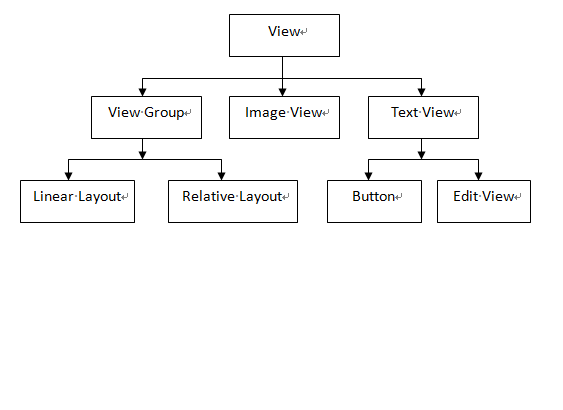
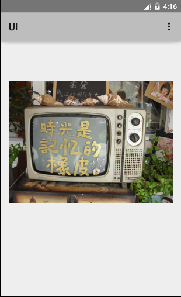

# Android UI组件使用及分析（1501211017 杨宗睿）

姓名：杨宗睿

学号：1501211017

专业：软件工程

# 1Android 用户界面设计

## 1.1 用户界面设计概述
随着移动互联网技术的发展，智能手机越来越普及。伴随着开发成本的降低以及技术的进步，越来越多的人进入Android程序开发行业。有数据显示，Android系统的市场占有率也居高不下，预示着Android系统的可用性在逐步提高，智能手机越来越离不开Android系统。

作为Android程序开发者，在开发程序时不光要注重程序功能的设计，同时还要关注用户界面的开发。UI，即用户界面设计，主要功能是为用户提供人机交互的界面。如何设计可以吸引更多新用户以及可以给用户带来方便、愉快，让用户满意的界面已经成为软件设计与开发人员深入研究的主题。

## 1.2	 视图组件与容器组件
Android给开发人员提供了大量功能丰富的组件，在进行界面开发时开发者只需要将不同功能的组件进行组合即可实现大部分功能。Android界面最主要的功能除了为用户展示可视化的数据，还有一个重要的功能就是相应用户的动作，例如键盘输入和手指触摸。为了实现上述功能，Android还使用事件响应机制以确保界面能够相应用户的交互操作。

通过查阅Android文档可知，AndroidUI组件主要存放于Android.view以及Android.weight包中，如图1所示：


图1 图形用户界面的组件层次

Android的所有UI组件都是View类的子类，类似于Java界面设计Java.Swing中的JPanel，表示了一个矩形的空白区域。特别指出的是View类中的ViewGroup子类，它的主要作用是为其他的组件提供容器来管理下一层的View和ViewGroup组件，它也可以被当作View使用。由图可知，ViewGroup作为其他组件的容器，不仅仅可以包含其它的View组件，还可以继续包含ViewGroup组件。

View定义了绘制界面的基本操作，基本以下三个函数完成：

1)	measure（）：主要用于计算包括视图的高度（height）、宽度（width）；

2)	layout（）：主要用于确定视图在屏幕上的位置。通过调用setFrame（top，bottom，left，right）方法来设置当前视图位于父视图的位置坐标，其参数为父视图矩形区域的四条边的坐标；

3)	draw（）：该方法主要用于将视图显示到屏幕上，其参数为measure（）以及layout（）方法得到的参数，当该方法执行后视图的绘制工作即完成。


## 1.3	 常见的UI组件简介

对于开发者来说，在界面设计开发阶段最常用的UI组件包括布局管理器、TextView和ImageView等。



图2 UI继承关系图

由上图可知，虽然所有的UI组件都是View类的子类，但是有些是直接继承View类，有些则是经过了多次的继承。例如ViewGroup和ImageView都是直接继承自View控件，而Button和EditView则是继承自TextView，而TextView继承自View。

本文首先介绍一下这三个UI组件的相关功能。


### 1.3.1	布局管理器

Android提供了布局管理器来管理Android用户界面中的各种组件。开发者可以通过使用布局管理器来管理组件的位置和大小，而不是直接设置界面组件的大小和位置，从而实现用户界面的平台无关性。下面介绍一下布局管理器中常用的四种基本布局：

1)	LinearLayout：线性布局，通过使用线性布局可以将界面上的各个控件按照线性进行排列。在使用过程中可以通过设置android:orientation属性来改变排列的方向，vertical代表的是垂直排列，horizontal代表的是水平排列。

2)	RelativeLayout：相对布局，通过相对定位的方式是控件出现的布局的任何位置。开发者可以使用如下属性设置控件相对于父布局的位置。

	android:alignParentTop：和父布局上对齐；
	
	android:alignParentBottom：和父布局上对齐；
	
	android:alignParentLeft：和父布局左对齐；
	
	android:alignParentRight：和父布局右对齐。
	
当然，RelativeLayout也提供了一组相对于控件的对齐方式，使用该组对齐方式时需要指定相对控件的id：

	android:layout_above：使一个控件位于另一个控件的上方；
	android:layout_toLeftOf：使一个控件位于另一个控件的左方；
	android:layout_toRightOf：使一个控件位于另一个控件的右方。


除此之外，RelativeLayout也提供了一组相对于控件边缘的对齐方式，使用该组对齐方式时也需要指定相对控件的id：

	android:layout_alignLeft：使一个控件的左边缘和另一个控件的左边缘对齐；
	android:layout_alignRight：使一个控件的右边缘和另一个控件的右边缘对齐；
	android:layout_alignTop：使一个控件的上边缘和另一个控件的上边缘对齐；
	android:layout_alignBottom：使一个控件的下边缘和另一个控件的下边缘对齐。
	
3)	FrameLayout：所有的控件都会按照添加的顺序叠放在布局的左上角。

4)	TableLayout：通过表格的方式来排列控件，属性如下：

	TableRow：控件，表示增加一行，在其中每增加一个控件就是增加了一列；
	android:layout_span：表示控件可以占据多行空间；
	android:stretchColumns：允许将TableRow中的某一列进行拉伸，自适应屏幕的宽度，如果将值设为0，表示将第一列拉伸；设为1表示将第二列拉伸，依次类推。
	

### 1.3.2	TextView类及其子类

由图2可知，TextView直接继承了View类，而它同时又是EditText以及Button两个组件实现的父类。它的作用相当于文本编辑器，但是Android没有实现其编辑文本框的功能，只用于在界面上显示文本；如果需要对文本框进行编辑，则需要使用EditText类。其主要功能及属性介绍如下：

1)	TextView：主要作用就是在界面上显示一段文本信息，属性如下：

	android:layout_height：指定控件的高度，参数为match_parent以及wrap_parent，前者表示的是让当前的大小和父布局的大小一样，即由父布局的大小决定当前控件的大小；后者表示的是当前控件的大小刚好能够包含里面的内容，及由控件内容决定当前控件的大小；
	android:layout_width：指定控件的宽度；
	android:gravity：用于指定文字的对齐方式，值分别为：content，top，bottom，left，right；
	android:textSize：用于指定文字的大小；
	android:textColor：用于指定文字的颜色。
	
2)	Button：主要用于实现和用户进行交互的按钮控件，在使用时要在MainActivity中为其添加一个监听器，以便为用户点击屏幕做出反应。实现代码如图3、图4所示：

```
public class MainActivity extends Activity {
    public static final String TAG = "MainActivity";

    @Override
    protected void onCreate(Bundle savedInstanceState) {
        DisplayMetrics metrics =new DisplayMetrics();
        getWindowManager().getDefaultDisplay().getMetrics(metrics);
        int width = metrics.widthPixels;
        int height  = metrics.heightPixels;
        float density = metrics.density;
        int densityDpi = metrics.densityDpi;
        Log.e(TAG,"width="+width+";height="+height+";density="+density+";densityDpi="+densityDpi);
        super.onCreate(savedInstanceState);
        Log.d(TAG, "onCreate");
        requestWindowFeature(Window.FEATURE_NO_TITLE);
        setContentView(R.layout.activity_main);
        //实现监听器
        Button startNormalActivity = (Button)findViewById(R.id.start_normal_activity);
        Button startDialogActivity = (Button)findViewById(R.id.start_dialog_activity);
        startNormalActivity.setOnClickListener(new View.OnClickListener() {
            @Override
            public void onClick(View v) {
                Intent intent = new Intent(MainActivity.this, NormalActivity.class);
                intent.putExtra("name", "zhang");
                intent.putExtra("age", 22);
                startActivity(intent);
            }
        });
        startDialogActivity.setOnClickListener(new View.OnClickListener() {
            @Override
            public void onClick(View v) {
                Intent intent = new Intent(MainActivity.this, DialogActivity.class);
                startActivity(intent);
            }
        });
    }
}
```

3)	EditText：该控件可以对用户的键盘输入的响应，即允许用户在控件里输入内容，并可以让程序对输入的数据进行处理，属性如下：

	android:hint：在初始时显示一段提示性文字；
	android:maxLines：指定EditText的最大行数，当输入的内容超过指定的最大行数时，文本数据会自动向上滚动。


### 1.3.3	ImageView

ImageView的主要功能是显示任何Drawable对象，开发人员可以使用android:src来指定图片的路径；由于事先不知道图片的大小，所以可以使用wrap_content来设定显示的高度和宽度。ImageView还派生了两个子类如下：

	ImageButton：实现图片按钮；
	QuickContactBadge：显示关联特定联系人的图片。
	

# 2	基于XML的界面实现


## 2.1 XML简介

XML，可扩展标记语言，设计用于传输和存储数据，而不是用来显示数据。由于是可扩展的标记语言，因此没有预定义任何标签，开发者可以自行定义任意的标签。

XML与HTML的设计区别是：XML被设计为传输和存储数据，其焦点是数据的内容。而HTML被设计用来显示数据，其焦点是数据的外观。HTML旨在显示信息，而XML旨在传输信息。

XML和HTML语法区别：HTML的标记不是所有的都需要成对出现，XML则要求所有的标记必须成对出现；HTML标记不区分大小写，XML则大小敏感,即区分大小写。


## 2.2	用户界面选用XML进行描述的优点

基于上述XML语言的特征可以发现用XML来描述用户界面有以下优点：

1)	XML语言具有平台无关性，并且有很多开发解析支持工具；

2)	XML语言具有良好的扩展能力，随着用户界面向多通道用户界面方向发展，通过界面进行人机交互的方式将会越来越多。由于其良好的扩展性，因此能够满足未来不断增加新内容的需求；

3)	XML描述的只是内容，但可以拥有不同的表现形式。将用户界面用XML进行统一描述，并不会使各种语言设计的用户界面失去个性。

由此看来，统一的用户界面描述方式不但没有束缚用户界面的设计，反而为今后界面开发的个性化铺平了道路。


## 2.3	在XML文件中使用资源

在XML文件中只要遵循以下的格式就可以访问资源：

@<资源对应的内部类的类名>/<资源项的名称>

例如，假设要访问app_name字符串资源中定义的“Hello World”字符串常量，可以使用如下形式来引用：
```
@string/app_name
```
但是，当开发者在XML文件中使用标识符时，因为这些资源无需使用专门的资源进行定义，所以可以直接在XML文件中按如下格式分配标识符：
```
@+id/<标识符代号>
```
例如，使用如下代码为一个组件分配标识符后就可以在程序中直接应用该组件。
```
android:id=”@+id/ok”
```
假如希望在程序中调用该组件，则可以通过调用Activity中的findViewById()方法实现。

假如希望在XML文件中获取该组件，则可以通过资源引用的方式来引用，语法如下：

```
@id/<标识符代号>
```


# 3	使用XML及Java混合控制UI界面

Android提供如下两种方法来开发用户界面：

	在XML文件中通过XML属性进行控制。
	通过调用Java方法来控制界面。
	
Android官方推荐使用第一种方法来控制界面。与使用XML布局文件控制UI界面相比，完全使用Java代码布局UI界面不仅繁琐，而且不利于解耦；而完全使用XML布局文件来控制UI界面虽然便捷但难免有失灵活。为了弥补两种方式的不足，开发者可以采用混合的方式来控制UI界面。

当采用混合的方式来开发界面时，习惯把变化小、行为比较固定的组件放在XML文件中，而那些变化较多，行为控制比较复杂的组件用Java控制。

首先，在XML文件中定义一个线性布局，代码如下：

```
<LinearLayout
    xmlns:android="http://schemas.android.com/apk/res/android"
    xmlns:tools="http://schemas.android.com/tools"
    android:layout_width="match_parent"
    android:layout_height="match_parent"
    android:paddingLeft="@dimen/activity_horizontal_margin"
    android:paddingRight="@dimen/activity_horizontal_margin"
    android:paddingTop="@dimen/activity_vertical_margin"
    android:paddingBottom="@dimen/activity_vertical_margin" 
    tools:context=".MainActivity"
    android:id="@+id/root"
    android:orientation="vertical">
</LinearLayout>
```
然后准备两张图片tv.jpg与sina.jpg，并添加到Drawable文件中；接下来在MainActivity类中获取线性容器，设置ImageView组件，并添加到线性布局容器，设置点击监听器，当点击屏幕时会实现切换图片的功能，代码如下：

```
public class MainActivity extends Activity {
    //定义一个访问图片的数组
    int[] images = new int[]{
            R.drawable.sina,
            R.drawable.tv,};
    int currentImg = 0;
    @Override
    protected void onCreate(Bundle savedInstanceState) {
        super.onCreate(savedInstanceState);
        setContentView(R.layout.activity_main);
        //获取LinearLayout布局容器
        LinearLayout main = (LinearLayout) findViewById(R.id.root);
        //创建ImageView组件
        final ImageView image = new ImageView(this);
        //将ImageView组件添加到LinearLayout布局容器中
        main.addView(image);
        //初始化时显示第一张图片
        image.setImageResource(images[0]);
        image.setOnClickListener(new View.OnClickListener() {
            @Override
            public void onClick(View v) {
                //改变ImageView里显示的图片
                image.setImageResource(images[++currentImg%images.length]);
            }
        });
    }
}
```

运行程序，程序初始化界面如图5所示：



图3 混合控制布局初始化界面


图4 切换后效果


# 4	创建自定义控件


## 4.1 引入自定义布局

在开发过程中，如果开发人员希望创建自己的自定义标题栏，并且在很多个界面上都希望使用这样的标题栏，为了避免代码重复，可以使用引入布局的方式实现。

首先，新建自定义布局文件title.xml，然后在activity_main.xml中使用include语句将标题栏布局引进即可，代码如下：


```<LinearLayout
    xmlns:android="http://schemas.android.com/apk/res/android"
    xmlns:tools="http://schemas.android.com/tools"
    android:layout_width="match_parent"
    android:layout_height="match_parent"
    <include layout=”@layout/title”/>
</LinearLayout>
```
最后，在MainActivity中将系统自带的标题栏隐藏，代码如下：

```
public class MainActivity extends Activity {
    @Override
    protected void onCreate(Bundle savedInstanceState) {
        super.onCreate(savedInstanceState);
        requestWindowFeature(Window.FEATURE_NO_TITLE);
        setContentView(R.layout.activity_main);
    }
}
```

## 4.2	创建自定义控件

由上可知，在引入自定义布局后，开发者可以针对布局中的控件创建自定义控件，从而避免在每个活动中都为这些控件单独编写一次事件注册的代码，例如返回按钮，在所有的活动中的功能都是相同的，在这里即可使用自定义控件的方式解决。

新建TitleLayout继承自LinearLayout，让它成为自定义标题栏的控件，代码如下：

```
public class TitleLayout extends LinearLayout{
    public TitleLayout(Context context,AttributeSet attrs){
    super(context,attrs);
    LayoutInflater.from(context).inflate(R.layout.title,this);
    }
}
```

通过代码可知，首先需要重写LinearLayout中带有两个参数的构造函数，在布局引用这个TitleLayout控件就会调用这个构造函数。在动态加载的过程中，通过LayoutInflater的from()方法可以构件出一个LayoutInflater对象，后调用inflate()方法就可以动态加载一个布局文件，在该方法中，第一个参数是要加载的布局文件，第二个参数是给加载好的布局文件添加父布局，可以指定为TitleLayout本身，即this。

在布局文件中添加这个空间，代码如下：

```<LinearLayout
    xmlns:android="http://schemas.android.com/apk/res/android"
    xmlns:tools="http://schemas.android.com/tools"
    android:layout_width="match_parent"
    android:layout_height="match_parent"
    <pku.ss.yzr.ui.TitleLayout
        android:layout_width="match_parent"
        android:layout_height="wrap_parent"></ pku.ss.yzr.ui.TitleLayout >
</LinearLayout>
```
这里需要注意的是不可省略包名与类名。

为标题栏中的按钮注册点击事件，修改代码如下：

```
public class TitleLayout extends LinearLayout{
    public TitleLayout(Context context,AttributeSet attrs){
    super(context,attrs);
    LayoutInflater.from(context).inflate(R.layout.title,this);
    Button titleback = (Button)findViewById(R.layout.title_back);//得到实例
    titleback. setOnClickListener(new View.OnClickListener() {
            @Override
            public void onClick(View v) {
                ((Activity)getContext()).finish();//销毁掉当前的活动
            }
        });
    }
}
```

# 5 小结

在装载有Android系统的智能移动设备迅速占领移动市场的同时，应用程序是否有良好的人机交互界面成为用户关注的焦点，良好的人机交互可以大大提高系统的可用性。在Android界面的设计过程中具有强大功能的各类组件的支持以及XML技术的高可扩展性使得界面设计与开发变得更加快捷方便，同时伴随着技术的发展以及正常的不断提高，程序开发人员还应关注更深层次的开发技术，使得界面可以给用户带来更好的用户体验！


