# Android Universal Image Loader解析

# 

## Universal Image Loader简介

Android Universal Image Loader，简称UIL，是Github上一个使用非常广泛的图片异步加载库，为我们提供了全面的图片异步加载解决方案，且性能良好，因此得到了广泛的使用。
相信做过Android应用开发的同学都知道，Android在加载大量图片时很容易出现Out Of Memory（内存溢出）异常。这是因为系统分配给图片加载的内存大小有限，所以如果加载图片量非常大的话会报OOM异常。当然，关于这个异常有很多的解决方案，这里想给大家介绍一下UIL这个开源项目的解决方案。

# 

UIL的主要功能
1. 
提供多线程下载图片。图片可以来源于网络、文件系统、项目文件夹assets中以及drawable中等
1. 
可以根据需要进行图片加载（ImageLoader）的相关配置。例如，线程池、图片下载器、内存缓存策略、硬盘缓存策略、图片显示选项以及其他的一些配置
1. 
支持图片的多种缓存方式。包括内存缓存、文件系统缓存和SD卡缓存三种缓存图片方式
1. 
对图片的下载过程进行监听
1. 
跟据控件（ImageView）的大小对Bitmap（位图）进行裁剪，以减少Bitmap占用过多的内存
1. 
能够对图片的加载过程进行控制。如暂停图片加载、重新开始加载图片等
1. 
提供在较慢的网络下对图片进行加载的方式

## 

## UIL总体架构

UIL主要由五部分构成，分别为ImageLoaderEngine、Cache（MemoryCache和DiskCache）、ImageDownloader、ImageDecoder、BitmapDisplayer以及BitmapProcessor，具体见下图。

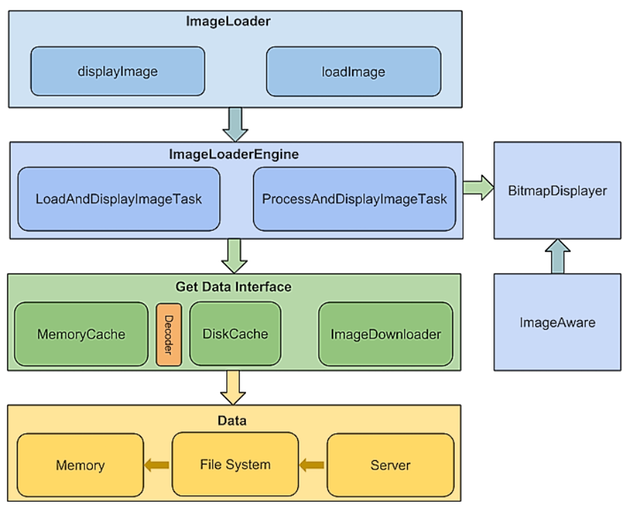

# 

由上图可以看出UIL的处理流程：
1. 
ImageLoader收到加载及显示图片的任务，并将任务提交给ImageLoaderEngine；
1. 
ImageLoaderEngine分发任务到具体的线程池去执行；
1. 
任务通过Cache及ImageDownloader获取图片。根据情况，中间可能需要BitmapProcessor和ImageDecoder处理，最终转换为Bitmap交给BitmapDisplayer在ImageAware中显示。
1. 
每一个图片的加载和显示任务都运行在独立的线程中除非这个图片缓存在内存中，这种情况下图片会立即显示。如果需要的图片缓存在本地，他们会开启一个独立的线程队列。如果在缓存中没有正确的图片，任务线程会从线程池中获取，因此，快速显示缓存图片时不会有明显的障碍。

## 

## UIL中主要模块简介

* 
ImageLoaderEngine：
任务分发器，负责分发LoadAndDisplayImageTask和ProcessAndDisplayImageTask给具体的线程池去执行
* 
ImageAware:显示图片对象，可以使ImageView等。
* 
ImageDownloader：图片下载器，负责从图片的各个来源获取输入流。
* 
Cache：图片缓存，主要分为MemoryCache和DiskCache两部分。
* 
MemoryCache：内存图片缓存，可以向内存缓存图片或从内存缓存中读取图片。
* 
DiskCache：本地图片缓存，可向本地磁盘缓存保存图片或从本地磁盘读取图片。
* 
ImageDecoder：图片解码器，负责将图片输入流InputStream转换为Bitmap对象。
* 
BitmapProcessor：图片处理器，负责从缓存读取或写入前对图片进行处理。
* 
BitmapDisplayer：将Bitmap对象显示在相应的控件ImageAware上。
* 
LoadAndDisplayImageTask：用于加载并显示图片的任务。
* 
ProcessAndDisplayImageTask：用于处理并显示图片的任务。
* 
DisplayBitmapTask：用于显示图片的任务。

## 

## UIL图片缓存及加载流程
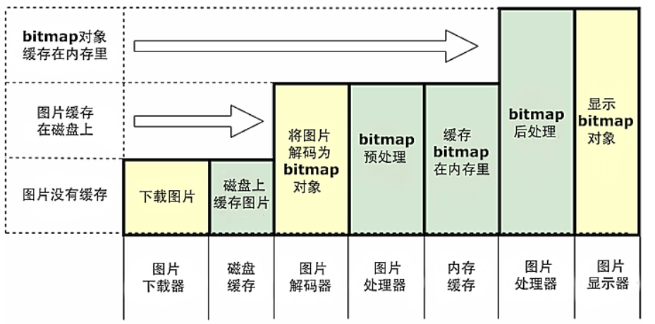
如上图所示，对需要的图片首先到内存中查找。如果存在与内存中，则首先根据需要通过图片处理器来对想要加载的bitmap进行后期处理，然后通过图片显示器来显示bitmap对象。
如果需要的bitmap不再内存中，则会去磁盘上查找。如果存在于磁盘中，则对图片进行解码、 预处理、缓存到内存中。如果不存在于磁盘中，则意味着图片没有被缓存，需要去相应的链接地址下载，然后根据需要进行缓存。

## 
## UIL图片缓存机制
UIL中缓存机制的主体有三个，分别是UI、缓存模块和数据源（网络），他们之间的关系如下图所示：
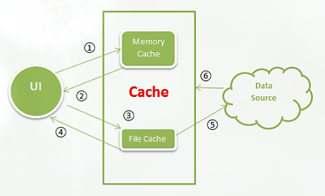
1. 
UI：请求数据，使用唯一的Key值索引Memory Cache中的Bitmap。
1. 
内存缓存：缓存索引，如果能找到Key值对应的Bitmap，则返回数据。否则执行第三步。
1. 
硬盘存储：使用唯一的Key值对应的文件名，检索SDCard上的文件。
1. 
如果有对应的文件，使用BitmapFactory.decode*方法，解码Bitmap并返回数据，同时将数据写入缓存。如果没有对应文件，执行第五步。
1. 
下载图片：启动异步线程，从数据源下载数据（Web）
1. 
若下载成功，将数据同时写入磁盘和缓存，并将Bitmap显示在UI中。

# 

### UIL内存缓存机制
1. 
强引用缓存:
LruMemoryCache 开源框架默认的内存缓存类，缓存的是Bitmap的强引用
1. 
强引用和弱引用相结合的缓存：
UsingFreqLimitedMemoryCache：如果缓存额图片总量超过限定值，先删除使用频率最小的Bitmap；
LRULimitedMemoryCache：使用lru算法，与LruMemroyCache不同的是，他缓存的是Bitmap的弱引用
FIFOLimitedMemoryCache：先进先出缓存策略。当超过设定值，先删除最先加入缓存的Bitmap。
LargestLimitedMemoryCache：删除最大的Bitmap对象
LimitedAgeMemeoryCache：当Bitmap加入缓存中的时间超过我们设定的值，将其删除
1. 
弱引用缓存
WeakMemoryCache：缓存Bitmap的总大小没有限制，唯一不足的地方就是不稳定，缓存的图片容易被回收掉。

在这里，我们主要介绍UIL的默认内存缓存 --强引用缓存LruMemoryCache。

# 

# LruMemoryCache解析

LruMemoryCache，一种使用强引用来保存有数量限制的Bitmap的缓存。每次Bitmap被访问时，它就被移动到一个队列的头部。当Bitmap被添加到一个空间已满的缓存中时，在队列末尾的Bitmap会被挤出去，并变成适合被GC（Garbage Collection，垃圾回收）回收的状态。因此，该缓存机制在空间有限的情况下，保留的是最近使用过的Bitmap。那么LruMemoryCache又是如何实现该机制呢？

LruMemoryCache算法使用的是LRU算法，即Least Recently Used，近期最少使用算法，通过分析源码我们可以知道该机制的实现是通过基于双链表结构的LinkedHashMap实现的，因此这里我们介绍一下LinkedHashMap的get()、put()方法对LRU算法的具体实现。

LinkedHashMap维护着一个运行于所有条目的双重链接列表，此链接列表定义了迭代顺序，该迭代顺序可以是插入顺序或者是访问顺序。LinkedHashMap通过accessOrder属性来控制迭代顺序，accessOrder值为true，表示按照访问顺序迭代，则在调用get方法后，会将这次访问的元素移至链表尾部，不断访问可以形成按访问顺序排序的链表；若accessOrder值为false，则默认是按插入顺序排序。

因此，当accessOrder的值为“true”时，LinkedHashMap中的get()方法返回所匹配的值，并且在返回前还会将所匹配的key对应的entry调整在列表中的顺序，让其处于列表的最后。其实现源码如下图所示。
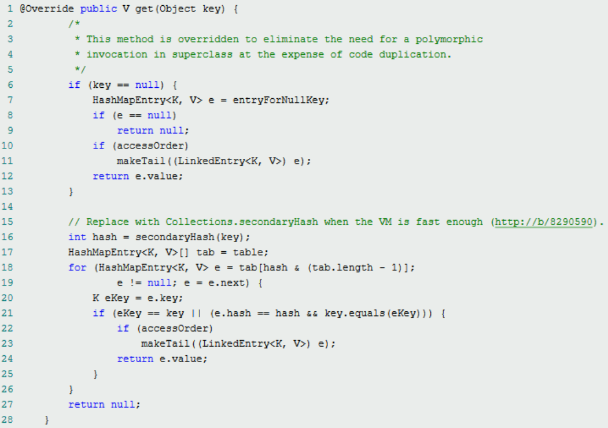

LruMemoryCache的缓存实现方法我们已经了解了，在LinkedHashMap.get()方法执行后，LinkedHashMap中entry的顺序会得到调整，那又如何保证最近使用的项不会被删除呢？接下来我们来看LinkedHashMap.put()方法的实现原理。

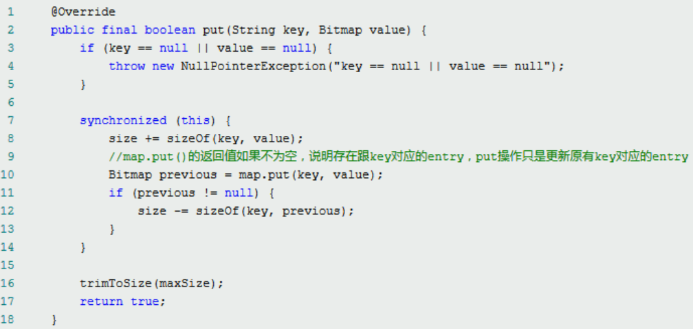

从上图的put()方法方法我们可以看出，其核心在于trimToSize(maxSize)方法，通过该方法来实现用户限定的缓存大小。由于调用put()方法，插入的Bitmap都是位于双链表的尾部，而调用get()方法后，最近被使用的Bitmap也会移动到双链表的尾部，可以看出最新被使用的Bitmap都位于LinkedHashMap双链表的尾部，因此当缓存达到最大上限时，在trimToSize()方法中，只需遍历一下双链表，将头部的元素删除，直到满足要求即可。其具体实现源码如下图所示。其中toEvict即为多余（长时间不被访问）需要被删除的项。

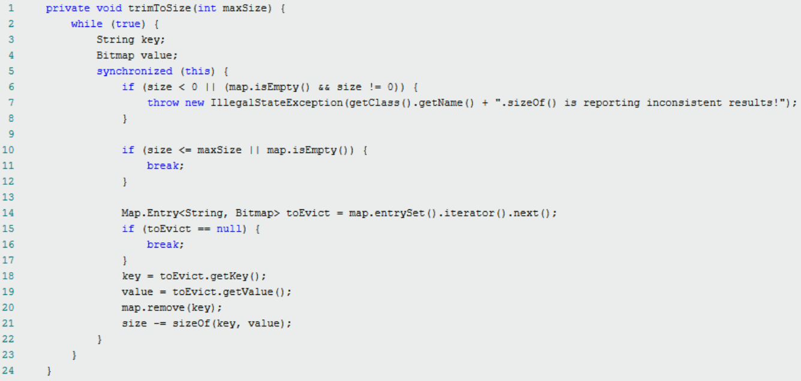

下面我们以图示的方式更详细的介绍一下LruMemoryCache实现保存最新被访问元素的过程。在这里为了方便起见，我们假设内存缓存设置的阈值只够存储两个Bitmap对象，当put第三个Bitmap对象时，将近期最少使用的Bitmap对象移除。

1. 
首先初始化LinkedHashMap，并设定按照访问顺序来排序，即accessOrder=“true”。
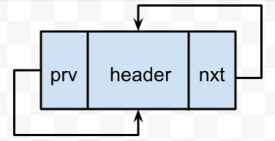

1. 
调用put()方法，向缓存池中放入bitmap1和bitmap2两个对象。
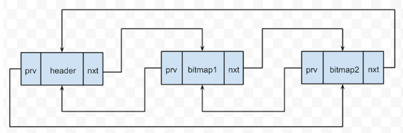

1. 
继续放入第三个bitmap3，根据假设，将会超过用户设定的缓存池阈值。
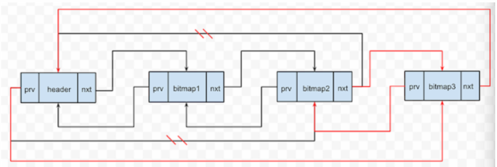

1. 
释放对bitmap1对象的引用，即释放最少被访问使用的bitmap对象。
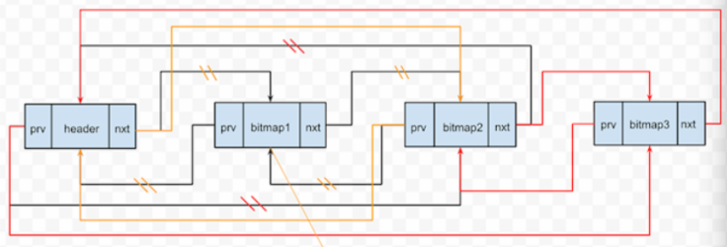

1. 
bitmap1对象被GC回收。
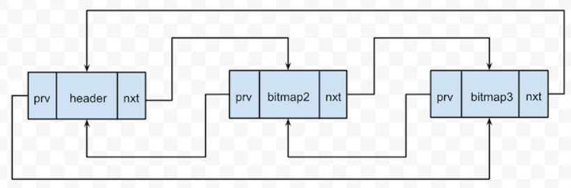

### UIL磁盘缓存机制
例如新浪微博这种应用需要加载很多图片，本身加载图片的时间就比较慢，如果每次打开应用后都需要重新下载图片，我相信不仅因为花费大量的流量的原因，用户等待的时间过长，这一很差的用户体检就会使应用丢掉很多用户。因此，对于图片很多的应用，一个好的磁盘缓存直接决定了应用在用户手机的存留时间。如果我们自己实现磁盘缓存，要考虑很多因素，实现起来很麻烦，因此UIL为我们提供了几种常见的磁盘缓存策略。当然，也可以根据自身需要进行扩展。
* 
FileCountLimitedDiscCache：可以设定缓存图片额个数，当超过设定值，删除最先加入到硬盘的文件。
