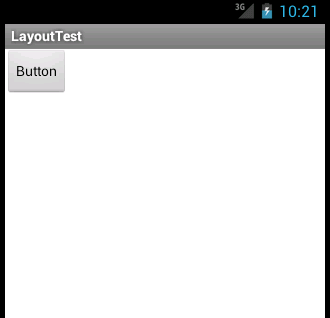
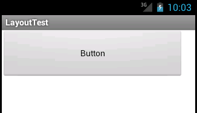
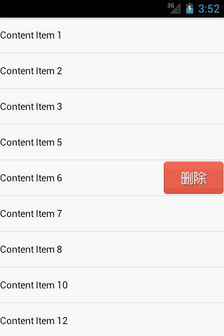

# Android View解析(1501210892 丁文玲)

本篇从LayoutInflater原理解析以及Android如何自定义View两个方面来讲解Android View解析，首先我们讲一下LayoutInflater的原理。

## 一：LayoutInflater原理解析

LayoutInflater主要是用来进行加载布局的，它的基本用法非常简单，首先我们要做的就是获取到LayoutInflater的实例，有以下两种方式可以：第一种代码如下：

```LayoutInflater layoutInflater = LayoutInflater.from(context);```

除此之外，还有另外一种方法
```LayoutInflater layoutInflater = (LayoutInflater) context
		.getSystemService(Context.LAYOUT_INFLATER_SERVICE);```

其实两种方法的本质相同，只不过第一种是第二种的简单写法，在我们得到实例之后，就可以调用它里面的inflate（）方法来加载布局，代码如下：

```layoutInflater.inflate(resourceId, root);```

这里面有两个参数，第一个参数的含义是我们要加载的那个布局的id，第二个参数的含义是为该布局嵌套的父布局，如果第二个参数不需要的就传null，通过以上方式我们就建立了一个布局的实例，之后我们再指定位置把它添加进去就可以显示出来了。
下面我们通过一个例子来说明：

建立一个布局文件activity_main.xml，代码如下：
```
<LinearLayout xmlns:android="http://schemas.android.com/apk/res/android"
    android:id="@+id/main_layout"
    android:layout_width="match_parent"
    android:layout_height="match_parent" >
</LinearLayout>
```
由代码看到，这个布局文件的内容是非常简单的，除了一个空的LinearLayout，其余什么都没有，所以界面上不会显示东西。
然后我们定义一个button_layout.xml，代码如下：
```
<Button xmlns:android="http://schemas.android.com/apk/res/android"
    android:layout_width="wrap_content"
    android:layout_height="wrap_content"
    android:text="Button" >
</Button>```

我们看到这个布局文件也是非常简单，就仅仅有一个Button的按钮，现在我们要做的是想办法，如何将button_layout添加到LinearLayout里面，根据以上我们所介绍的用法，修改MainActivity里面的代码，修改后的代码如下：
```
public class MainActivity extends Activity {
	private LinearLayout mainLayout;
	@Override
	protected void onCreate(Bundle savedInstanceState) {
		super.onCreate(savedInstanceState);
		setContentView(R.layout.activity_main);
		mainLayout = (LinearLayout) findViewById(R.id.main_layout);
		LayoutInflater layoutInflater = LayoutInflater.from(this);
		View buttonLayout = layoutInflater.inflate(R.layout.button_layout, null);
		mainLayout.addView(buttonLayout);
	}
}```

由以上代码，我们可以看到，首先是获取到了LayoutInflater的实例，然后我们调用它的Inflate（）方法来加载button_layout，最后调用LinearLayout的addView（）来把它加到LinearLayout里面，运行结果如下图表示：



可以通过上图看到，Button在界面上显示出来了，然后我们从源码的角度来看一下LayoutInflater的工作机制。不论我们使用的是哪个inflate（）方法的重载，最后都会调用以下代码：

```
public View inflate(XmlPullParser parser, ViewGroup root, boolean attachToRoot) {
    synchronized (mConstructorArgs) {
        final AttributeSet attrs = Xml.asAttributeSet(parser);
        mConstructorArgs[0] = mContext;
        View result = root;
        try {
            int type;
            while ((type = parser.next()) != XmlPullParser.START_TAG &&
                    type != XmlPullParser.END_DOCUMENT) {
            }
            if (type != XmlPullParser.START_TAG) {
                throw new InflateException(parser.getPositionDescription()
                        + ": No start tag found!");
            }
            final String name = parser.getName();
            if (TAG_MERGE.equals(name)) {
                if (root == null || !attachToRoot) {
                    throw new InflateException("merge can be used only with a valid "
                            + "ViewGroup root and attachToRoot=true");
                }
                rInflate(parser, root, attrs);
            } else {
                View temp = createViewFromTag(name, attrs);
                ViewGroup.LayoutParams params = null;
                if (root != null) {
                    params = root.generateLayoutParams(attrs);
                    if (!attachToRoot) {
                        temp.setLayoutParams(params);
                    }
                }
                rInflate(parser, temp, attrs);
                if (root != null && attachToRoot) {
                    root.addView(temp, params);
                }
                if (root == null || !attachToRoot) {
                    result = temp;
                }
            }
        } catch (XmlPullParserException e) {
            InflateException ex = new InflateException(e.getMessage());
            ex.initCause(e);
            throw ex;
        } catch (IOException e) {
            InflateException ex = new InflateException(
                    parser.getPositionDescription()
                    + ": " + e.getMessage());
            ex.initCause(e);
            throw ex;
        }
        return result;
}
}```

从以上代码我们可以发现，其实LayoutInflater就是用的Android的Pull的解析方式对文件进行解析。在上面的代码中，其中调用了createViewFromTag（）这个方法，把节点名和参数传了进去，。这个方法是是根据节点的名字来创建View对象。这里我们只是创建除了一个根布局的实例，然后我们会调用rInflate（）方法进行遍历。代码如下：
```
private void rInflate(XmlPullParser parser, View parent, final AttributeSet attrs)
        throws XmlPullParserException, IOException {
    final int depth = parser.getDepth();
    int type;
    while (((type = parser.next()) != XmlPullParser.END_TAG ||
            parser.getDepth() > depth) && type != XmlPullParser.END_DOCUMENT) {
        if (type != XmlPullParser.START_TAG) {
            continue;
        }
        final String name = parser.getName();
        if (TAG_REQUEST_FOCUS.equals(name)) {
            parseRequestFocus(parser, parent);
        } else if (TAG_INCLUDE.equals(name)) {
            if (parser.getDepth() == 0) {
                throw new InflateException("<include /> cannot be the root element");
            }
            parseInclude(parser, parent, attrs);
        } else if (TAG_MERGE.equals(name)) {
            throw new InflateException("<merge /> must be the root element");
        } else {
            final View view = createViewFromTag(name, attrs);
            final ViewGroup viewGroup = (ViewGroup) parent;
            final ViewGroup.LayoutParams params = viewGroup.generateLayoutParams(attrs);
            rInflate(parser, view, attrs);
            viewGroup.addView(view, params);
        }
    }
    parent.onFinishInflate();
}```

如果我们想要把例子中的按钮调大一些，应该怎么办？
先改动代码如下：
```
<Button xmlns:android="http://schemas.android.com/apk/res/android"
    android:layout_width="300dp"
    android:layout_height="80dp"
    android:text="Button" >
</Button>
```
但是上面的代码并没有效果，因为layout_width和layout_height已经失去了作用，要想起作用，首先View必须要在一个布局里面，这样的话就起作用了。
接下来我们再来看一下button_layout.xml，可以看到Button现在不属于任何一个布局，所以layout_width和layout_height没有任何作用，那么如何让它们起作用呢？最简单的方法就是在这个Button外面再嵌套一层布局，代码如下：
```
<RelativeLayout xmlns:android="http://schemas.android.com/apk/res/android"
    android:layout_width="match_parent"
    android:layout_height="match_parent" >
    <Button
        android:layout_width="300dp"
        android:layout_height="80dp"
        android:text="Button" >
    </Button>
</RelativeLayout>```

由代码可以看到，我们添加了一个RelativeLayout，现在Button在这个RelativeLayout的里面，ayout_width和layout_height这两个属性也就起作用了，但是，处于最外层的RelativeLayout，它的这两个参数也就失去了作用。现在我们运行下程序，结果如下：



现在按钮放大了，但是我们注意到平时的实践中，最外层的布局是可以指定大小的，layout_width和layout_height都是有作用的，原因是什么呢？因为在我们的平时实践中，Android会自动在布局文件的最外层再加一层FrameLayout，所以layout_width和layout_height才会起作用。
到这里关于LayoutInflater原理解析我们就讲完了，下面介绍下Android如何自定义View

## 二：Android如何自定义View

关于Android如何自定义View，我们按类型分为以下几种：自绘控件，组合控件，继承控件。下面依次讲一下每一种控件是如何实现的。

### 一：自绘控件

此类控件的意思是View上面的内容是由我们定义的，把内容写到onDraw()里面。首先我们来定义一个计数器View，它能够对用户发出的点击事件来进行响应，而且可以记录到总点击的次数。我们新建CounterView，它继承View：
```
public class CounterView extends View implements OnClickListener {

	private Paint mPaint;
	
	private Rect mBounds;

	private int mCount;
	
	public CounterView(Context context, AttributeSet attrs) {
		super(context, attrs);
		mPaint = new Paint(Paint.ANTI_ALIAS_FLAG);
		mBounds = new Rect();
		setOnClickListener(this);
	}

	@Override
	protected void onDraw(Canvas canvas) {
		super.onDraw(canvas);
		mPaint.setColor(Color.BLUE);
		canvas.drawRect(0, 0, getWidth(), getHeight(), mPaint);
		mPaint.setColor(Color.YELLOW);
		mPaint.setTextSize(30);
		String text = String.valueOf(mCount);
		mPaint.getTextBounds(text, 0, text.length(), mBounds);
		float textWidth = mBounds.width();
		float textHeight = mBounds.height();
		canvas.drawText(text, getWidth() / 2 - textWidth / 2, getHeight() / 2
				+ textHeight / 2, mPaint);
	}

	@Override
	public void onClick(View v) {
		mCount++;
		invalidate();
	}

}```

由以上代码，先在CounterView的构造函数里面把一些数据进行了初始化，然后给View注册了点击事件，经过以上处理，每次点击CounterView时，就会调用onClick()这个方法，然后重新绘制视图，所以随之也会调用onDraw()。因为CounterView是自绘视图，所以onDraw()方法中是最重要的代码，上面代码先把画笔颜色设为blue，随之调用drawRect()绘制矩形，它能看做是CounterView的背景图，然后又把画笔颜色设为yellow，用来在背景与上进行计数，要注意的是，首先要调用getTextBounds()获取文字的高度宽度，调用drawText（）来进行绘制。经过以上方法，我们就把一个自定义的View实现完成了。而且当前的CounterView是可以实现自动计数。接下来的问题就是怎么样才能把View在界面里面显示出来。我们在布局文件里面添加以下代码：
```
<RelativeLayout xmlns:android="http://schemas.android.com/apk/res/android"
    android:layout_width="match_parent"
    android:layout_height="match_parent" >
    <com.example.customview.CounterView
        android:layout_width="100dp"
        android:layout_height="100dp"
        android:layout_centerInParent="true" />
</RelativeLayout>```

由以上代码可以发现，我们是把CounterView放入了RelativeLayout里面，可以给CounterView指定一些属性，例如，可以用layout_width和layout_height定CounterView的宽度和高度。还可以用android:layout_centerInParent让它在布局里面居中进行显示。另外要注意，在使用之前一定要把自己定义的View的包名完全写出来，不然的话，系统就没有办法找到这个View。

### 二：组合控件

所谓组合控件，就是我们不需要自己写代码来定义绘制的诶荣，只需要用系统原生的东西就好，但我们可以做到把几个系统原生的控件组合在一起，这样就创建出来一个新的控件，我们称它为组合控件。我们举一个例子来说明，我们常见的一些组合控件例如标题栏，一般在标题栏上面会有标题内容和一个返回按钮，当我们点击这个返回按钮的时候，就会跳转到另一个界面。下面我们就用代码来实现这样一个标题栏来说明分析一下组合控件。
首先，新建一个布局文件，命名为title.xml，代码如下：
```
<?xml version="1.0" encoding="utf-8"?>
<RelativeLayout xmlns:android="http://schemas.android.com/apk/res/android"
    android:layout_width="match_parent"
    android:layout_height="50dp"
    android:background="#ffcb05" >
    <Button
        android:id="@+id/button_left"
        android:layout_width="60dp"
        android:layout_height="40dp"
        android:layout_centerVertical="true"
        android:layout_marginLeft="5dp"
        android:background="@drawable/back_button"
        android:text="Back"
        android:textColor="#fff" />
    <TextView
        android:id="@+id/title_text"
        android:layout_width="wrap_content"
        android:layout_height="wrap_content"
        android:layout_centerInParent="true"
        android:text="This is Title"
        android:textColor="#fff"
        android:textSize="20sp" />
</RelativeLayout>```

在上面这个布局文件里面，我们先是定义了一个背景布局RelativeLayout，随后就在这个背景布局里面定义了一个TextView，这个背景布局里面的Button就是标题栏里面的那个返回按钮，TextView就是标题栏里面要显示的那些文字内容。
然后我们再创建一个TitleView，它继承自FrameLayout，代码如下：
```
public class TitleView extends FrameLayout {

	private Button leftButton;

	private TextView titleText;

	public TitleView(Context context, AttributeSet attrs) {
		super(context, attrs);
		LayoutInflater.from(context).inflate(R.layout.title, this);
		titleText = (TextView) findViewById(R.id.title_text);
		leftButton = (Button) findViewById(R.id.button_left);
		leftButton.setOnClickListener(new OnClickListener() {
			@Override
			public void onClick(View v) {
				((Activity) getContext()).finish();
			}
		});
	}

	public void setTitleText(String text) {
		titleText.setText(text);
	}

	public void setLeftButtonText(String text) {
		leftButton.setText(text);
	}

	public void setLeftButtonListener(OnClickListener l) {
		leftButton.setOnClickListener(l);
	}

}```
在上面的TitleView里的构造方法中，我们是调用了LayoutInflater的inflate()方法用来加载title.xml布局。随后又调用findViewById()这个方法获取到了标题栏中返回按钮的实例。我们在它的onClick（）里面调用finish（）这个方法用来关闭当前的Activity，这样也就实现了按钮返回的功能。
此外，为了增强TitleView的扩展性，系统还提供了一些方法用来设置标题栏上面的文字，返回按钮上面的文字以及返回按钮的点击事件。这样，我们自己定义的标题栏也就完成了，下面就是如何引用的问题，方法是一样的，也就是在布局文件里面，添加以下的代码：
```

<RelativeLayout xmlns:android="http://schemas.android.com/apk/res/android"
    xmlns:tools="http://schemas.android.com/tools"
    android:layout_width="match_parent"
    android:layout_height="match_parent" >
    <com.example.customview.TitleView
        android:id="@+id/title_view"
        android:layout_width="match_parent"
        android:layout_height="wrap_content" >
    </com.example.customview.TitleView>
</RelativeLayout>```


这样我们就把标题栏控件成功地加入到了布局文件的里面，运行结果如图：


现在我们点击一下返回按钮，就可以将当前的Activity关闭，如果想要修改标题栏上面展示的文字，或者是修改back按钮的默认事件，就只需要在Activity里面调用findViewById()这个方法得到TitleView的实例，随之调用setTitleText（），setLeftButtonListener（）setLeftButtonText（）来进行设置就可以了。

### 三：继承控件

所谓继承控件就是我们不需要去重头开始实现一个完整的控件我们可以继承一个现有的，在这个控件的基础之上添加一个新的功能，然后我们就可以一个自己定义的新的控件，这种继承控件的特点就是不仅仅可以按照我们自己需要的来添加对应的功能，而且还可以保留被继承的那个控件原生的所有的功能。下面我们用一个例子来说明，对ListView进行扩展，在ListView的上面加上一个滑动可以显示删除的按钮，当我们点击这个按钮的时候就会删除对应的那一栏。
第一步，我们先准备一个删除按钮的布局文件，新建一个xml文件，代码如下：
```
<?xml version="1.0" encoding="utf-8"?>
<Button xmlns:android="http://schemas.android.com/apk/res/android"
    android:id="@+id/delete_button"
    android:layout_width="wrap_content"
    android:layout_height="wrap_content"
    android:background="@drawable/delete_button" >
</Button>```

然后我们给这个按钮指定一张删除的背景图，紧接着创建MyListView，它继承自ListView，代码如下：
```
public class MyListView extends ListView implements OnTouchListener,
		OnGestureListener {
	private GestureDetector gestureDetector;
	private OnDeleteListener listener;
	private View deleteButton;
	private ViewGroup itemLayout;
	private int selectedItem;
	private boolean isDeleteShown;
	public MyListView(Context context, AttributeSet attrs) {
		super(context, attrs);
		gestureDetector = new GestureDetector(getContext(), this);
		setOnTouchListener(this);
	}
	public void setOnDeleteListener(OnDeleteListener l) {
		listener = l;
	}
	@Override
	public boolean onTouch(View v, MotionEvent event) {
		if (isDeleteShown) {
			itemLayout.removeView(deleteButton);
			deleteButton = null;
			isDeleteShown = false;
			return false;
		} else {
			return gestureDetector.onTouchEvent(event);
		}
	}
	@Override
	public boolean onDown(MotionEvent e) {
		if (!isDeleteShown) {
			selectedItem = pointToPosition((int) e.getX(), (int) e.getY());
		}
		return false;
	}
	@Override
	public boolean onFling(MotionEvent e1, MotionEvent e2, float velocityX,
			float velocityY) {
		if (!isDeleteShown && Math.abs(velocityX) > Math.abs(velocityY)) {
			deleteButton = LayoutInflater.from(getContext()).inflate(
					R.layout.delete_button, null);
			deleteButton.setOnClickListener(new OnClickListener() {
				@Override
				public void onClick(View v) {
					itemLayout.removeView(deleteButton);
					deleteButton = null;
					isDeleteShown = false;
					listener.onDelete(selectedItem);
				}
			});
			itemLayout = (ViewGroup) getChildAt(selectedItem
					- getFirstVisiblePosition());
			RelativeLayout.LayoutParams params = new RelativeLayout.LayoutParams(
					LayoutParams.WRAP_CONTENT, LayoutParams.WRAP_CONTENT);
			params.addRule(RelativeLayout.ALIGN_PARENT_RIGHT);
			params.addRule(RelativeLayout.CENTER_VERTICAL);
			itemLayout.addView(deleteButton, params);
			isDeleteShown = true;
		}
		return false;
	}

	@Override
	public boolean onSingleTapUp(MotionEvent e) {
		return false;
	}
	@Override
	public void onShowPress(MotionEvent e) {

	}
	@Override
	public boolean onScroll(MotionEvent e1, MotionEvent e2, float distanceX,
			float distanceY) {
		return false;
	}
	@Override
	public void onLongPress(MotionEvent e) {
	}
	public interface OnDeleteListener {
		void onDelete(int index);
	}
}```
上面的代码在MyListView这个方法里面创建了一个实例：GestureDetector，此实例用于监听手势动作，随之我们给MyListView注册了touch的监听事件，然后我们在onTouch（）方法里面进行了判断，如果此时删除按钮已经显示，我们就把它给移除，如果没有显示，就调用GestureDetector来处理这个手势。当我们的手指按下的时候，就会调用OnGestureListener的onDown（）方法，然后可以通过pointToPosition（）这个方法用来判断当前我们选中的是ListView的哪一行，如果我们的手指滑动比较快的时候，这时候就会调用onFling（）这个方法，然后在这个方法里面去加载delete_button.xml这个布局文件，就把删除的按钮添加到我们当前选中的那一行item上面。需要注意的是，我们还在删除按钮上面添加了一个点击的事件，如果点击了删除按钮，就会回调onDeleteListener的onDelete（）方法。到这里，我们自定义的View功能就已经完成了，接下来就是我们如何使用这个自定义的View，第一步先创建一个ListView的布局文件，新建文件my_list_view_item.xml，代码如下：
```
<?xml version="1.0" encoding="utf-8"?>
<RelativeLayout xmlns:android="http://schemas.android.com/apk/res/android"
    android:layout_width="match_parent"
    android:layout_height="match_parent"
    android:descendantFocusability="blocksDescendants"
    android:orientation="vertical" >```
    <TextView
        android:id="@+id/text_view"
        android:layout_width="wrap_content"
        android:layout_height="50dp"
        android:layout_centerVertical="true"
        android:gravity="left|center_vertical"
        android:textColor="#000" />
</RelativeLayout>
然后我们再创建一个适配器MyAdapter，在MyAdapter里面来加载my_list_view_item，代码如下：
```
public class MyAdapter extends ArrayAdapter<String> {
	public MyAdapter(Context context, int textViewResourceId, List<String> objects) {
		super(context, textViewResourceId, objects);
	}
	@Override
	public View getView(int position, View convertView, ViewGroup parent) {
		View view;
		if (convertView == null) {
			view = LayoutInflater.from(getContext()).inflate(R.layout.my_list_view_item, null);
		} else {
			view = convertView;
		}
		TextView textView = (TextView) view.findViewById(R.id.text_view);
		textView.setText(getItem(position));
		return view;
	}
}```
到这一步，基本就已经做完了，接下来就是在程序中的主布局文件里引入MyListView控件，代码如下：
```
<RelativeLayout xmlns:android="http://schemas.android.com/apk/res/android"
    xmlns:tools="http://schemas.android.com/tools"
    android:layout_width="match_parent"
    android:layout_height="match_parent" >
    <com.example.customview.MyListView
        android:id="@+id/my_list_view"
        android:layout_width="match_parent"
        android:layout_height="wrap_content" >
    </com.example.customview.MyListView>
</RelativeLayout>```
最后我们在Activity里面对MyListView里面的数据进行初始化，并且处理onDelete（）方法的删除逻辑，代码如下：
public class MainActivity extends Activity {

	private MyListView myListView;

	private MyAdapter adapter;

	private List<String> contentList = new ArrayList<String>();

	@Override
	protected void onCreate(Bundle savedInstanceState) {
		super.onCreate(savedInstanceState);
		requestWindowFeature(Window.FEATURE_NO_TITLE);
		setContentView(R.layout.activity_main);
		initList();
		myListView = (MyListView) findViewById(R.id.my_list_view);
		myListView.setOnDeleteListener(new OnDeleteListener() {
			@Override
			public void onDelete(int index) {
				contentList.remove(index);
				adapter.notifyDataSetChanged();
			}
		});
		adapter = new MyAdapter(this, 0, contentList);
		myListView.setAdapter(adapter);
	}

	private void initList() {
		contentList.add("Content Item 1");
		contentList.add("Content Item 2");
		contentList.add("Content Item 3");
		contentList.add("Content Item 4");
		contentList.add("Content Item 5");
		contentList.add("Content Item 6");
		contentList.add("Content Item 7");
		contentList.add("Content Item 8");
		contentList.add("Content Item 9");
		contentList.add("Content Item 10");
		contentList.add("Content Item 11");
		contentList.add("Content Item 12");
		contentList.add("Content Item 13");
		contentList.add("Content Item 14");
		contentList.add("Content Item 15");
		contentList.add("Content Item 16");
		contentList.add("Content Item 17");
		contentList.add("Content Item 18");
		contentList.add("Content Item 19");
		contentList.add("Content Item 20");
	}

}

然后整个例子的代码我们就完成了，运行程序，如下：
