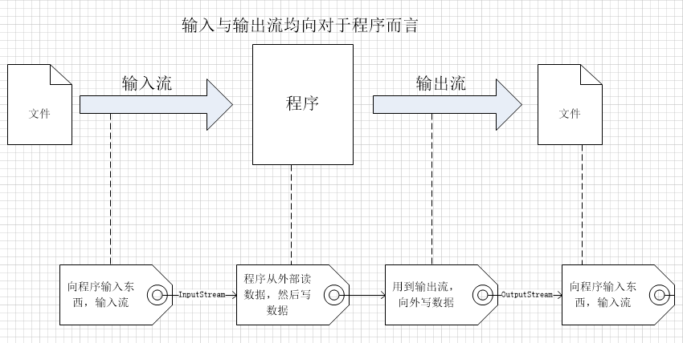
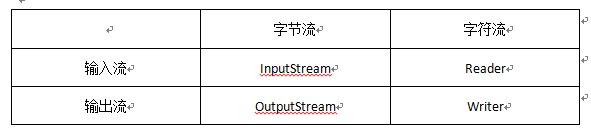

---

# **Android 文件读写与解析（1501211000 王奕超）**

---

## **摘要**
Android 的文件操作其实和 Java 的文件操作原理上并没有太大的差别，但是用过Android手机的我们都会了解，Android的文件存放的地方有多个，比如SD卡，比如手机自带存储空间等。每个应用程序之间是相互独立的，彼此无法访问对方的文件（如果没有root权限），但同时手机也会有共同的存储空间，共同存储空间里的文件是每个应用程序都可以访问的，比如相册。考虑到这些，了解 Android 的文件读写就有些必要了。本文会着重讲解文件操作与管理的理论知识，对传统的文件操作做些回顾，因为了解了原理，一切读写技术的应用都回自然理解，同时本文结合 Android 中文件操作的不同之处，做较为详细的解析。

## **Java IO**
本小节将会对 Java IO 进行简单的讲解，帮助大家对文件读写的 IO 基础进行回顾，也方便接下来对于 Android 文件读写讲解的理解。

### **Java IO 的分类**
Java IO（Input/Output）可以根据不同的分类方式分为不同的类别，按照数据流的方向，我们可以将 IO 分为输入流和输出流；按照处理的数据单位有可以分为字节流和字符流；按照处理功能有可以分为节点流和处理流。输入与输出均是相对于程序而言的。

所有的流类型均位于 java.io 包内，分别继承一下四种抽象流类型。

以上说明了最基础的输入输出（主要针对磁盘file，而没有涉及到网络Socket），接下来简要说一下字节流与字符流。其实不论是网络传输还是磁盘传输，最小的存储单位都是字节，但是由于但是由于我们程序操作的文件数据多是以字符的形式存在，所以出现了读写字符的接口。
* **字节流**

字节流是最基本的，通过简单的二进制形式一个字节一个字节进行传输。所有的 InputStream 和 OutputStream 的子类都是主要用在处理二进制数据。
* **字符流**

由于程序处理的文本数据多是字符，所以出现了字符流，字符流实际上就是在内部进行了字节与字符的转换即 byte[] 转换为 String。我们经常遇到的汉字编码问题，实际上就是由于这个转换的不一致造成的。

而节点流与处理流则是区别于读写发生的地方。

* **节点流**

从一个特定的数据源（内存或文件）读写数据（如我们熟识的 FileInputStream）。
* **处理流**

建立在已存在的流之上（节点流或处理流），通过对数据的处理，为程序提供更为强大的读写功能（如我们熟识的 BufferedInputStream）。

### **RandomAccessFile类**
RandomAccessFile 类是 IO 系统中完全独立的类，和 InputStream 和 OutputStream 继承层次没有任何关联，它拥有和其他 IO 类型本质不同的行为，它可以在一个文件内向前向后移动，使用 seek() 方法将记录从一处转移到另一处，然后读取或修改记录，它会创建一个随机存储的文件流来随机读写由 File 参数指定的文件，并设置 mode 参数为 r （随机读）或 rw （随机读写）。

## **内部存储与外部存储**

### **内部存储**

内部存储并不是指内存，而是指文件默认只能被你的应用程序访问到，所创建的文件在和你所创建的应用名称为包名的目录下，即与你的应用关联起来了，当应用被删除，则内部存储中的文件也会被删除。当然你也可以将文件设置为外部可读，那么只要外部应用程序知道你的应用程序包名，那么它就可以访问，但是内部存储空间有限，是系统本身和系统应用程序主要的数据所在地，内部存储空间耗尽则手机无法再使用。SharedPreferences 和 SQLite 数据库都是存储在内部空间上的，并通过 Context 来获取或操作。
getFilesDir()获取你app的内部存储空间，相当于你的应用在内部存储上的根目录即/data/data/yourpackagename。
但是 Android 为我们提供了一个较为简洁的读写内部存储文件的方法 openFileInput 和 openFileOutput，需要设置文件名（不加文件分隔符）和读写模式，其返回一个 File 的输入或输出流对象实例。

    String filename = "myfile.txt";
    String string = "Hello world!";
    FileOutputStream outputStream;
    try{
        outputStream = openFileOutput(filename, Context.MODE_PRIVATE);
        outputStream.write(string.getBytes());
        outputStream.close();
    } catch(Exception e) {
        e.printStackTrace();
    }

### **外部存储**
此处提及的外部存储并不是我们传统理解上的像 PC 机上的移动硬盘、U盘等可移动存储设备，Android 手机的 SD 卡显然是外部存储设备，但是现在的中高端智能手机已经将机身自身容量扩展了许多，而不再具有可拓展接口，但是它仍然具有内部存储和外部存储之分。存储在外部存储的文件就有可能会被其他应用程序或用户访问或修改，这也要看是否是是设置为公有文件和私有文件。简而言之，在手机连上电脑后，能被电脑识别出来的那部分就是外部存储空间。
* **共有文件**

如果要存储的文件需要被其他应用所共享，且在应用被卸载的时候不被删除，比如说相册，或是下载的文件，这是就要使用 Envoronment.getExternalStoragePublicDirectory(String type) 进行操作。
如下我们以写一个相册文件为例简要说明

    public File getAlbumStorageDir(String albumName) {
        File file = new File(Environment.getExternalStoragePublicDirectory(Environment.DIRECTORY_PICTURES), albumName);
        if(!file.mkdirs()) {
            Log.e(LOG_TAG, "Directory not created");
        }
        return file;
    }
上面的代码中 File 的第一个参数是 parentFile ，返回的是一个 picture 目录，是公用的，然后在此目录下创建了 albumName 的文件。当此应用程序被删除后，所创建的文件不会被删除。
* **私有文件**

由于内部存储空间有限，较为宝贵，许多较大的本应放在内部存储区域的文件会选择放在外部存储区域，但是这些文件都是可以被其他程序或用户访问的，所以放在这里要慎重考虑。此时，需要通过 Context.getExternalFilesDir() 来获取存储路径。

如下我们对上面的例子进行修改。

    public File getAlbumStorageDir(Context context, String albumName) {
        File file = new File(context.getExternalFilesDir(Environment.DIRECTORY_PICTURES), albumName);
        if(!file.mkdirs()) {
            Log.e(LOG_TAG, "Directory not created");
        }
        return file;
    }
此时文件会被存储在根目录下/Android/data/yourpackagename/目录下，当应用程序被删除时，/yourpackagenam/目录及其之下的目录和文件也会一起被删除掉。

但在使用外部存储的时候有一点需要注意，就是需要提前判断外存储的当前状态，是否可用，因为用户可能把其挂载为 USB 存储设备，或者 SD 卡被移除，这时候我们可以通过 Environment.getExternalStorageState() 获取当前的状态，如果为 Environment.MEDIA_MOUNTED 说明此时可读可写，若为 Environment.MEDIA_MOUNTED_READ_ONLY 说明此时只可读不可写。否则则不可读也不可写。

通过以上的介绍，想必大家应该从宏观上对于 Android 文件的读写有了一个较为全面的认识或是基础知识的回顾，下面我们会具体的进行一些文件操作的实例讲解。

## **文件读写**
本节将针对不同情况下的读写要求进行实例分析。Android 的文件读写与 Java 的文件读写差别不是很大，一些读写方法中做了一些封装和参数设置，使得 Android 的文件读写更加简明。

### **资源文件的读取**
Android 的资源文件大致分为两类，一类是可直接访问的资源文件，这些资源可以使用 R. 进行访问，都保存在 res 目录下，在编译的时候，会自动生成 R.java 资源索引文件；另一类则是无法直接访问的原生资源文件，这些资源存放在 assets 下以及 resource 下的 raw 目录下, 不能使用 R 类 进行访问, 只能通过 AssetManager 和 openRawResource(int) 以二进制流形式读取资源。
* **直接资源**

直接可访问的资源像 resource 目录下的 animator 是属性动画 xml 文件目录，定义起始结束、动做、重复时间等参数齐全的动画；

anim 是补间动画的 xml 文件目录， 补间动画是只定义、起始、结束帧，中间的动作由系统进行计算获取动作过程；

color  是颜色列表的 xml 文件目录；

drawable 是存放真实的位图文件，也可以存放Drawable对象及子类对象的XML文件；

layout 是界面布局 xml 文件目录；

value 是存放字符串、整数、颜色、数组信息的 xml 文件的目录,这些 xml 文件资源的根元素是resource；

xml 原生的 xml 文件，可以使用 Resource.getXML()方法进行访问。

这些资源可以在程序代码中直接用 R.  进行访问。此处不再进行详细分析。需要注意的就是 R.xxx.xxx 获取的是资源的 ID 如果需要获取具体的值，则根据数据的类型，使用 get 方法，比如 getString(id)。
* **原生资源**

原生资源只能读取不能修改，且原生资源文件不会被编译，需要使用 inputStream 按二进制字节流来读取，且通常大小有限制为1M。首先我们先来看读取 resource 下 raw 目录下的文件。
    
    String res = ""; 
    try{ 
        //得到资源中的Raw数据流
        InputStream in = getResources().openRawResource(R.raw.test); 
        
        //得到数据的大小
        int length = in.available();       

        byte [] buffer = new byte[length];        

        //读取数据
        in.read(buffer);         

        //依test.txt的编码类型选择合适的编码，如果不调整会乱码 
        res = EncodingUtils.getString(buffer, "UTF-8"); 
    
        //关闭    
        in.close();            

    }catch(Exception e){ 
        e.printStackTrace();         
    }
可以看到，通过 getResources() 方法返回一个 Resources 对象，然后调用 openRawResource() 方法，将资源的 ID 作为参数，返回一个 inputStream 实例。
然后我们来看一下 assets 类资源应该如何访问。

    String fileName = "test.txt"; //文件名字 
    String res=""; 
    try{ 
        //得到资源中的asset数据流
        InputStream in = getResources().getAssets().open(fileName); 
        //得到数据的大小
        int length = in.available();         
        byte [] buffer = new byte[length];        
        //读取数据
        in.read(buffer);
        //资源关闭
        in.close();
        //设置编码格式
        res = EncodingUtils.getString(buffer, "UTF-8");     

    }catch(Exception e){ 

      e.printStackTrace();         

    }
要访问 assets 目录下的资源，我们需要通过 Resource 对象的 getAssets() 方法获取一个 AssetManager 对象，根据文件名字打开一个资源对象，并以二进制流的方式读取。

在应用程序编写完成进行编译打包成 apk 的时候，assets 和 res/raw 资源文件会被原封不动的打包进 apk，而其他的资源则需要被编译或处理，然后打包进 apk，同时，除了 assets 资源外，其他的资源都会被赋予一个资源 ID作为唯一标识。

### **用户数据的读写**
用户数据的读取，即读取 /data/data/yourpackagename/ 目录下的文件，这里可以使用 Android 封装好的 openInputStream 和 openOutputStream 进行读取和写入。

首先是读数据：

    public String readFile(String fileName) throws IOException{ 
        String res=""; 
        try{ 
            FileInputStream fin = openFileInput(fileName); 
            int length = fin.available(); 
            byte [] buffer = new byte[length]; 
            fin.read(buffer);
            //设置编码格式
            res = EncodingUtils.getString(buffer, "UTF-8"); 
            fin.close();     
        }catch(Exception e){ 
            e.printStackTrace(); 
        } 
        return res; 
    }

写数据：

    public void writeFile(String fileName,String writestr) throws IOException{ 
        try{ 

            FileOutputStream fout = openFileOutput(fileName, Context.MODE_PRIVATE); 

            byte [] bytes = writestr.getBytes(); 

            fout.write(bytes); 

            fout.close(); 
        } catch(Exception e){ 
        e.printStackTrace(); 
        } 
    }
openFileOutput() 方法的第二个参数是文件的权限设置以及写的方式：
1. Context.MODE_PRIVATE 
#####该模式下创建的文件其他应用无权访问，并且本应用将覆盖原有的内容。
2. Context.MODE_APPEND
#####该模式下创建的文件其他应用无权访问，并且本应用将在原有的内容后面追加内容。
3. Context.MODE_WORLD_READABLE
#####该模式下创建的文件其他应用有读的权限。
4. Context.MODE_WORLD_WRITEABLE
#####该模式下创建的文件其他应用有写的权限。

这些权限可以根据需要进行组合，并用 | 分隔。

用户数据的读写是 Android 文件读写中最常用到的读写方式，而且也比较简单易懂。

### **外部存储区域读写**
这里就以 SD 卡上文件的读写操作为例进行讲解。请结合上面讲的外部存储相关知识进行阅读此处代码。

首先要看 SD 卡是否可用即存在。
	
	public static boolean isSdCardExist() {
		return Environment.getExternalStorageState().equals(
				Environment.MEDIA_MOUNTED);
	}
然后获取 SD 卡的路径。
	
	public static String getSdCardPath() {
		boolean exist = isSdCardExist();
		String sdpath = "";
		if (exist) {
			sdpath = Environment.getExternalStorageDirectory()
					.getAbsolutePath();
		} else {
			sdpath = "sd card not exist";
		}
		return sdpath;

	}
获取文件的默认存放路径。
	
	public static String getDefaultFilePath() {
		String filepath = "";
		File file = new File(Environment.getExternalStorageDirectory(),
				"abc.txt");
		if (file.exists()) {
			filepath = file.getAbsolutePath();
		} else {
			filepath = "file not exist";
		}
		return filepath;
	}
使用 FileInputStream 读取文件。
        
        try {
    		File file = new File(Environment.getExternalStorageDirectory(),
    				"test.txt");
            FileInputStream is = new FileInputStream(file);
            byte[] b = new byte[inputStream.available()];
            is.read(b);
            String result = new String(b);
            System.out.println("content of text.txt："+result);
        } catch (Exception e) {
        	e.printStackTrace();
        }
使用 FileOutputStream 向 SD 写入数据。

		try {
			File file = new File(Environment.getExternalStorageDirectory(),
					DEFAULT_FILENAME);
	         FileOutputStream fos = new FileOutputStream(file);
	         String info = "write words into sd card";
             fos.write(info.getBytes());
             fos.close();
			System.out.println("write success");
		} catch (Exception e) {
			e.printStackTrace();
		}

### **外部文档的解析**
外部文档是指来自程序外部，除了以上所讲解的文件，这里主要讲解 xml 文件和 json 文件的解析。因为 xml 文件和 json 文件是当下较为流行的数据传输与存储格式化文件，它们能以灵活有效的方式定义管理信息的结构，实现数据的标准化、结构化，解决了在不同平台、不同系统之间的数据结构/模式的差异。
####**XML文件的解析**
对于 XML 的解析，我们这里讲解两种解析方式，一个是 SAX 方法，一个是 XMLPull 方法。

**SAX (Simple API for XML)**

SAX(Simple API for XML) 解析器是一种基于事件的解析器，事件驱动的流式解析方式是，从文件的开始顺序解析到文档的结束，不可暂停或倒退。它的核心是事件处理模式，主要是围绕着事件源以及事件处理器来工作的。当事件源产生事件后，调用事件处理器相应的处理方法，一个事件就可以得到处理。当遇到像文件开头，文档结束，或者标签开头与标签结束时，会触发一个事件，用户通过在其回调事件中写入处理代码来处理 XML 文件，适合对 XML 的顺序访问，且是只读的。
SAX的工作原理：简单地说就是对文档进行顺序扫描，当扫描到文档开始与结束、元素开始与结束、文档结束等地方时通知事件处理函数，由事件处理函数做相应动作，然后继续同样的扫描，直至文档结束。

* 
**SAX的一些回调方法解析：**

•	startDocument()

此方法只会在文档开始解析的时候被调用，每次解析只会调用一次。即开始解析XML根元素时调用该方法。可以用来做初始化。

•	startElement(String uri, String localName, String qName, Attributes attributes)

方法每次在开始解析一个元素，即遇到元素标签开始的时候都会调用。可以根据qName或localName判断是否是所需元素，并进行操作，attribute可以取出XML标签里的属性值。

•	characters(char[] ch, int start, int length)

通过new String(ch,start,length)获取每个元素的内容。
方法也是在每次解析到元素标签携带的内容时都会调用，即使该元素标签的内容为空或换行。而且如果元素内嵌套元素，在父元素结束标签前， characters()方法会再次被调用，此处需要注意。

•	endElement(String uri, String localName, String qName)

方法每次在结束解析一个元素，即遇到元素标签结束的时候都会调用。可在此方法中做善后操作。

•	endDocument() 

方法只会在文档解析结束的时候被调用，每次解析只会调用一次。

* **SAX方法解析XML文件实现步骤：**

（一）	创建一个工厂类SAXParserFactory实例

（二）	让工厂类产生一个SAX的解析类SAXParser

（三）	从SAXPsrser中得到一个XMLReader实例

（四）	把自己写的handler处理器注册到XMLReader中，即setContentHandler

（五）	将一个xml文档或者资源变成一个java可以处理的字符流后，解析正式开始

    private TodayWeather parseSAXxml(String xmlData){
        SAXParserFactory saxParserFactory = SAXParserFactory.newInstance();
        TodayWeather todayWeather = new TodayWeather();
        try {
            XMLReader xmlReader = saxParserFactory.newSAXParser().getXMLReader();
            WeatherXMLHandler handler = new WeatherXMLHandler(todayWeather);
            xmlReader.setContentHandler(handler);
            xmlReader.parse(new InputSource(new StringReader(xmlData)));
        }catch (SAXException e){
            e.printStackTrace();
        }catch (ParserConfigurationException e){
            e.printStackTrace();
        }catch (IOException e){
            e.printStackTrace();
        }
        return todayWeather;
    }
其中WeatherXMLHandler类是XML解析处理器，它继承了DefaultHandler类，并重写其中的方法。这里主要重写的是characters()方法和endElement()方法。用于读取xml文件中相应节点重的内容，并用读取到的内容设置实体类的属性。

    @Override
    public void characters(char[] ch, int start, int length) throws SAXException{
        super.characters(ch,start,length);
        content = new String(ch,start,length);
    }

    @Override
    public void endElement(String uri, String localName, String qName) throws SAXException{
        Log.i(TAG,"元素解析结束");
        super.endElement(uri, localName, qName);
        if(qName.equals("city")){
            todayWeather.setCity(content);
        }else if(qName.equals("updatetime")){
            todayWeather.setUpdateTime(content);
        }else if(qName.equals("shidu")){
            todayWeather.setShidu(content);
        }
    }
**XMLPull Parsing**

XML Pull是Android开发环境中集成的解析XML文件的工具，不需要额外的包。相对来说比较简单，而且可以随时终止解析，并在解析的过程中就可以给实体类属性赋值，不需要再另分出一个handler处理器。
* **Pull方法解析XML文件实现步骤：**

（一）	创建一个解析器工厂类XmlPullParserFactory实例

（二）	让工厂类产生一个Xml Pull的解析类xmlPullParser

（三）	注册解析内容setInput

（四）	通过解析器获取解析事件（第一个）

（五）	判断事件类型进行相应的处理

XmlPull通过next()来提取事件，通过getText()元素的值。

    XmlPullParserFactory fac = XmlPullParserFactory.newInstance();
            XmlPullParser xmlPullParser = fac.newPullParser();
            xmlPullParser.setInput(new StringReader(xmldata));
            int eventType = xmlPullParser.getEventType();
            Log.d(TAG, "parseXML");
            while (eventType != XmlPullParser.END_DOCUMENT){
                switch (eventType){
                    case XmlPullParser.START_DOCUMENT:
                        break;
                    case XmlPullParser.START_TAG:
                        if(xmlPullParser.getName().equals("resp")){
                            todayWeather = new TodayWeather();
                        }
                        if(todayWeather != null){
                            if(xmlPullParser.getName().equals("city")){
                                eventType = xmlPullParser.next();
                                todayWeather.setCity(xmlPullParser.getText());
                                Log.d(TAG,"city:"+xmlPullParser.getText());
                            }else if(xmlPullParser.getName().equals("updatetime")){
                                eventType = xmlPullParser.next();
                                todayWeather.setUpdateTime(xmlPullParser.getText());
                                Log.d(TAG,"updateTime:"+xmlPullParser.getText());
                            }
                            ......
SAX解析器的工作方式是自动将事件推入注册的事件处理器进行处理，因此你不能控制事件的处理主动结束；而Pull解析器的工作方式为允许你的应用程序代码主动从解析器中获取事件，正因为是主动获取事件，因此可以在满足了需要的条件后不再获取事件，结束解析。这是他们主要的区别。

而他们的相似性在运行方式上，Pull解析器也提供了类似SAX的事件，开始文档START_DOCUMENT和结束文档END_DOCUMENT，开始元素START_TAG和结束元素END_TAG，遇到元素内容TEXT等，但需要调用next()方法提取它们（主动提取事件）。

直观而言，Pull方式比SAX方式要少了一个handle处理器的实现，显得更加简洁，但是自认为SAX方式相比也有优点，就是将具体的处理方法和主程序分离，便于后期维护代码。
####**JSON文件的解析**
对于 JSON 文件的解析，我们这里以 JSONObject 为例进行说明。
由于 JSON 文件格式自身的特点，JSONObject 中的数据类型与 JSON 文件中的数据组织方式一一对应，在下面的代码中你会很清楚的发现这一点。

    private TodayWeather parseJsonObject(String jsonData){

        TodayWeather todayWeather = new TodayWeather();
        try {
            JSONObject jsonObject = new JSONObject(jsonData);
            //对应简单对象
            JSONObject jsonObject2 = jsonObject.getJSONObject("data");
            //对应着数组
            JSONArray jsonArray = jsonObject2.getJSONArray("forecast");
            todayWeather.setCity(jsonObject2.getString("city"));
            todayWeather.setQuality(jsonObject2.getString("aqi"));
            todayWeather.setWendu(jsonObject2.getString("wendu"));
    //            for (int i = 0;i<jsonArray.length();i++){
    //                JSONObject jsonObject1 = jsonArray.getJSONObject(i);
    //
    //            }
            JSONObject jsonObject1 = jsonArray.getJSONObject(0);
            todayWeather.setFengxiang(jsonObject1.getString("fengxiang"));
            todayWeather.setFengli(jsonObject1.getString("fengli"));
            todayWeather.setHigh(jsonObject1.getString("high"));
            todayWeather.setLow(jsonObject1.getString("low"));
            todayWeather.setType(jsonObject1.getString("type"));
            todayWeather.setDate(jsonObject1.getString("date"));
        }catch (JSONException e){
            e.printStackTrace();
        }
        return todayWeather;
    }
若需要json中数组的所有内容，遍历即可。将所需要的值用getString（或getDouble等）方法，将所需要的值赋给实体类对应的属性即可。

## **小结**

数据不会一直在传输，它终将会被持久化在某一个地方，那么我们就需要对数据进行读与写，或是从硬盘中或是从网络上等等，而这某一个地方就是文件。文件具有不同的组织形式，不同的数据内容，不同的存在地点，那么我们就要针对这些不同点采取不同的文件读写方式，但只要我们了解到了它的原理，那么不论文件以何种形式存在，存在哪里，我们都可以实现轻松地访问。