# Android 中Service技术简介(1501211040_赵浩新)

## Service简介


作为android程序开发四大组件之一，与Activity组件同为Context类的子类。不同于Activity作为包含用户界面与用户交互的组件，Service就是我们常说的后台程序。例如，音乐播放器，网络操作等。
##Service生命周期
Service可以分为两种，本地服务与远程服务,l两种服务生命周期如下图所示。

无论本地服务还是远程服务的创建流程都是：onCreate()->onStart()->服务开始，只不过本地服务通过调用Context.startService(Intetnt)进入服务的启动创建流程，远程服务通过Context.bindService()进入服务启动流程。

不过两种服务的销毁流程有点区别，但最终都是通过onDestory()方法，回收资源。只不过本地服务通过控件调用Context.stopService()或者Service本身调用Service.stopSelf()启动onDestory()；而远程服务通过调用unbindService()，直至与该Service连接的客户端为零后，才会启动onDestory()方法。

如果组件调用startService()方法启动服务（onStartCommand()方法被调用），服务需要使用stopSelf()方法停止自身。或者其他组件使用stopService()方法停止该服务。如果组件调用bindService()（方法创建服务（onStartCommand()方法不被调用），服务运行时间与组件绑定到服务的时间一样长。一旦服务从所有客户端解绑定。系统会将其销毁。

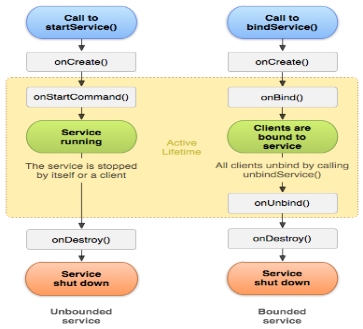

##Service方法介绍
本节主要介绍Service生命周期中相关方法或功能：
###onCreate():
当服务第一次创建时。系统调用该方法执行一次性建立过程（在系统调用onStartCommand()或onBind（）方法前）。如果服务已经运行，该方法不被调用。
###onDestory():
当服务不再使用并即将销毁时，系统调用该方法。服务应该实现该方法来清理诸如线程、注册监听器、接收者等资源。这是服务收到的最后调用。
###onStartCommand():
他组件（如Activity）调用startService()方法请求服务启动时。系统调用该方法。一旦该方法执行，服务就启动（处于started状态）并在后台无限期运行。如果开发人员实现该方法，则需要在任务完成时调用stopSelf()或stopService()方法停止服务（如果仅想提供绑定，则不必实现该方法）。
###onBind():
当其他组件调用bindService()方法想与服务绑定时（如执行RPC），系统调用该方法。在该方法的实现中，开发人员必须通过返回Binder提供客户端用来与服务通信的接口。该方法必须实现，但是如果不想允许绑定，则返回null.
##Service之启动本地服务
之前我们提到，Service同Activity为Context子类，且都可进行相关处理操作，只不过前者不可作为与用户的交互的界面，运行在后台。在Activity中，界面的切换通过Intent实现，Service也同样如此。

 Service的启动通过传递Intent对象实现，需要注意的是，在我们的自定义Service中需要重写父类(Service)中的onCreate()、onStartCommand()、OnDestory()方法，并在MainFest.xml文件中进行注册。
 
 
 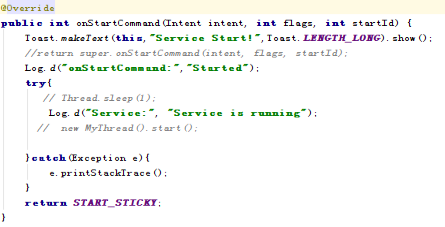
 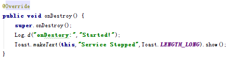

 Manifest.xml 文件中注册:
 
 
 
 调用通过Intent启动/关闭服务：
 
 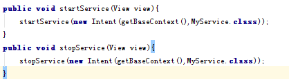
 
 现在我们已经对Service的概念有了大致的了解,运行如下图：
 
 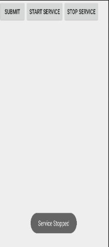
 
 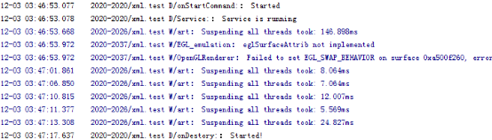
 
 ##Service用法之与Activity通信
上一节中，在Activity中调用startService启动Service后，通过onStartCommand()方法里处理一些具体的操作。但是Service与Activity却相互独立的。有能让它们俩的关联更紧密的发放吗？例如Activity中可以指定让Service执行的后台任务。具体操作过程如下：

首先在MyService中自定义MyBinder类，继承自Binder，并在自定义类中增加需要功能：

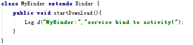

其次，修改MyService中的onBind()方法，返回MyBinder：
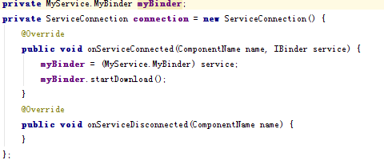

最后，Activity类中，增加MyBinder变量，并定义ServiceConnection变量，用于绑定具体的Binder,点击BIND按钮，启动onCreate()方法，并调用startDownload()方法输出下列字符串，点击unBind按钮，任务终止。示例如下:
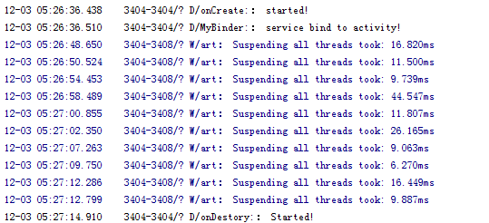

##Service用法之销毁Service
在最开始的一节中，我们介绍了销毁Service最简单的一种情况，点击Start Service按钮启动Service，再点击Stop Service按钮停止Service，这样MyService就被销毁。

第二节中，由于在绑定Service的时候指定的标志位是BIND_AUTO_CREATE，说明点击Bind Service按钮的时候Service也会被创建，这时，点击stopService按钮并没有销毁Service，点击一下Unbind Service按钮，将Activity和Service的关联解除就可以了，Service被销毁。
如果既点击了Start Service按钮，又点击了Bind Service按钮会怎么样呢？这个时候你会发现，不管你是单独点击Stop Service按钮还是Unbind Service按钮，Service都不会被销毁，必要将两个按钮都点击一下，Service才会被销毁，如下图所示：
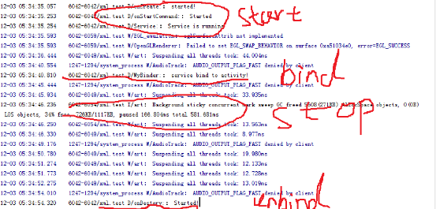

##Service用法之创建前台Service
Service几乎都是在后台运行的，一直以来它都是默默地做着辛苦的工作。但是Service的系统优先级还是比较低的，当系统出现内存不足情况时，就有可能会回收掉正在后台运行的Service。

不过可以使用前台Service。前台Service和普通Service最大的区别就在于，它会一直有一个正在运行的图标在系统的状态栏显示，下拉状态栏后可以看到更加详细的信息，非常类似于通知的效果。

那么我们就来看一下如何才能创建一个前台Service吧，其实并不复杂，修改MyService中的代码，如下所示：
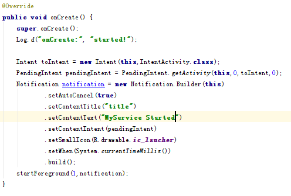

运行效果如下图：

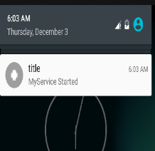

##Service开发小结
以上只是本地Service服务的相关操作。需要注意的是，Service如果没有特殊声明，在运行的时候会占用主线程的资源。因此对于一些耗费资源的后台服务，可以启用运程服务模式，即在Manifest文件中添加如下代码：
``````
<service android:name=".MyService"
    android:process=":remote"/>
    ``````
即使如此，远程Service并非最好的，因为此时在此点击bind按钮，程序崩溃，这是因为远程Service并为与Activity运行在同一进程下，无法在进行绑定。而若要再次实现绑定，操作很复杂，在这里就不再赘述，有兴趣的同学可以进行深入的学习。

##参考文档
http://blog.csdn.net/guolin_blog/article/details/11952435
http://blog.csdn.net/pi9nc/article/details/18764415

 