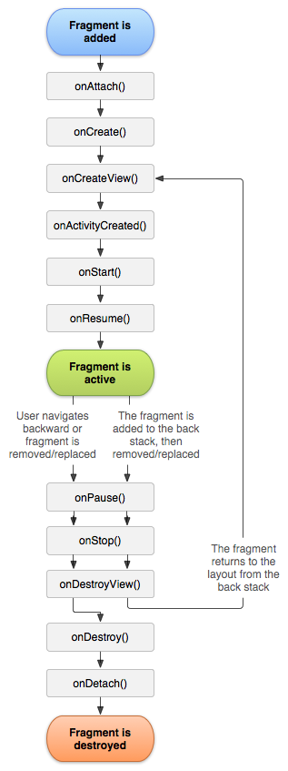

# Android的碎片机制浅析（1501211032_张凯云）

# 引言


随着移动互联网技术的发展，智能手机越来越普及。伴随着开发成本的降低以及技术的进步，越来越多的人进入Android程序开发行业。而Android不仅应用于屏幕较小的手机也同样可以应用于屏幕稍大的平板电脑，这样便存在同样一个界面在不同屏幕上显示有较大的视觉差异，于是就有了碎片（Fragment）。Android3.0是第一版引入碎片（Fragment）的概念，其初衷是为了界面能更好的适应大屏幕的平板电脑。Fragment简化了大屏幕UI的设计，开发者可以使用Fragment对UI组件进行分组、模块化管理，以便在运行过程中动态更新Activity的用户界面。


# 1.Fragment简介 


## 1.1.特性


Fragment是一种可以嵌入在Activity当中的UI片段,它能让程序更加合理和充分地利用大屏幕的空间，Fragment和Activity很像，它们都可以包含布局,都有自己的生命周期。我们可以把Fragment理解为模块化的一段Activity,它具有自己的生命周期,可以接受自己的事件,并可以在Activity运行时被添加或删除。但是Fragment不能独立存在,它必须嵌入到Activity中,而且Fragment的生命周期直接受所在的Activity的影响。总结一下，Fragment是嵌套在Activity上面的，多个Fragment可以嵌套在一个Activity上，也可以在多个Activity中重复使用一个Fragment，所以Fragment必须被写成可重用的模块，保证可以在多个Activity中包含同一个Fragment的不同实例。使得程序在不同的屏幕尺寸下都能自如切换给用户最佳体验。即，程序运行于大屏幕中时启动包含很多fragment的Activity，而在运行在小屏幕时启动一个包含少量fragment的Activity。

下面就简单举个例子说明一下：
如下图所示左侧所示，没有使用fragment之前那需要用一个activity显示标题列表,用另一个Activity显示每个标题的具体内容，而使用了fragment后就如下图所示右侧所示，在一个Activity中用一个fragment显示标题列表,另一个fragment显示选中标题的具体内容,这两个fragment都在一个Activity上,同时显示在屏幕上。并且这两个fragment都有自己的生命周期并可以响应自己感兴趣的事件。


图1不同屏幕大小展示
 
如上图所示，当检测到程序运行于大屏幕时,启动ActivityA,将标题列表和新闻内容这两个 fragment 都放在ActivityA中;当检测到程序运行于小屏幕时,还是启动ActivityA,但这时的ActivityA中只有标题列表fragment,当选中一个标题时, ActivityA启动ActivityB, ActivityB中是含有对应内容的fragment。


特别需要注意的是：

如果当前Activity暂停,它拥有的所有的Fragment就都暂停了,当Activity销毁时,它拥有的所有Fragment都被销毁。然而,我们也可以单独操作（如添加或删除）每一个Fragment, 当然这个操作需要在Activity运行时，也就是在onResume()和onPause()之间进行。当在执行上述针对Fragment的事务时,可以将事务添加到一个被Activity管理的栈中,这个栈中的每一条都是一个Fragment的一次事务。通过该栈,就可以反向执行 Fragment的事务,从而完成Fragment级支持“返回”键(向后导航)。需要注意的是向Activity中添加一个Fragment时，须将其置于ViewGroup控件中,并且需为Fragment定义自己的界面。可以在layoutxml文件中声明Fragment，元素为:<fragment>;也可以在代码中创建Fragment，然后把它加入到ViewGroup控件中。然而，Fragment不一定非要放在Activity的界面中,它可以隐藏在后台为Actvitiy!工作。


## 1.2Fragment生命周期


通过两张图来说明Fragment的生命周期



图2Fragment的生命周期


图3Fragment与activity的生命周期对比

Fragment的生命周期及其与activity的关系如上图所示，下面分别对每个回调进行中文注释，如下所示：
* onAttach：当fragment第一次添加到activity时调用，onCreate(bundle)将在这后面执行。

* onCreate：fragment初次创建时调用。这会在onAttach和onCreateView之间执行。需要注意的是这个方法能在这个fragment的activity正在被created的时候调用。也就是说，你不能指望它就像activity在这个位置一样被初始化。如果你想一旦在activity被创建完成后做某些事，参见onActivityCreated方法。

* onCreateView：在这个fragment构造它的用户接口视图(即布局)时调用。这条是可选的，对于没有布局的fragments这项将返回null。这个方法会在onCreate与onActivityCreated之间被调用。

* onActivityCreated：当这个fragment的activity已经创建完成，并且这个fragment的视图树已经构造完成后调用。一旦这部分完成，就可以进行最终的初始化操作。这个方法对使用setRetainInstance来维护fragment的实例的来说也是有用的，因为当这个fragment完全同它的activity关联之后这个回调会通知fragment。例如获取视图或还原状态。这将在onCreateView之后和onViewStateRestored之前调用。


* onStart：当这个fragment对用户可见时调用。通常它依赖于包含它的activity的Activity.onStart。


* onResume：当这个fragment对用户可见并且正在运行时调用。通常它依赖于包含它的activity的Activity.onResume。


* onPause：当这个fragment不再resumed时调用。通常它依赖于包含它的activity的Activity.onPause。


* onStop：当这个fragment不再started时调用。通常它依赖于包含它的activity的Activity.onStop。


* onDestroyView：当由onCreateView上一次创建的视图从这个fragment分离时调用。下次这个fragment若要显示，那么将会创建新视图。这会在onStop之后和onDestroy之前调用。这个方法的调用同onCreateView是否返回非null视图无关。它会潜在的在这个视图状态被保存之后以及它被它的父视图回收之前调用。


* onDestroy：当这个fragment不再使用时调用。这会在onStop之后onDetach之前调用。


* onDetach：当这个fragment不再attach到它的activity时调用。这将在onDestroy之后调用。


需要特殊说明的是：方法setUserVisibleHint()会在每个Fragment显示的时候执行，该方法位于onCreate方法和onCreateView()方法之间。


## 1.3.管理Fragment的生命周期


管理Fragment的生命周期很像管理Activity的生命周期。像Activity一样，一个Fragment有三个状态：
* Resumed

Fragment在运行中的Activity中可见，也可获取焦点。
* Paused

另外一个Activity挡在前面，但是这个Activity当前是可见的（前面的Activity可能是透明的活着没有覆盖整个屏幕）
* Stopped

Fragment不可见。可能是宿主Activity been stopped或者这个Fragment被移除同时被加入到back stack中了。一个stopped Fragment仍然存活着（他的状态和成员信息都被系统保存着）。但是，他即将不被用户看见，将可能随着Activity被杀掉而杀掉。


## 1.4 派生类


这里介绍三个类继承自Fragment的子类：
* DialogFragment

显示一个浮动的对话框。使用这个类创建对话框是替代activity创建对话框的最佳选择。因为可以把fragmentdialog放入到activity的返回栈中，使用户能再返回到这个对话框。

* ListFragment

显示一个列表控件，就像ListActivity类，它提供了很多管理列表的方法，比如onListItemClick()方法响应click事件。

* PreferenceFragment

显示一个由Preference对象组成的列表，与PreferenceActivity相同。它用于为程序创建“设置”activity。
       


# 2.Fragment相关技术


##2.1创建Fragment


创建 Fragment,需要从Fragment或Fragment的派生类派生出一个类。Fragment 的代码写起来与Activity很像。Fragment和Activity拥有一样的回调方法,比如 onCreate(),onStart(),onPause()和 onStop()。也就是说，如果想在没有Fragment的程序中加入Fragment的使用，最简单的操作就是把Activity的回调方法的代码移到Fragment中对应的方法即可。一般情况下创建Fragment需要实现onCreate()、onCreateView()、onPause()三个方法：
1. onCreate()：当创建一个Fragment的时候，系统会调用这个方法。如果你想要Fragment从paused/stopped到resumed的时候保持一些组件，这里必须初始化 fragment 的这些组件，当Fragment被暂停或停止后可以恢复。
2.	onCreateView()：当Fragment第一次绘制界面组件会回调该方法。该方法必须返回一个View，该View也就是该Fragment所显示的View。如果你的Fragment没有UI的话，则可以直接返回null。
3.	onPause():当用户离开该Fragment时会回调该方法，但这并不意味着Fragment会被destroyed，由于用户可能不在回来，所以通常需要在这里保存一些持久化的数据。


对于大部分的Fragment而言，通常都会重写上面这三个方法。但实际上开发者可以根据需要重写Fragment的任意回调方法。为了控制Fragment显示的组件，通常需要重写onCreateView()方法，该方法会返回的View将作为该Fragment显示的View组件。当Fragment绘制界面组件时将会回调该方法。
例如如下片段:
```
//重写该方法，该方法返回的View将作为Fragment显示的组件。
Public View onCreateView( LayoutInflater inflater,ViewGroup container,Bundle savedInstanceState){
	//将在/res/layout/目录下的fragment_book_detail.xml布局文件
	View rootView =inflater.inflate(R.layout.fragment_book_detail,container,false){
	if(book!=null){
	((TextView))  rootView.findViewById(R.id.book_title).setText(book.title);
	((TextView)) rootView.findViewById(R.id.book_desc).setText(book.desc);
}	
}
return rootView;
}
```
上面方法Public View onCreateView( LayoutInflater inflater,ViewGroup container,Bundle savedInstanceState)这一行代码使用了LayoutInflater加载了/res/layout/目录下的fragment_book_detail.xml 布局文件。最后一行return rootView返回该布局文件对应的View组件，这表明该Fragment将会显示该View组件。


## 2.2.添加有界面的Fragment


Fragment一般作为activity的用户界面的一部分，把它自己layout嵌入到activity的layout中。一个要为fragment提供layout，必须实现onCreateView()回调方法，然后在这个方法中返回一个View对象，这个对象时fragment的layout的根。
注意：如果fragment是从ListFragment中派生的，就不需要实现onCreateView()方法了，因为默认的实现已经返回了ListView控件对象。
要从onCreateView()方法中返回layout对象，可以从layout.xml布局文件中生成layout对象。为了帮助这样做，
onCreateView()提供了一个layoutInflater对象。举例：以下代码展示了一个Fragment的子类如何从layout.xml布局文件example_fragment.xml中生成对象。

```
publicstaticclassExampleFragmentextendsFragment{
   @Override
  publicViewonCreateView(LayoutInflaterinflater,ViewGroupcontainer,BundlesavedInstanceState){
       //Inflate the layout for this fragment
       returninflater.inflate(R.layout.example_fragment,container,false);
   }
}

```
onCreateView()参数中的container是存放fragment的layout的ViewGroup对象。saveInstanceState参数是一个Bundle，跟activity的onCreate()中Bundle差不多，用于状态恢复。但是fragment的onCreate()中也有Bundle参数，所以此处的Bundle中存放的数据与onCreate()中存放的数据还是不同的。Inflate()方法中有三个参数：
1. layout的资源ID；
2. 存放fragment的layout的ViewGroup；
3. 布尔数据表示是否在创建fragment的layout期间，把layout附加到container上（在这个例子中，因为系统已经把layout插入到container中了，所以值为false，如果为true会导致在最终的layout中创建多余的ViewGroup）。   

   

把fragment添加到activity

下面用两种方法讲述如何把它添加到activity中。一般情况下，fragment把它的layout作为activity的layout的一部分合并到activity中。

**方法一：**在activity的layout.xml文件中声明fragment

```
<?xmlversion="1.0"encoding="utf-8"?>
<LinearLayoutxmlns:android="http://schemas.android.com/apk/res/android"
   android:orientation="horizontal"
   android:layout_width="match_parent"
   android:layout_height="match_parent">
   <fragmentandroid:name="com.example.news.ArticleListFragment"
           android:id="@+id/list"
           android:layout_weight="1"
           android:layout_width="0dp"
          android:layout_height="match_parent"/>
   <fragmentandroid:name="com.example.news.ArticleReaderFragment"
           android:id="@+id/viewer"
           android:layout_weight="2"
           android:layout_width="0dp"
          android:layout_height="match_parent"/>
</LinearLayout>

```
以上代码中，< fragment>中声明一个fragment。当系统创建上例中的layout时，它实例化每一个fragment，然后调用它们的onCreateView()方法，以获取每个fragment的layout。系统把fragment返回的view对象插入到< fragment>元素的位置，直接代替< fragment>元素。注：每个fragment都需要提供一个ID，系统在activity重新创建时用它来恢复fragment，也可以用它来操作fragment进行其它的事物，比如删除它。有三种方法给fragment提供ID：
1. 为Android:id属性赋一个数字；
2. 为Android:tag属性赋一个字符串。如果没有使用上述任何一种方法，系统将使用fragment的容器的ID。


**方法二：**在代码中添加fragment到一个ViewGroup这种方法可以在运行时，把fragment添加到activity的layout中。只需指定一个要包含fragment的ViewGroup。为了完成fragment的事务（比如添加，删除，替换等），必须使用FragmentTransaction的方法。可以从activity获取FragmentTransaction，如下：
容。

```
FragmentManager fragmentManager = getFragmentManager();  
FragmentTransaction fragmentTransaction = fragmentManager.beginTransaction(); 
```

然后可以用add()方法添加一个fragment，它有参数用于指定容纳fragment的ViewGroup。

```
ExampleFragmentfragment =newExampleFragment();
fragmentTransaction.add(R.id.fragment_container,fragment);
fragmentTransaction.commit();
```


如，Add()的第一个参数是容器ViewGroup，第二个是要添加的fragment。一旦通过FragmentTransaction对fragment做出了改变，必须调用方法commit()提交这些改变。不仅在无界面的fragment中，在有界面的fragment中也可以使用tag来作为唯一的标志，这样在需要获取fragment对象时，要调用findFragmentTag()。 


## 2.3.添加没有界面的Fragment


上面演示了如何添加fragment来提供界面，然而，也可以使用fragment为activity提供后台的行为而不用显示fragment的界面。要添加一个没有界面的fragment，需要在activity中调用方法add(Fragment,String)（它支持用一个唯一的字符串做为fragment的“tag”，而不是viewID）。这样添加的fragment由于没有界面，所以在实现它时不需要调用实现onCreateView()方法。
使用tag字符串来标示一个fragment并不是只能用于没有界面的fragment上，也可以把它用于有界面的fragment上，但是，如果一个fragment没有界面，tag字符串将成为它唯一的选择。获取以tag表示的fragment，需使用方法findFragmentByTab()。


## 2.4.Fragment管理


要管理fragment，需使用FragmentManager，要获取它，需在activity中调用方法getFragmentManager()。可以用FragmentManager来做以下事情：

1. 使用方法findFragmentById()或findFragmentByTag()，获取activity中已存在的fragment；
2. 使用方法popBackStack()从activity的后退栈中弹出fragment（这可以模拟后退键引发的动作），用方法addOnBackStackChangedListenner()注册一个侦听器以监视后退栈的变化；
3. 使用FragmentManager打开一个FragmentTransaction来执行fragment的事务，比如添加或删除fragment。


### 执行Fragment的事务


在activity中使用fragment的一个伟大的好处是能根据用户的输入对fragment进行添加、删除、替换以及执行其他动作的能力。提交的一组fragment的变化叫做一个事务。事务通过FragmentTransaction来执行。还可以把每个事务保存在activity的后退栈中，这样就可以让用户在fragment变化之间导航（跟在activity之间导航一样）。可以通过FragmentManager来取得FragmentTransaction的实例，如下：
```
FragmentManager fragmentManager = getFragmentManager();  
FragmentTransaction fragmentTransaction = fragmentManager.beginTransaction();  
```
一个事务是在同一时刻执行的一组动作（类似于数据库中的事务）。可以用add(),remove(),replace()等方法构成事务，最后使用commit()方法提交事务。在调用commit()之前，可以用addToBackStack()把事务添加到一个后退栈中，这个后退栈属于所在的activity。有了它，就可以在用户按下返回键时，返回到fragment执行事务之前的状态。如下例：演示了如何用一个fragment代替另一个fragment，同时在后退栈中保存被代替的fragment的状态。

```
//创建一个fragment  
Fragment newFragment = new ExampleFragment();  
//实例化fragment事务管理器  
FragmentTransaction transaction = getFragmentManager().beginTransaction();  
  
//用新创建的fragment来代替fragment_container  
transaction.replace(R.id.fragment_container,newFragment);  
//添加进栈中  
transaction.addToBackStack(null);  
  
//提交事务  
transaction.commit();
```

解释：newFragment代替了控件ID R.id.fragment_container所指向的ViewGroup中所含的任何fragment。然后调用addToBackStack()，此时被代替的fragment就被放入后退栈中，于是当用户按下返回键时，事务发生回溯，原先的fragment又回来了。如果向事务添加了多个动作，比如多次调用了add()，remove()等之后又调用了addToBackStack()方法，那么所有的在commit()之前调用的方法都被作为一个事务。当用户按返回键时，所有的动作都被反向执行（事务回溯）。对于fragment事务，你可以应用动画。在commit()之前调用setTransition()就行。
事务中动作的执行顺序可随意，但要注意以下几点：
1. 必须最后调用commit()；
2. 如果添加了多个fragment，那么它们的现实顺序跟添加顺序一致（后显示的覆盖前面的）
3. 如果在执行的事务中有删除fragment的动作，而且没有调用addToBackStack()，那么当事务提交时，那些被删除的fragment就被销毁了。反之，那些fragment就不会被销毁，而是处于停止状态。当用户返回时，它们会被恢复。
4. 但是，调用commit()后，事务并不会马上执行。它会在activity的UI线程（其实就是主线程）中等待直到现成能执行的时候才执行。如果必要，可以在UI线程中调用executePendingTransactions()方法来立即执行事务。但一般不需要这样做，除非有其它线程在等待事务的执行。
注意：只能在activity处于可保存状态的状态时，比如running中，onPause()方法和onStop()方法中提交事务，否则会引发异常。这是因为fragment的状态会丢失。如果要在可能丢失状态的情况下提交事务，请使用commitAllowingStateLoss()。 


## 2.5. Fragment与Activity通讯


尽管fragment的实现是独立于activity的，可以被用于多个activity，但是每个activity所包含的是同一个fragment的不同的实例。Fragment可以调用getActivity（）方法很容易的得到它所在的activity的对象，然后查找activity中的控件们（findViewById()）。例如:

```
ViewlistView=getActivity().findViewById(R.id.list);
```
同样的，activity也可以通过FragmentManager的方法查找它所包含的frament们。例如：
```
ExampleFragment　fragment=(ExampleFragment)getFragmentManager().findFragmentById(R.id.example_fragment)
```

有时，可能需要fragment与activity共享事件。一个好办法是在fragment中定义一个回调接口，然后在activity中实现之。
例如，还是文章开始举得例子的例子，它有一个activity，activity中含有两个fragment。fragmentA显示标题，fragmentB显示标题对应的内容。fragmentA必须在用户选择了某个标题时告诉activity,然后activity再告诉fragmentB，fragmentB就显示出对应的内容。当然也可以直接fragmentA告诉fragmentB，但是这样fragment就减少了可重用的能力。所以我们把事件告诉宿主，由宿主决定如何处置，这样大大提升了重用性。如下例，OnArticleSelectedListener接口在fragmentA中定义：
```
public　static　class　FragmentA　extends　ListFragment{
   ...
   //Container Activity must implement this interface
   public　interface　OnArticleSelectedListener{
       public　void　onArticleSelected(Uri　articleUri);
   }
   ...
}
```
然后activity实现接口OnArticleSelectedListener，在方法onArticleSelected()中通知fragmentB。当fragment添加到activity中时，会调用fragment的方法onAttach()，这个方法中适合检查activity是否实现了OnArticleSelectedListener接口，检查方法就是对传入的activity的实例进行类型转换，如下所示：

```
public　static　class　FragmentA　extends　ListFragment{
   OnArticleSelectedListener　mListener;
   ...
   @Override
   public　void　onAttach(Activity　activity){
       super.onAttach(activity);
       try{
           mListener =(OnArticleSelectedListener)activity;
       }catch(ClassCastException　e){
           throw　new　ClassCastException(activity.toString()+"must implement OnArticleSelectedListener");
       }
   }
  ...
}
```

如果activity没有实现那个接口，fragment抛出ClassCastException异常。如果成功了，mListener成员变量保存OnArticleSelectedListener的实例。于是fragmentA就可以调用mListener的方法来与activity共享事件。例如，如果fragmentA是一个ListFragment，每次选中列表的一项时，就会调用fragmentA的onListItemClick()方法，在这个方法中调用onArticleSelected()来与activity共享事件，如下：
```
public　static　class　FragmentA　extends　ListFragment{
   OnArticleSelectedListener　mListener;
   ...
   @Override
   public　void　onListItemClick(ListView　l,View　v,int　position,long　id){
       //Append the clicked item's row ID with the content provider Uri
       Uri　noteUri =ContentUris.withAppendedId(ArticleColumns.CONTENT_URI,id);
       //Send the event and Uri to the host activity
       mListener.onArticleSelected(noteUri);
   }
   ...
}
```
onListItemClick()传入的参数id是列表的被选中的行ID，另一个fragment用这个ID来从程序的ContentProvider中取得标题的内容。


# 参考文献


[1]黄立明；江有福；陆雅男.用Android Fragment技术实现多级选项列表[J]. 教育教学论坛.2015(04)

[2]徐永丽.浅谈软件开发之android应用开发——界面开发之Fragment[J]. 科学与财富.2012, (3)

[3]王涛.安卓系统消息传递方法研究[J].安阳工学院学报.2014, 13(4)

[4]王云林.Android应用中跨版本集成新特性的研究与实现[D]. 东华大学. 2014

[5]高兰兰.基于Android平台的多分辨率解决方案[J].COMPUTER ENGINEERING & SOFTWARE.2011, 32(9)

