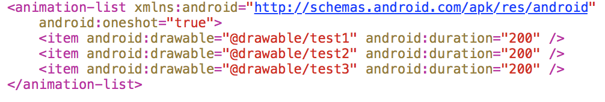
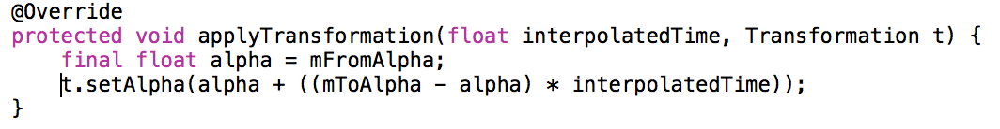
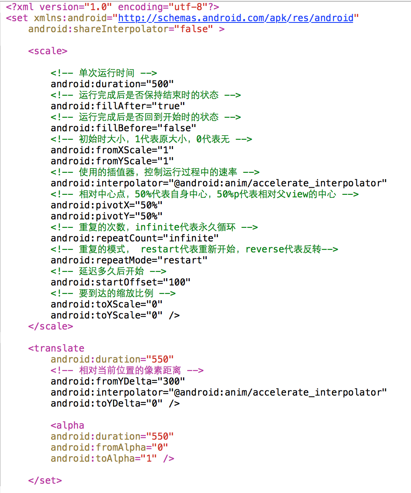
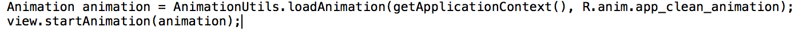
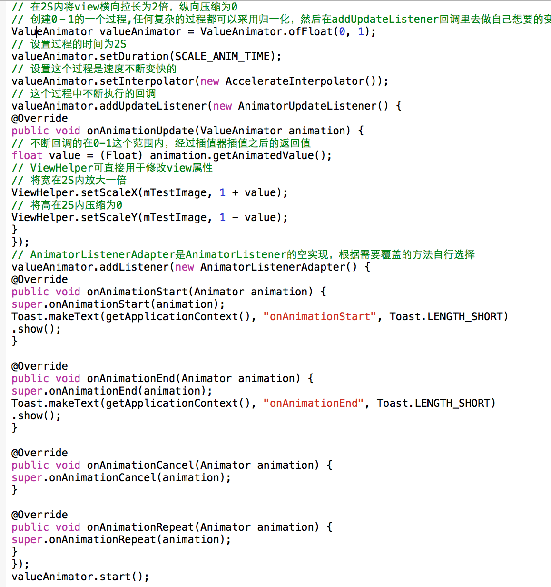
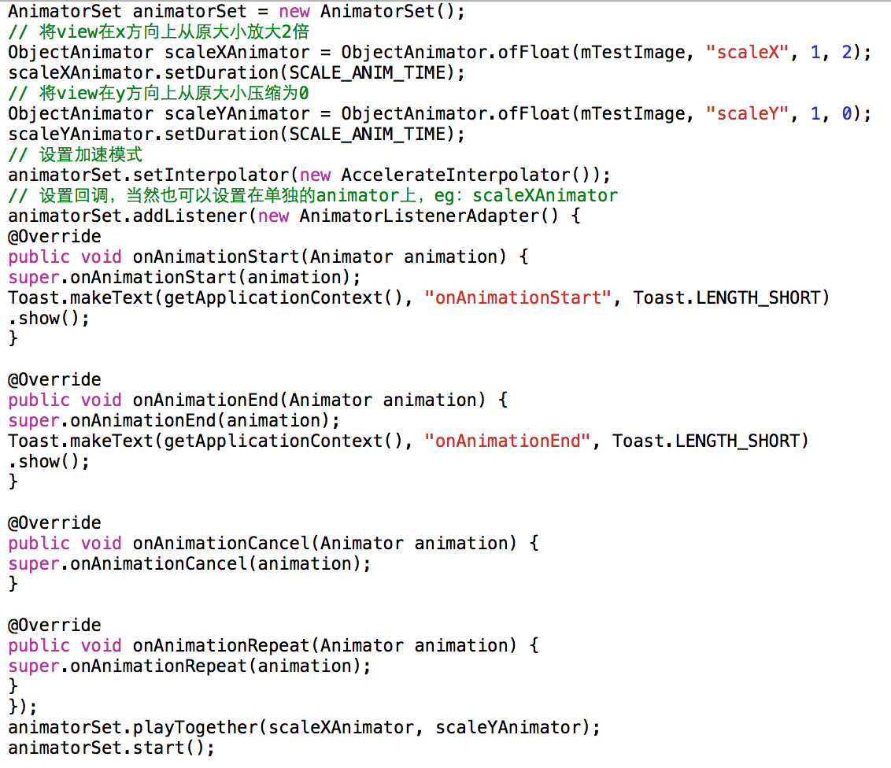

# Android动效与个性化交互（1501210479 白鹤松）

作者：白鹤松

学号：1501210479

在天气预报项目中，当我们点击更新天气按钮后，如果网络速度较慢，在等待的过程中会有按钮旋转的动画效果，减少用户等待的焦急感。

单一的静态页面容易使人感觉枯燥乏味，因此设计师对动效越来越重视，如此也就加大了对开发同学的挑战，简单的如移动，旋转，缩放，渐变或普通的界面跳转等，可是随着技术的飞速发展，各种复杂的动态效果也越来越多。

## 
安卓的动效开发框架主要有两类， Animation 和 Property Animation；两者之间的主要区别在于：

1.需要的不同的API级别。Property Animation需要Android API level 11, Animation只需要原始的版本。

2.而且这两者适用的范围不一样。Property Animation适用于所有的Object对象而View Animation则只能应用于View对象。

3.实际效果不一样。Animation对 view的绘制位置进行改变，而不是改变view的实际属性；Property Animation则不然，它可以改变view的实际属性。例如： 对一个button做位移动画，当你用animation处理之后，button的点击响应仍会在原来的位置，可是当你用Property Animation处理后，button的点击响应会在最终位置处。

##1 Animation
总体上可以分为两类： Frame Animation和Tween Animation，也就是帧动画和补间动画。

###1.1帧动画（Frame Animation）：
所谓帧动画，其实就是让图片按照一定的时间间隔，进行快速的切换，这种切换可以带来视觉上动画的效果，这种方式简单粗暴，因此也存在了大量弊端， 比如：

1.如果动画比较复杂，需要的图片数量也就更多，因此会造成文件过大，增加包容量。

2.同样因为需要更多的图片，运行时会耗用更多的内存。

因此在实际使用中我们尽量不采用帧动画的方法，如果在一些特殊情况下不得不采用，也尽量减少图片的数量和尺寸； 帧动画相对比较容易理解，下面这个例子用来让大家理解帧动画

1.在drawable目录下xml中定义如下文件，节点为animation-list，oneshot代表是否执行一次，duration代表每张图对应展示时间：

2.然后将该drawable设置给对应的imageview

3.在activity中
animDrawable = (AnimationDrawable) imageView.getBackground();

4.在onWindowFocusChanged()中调用：

animDrawable.stop();

animDrawable.start();

如果不这样做性能较差的机器可能无法播放，由于只显示出第一帧，并没有和view进行实际的关联，因此，不是在onCreate（）方法中进行调用，而是在onWindowFocusChanged中；
在极特殊的情况下如果还无法播放，则可以mHandler.postDelay 200 毫秒解决。

###1.2补间动画（Tween Animation）
Animation下有五个子类：AlphaAnimation(渐变),RotateAnimation(旋转),ScaleAnimation(缩放),TranslateAnimation(位移) 在实现原理上除了AlphaAnimation是动态的去改变view的alpha值，RotateAnimation(旋转),ScaleAnimation(缩放),TranslateAnimation(位移)则是去改变里面的Matrix；

Animation框架主要包括 Animation和Transformation、Interpolator这几个类。 alpha和matrix在Transformation里面进行封装，alpha则是改变view的透明度，改变matrix Animation里有一个重要的方法applyTransformation可以使移动、旋转、缩放、错切等效果实现。

以AlphaAnimation为例：

interpolatedTime动态计算出对应的alpha，渐变动画只根据当前计算出的alpha， 在Transformation中进行设置。

1.xml配置：

使用set标签可以进行组合，在代码中使用如下：

 

##2 Property Animation（属性动画）
属性动画更改的是对象的实际属性，而View Animation（Tween Animation）改变的是View的绘制效果，并没有改变view的实际属性，前者无论你中如何缩放Button的大小，Button的有效点击区域还是之前的区域，也就是动画应用前的区域，不管是位置还是大小，都不受影响。而在Property Animation则大有不同，它可以对view的实际属性进行改变，比如之前的button，改变的是实际的尺寸缩放和位置变化。事实上不仅仅是view，Property Animation可以应用于任何对象。

Property Animation可以表示一个属性值在一段时间内的改变，而这个改变可以是用户指定的， 可以在Property Animation中改变以下属性：

1.TimeInterpolator：计算属性值，如先快后慢、先慢后快、匀速等

2.TypeEvaluator：根据属性的开始、结束值与TimeInterpolator计算出的因子计算出当前时间的属性值

3.Repeat Count and behavoir：重复次数与方式，如播放的次数，循环播放或是单次播放，正向播放或是反向播放。

4.Animation sets：动画集合，同一个对象可以应用几个动画，同时播放这些动画，也可以把不同开始偏移设置在动画上。

5.Frame refreash delay： 每隔多少时间计算一次属性值，默认时间为10ms， 系统进程调度与硬件的也会对最终刷新时间造成影响。

以上的概念无需死机，只要在需要的时候理解其中的含义，可以准确地应用即可。属性动画中的 ValueAnimator和ObjectAnimator需要我们重点去了解，这两个类可以解决我们在动效制作中遇到的大多数问题。

###2.1 ValueAnimator：
ValueAnimator基本囊括了了 Property Animation 动画中的所有核心功能，它包括动画时间，开始、结束属性值，以及相应时间属性值计算方法等。
ValueAnimator 只是为我们创建了一个过程， ValueAnimator.ofXXX()可以用来进行创建，然后各种setXXX()可以给其设定过程的时间，速率变化效果等，最后通过addUpdateListener()，再结合回调回来的参数值，就可以生成 改变view的属性，从而形成动态效果；
上面这句话通过代码表现如下：
比如我们使用 ValueAnimator 在2S内将view横向拉长为2倍，纵向压缩为0：

动画的本质，其实就是让view的一些属性值在一个时间段内不断去改变，在这些属性值动态变化中不断重新绘制，也就呈现我们所看见的动态效果。因此我们知道动画其实就是属性与时间的一种对应关系式，如果整个过程属性与时间变化的程度是相等的，也就是线性的 。
可是更多情况下我们需要的效果是非线性的，我们可以参照下面的曲线：

横轴就是经过的时间比例，它是匀速的从0-1，纵轴则是时间比例经过加工后的插值，这个对应过程则是Interpolator（插值器）对应的过程。
减速线则对应DecelerateInterpolater,因为它的斜率越来越平，所以瞬时速度越来越小，则形成了减速效果。

其他的效果类似，目前android里提供的插值器有如下一些：

其他的效果类似，目前android里提供的插值器有如下一些：

AccelerateInterpolator　　　　　     加速，开始时慢中间加速

DecelerateInterpolator　　　 　　   减速，开始时快然后减速

AccelerateDecelerateInterolator　   先加速后减速，开始结束时慢，中间加速

AnticipateInterpolator　　　　　　  反向 ，先向相反方向改变一段再加速播放

AnticipateOvershootInterpolator　   反向加回弹，先向相反方向改变，再加速播放，会超出目的值然后缓慢移动至目的值

BounceInterpolator　　　　　　　  跳跃，快到目的值时值会跳跃，如目的值100，后面的值可能依次为85，77，70，80，90，100

CycleIinterpolator　　　　　　　　 循环，动画循环一定次数，值的改变为一正弦函数：Math.sin(2 * mCycles * Math.PI * input)

LinearInterpolator　　　　　　　　 线性，线性均匀改变

OvershottInterpolator　　　　　　  回弹，最后超出目的值然后缓慢改变到目的值

TimeInterpolator　　　　　　　　   一个接口，允许你自定义interpolator，以上几个都是实现了这个接口

其实想实现对应的效果，其实是找一条曲线对对应条件进行模拟，然后根据曲线函数，和X值，得出每个时间点上对应的Y值（插值），这也就是插值器原理。
###2.2 ObjectAnimator
我们同样还是实现在2S内将view横向拉长为2倍，纵向压缩为0：

ObjectAnimator 是ValueAnimator 的子类，可以直接改变Object的属性，目前可供改变的属性主要有：

translationX,translationY           View相对于原始位置的偏移量

rotation,rotationX,rotationY       旋转，rotation用于2D旋转角度，3D中用到后两个

scaleX,scaleY                           缩放比

x,y                                             View的最终坐标，是View的left，top位置加上translationX，translationY

alpha                                         透明度
