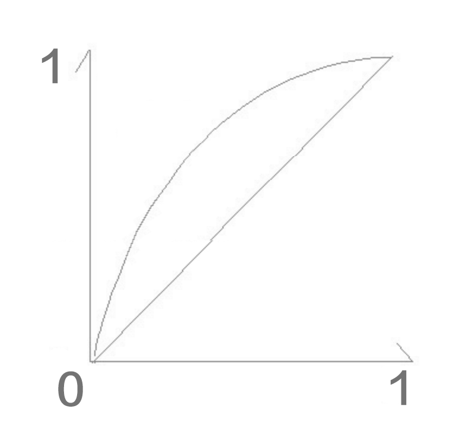

# Android动效与个性化交互（1501210479 白鹤松）

作者：白鹤松

学号：1501210479

在天气预报项目中，当我们点击更新天气按钮后，如果网络速度较慢，在等待的过程中会有按钮旋转的动画效果，减少用户等待的焦急感。

单一的静态页面容易使人感觉枯燥乏味，因此动效越来越受到产品和设计师同学的重视，如此一来，也就增大了对开发同学的考验，虽说简单的动效：如移动，旋转，缩放，渐变或普通的界面跳转相对简单，但在目前日益激烈的竞争条件下，出彩复杂的动效也越来越多

## 
在Android中开发动效有两套框架可以使用，分别为 Animation 和 Property Animation；两者之间的主要区别在于：

1.需要的Anroid API level不一样。Property Animation需要Android API level 11的支持,当然可以使用nineoldandroids.jar进行兼容，而View Animation则是最原始的版本。

2.适用范围不一样Property Animation适用于所有的Object对象，而View Animation则只能应用于View对象。

3.实际改变不一样。Animation改变的是view的绘制位置，而非实际属性；Property Animation改变的是view的实际属性；如：用两套框架分别对一个button做位移动画，用animation处理之后的点击响应会在原处，而用Property Animation处理后的点击响应会在最终位置处。

##1 Animation
总的来说可以分为：Tween Animation（补间动画） 和Frame Animation（帧动画）
###1.1帧动画（Frame Animation）：
帧动画其实就是按照一定的时间间隔进行快速的图片切换，达到视觉上的动画效果，这种动画相对来说缺点较多，
比如：

1.根据动画的复杂度需要切多张图，这样就不可避免的增大了包大小

2.由于是多张图，运行时需要加载到内存，那么又会增大运行时的内存大小

所以如果在动效上有别的方案选择，个人不太建议使用帧动画的实现方式，当然有时候不得不用，这时我们可以尽可能的在效果连贯的基础上减少图片张数；
帧动画的实现也相对简单，就举一个例子，但是例子之中有几条帧动画的使用规则，是我以前在使用的过程中遇到问题后总结出来的；

1.在drawable目录下xml中定义如下文件，节点为animation-list，oneshot代表是否执行一次，duration代表每张图对应展示时间：

    <animation-list xmlns:android="http://schemas.android.com/apk/res/android"  
    android:oneshot="true">  
    <item android:drawable="@drawable/test1" android:duration="200" />  
    <item android:drawable="@drawable/test2" android:duration="200" />  
    <item android:drawable="@drawable/test3" android:duration="200" />  
    </animation-list>  
2.然后将该drawable设置给对应的imageview

3.在activity中
animDrawable = (AnimationDrawable) imageView.getBackground();

4.在onWindowFocusChanged()中调用：

animDrawable.stop();

animDrawable.start();

如果不这么做，那么在性能比较差的机器上很可能就会出现没有播放的情况，因为只显示出了第一帧，问题在于动画没有和view完成关联，所以不要在onCreate中去调用启动，而需要在onWindowFocusChanged中进行调用；

在极特殊的情况下如果还无法播放，则可以mHandler.postDelay 200 毫秒解决。
###1.2补间动画（Tween Animation）
Animation下有五个子类：AlphaAnimation(渐变),RotateAnimation(旋转),ScaleAnimation(缩放),TranslateAnimation(位移)
在实现原理上除了AlphaAnimation是动态的去改变view的alpha值，其他三个都是去改变里面的Matrix；

在Animation框架里，主要的类主要有Animation和Transformation、Interpolator(插值器，后面也会专门讲)
Transformation里面主要对alpha和matrix进行了封装，而改变view的透明度就是改变alpha，移动、旋转、缩放甚至错切则都是改变matrix
Animation里有一个重要的方法applyTransformation，实现自定义Animation也主要是实现这个方法。

以AlphaAnimation为例：
    
    /**  
    * Changes the alpha property of the supplied {@link Transformation}  
    */  
    @Override  
        protected void applyTransformation(float interpolatedTime, Transformation t) {  
        final float alpha = mFromAlpha;  
        t.setAlpha(alpha + ((mToAlpha - alpha) * interpolatedTime));  
    }  
    渐变动画只需要在里面根据当前的interpolatedTime(已经由插值器转换后的值)动态计算出对应的alpha，重新设置到Transformation中即可；
Animation的使用也相对比较简单，可以通过xml配置，也可以通过代码生成。

1.xml配置：

    <?xml version="1.0" encoding="utf-8"?>
    <set xmlns:android="http://schemas.android.com/apk/res/android"
     android:shareInterpolator="false" >

    <scale>

        <!-- 单次运行时间 -->
        android:duration="500"
        <!-- 运行完成后是否保持结束时的状态 -->
        android:fillAfter="true"
        <!-- 运行完成后是否回到开始时的状态 -->
        android:fillBefore="false"
        <!-- 初始时大小，1代表原大小，0代表无 -->
        android:fromXScale="1"
        android:fromYScale="1"
        <!-- 使用的插值器，控制运行过程中的速率 -->
        android:interpolator="@android:anim/accelerate_interpolator"
        <!-- 相对中心点，50%代表自身中心，50%p代表相对父view的中心 -->
        android:pivotX="50%"
        android:pivotY="50%"
        <!-- 重复的次数，infinite代表永久循环 -->
        android:repeatCount="infinite"
        <!-- 重复的模式， restart代表重新开始，reverse代表反转-->
        android:repeatMode="restart"
        <!-- 延迟多久后开始 -->
        android:startOffset="100"
        <!-- 要到达的缩放比例 -->
        android:toXScale="0"
        android:toYScale="0" />
    </scale>
    
    <translate
        android:duration="550"
        <!-- 相对当前位置的像素距离 -->
        android:fromYDelta="300"
        android:interpolator="@android:anim/accelerate_interpolator"
        android:toYDelta="0" />

    <alpha
        android:duration="550"
        android:fromAlpha="0"
        android:toAlpha="1" />

    </set>
当要多个效果同时使用时，则如上使用set标签进行组合，在代码中使用如下：

    Animation animation = AnimationUtils.loadAnimation(getApplicationContext(), R.anim.app_clean_animation);
    view.startAnimation(animation);
##2 Property Animation（属性动画）
属性动画，它更改的是对象的实际属性，在View Animation（Tween Animation）中，其改变的是View的绘制效果，真正的View的属性保持不变，比如无论你在对话中如何缩放Button的大小，Button的有效点击区域还是没有应用动画时的区域，其位置与大小都不变。而在Property Animation中，改变的是对象的实际属性，如Button的缩放，Button的位置与大小属性值都改变了。而且Property Animation不止可以应用于View，还可以应用于任何对象。Property Animation只是表示一个值在一段时间内的改变，当值改变时要做什么事情完全是你自己决定的。
在Property Animation中，可以对动画应用以下属性：

1.TimeInterpolator(插值器，和低版本的Interpolator一样)：属性值的计算方式，如先快后慢

2.TypeEvaluator：根据属性的开始、结束值与TimeInterpolator计算出的因子计算出当前时间的属性值

3.Repeat Count and behavoir：重复次数与方式，如播放3次、5次、无限循环，可以此动画一直重复，或播放完时再反向播放

4.Animation sets：动画集合，即可以同时对一个对象应用几个动画，这些动画可以同时播放也可以对不同动画设置不同开始偏移

5.Frame refreash delay：多少时间刷新一次，即每隔多少时间计算一次属性值，默认为10ms，最终刷新时间还受系统进程调度与硬件的影响

上面都是些概念，但这些东西不必刻意去记，或去理解插值器这样的比较生涩的概念，我们只需要使用他最实用的部分，并熟悉动画的实现套路；
所以对于属性动画主要带大家熟悉两个类，ValueAnimator和ObjectAnimator,通过这两个类我们平常遇到的动效大部分都能够加以解决。
###2.1 ValueAnimator：
ValueAnimator包含了 Property Animation 动画的所有核心功能，如动画时间，开始、结束属性值，相应时间属性值计算方法等。

使用 ValueAnimator 只是为我们创建了一个过程，我们可以用ValueAnimator.ofXXX()进行创建，然后通过各种setXXX()给其设定过程的时间，速率变化效果等，然后通过addUpdateListener()中去拿这个过程中回调回来的中间值，然后使用这些中间值改变view的属性形成动态效果；

上面这句话通过代码表现如下：

比如我们使用 ValueAnimator 在2S内将view横向拉长为2倍，纵向压缩为0：
                
            // 在2S内将view横向拉长为2倍，纵向压缩为0
            // 创建0－1的一个过程,任何复杂的过程都可以采用归一化，然后在addUpdateListener回调里去做自己想要的变化
            ValueAnimator valueAnimator = ValueAnimator.ofFloat(0, 1);
            // 设置过程的时间为2S
            valueAnimator.setDuration(SCALE_ANIM_TIME);
            // 设置这个过程是速度不断变快的
            valueAnimator.setInterpolator(new AccelerateInterpolator());
            // 这个过程中不断执行的回调
            valueAnimator.addUpdateListener(new AnimatorUpdateListener() {
                @Override
                public void onAnimationUpdate(ValueAnimator animation) {
                    // 不断回调的在0-1这个范围内，经过插值器插值之后的返回值
                    float value = (Float) animation.getAnimatedValue();
                    // ViewHelper可直接用于修改view属性
                    // 将宽在2S内放大一倍
                    ViewHelper.setScaleX(mTestImage, 1 + value);
                    // 将高在2S内压缩为0
                    ViewHelper.setScaleY(mTestImage, 1 - value);
                }
            });
            // AnimatorListenerAdapter是AnimatorListener的空实现，根据需要覆盖的方法自行选择
            valueAnimator.addListener(new AnimatorListenerAdapter() {
                @Override
                public void onAnimationStart(Animator animation) {
                    super.onAnimationStart(animation);
                    Toast.makeText(getApplicationContext(), "onAnimationStart", Toast.LENGTH_SHORT)
                            .show();
                }

                @Override
                public void onAnimationEnd(Animator animation) {
                    super.onAnimationEnd(animation);
                    Toast.makeText(getApplicationContext(), "onAnimationEnd", Toast.LENGTH_SHORT)
                            .show();
                }

                @Override
                public void onAnimationCancel(Animator animation) {
                    super.onAnimationCancel(animation);
                }

                @Override
                public void onAnimationRepeat(Animator animation) {
                    super.onAnimationRepeat(animation);
                }
            });
            valueAnimator.start();
动画其实就是在一个时间段内不断去改变view的一些属性值，这些属性值动态变化，不断重绘的过程，也就形成了我们所看到的动效。

那么基于此，我们可以知道这个过程都是通过时间来控制的，时间走过的比例肯定在 0-1 之间，如果我们直接用这个走过的时间比例去算当前属性值，那么整个过程则是匀速（线性）的。

那么在这个基础上，我们想我们的过程是非线性的，我们该怎么办呢，那么只需要对这个时间比例加以加工，具体请看下图：

横轴就是经过的时间比例，肯定是匀速的从0-1，纵轴则是时间比例经过加工后的插值，这个对应过程则是Interpolator（插值器）对应的过程。

减速线则对应DecelerateInterpolater,因为它的斜率越来越平，所以瞬时速度越来越小，则形成了减速效果。

其他的效果类似，目前android里提供的插值器有如下一些：

AccelerateInterpolator　　　　　     加速，开始时慢中间加速

DecelerateInterpolator　　　 　　   减速，开始时快然后减速

AccelerateDecelerateInterolator　   先加速后减速，开始结束时慢，中间加速

AnticipateInterpolator　　　　　　  反向 ，先向相反方向改变一段再加速播放

AnticipateOvershootInterpolator　   反向加回弹，先向相反方向改变，再加速播放，会超出目的值然后缓慢移动至目的值

BounceInterpolator　　　　　　　  跳跃，快到目的值时值会跳跃，如目的值100，后面的值可能依次为85，77，70，80，90，100

CycleIinterpolator　　　　　　　　 循环，动画循环一定次数，值的改变为一正弦函数：Math.sin(2 * mCycles * Math.PI * input)

LinearInterpolator　　　　　　　　 线性，线性均匀改变

OvershottInterpolator　　　　　　  回弹，最后超出目的值然后缓慢改变到目的值

TimeInterpolator　　　　　　　　   一个接口，允许你自定义interpolator，以上几个都是实现了这个接口

其实想实现对应的效果，其实是找一条曲线对对应条件进行模拟，然后根据曲线函数，和X值，得出每个时间点上对应的Y值（插值），这也就是插值器原理。
###2.2 ObjectAnimator
我们同样还是实现在2S内将view横向拉长为2倍，纵向压缩为0：

            AnimatorSet animatorSet = new AnimatorSet();
            // 将view在x方向上从原大小放大2倍
            ObjectAnimator scaleXAnimator = ObjectAnimator.ofFloat(mTestImage, "scaleX", 1, 2);
            scaleXAnimator.setDuration(SCALE_ANIM_TIME);
            // 将view在y方向上从原大小压缩为0
            ObjectAnimator scaleYAnimator = ObjectAnimator.ofFloat(mTestImage, "scaleY", 1, 0);
            scaleYAnimator.setDuration(SCALE_ANIM_TIME);
            // 设置加速模式
            animatorSet.setInterpolator(new AccelerateInterpolator());
            // 设置回调，当然也可以设置在单独的animator上，eg：scaleXAnimator
            animatorSet.addListener(new AnimatorListenerAdapter() {
                @Override
                public void onAnimationStart(Animator animation) {
                    super.onAnimationStart(animation);
                    Toast.makeText(getApplicationContext(), "onAnimationStart", Toast.LENGTH_SHORT)
                            .show();
                }

                @Override
                public void onAnimationEnd(Animator animation) {
                    super.onAnimationEnd(animation);
                    Toast.makeText(getApplicationContext(), "onAnimationEnd", Toast.LENGTH_SHORT)
                            .show();
                }

                @Override
                public void onAnimationCancel(Animator animation) {
                    super.onAnimationCancel(animation);
                }

                @Override
                public void onAnimationRepeat(Animator animation) {
                    super.onAnimationRepeat(animation);
                }
            });
            animatorSet.playTogether(scaleXAnimator, scaleYAnimator);
            animatorSet.start();
ObjectAnimator 是ValueAnimator 的子类，可以直接改变Object的属性，目前可供改变的属性主要有：

translationX,translationY           View相对于原始位置的偏移量

rotation,rotationX,rotationY       旋转，rotation用于2D旋转角度，3D中用到后两个

scaleX,scaleY                           缩放比

x,y                                             View的最终坐标，是View的left，top位置加上translationX，translationY

alpha                                         透明度
