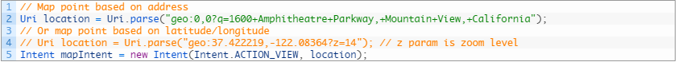
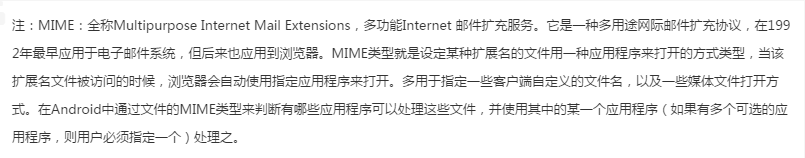
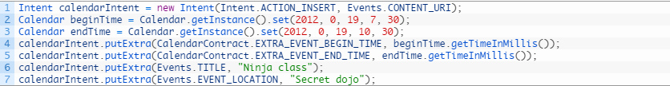
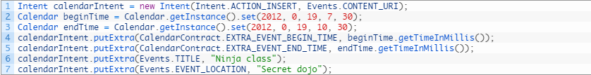
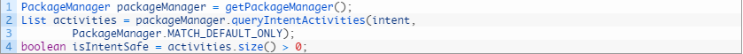
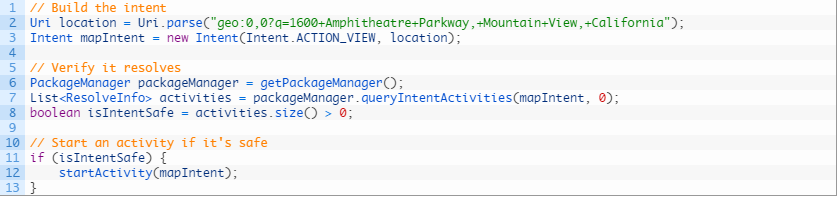
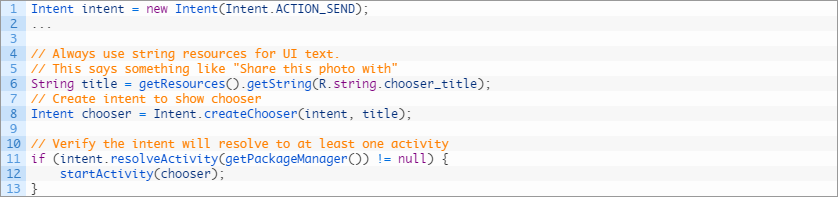

# Android利用Intent与其他应用交互(1501210426  李仕聪)

  Android系统的一个重要特性就是一个应用程序可以调用另外一个应用程序来完成用户的请求动作。比如你的应用程序需要给用户显示一个地理位置在地图上，你不必在你的应用程序中实现地图功能，而是创建一个显示这个地理位置的Intent，发送出去，Android系统会启动那些可以处理这个请求的应用程序。还比如:你用百度云盘下载了一个pdf文档，你在点击打开这个文档的时候百度云盘是无法打开的，但是也许你系统上安装有其他的能打开pdf文档的阅读器，这个时候就会弹出一个对话框，列举了可以打开pdf文档的应用程序，你可以自由选择一个应用程序打开你下载的文档。
  
  * 使用隐式Intent:

  
  隐式Intent不会指明要启动的组件名称，而是声明执行的动作，动作指定了你想要做什么事情，比如显示(view)，编辑(edit)，发送(send)，获取一些东西(get something)等。Intent经常会附带一些数据，比如你要查看的地址，发送邮件的内容等。数据形式依赖于你想要做什么事情，数据可以是一个Uri，也可以是其他数据类型(基本数据类型或者对象)之一。数据不是必须的，你的Intent中可以不包含data。
  
  如果你的数据(data)是Uri，可以利用Intent(action,Uri)的构造函数方便的创建Intent，下面的例子就是创建一个打电话的Intent，数据就是一个包含电话号码的Uri：
  
  
  
  当你在你的应用程序中调用startActivity(Intent,intent)，传入上面的Intent，电话应用程序就会呼叫你上面指定的电话号码。下面是两个利用Intent实现其他功能的例子。
  
  在地图应用上查看地理位置：
  
  
  
  在浏览器上查看请求的网址：
  
  
  
  上面的Intent都是不带data的，但是有的时候Intent需要附带数据，数据可以是string，可以是基本数据类型，你可以调用putExtra()方法设置多个数据。
  
  Intent数据是有数据类型的，这个数据类型叫做MIME类型，默认情况下系统通过数据中包含的Uri数据来确定数据的MIME类型，如果数据中不包含Uri，那么你需要调用setType()设置Intent数据的MIME类型。设置MIME类型进一步指定了哪些类型的Activity可以响应这个Intent。
  
  
  
  下面是附带数据的Intent例子：
  
  发送带有附件的Email：
  
  
  
  创建日历事件(API level 14 and higher)：
  
  
  
  
  
  * 验证Intent是否有效：

  
  尽管Android系统内置的应用程序(比如：电话，邮件，日历)能够保证一些Intent肯定会被响应，但是你在发送一个Intent之前最好是要验证一下Intent能否会被系统处理。如果你发送的Intent没有应用程序能够处理，那么你的应用程序会出现crash现象。
  
  你可以调用queryIntentActivities()方法来验证Intent是否会有Activity响应，queryIntentActivities()返回一个能够响应该Intent的Activity列表，如果列表不为空，那么你就可以放心的发送这个Intent了。验证Intent的代码如下：
  
  
  
  下面的例子是完整的启动地图应用的例子，包含启动前Intent的安全检查：
  
  
  
  * 显示应用选择器：

  
  有的时候你在调用startActivity()向系统请求Activity处理你的请求时会有多个应用程序响应，用户需要选择一个应用程序来处理这个意图请求，这种体验非常好，用户可以自由选择应用程序，也可以指定默认用哪个应用程序响应这个请求，比如拍照，查看图片，上网。给用户显示这种应用选择器需要调用creatChooser()创建你的Intent，例如：
  
  
  
  上面的例子会弹出一个包含很多应用的Dialog，这些应用都是能够响应这个Intent的应用。
  
  
  
  
  
   