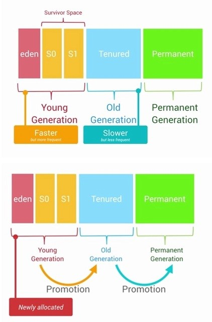
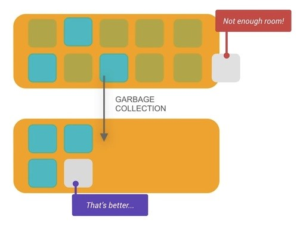
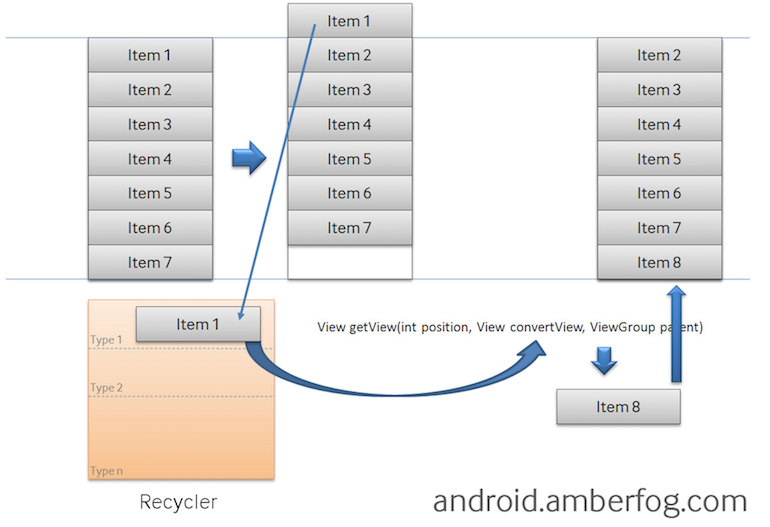
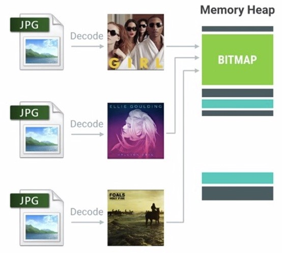
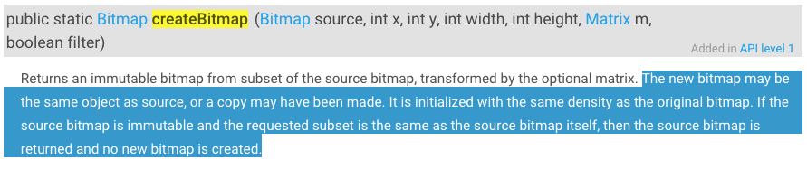
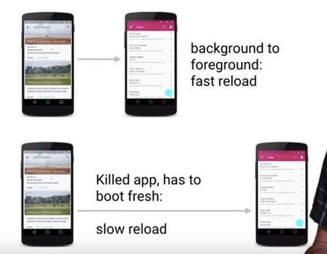
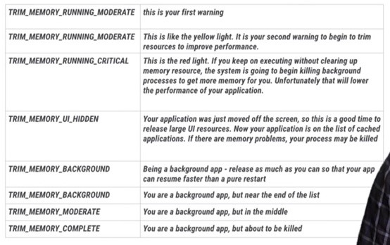
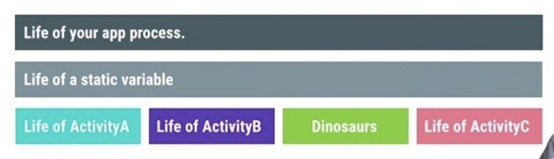
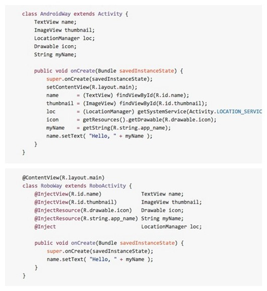

# Android 内存优化

#### 作者：刘亚迪 学号：1501210954

### **摘要**

Android是时下最为流行的智能手机平台，尽管Android有一套自己的内存管理机制，但是用户一致的体验是Android手机会随着使用越来越慢，内存占用越来越多。由于开发人员以及Android系统机制的原因，有很多应用存在着内存泄露甚至导致强制关机等严重问题。本文主要介绍了Android的内存管理机制，探讨安卓应用的内存泄露原因，以及相应的避免方法。`

###### **关键字： Android，内存泄露，内存优化 **

---

# 1 Android内存管理机制
Android系统的Dalvik虚拟机扮演了常规的内存垃圾自动回收的角色，Android系统没有为内存提供交换区，它使用paging与memory-mapping(mmapping)的机制来管理内存，下面简要概述一些Android系统中重要的内存管理基础概念。

## 1.1	共享内存
Android应用的进程都是从一个叫做Zygote的进程fork出来的。Zygote进程在系统启动，并载入通用的framework的代码与资源之后开始启动。为了启动一个新的程序进程，系统会fork Zygote进程生成一个新的进程，然后在新的进程中加载并运行应用程序的代码。这就使得大多数的RAM pages被用来分配给framework的代码，同时促使RAM资源能够在应用的所有进程之间进行共享。

大多数Static的数据被mmapped到一个进程中。这不仅仅让同样的数据能够在进程间进行共享，而且使得它能够在需要的时候被paged out。常见的static数据包括Dalvik Code、app resources、so文件等。
大多数情况下，Android通过显式的分配共享内存区域（例如ashmem或gralloc）来实现动态RAM区域能够在不同进程之间进行共享的机制。比如，Window Surface在App与Screen Compositor之间使用共享的内存，Cursor Buffers在Content Provider与Clients之间共享内存。

## 1.2	分配与回收内存
每一个进程的Dalvik Heap都反映了使用内存的占用范围。这就是通常逻辑意义上提到的Dalvik Heap Size，它可以随着需要进行增长，但是增长行为会有一个系统为它设定上限。逻辑上讲的Heap Size和实际物理意义上使用的内存大小是不对等的，Proportional Set Size(PSS)记录了应用程序自身占用以及与其他进程进行共享的内存。
Android系统并不会对Heap中空闲内存区域做碎片整理。系统仅仅会在新的内存分配之前判断Heap的尾端剩余空间是否足够，如果空间不够会触发GC操作，从而腾出更多空闲的内存空间。在Android的高级系统版本里面针对Heap空间有一个Generational Heap Memory的模型，最近分配的对象会存放在Young Generation区域。当这个对象在该区域停留的时间达到一定程度，它会被移动到Old Generation，最后累积一定时间再移动到Permanent Generation区域。系统会根据内存中不同的内存数据类型分别执行不同的GC操作。例如，刚分配到Young Generation区域的对象通常更容易被销毁回收，同时在Young Generation区域的GC操作速度会比Old Generation区域的GC操作速度更快（如图1所示）。

每一个Generation的内存区域都有固定的大小。随着新的对象陆续被分配到此区域，当对象总的大小临近这一级别内存区域的阀值时，会触发GC操作，以便腾出空间来存放其他新的对象（如图2所示）。

通常情况下，GC发生的时候，所有的线程都是会被暂停的。执行GC所占用的时间和它发生在哪一个Generation也有关系，Young Generation中的每次GC操作时间是最短的，Old Generation其次，Permanent Generation最长。执行时间的长短也和当前Generation中的对象数量有关，遍历树结构查找20000个对象比起遍历50个对象自然是要慢很多的。

## 1.3	限制应用的内存

为了整个系统的内存控制需要，Android系统为每一个应用程序都设置一个硬性的Dalvik Heap Size最大限制阈值，这个阈值在不同的设备上会因为RAM大小不同而各有差异。如果你的应用占用内存空间已经接近这个阈值，此时再尝试分配内存的话，很容易引发OutOfMemoryError错误。
ActivityManager.getMemoryClass()可以用来查询当前应用的Heap Size阈值，这个方法会返回一个整数，表明应用的Heap Size阈值是多少MB（Megabates）。

## 1.4	应用切换操作
Android系统并不会在用户切换应用的时候执行交换内存操作。Android会把那些不包含Foreground组件的应用进程放到LRU Cache中。例如，当用户开始启动一个应用时，系统会为它创建一个进程。但是当用户离开此应用，进程不会立即被销毁，而是被放到系统的Cache当中。如果用户后来再切换回到这个应用，此进程就能够被马上完整地恢复，从而实现应用的快速切换。
如果你的应用中有一个被缓存的进程，这个进程会占用一定的内存空间，它会对系统的整体性能有影响。因此，当系统开始进入Low Memory的状态时，它会由系统根据LRU的规则与应用的优先级，内存占用情况以及其他因素的影响综合评估之后决定是否被杀掉。

# 2 应用内存泄露原因

作为主要编程语言为JAVA的Android应用，因为JAVA有垃圾回收机制，所以不少人认为Android应该没有内存泄露。其实如果我们一个程序中，如果已经不再使用某个对象，但是因为仍然有引用指向它，垃圾回收器就无法回收它，当然该对象占用的内存就无法被使用，这就造成了内存泄露。如果我们的JAVA运行很久，而这种内存泄露不断的发生，最后就没内存可用了。如果java程序完全结束后，它所 有的对象就都不可达了，系统就可以对他们进行垃圾回收，它的内存泄露仅仅限于它本身，而不会影响整个系统的。

Android的一个应用程序的内存泄露对别的应用程序影响不大。为了能够使得Android应用程序安全且快速的运行，Android的每个应用程序都会使用一个专有的Dalvik虚拟机实例来运行，它是由Zygote服务进程孵化出来的，也就是说每个应用程序都是在属于自己的进程中运行的。

Android为不同类型的进程分配了不同的内存使用上限，如果程序在运行过程中出现了内存泄漏的而造成应用进程使用的内存超过了这个上限，则会被系统视为内存泄漏，从而被终止，这使得仅仅自己的进程被终止，而不会影响其他进程（如果是system_process等系统进程出问题的话，则会引起系统重启）。

## 2.1 引用没释放造成的内存泄露

### 2.1.1 注册没有取消造成的内存泄露
这种Android的内存泄露比JAVA语言使用不当的内存泄露还要严重，因为其他一些Android程序可能引用我们的Anroid程序的对象（比如注册机制）。即使我们的Android程序已经结束了，但是别的引用程序仍然还有对我们的Android程序的某个对象的引用，泄露的内存依然不能被垃圾回收。

比如如下的场景，假设我们希望在锁屏界面(LockScreen)中，监听系统中的电话服务以获取一些信息(如信号强度等)，则可以在LockScreen中定义一个 PhoneStateListener的对象，同时将它注册到TelephonyManager服务中。对于LockScreen对象，当需要显示锁屏界面的时候就会创建一个LockScreen对象，而当锁屏界面消失的时候LockScreen对象就会被释放掉。但是如果在释放LockScreen对象的时候忘记取消我们之前注册的PhoneStateListener对象，则会导致LockScreen无法被 垃圾回收。如果不断的使锁屏界面显示和消失，则最终会由于大量的LockScreen对象没有办法被回收而引起OutOfMemory，使得 system_process进程被终止，导致手机重启等问题。
虽然有些系统程序，它本身有自动取消注册的机制（但是是不及时的），但是我们还是应该在我们的程序中明确的取消注册，程序结束时应该把所有的注册都取消掉。

### 2.1.2 集合中对象没清理造成的内存泄露
我们通常把一些对象的引用加入到了集合中，当我们不需要该对象时，并没有把它的引用从集合中清理掉，这样这个集合就会越来越大。如果这个集合是static的话，那情况就更严重了。

## 2.2 资源对象没关闭造成的内存泄露
资源性对象比如（Cursor，File文件等）往往都用了一些缓冲，我们在不使用的时候，应该及时关闭它们，以便它们的缓冲及时回收内存。它们的缓冲不仅存在于java虚拟机内，还存在于java虚拟机外。如果我们仅仅是把它的引用设置为null，而不关闭它们，往往会造成内存泄露。因为有些资源性对象，比如SQLiteCursor（在析构函数finalize()，如果我们没有关闭它，它自己会调用close()关闭），如果我们没有关闭它，系统在回收它时也会关闭它，但是这样的效率极低。因此对于资源性对象在不使用的时候，应该调用它的close()函数，将其关闭掉，然后才置为null。在我们的程序退出时一定要确保我们的资源性对象已经关闭。

程序中经常会进行查询数据库的操作，但是经常会有使用完毕Cursor后没有关闭的情况。如果我们的查询结果集比较小，对内存的消耗不容易被发现，只有在长时间大量操作的情况下才会复现内存问题，这样就会给以后的测试和问题排查带来困难和风险。

## 2.3 一些不良代码成内存压力

有些代码并不造成内存泄露，但是它们，或是对没使用的内存没进行有效及时的释放，或是没有有效的利用已有的对象而是频繁的申请新内存，对内存的回收和分配造成很大影响的，容易迫使虚拟机不得不给该应用进程分配更多的内存，造成不必要的内存开支。

### 2.3.1 Bitmap问题
Bitmap对象在不使用时,我们应该先调用recycle()释放内存，然后才设置为null。虽然recycle()从源码上看，调用它应该能立即释放Bitmap的主要内存，但是测试结果显示它并没能立即释放内存。但是还是能大大的加速Bitmap的主要内存的释放。

### 2.3.2 构造Adapter问题
以构造ListView的BaseAdapter为例，在BaseAdapter中提供了方法public View getView(int position, View convertView, ViewGroup parent)来向ListView提供每一个item所需要的view对象。初始时ListView会从BaseAdapter中根据当前的屏幕布局实例化一定数量的view对象，同时ListView会将这些view对象缓存起来。当向上滚动ListView时，原先位于最上面的list item的view对象会被回收，然后被用来构造新出现的最下面的list item。这个构造过程就是由getView()方法完成的，getView()的第二个形参View convertView就是被缓存起来的list item的view对象(初始化时缓存中没有view对象则convertView是null)。
由此可以看出，如果我们不去使用convertView，而是每次都在getView()中重新实例化一个View对象的话，即浪费时间，也造成内存垃圾，给垃圾回收增加压力，如果垃圾回收来不及的话，虚拟机将不得不给该应用进程分配更多的内存，造成不必要的内存开支。ListView回收list item的view对象的过程可以查看:

android.widget.AbsListView.java -> void addScrapView(View scrap) 方法。

在android的开发中，要时刻主要内存的分配和垃圾回收，因为系统为每一个dalvik虚拟机分配的内存是有限的，在google的G1中，分配的最大堆大小只有 16M，后来的机器一般都为24M，这样就需要我们在开发过程中要时刻注意，不要因为自己的代码问题而造成内存泄露问题。

# 3 如何避免内存泄露
前文介绍了一些基础的内存管理机制以及Android内存泄露的原因，那么在实践操作当中为了避免内存泄露，可以从四个方面着手，首先是减小对象的内存占用，其次是内存对象的重复利用，然后是避免对象的内存泄露，最后是内存使用策略优化。

## 3.1 减小对象的内存占用
避免内存泄露的第一步就是要尽量减少新分配出来的对象占用内存的大小，尽量使用更加轻量的对象。
### 3.1.1 使用更加轻量的数据结构
例如，我们可以考虑使用ArrayMap/SparseArray而不是HashMap等传统数据结构。图8演示了HashMap的简要工作原理，相比起Android专门为移动操作系统编写的ArrayMap容器，在大多数情况下，都显示效率低下，更占内存。通常的HashMap的实现方式更加消耗内存，因为它需要一个额外的实例对象来记录Mapping操作。另外，SparseArray更加高效，在于他们避免了对key与value的自动装箱（autoboxing），并且避免了装箱后的解箱。
### 3.1.2 避免在Android里面使用Enum
Android官方培训课程提到过“Enums often require more than twice as much memory as static constants. You should strictly avoid using enums on Android.”
### 3.1.3 减小Bitmap对象的内存占用
Bitmap是一个极容易消耗内存的大胖子，减小创建出来的Bitmap的内存占用可谓是重中之重，通常来说有以下2个措施：
inSampleSize：缩放比例，在把图片载入内存之前，我们需要先计算出一个合适的缩放比例，避免不必要的大图载入。
decode format：解码格式，选择ARGB_8888/RBG_565/ARGB_4444/ALPHA_8，存在很大差异。
### 3.1.4 使用更小的图片
在涉及给到资源图片时，我们需要特别留意这张图片是否存在可以压缩的空间，是否可以使用更小的图片。尽量使用更小的图片不仅可以减少内存的使用，还能避免出现大量的InflationException。假设有一张很大的图片被XML文件直接引用，很有可能在初始化视图时会因为内存不足而发生InflationException，这个问题的根本原因其实是发生了内存泄露。
## 3.2 内存对象的重复利用
大多数对象的复用，最终实施的方案都是利用对象池技术，要么是在编写代码时显式地在程序里创建对象池，然后处理好复用的实现逻辑。要么就是利用系统框架既有的某些复用特性，减少对象的重复创建，从而降低内存的分配与回收。
### 3.2.1 复用系统自带的资源
Android系统本身内置了很多的资源，比如字符串、颜色、图片、动画、样式以及简单布局等，这些资源都可以在应用程序中直接引用。这样做不仅能减少应用程序的自身负重，减小APK的大小，还可以在一定程度上减少内存的开销，复用性更好。但是也有必要留意Android系统的版本差异性，对那些不同系统版本上表现存在很大差异、不符合需求的情况，还是需要应用程序自身内置进去。

*注意ListView/GridView等出现大量重复子组件的视图里对ConvertView的复用。如图3。*

### 3.2.2 Bitmap对象的复用
在ListView与GridView等显示大量图片的控件里，需要使用LRU的机制来缓存处理好的Bitmap。利用inBitmap的高级特性提高Android系统在Bitmap分配与释放执行效率(注：3.0以及4.4以后存在一些使用限制上的差异)。使用inBitmap属性可以告知Bitmap解码器去尝试使用已经存在的内存区域，新解码的Bitmap会尝试去使用之前那张Bitmap在Heap中所占据的pixel data内存区域，而不是去问内存重新申请一块区域来存放Bitmap。利用这种特性，即使是上千张的图片，也只会仅仅只需要占用屏幕所能够显示的图片数量的内存大小。如图4所示。

## 3.3 避免对象的内存泄露
内存对象的泄漏，会导致一些不再使用的对象无法及时释放，这样一方面占用了宝贵的内存空间，很容易导致后续需要分配内存的时候，空闲空间不足而出现OOM。显然，这还使得每级Generation的内存区域可用空间变小，GC就会更容易被触发，容易出现内存抖动，从而引起性能问题。
### 3.3.1 注意Activity的泄漏
通常来说，Activity的泄漏是内存泄漏里面最严重的问题，它占用的内存多，影响面广，我们需要特别注意以下两种情况导致的Activity泄漏：
* （1）内部类引用导致Activity的泄漏
最典型的场景是Handler导致的Activity泄漏，如果Handler中有延迟的任务或者是等待执行的任务队列过长，都有可能因为Handler继续执行而导致Activity发生泄漏。此时的引用关系链是Looper -> MessageQueue -> Message -> Handler -> Activity。为了解决这个问题，可以在UI退出之前，执行remove Handler消息队列中的消息与runnable对象。或者是使用Static + WeakReference的方式来达到断开Handler与Activity之间存在引用关系的目的。
* （2）Activity Context被传递到其他实例中，这可能导致自身被引用而发生泄漏。
内部类引起的泄漏不仅仅会发生在Activity上，其他任何内部类出现的地方，都需要特别留意，我们可以考虑尽量使用static类型的内部类，同时使用WeakReference的机制来避免因为互相引用而出现的泄露。

### 3.3.2 考虑使用Application Context而不是Activity Context
对于大部分非必须使用Activity Context的情况（Dialog的Context就必须是Activity Context），我们都可以考虑使用Application Context而不是Activity的Context，这样可以避免不经意的Activity泄露。
### 3.3.3 注意临时Bitmap对象的及时回收
虽然在大多数情况下，我们会对Bitmap增加缓存机制，但是在某些时候，部分Bitmap是需要及时回收的。例如临时创建的某个相对比较大的bitmap对象，在经过变换得到新的bitmap对象之后，应该尽快回收原始的bitmap，这样能够更快释放原始bitmap所占用的空间。需要特别留意的是Bitmap类里面提供的createBitmap()方法，如图5所示：

该函数返回的bitmap有可能和source bitmap是同一个，在回收的时候，需要特别检查source bitmap与return bitmap的引用是否相同，只有在不等的情况下，才能够执行source bitmap的recycle方法。

### 3.3.4 注意监听器的注销

在Android程序里面存在很多需要register与unregister的监听器，我们需要确保在合适的时候及时unregister那些监听器。自己手动add的listener，需要记得及时remove这个listener。

### 3.3.5 注意WebView的泄漏
Android中的WebView存在很大的兼容性问题，不仅仅是Android系统版本的不同对WebView产生很大的差异，另外不同的厂商出货的ROM里面WebView也存在着很大的差异。更严重的是标准的WebView存在内存泄露的问题。所以通常根治这个问题的办法是为WebView开启另外一个进程，通过AIDL与主进程进行通信，WebView所在的进程可以根据业务的需要选择合适的时机进行销毁，从而达到内存的完整释放。

### 3.3.6 注意Cursor对象是否及时关闭

在程序中我们经常会进行查询数据库的操作，但时常会存在不小心使用Cursor之后没有及时关闭的情况。这些Cursor的泄露，反复多次出现的话会对内存管理产生很大的负面影响，我们需要谨记对Cursor对象的及时关闭。

## 3.4 内存使用策略优化
### 3.4.1 谨慎使用large heap
Android设备根据硬件与软件的设置差异而存在不同大小的内存空间，他们为应用程序设置了不同大小的Heap限制阈值。你可以通过调用getMemoryClass()来获取应用的可用Heap大小。在一些特殊的情景下，你可以通过在manifest的application标签下添加largeHeap=true的属性来为应用声明一个更大的heap空间。然后，你可以通过getLargeMemoryClass()来获取到这个更大的heap size阈值。然而，声明得到更大Heap阈值的本意是为了一小部分会消耗大量RAM的应用(例如一个大图片的编辑应用)。不要轻易的因为你需要使用更多的内存而去请求一个大的Heap Size。只有当你清楚的知道哪里会使用大量的内存并且知道为什么这些内存必须被保留时才去使用large heap。因此请谨慎使用large heap属性。使用额外的内存空间会影响系统整体的用户体验，并且会使得每次GC的运行时间更长。在任务切换时，系统的性能会大打折扣。另外, large heap并不一定能够获取到更大的heap。在某些有严格限制的机器上，large heap的大小和通常的heap size是一样的。因此即使你申请了large heap，你还是应该通过执行getMemoryClass()来检查实际获取到的heap大小。
### 3.4.2 综合考虑设备内存阈值与其他因素设计合适的缓存大小
例如，在设计ListView或者GridView的Bitmap LRU缓存的时候，需要考虑的点有：
* （1）应用程序剩下了多少可用的内存空间
* （2）有多少图片会被一次呈现到屏幕上？有多少图片需要事先缓存好以便快速滑动时能够立即显示到屏幕？
* （3）设备的屏幕大小与密度是多少? 一个xhdpi的设备会比hdpi需要一个更大的Cache来保存同样数量的图片。
* （4）不同的页面针对Bitmap的设计的尺寸与配置是什么，大概会花费多少内存？
* （5）页面图片被访问的频率？是否存在其中的一部分比其他的图片具有更高的访问频繁？如果是，也许你想要保存那些最常访问的到内存中，或者为不同组别的位图(按访问频率分组)设置多个LruCache容器。

### 3.4.3 onLowMemory()与onTrimMemory()
Android用户可以随意在不同的应用之间进行快速切换。为了让background的应用能够迅速的切换到forground，每一个background的应用都会占用一定的内存。Android系统会根据当前的系统的内存使用情况，决定回收部分background的应用内存。如果background的应用从暂停状态直接被恢复到forground，能够获得较快的恢复体验，如果background应用是从Kill的状态进行恢复，相比之下就显得稍微有点慢，如图6所示。

* onLowMemory()：Android系统提供了一些回调来通知当前应用的内存使用情况，通常来说，当所有的background应用都被kill掉的时候，forground应用会收到onLowMemory()的回调。在这种情况下，需要尽快释放当前应用的非必须的内存资源，从而确保系统能够继续稳定运行。
* onTrimMemory(int)：Android系统从4.0开始还提供了onTrimMemory()的回调，当系统内存达到某些条件的时候，所有正在运行的应用都会收到这个回调，同时在这个回调里面会传递以下的参数，代表不同的内存使用情况，收到onTrimMemory()回调的时候，需要根据传递的参数类型进行判断，合理的选择释放自身的一些内存占用，一方面可以提高系统的整体运行流畅度，另外也可以避免自己被系统判断为优先需要杀掉的应用。

当程序正在前台运行的时候，可能会接收到从onTrimMemory()中返回的下面的值之一：

* TRIM_MEMORY_RUNNING_MODERATE：你的应用正在运行并且不会被列为可杀死的。但是设备此时正运行于低内存状态下，系统开始触发杀死LRU Cache中的Process的机制。
* TRIM_MEMORY_RUNNING_LOW：你的应用正在运行且没有被列为可杀死的。但是设备正运行于更低内存的状态下，你应该释放不用的资源用来提升系统性能。
* TRIM_MEMORY_RUNNING_CRITICAL：你的应用仍在运行，但是系统已经把LRU Cache中的大多数进程都已经杀死，因此你应该立即释放所有非必须的资源。如果系统不能回收到足够的RAM数量，系统将会清除所有的LRU缓存中的进程，并且开始杀死那些之前被认为不应该杀死的进程，例如那个包含了一个运行态Service的进程。

当应用进程退到后台正在被Cached的时候，可能会接收到从onTrimMemory()中返回的下面的值之一：

* TRIM_MEMORY_BACKGROUND: 系统正运行于低内存状态并且你的进程正处于LRU缓存名单中最不容易杀掉的位置。尽管你的应用进程并不是处于被杀掉的高危险状态，系统可能已经开始杀掉LRU缓存中的其他进程了。你应该释放那些容易恢复的资源，以便于你的进程可以保留下来，这样当用户回退到你的应用的时候才能够迅速恢复。
* TRIM_MEMORY_MODERATE: 系统正运行于低内存状态并且你的进程已经接近LRU名单的中部位置。如果系统开始变得更加内存紧张，你的进程是有可能被杀死的。
* TRIM_MEMORY_COMPLETE: 系统正运行于低内存的状态并且你的进程正处于LRU名单中最容易被杀掉的位置。你应该释放任何不影响你的应用恢复状态的资源。

因为onTrimMemory()的回调是在API 14才被加进来的，对于老的版本，你可以使用onLowMemory)回调来进行兼容。onLowMemory相当与TRIM_MEMORY_COMPLETE。
请注意：当系统开始清除LRU缓存中的进程时，虽然它首先按照LRU的顺序来执行操作，但是它同样会考虑进程的内存使用量以及其他因素。占用越少的进程越容易被留下来。

### 3.4.4 资源文件需要选择合适的文件夹进行存放
我们知道hdpi/xhdpi/xxhdpi等等不同dpi的文件夹下的图片在不同的设备上会经过scale的处理。例如我们只在hdpi的目录下放置了一张100\*100的图片，那么根据换算关系，xxhdpi的手机去引用那张图片就会被拉伸到200\*200。需要注意到在这种情况下，内存占用是会显著提高的。对于不希望被拉伸的图片，需要放到assets或者nodpi的目录下。
### 3.4.5 Try catch某些大内存分配的操作
在某些情况下，我们需要事先评估那些可能发生OOM的代码，对于这些可能发生OOM的代码，加入catch机制，可以考虑在catch里面尝试一次降级的内存分配操作。例如decode bitmap的时候，catch到OOM，可以尝试把采样比例再增加一倍之后，再次尝试decode。
### 3.4.6 谨慎使用static对象
因为static的生命周期过长，和应用的进程保持一致，使用不当很可能导致对象泄漏，在Android中应该谨慎使用static对象（如图8所示）。

### 3.4.7 特别留意单例对象中不合理的持有
虽然单例模式简单实用，提供了很多便利性，但是因为单例的生命周期和应用保持一致，使用不合理很容易出现持有对象的泄漏。
### 3.4.8 珍惜Services资源
如果你的应用需要在后台使用Service，除非它被触发并执行一个任务，否则其他时候Service都应该是停止状态。另外需要注意当这个Service完成任务之后因为停止Service失败而引起的内存泄漏。 当你启动一个Service，系统会倾向为了保留这个Service而一直保留Service所在的进程。这使得进程的运行代价很高，因为系统没有办法把Service所占用的RAM空间腾出来让给其他组件，另外Service还不能被Paged Out。这减少了系统能够存放到LRU缓存当中的进程数量，它会影响应用之间的切换效率，甚至会导致系统内存使用不稳定，从而无法继续保持住所有目前正在运行的Service。 建议使用IntentService，它会在处理完交代给它的任务之后尽快结束自己。
### 3.4.9 优化布局层次，减少内存消耗
越扁平化的视图布局，占用的内存就越少，效率越高。我们需要尽量保证布局足够扁平化，当使用系统提供的View无法实现足够扁平的时候考虑使用自定义View来达到目的。
### 3.4.10 谨慎使用“抽象”编程
很多时候，开发者会使用抽象类作为“好的编程实践”，因为抽象能够提升代码的灵活性与可维护性。然而，抽象会导致一个显著的额外内存开销：他们需要同等量的代码用于、执行，那些代码会被mapping到内存中，因此如果你的抽象没有显著的提升效率，应该尽量避免他们。
### 3.4.11 使用nano protobufs序列化数据
Protocol buffers是由Google为序列化结构数据而设计的，一种语言无关，平台无关，具有良好的扩展性。类似XML，却比XML更加轻量，快速，简单。如果你需要为你的数据实现序列化与协议化，建议使用nano protobufs。
### 3.4.12 谨慎使用依赖注入框架
使用类似Guice或者RoboGuice等框架注入代码，在某种程度上可以简化你的代码。图9是使用RoboGuice前后的对比图：

使用RoboGuice之后，代码是简化了不少。然而，那些注入框架会通过扫描你的代码执行许多初始化的操作，这会导致你的代码需要大量的内存空间来mapping代码，而且mapped pages会长时间的被保留在内存中。除非真的很有必要，建议谨慎使用这种技术。

# 4 总结
设计风格很大程度上会影响到程序的内存与性能，相对来说，如果大量使用类似Material Design的风格，不仅安装包可以变小，还可以减少内存的占用，渲染性能与加载性能都会有一定的提升。
内存优化并不就是说程序占用的内存越少就越好，如果因为想要保持更低的内存占用，而频繁触发执行gc操作，在某种程度上反而会导致应用性能整体有所下降，这里需要综合考虑做一定的权衡。
Android的内存优化涉及的知识面还有很多：内存管理的细节，垃圾回收的工作原理，如何查找内存泄漏等等都可以展开讲很多。OOM是内存优化当中比较突出的一点，尽量减少OOM的概率对内存优化有着很大的意义。

---

**参考文献**
* [1] Managing Your App's Memory http://developer.android.com/training/articles/memory.html
* [2] Andorid内存优化之OOM 
http://blog.csdn.net/jdsjlzx/article/details/49107183

