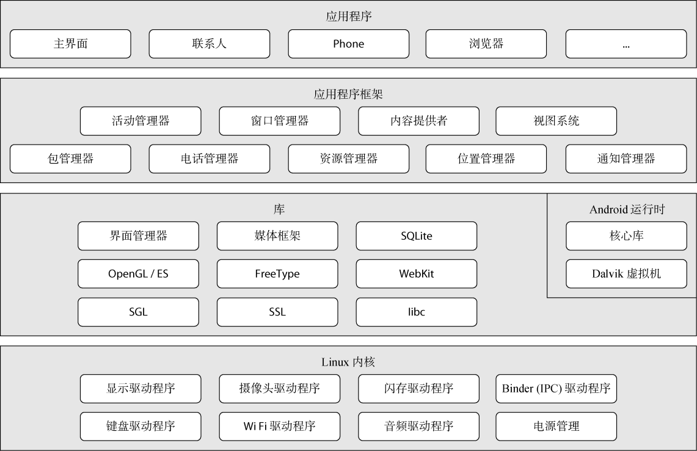

# Android平台下软件安全保护技术的分析（1501210994 王晨）

作者：王晨

学号：1501210994

## 一、Android系统架构
在分析具体的Android平台下软件安全保护技术之前，我们需要先了解一下Android平台的整个系统架构。

如上图所示，Android系统架构分为4个层次，自下而上分别为Linux内核层、系统运行时及库层、应用程序框架层和应用程序层。
1. Linux内核层：Android以Linux操作系统内核为基础，借助Linux内核服务实现硬件设备驱动、进程和内存管理、网络协议栈、电源管理、无线通信等核心系统功能。Android4.0版本之前是基于Linux2.6内核，4.0及之后的版本使用更新的Linux3.X内核。这一层位于硬件与其他的软件层之间，提供与硬件的交互。
2. 系统运行时及库层：这一层主要由两部分组成，Android Runtime和系统库。系统库是为应用程序运行提供服务的一些C/C++库；运行时核心库既包含了Java核心类库的大多数功能，也包含了利用JNI等方式封装的C/C++类库；Dalvik虚拟机是Android中的Java虚拟机，用于执行Android应用程序，在Android中，每一个进程都有独立的Dalvik虚拟机运行实例。
3. 应用程序框架层：为应用开发者提供API框架来访问核心功能，由一系列的服务和组件构成，包括了视图系统、资源管理器、通知管理器、电话管理器等。
4. 应用程序层：这一层由运行在Dalvik虚拟机上的应用程序组成，主要可以分为系统原生应用、第三方应用和开发者应用三种类型。

在这篇文章中，我们主要关注应用程序层的安全问题。

## 二、Android系统安全机制

在Android系统中，实现了三个重要的安全机制，分别为：
1. 沙箱机制：

  在Android系统中，默认应用软件之间是不可信的，甚至用户自行安装的应用程序也是不可信的。在此基础之上，Android使用沙箱机制来实现应用程序之间的分离和权限控制，从而允许或拒绝应用程序访问其他应用程序或系统的资源，如文件和目录、网络、传感器和API。

  Android基于Linux内核安全机制的用户与权限机制，将多用户操作系统的用户隔离机制转换为了对应用程序的隔离。在Android上，一个应用程序对应一个用户，用UID来标识。应用程序在安装时被分配UID，应用程序在设备上的存续期间内，UID保持不变。

  Android 用沙箱来分离每个应用程序，因此要求应用程序必须明确定义要共享的资源和数据。应用程序通过声明来获取它们所需要但基本沙箱所不具备的额外能力。Android没有运行时授权机制，所以应用程序必须静态地声明它们所需要的权限，并且Android系统会在安装应用程序时，提示用户是否同意赋予权限。

2. 数字签名机制：

 每个Android 应用程序都必须被签名，Android系统不会安装没有进行签名的应用程序。
  
 通过私有密钥以数字证书的形式签署一个即将发布的应用程序，从而识别代码的作者、检测应用程序是否被修改和在应用程序之间建立信任。
 
 通过信任关系，应用程序可以安全地共享代码和数据，使用相同数字签名签署的两个应用程序可以相互授予权限来访问基于签名的 API，如果它们共享用户 ID，那么也可以运行在同一进程中，从而允许访问对方的代码和数据。

3. 权限检查机制：

 权限作为 Android 平台的一种安全机制，旨在允许或限制应用程序访问受限的 API  和资源。
 
 由于沙箱机制的存在，默认情况下，Android应用程序没有被授予权限，通过不允许它们访问设备上的受保护 API 或资源，确保了数据的安全。
 
 为了访问首先资源，应用程序需要在安装期间通过xml文件向系统发出请求，由用户授予或不授予。

## 三、Android软件安全威胁

Android平台由于其开源性、采用Java语言编程以及庞大的用户量等特征，遭受到了多方面的安全威胁，主要可以概括为网络威胁、内部威胁和恶意主机威胁。包括缓冲区溢出攻击、协议分析攻击等的网络威胁主要来自远程的外部网络攻击；包括非法访问敏感数据、提升访问权限等的内部威胁来自于内部网络；而目标应用运行于恶意主机上遭受的恶意主机威胁主要包括软件盗版、窃取软件核心算法、非法植入信息等。

对于软件保护而言，主要防范的是来自恶意主机的威胁。
这一节主要讨论的问题就是目前Android平台下的软件主要面临的攻击手段。

1. 非法拷贝：

   这是最简单的一种攻击手段,如果应用程序中无任何软件保护措施,攻击者通过直接复制该应用程序便可达到非法使用的目的。在Android平台上可体现为对apk文件的直接拷贝。
2. 逆向工程分析

   逆向工程分析即攻击者通过对目标程序的二进制代码进行分析,从中得到程序的运行流程、关键算法或敏感信息。
   
   实现逆向工程的具体技术手段可分为静态分析技术和动态调试技术。
   
   静态分析技术是指破解者利用反汇编工具或反编译工具将二进制的可执行文件翻译成汇编代码或程序源代码,通过对代码的分析来破解软件。
   
   具体的静态分析手段可分为反汇编和反编译。反汇编是指逆向人员利用反汇编器将软件的二进制代码还原为汇编语言,然后通过直接分析汇编语言，或再次进行反编译—将汇编码还原成高级代码,逆向软件中的关键算法或敏感信息。反编译是指将二进制的可执行文件翻译成程序源代码。相比于C语言,Java语言由于其二进制文件中包含了更多的类型信息,使得该语言二进制文件的反编译工作很容易完成,可以由二进制文件轻松反编译出程序源代码。Android平台下可以通过dexZjar和jdecomPiler实现反编译Java代码的功能,通过smali和baksmali实现反汇编二进制代码的功能。
   
   动态调试技术则是指破解者利用调试器跟踪软件的运行,寻求破解的途径。在动态分析过程中破解者可跟踪数据值的变化和程序控制流程的走向。Android下常用的动态调试工具为gdb。

3. 篡改

   篡改往往建立在逆向工程分析的基础上,攻击者通过反汇编/反编译/动态调试,获悉了程序的执行流程,针对程序运行中的关键代码进行修改,绕过验证机制,从而达到破解的目的。
   
    按篡改的时间不同,可分为静态篡改和动态篡改两类。

    静态篡改是指在程序运行之前直接去修改二进制程序,需要绕过完整性检测的代码。在Android平台下静态篡改常用的工具为UltraEdit配合Android签名工具,攻击者通过使用UltraEdit修改APK文件中的classes.dex文件或.so文件,然后利用Android签名工具(如apksign)将修改后的应用重新打包。
    
    动态篡改是在程序运行阶段去修改内存中的数据或代码,如各种游戏内存修改器。相对而言,由于应用执行过程是在dalvik虚拟机内部,Android平台下动态篡改比较难以实现。
    
    
## 四、Android软件保护措施
针对上一节提出的安全威胁，目前比较广泛应用的保护手段主要有以下几种。

1. 防止静态分析：

 * 对抗反编译工具：通过大量的apk包测试找到无法反编译的指令或字段，将这些字段或指令用在程序开发的代码中防止他人反编译，方法：利用apktool和dex2jar工具及大量的APK做验证测试找到这些程序无法解析的字段或代码。
 * 代码混淆技术：
   Android应用程序由JAVA语言写成,最后经由SDK和DX工具编译和转换成DEX字节码。通常情况下,编译后的字节码仍然包含了大量的调试信息:源文件名,行号, 字段名,方法名,参数名,变量名等等。这些信息使得它很容易被反编译和通过逆向工程获得完整的程序,给以JAVA为源码的应用程序的安全带来极大的不利。
因此,对字节码作混淆变得尤为重要。

    Android SDK默认使用proguard混淆器来混淆待发布应用中的字节码。Proguard能够删除原来字节码文件中的调试信息,并用无意义的字符序列如a、b、c等字母来替换所有名字,使得它很难进行逆向工程,它进一步地精简代码。除了异常堆栈信息所需要的类名,方法名和行号外,程序只会保留功能上的等价,一定程度上增加了反编译后JAVA源码和SMALI文件阅读理解难度。
 * NDK保护：
Java开发的代码极易反编译并逆向，而利用c/c++开发的.so库等需要查看汇编代码才能逆向还原，难度更大，方法：利用NDK（Native Development Kit）开发核心代码。

    Android程序运行在Dalvik虚拟机中，NDK允许用户使用类似C / C++之类的原生代码语言执行部分程序。NDK包括了：从C/C++生成原生代码库所需要的工具和build files；将一致的原生库嵌入可以在Android设备上部署的应用程序包文件（application packages files ，即.apk文件）中；支持所有未来Android平台的一些列原生系统头文件和库。
使用NDK，不仅可以通过加大C/C++库反汇编的难度从而保护代码，还具有可以方便地使用现存的开源库、提高程序的执行效率和便于移植等好处。
 * 加壳保护：
加壳是一种较独特的软件保护技术。它对原始可执行程序进行加密,并将负责解密的代码置于原始可执行程序之前执行，目的是保护原始程序代码不被非法修改或反编译。加壳后的可执行程序执行时,先将程序在内存中解密,然后将程序控制流程转交给已解密的程序。加壳处理的程序实现难度高,并且受平台限制,但是加壳处理保护程度很高,分析者如果不能成功“脱壳”几乎无法修改和逆向分析。
  
    具体实现过程大致上可分为以下几个步骤：

    将加壳程序放在Application里面执行，因为系统会第一次时间调用Application，这样就保证了加壳程序也第一时间被执行；

    Android apk最终会打包生成dex文件，加壳程序生成dex文件后，将要进行加壳的apk和dex文件合并成一个文件，然后修改dex文件头中的checksum、signature 和file_size的信息，并且要附加加壳的apk的长度信息在dex文件中，以便进行解壳保证原来apk的正常运行。核心实现代码如下图所示：
当程序运行起来后，逆向读取dex文件获取原来的apk文件，通过DexClassLoader动态加载，就可以正常运行原来的apk。
2. 防止动态调试：
可以通过阻止其他人安装应用到模拟器上来实现，这样就无法通过反编译来动态调试应用。
在启动程序时，检查是否运行在模拟器上，若是则让应用程序自杀，关键代码如下图所示：

3. 防止重打包：
 * 签名验证：调用sdk api获取签名信息将签名验证写在程序启动的开头来验证签名是否被重新修改过。核心代码如下图所示：
 
    

    
 * 校验保护：
完整性校验就是用各种算法来计算一个文件的完整性，防止这个文件被修改。其中常用的方法就是计算一个文件的CRC32的值或者计算一个文件的哈希值。

    通过对所有文件进行校验保护来保证整个程序没有被重新打包。

    当然，在防止apk被反编译的方法中也可以采用这种方法，可以对classes.dex文件进行完整性校验，来保证整个程序的逻辑不被修改。
4. 防盗版技术：
放盗版技术的实现主要包括两种方法：软件水印和注册码。

 软件水印是一种软件版权保护技术,它把程序的版权信息和用户身份嵌入到程序中,可以用来标识作者、发行者、所有者、使用者等,作为鉴别非法复制和盗用的软件产品的依据。
 
 注册码技术主要用于防止软件的非授权使用。注册码计算程序根据用户提供的私人信息(如姓名,公司名称等),按照一定的密码算法计算出一个注册码并通过适当方式提供给用户。当用户获取注册码后,按照注册需要的步骤在软件中输入注册信息和注册码,其注册信息的合法性由软件验证通过后,软件提供正常服务。

## 五、总结 

文章主要介绍了目前Android平台下软件面临和安全威胁，以及应对问题的软件保护手段。

但从理论上说,只要拥有足够的资源和时间,所有的软件保护技术都可以被破解。

不过与此同时，我们需要明确的一点是：如果一种保护技术的安全强度达到了让破解者付出比购买软件还要高的成本,这种保护技术就是成功的。

从这个角度来看，不断地钻研寻找更好更完善的软件保护技术还是很有必要的。

 

