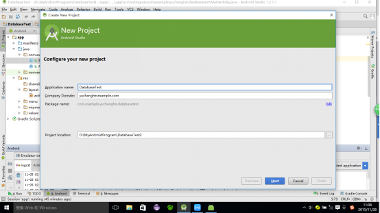
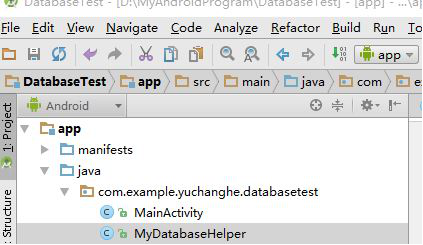
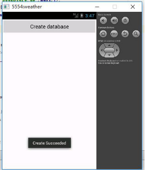
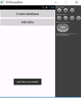

# Android数据库的使用和分析（1501210770 于昌和）
1.SQLite数据库的简介
SQLite，是一款轻型的数据库，是遵守ACID的关系型数据库管理系统，它包含在一个相对小的C库中。它是D.RichardHipp建立的公有领域项目。它的设计目标是嵌入式的，而且目前已经在很多嵌入式产品中使用了它，它占用资源非常的低，在嵌入式设备中，可能只需要几百K的内存就够了。它能够支持Windows/Linux/Unix等等主流的操作系统，同时能够跟很多程序语言相结合，比如 Tcl、C#、PHP、Java等，还有ODBC接口，同样比起Mysql这款开源的世界著名数据库管理系统来讲，它的处理速度比他们都快。SQLite第一个Alpha版本诞生于2000年5月。 至2015年已经有15个年头，SQLite也迎来了一个版本 SQLite 3已经发布。
ACID，指数据库事务正确执行的四个基本要素的缩写。包含：原子性（Atomicity）、一致性（Consistency）、隔离性（Isolation）、持久性（Durability）。一个支持事务（Transaction）的数据库，必需要具有这四种特性，否则在事务过程（Transaction processing）当中无法保证数据的正确性，交易过程极可能达不到交易方的要求。
SQLite是一款轻量级的关系型数据库，它的运算速度非常快，占用资源很少，因而特别适合在移动设备上使用。Android正是把这个功能极为强大的数据库嵌入到了系统当中，使得本地持久化的功能有了一次质的飞跃。
文件系统和SharedPreferences存储毕竟只适用于保存一些简单的数据和键值对，当我们需要存储大量复杂的关系型数据的时候，这两种存储方式很难应付得了。比如我们手机的短信程序中可能会有很多个会话，每个会话又保存了很多条信息内容，并且大部分会话还可能各自对应了电话薄中的某个联系人。像这种情况，很难用文件系统、SharedPreferences
来存储这些数据量大、结构性复杂的数据，但是使用数据库就可以很容易做到。
2、SQLite数据库的使用
   2.1 创建数据库
      Android为了让我们能够更加方便地管理数据库，提供了一个SQLiteOpenHelper帮助类，借助这个类就可以非常方便地对数据库进行创建和升级。
     SQLiteOpenHelper是一个抽象类，这意味着如果我们想要使用它，就需要自己创建一个类去继承它。SQLiteOpenHelper有两个抽象方法，分别是onCreate()和onUpgrade(),我们必须在自己的类里面重写这两个方法，然后分别在这两个方法中去实现创建、升级数据库的逻辑。
SQLiteOpenHelper中还有两个非常重要的实例方法，getReadableDatabase()和getWritableDatabase().这两个方法都可以创建或打开一个现有的数据库（如果数据库已经存在则直接打开，否则创建一个新的数据库），并返回一个可对数据库进行读写操作的对象。不同的是，当数据库不可写入的时候（如磁盘空间已满）getReadableDatabase()方法返回的对象将以只读的方式去打开数据库，而getWritableDatabase()方法则将抛出异常。
SQLiteOpenHelper中有两个构造方法可供重写，一般我们使用参数少的那个构造方法。这个构造方法有四个参数，第一个参数是context,第二个参数是数据库名，创建数据库时使用的就是这里指定的名称，第三个参数是允许我们在查询的时候返回一个自定义的Cursor，一般都是传人null,第四个参数表示当前数据库的版本号，可用于对数据库进行升级操作。构建出SQLiteOpenHelper的实例之后，再调用它的getReadableDatabase()或者是getWritableDatabase()方法就能够创建数据库了，数据库文件会存放在/data/data/<package name>/databases/目录下。此时，重写的onCreate()方法会得到执行，所以通常会在这里去处理一些创建表的逻辑。
2.1.1创建一个DatabaseTest项目
目的：创建一个名为BookStore.db的数据库，然后在这个数据库中新建一张Book表，表中有id(主键)、作者、价格、页数和书名等。
创建数据库表当然需要建表的SQL语句，Book表的建表语句如下：
Create table Book(
id integer primary key autoincrement,
author text,
price real,
pages integer,
Name text
)
integer 表示整型,real表示浮点型，text表示文本类型，blob表示二进制类型。另外，primary key表示将id列设置为主键，并用autoincrement关键字表示id列是自增长的。
第一步：新建一个项目

第二步：新建一个MySQLiteHelper类继承SQLiteHelper

public class MyDatabaseHelper extends SQLiteOpenHelper {
    public static final String CREATE_BOOK="create table Book("
            +"id integer primary key autoincrement,"
            +"author text,"
            +"price real,"
            +"pages integer,"
            +"name text)";
       private Context mContext;
    public MyDatabaseHelper(Context context,String name,SQLiteDatabase.CursorFactory factory,int version){
        super(context,name,factory,version );
        mContext=context;
    }
    @Override
    public void onCreate(SQLiteDatabase db){
        db.execSQL(CREATE_BOOK);
      Toast.makeText(mContext,"Create Succeeded",Toast.LENGTH_LONG).show();
}
    @Override
    public void onUpgrade(SQLiteDatabase db,int oldVersion,int newVersion){
    }
}
第三步：修改activity_main.xml中的代码
<LinearLayout xmlns:android="http://schemas.android.com/apk/res/android"
    xmlns:tools="http://schemas.android.com/tools"
    tools:context=".MainActivity"
    android:layout_width="match_parent"
    android:layout_height="match_parent"
    android:orientation="vertical"
     >
    <Button
        android:id="@+id/create_database"
        android:layout_width="match_parent"
        android:layout_height="wrap_content"
        android:text="Create database"
        />
</LinearLayout>
修改很简单，就是加入了一个按钮，用于创建数据库。
第四步：修改MainActivity中的代码
public class MainActivity extends Activity implements View.OnClickListener{
    private MyDatabaseHelper dbHelper;
    @Override
    protected void onCreate(Bundle savedInstanceState) {
        super.onCreate(savedInstanceState);
        setContentView(R.layout.activity_main);
        dbHelper=new MyDatabaseHelper(this,"BookStore.db",null,1);
        Button createDatabase=(Button)findViewById(R.id.create_database);
        createDatabase.setOnClickListener(this);
    }
      @Override
    public void onClick(View view){
        if(view.getId()==R.id.create_database){
            dbHelper.getWritableDatabase();
        }
    }
}
我们在onCreate()方法中构建了一个MyDatabaseHelper对象，并且通过构造函数的参数将数据库名指定为BookStore.db,版本号指定为1，然后在Create database按钮的点击事件里调用了getWritableDatabase()方法。这样当第一次点击Create database按钮时，就会检测到当前程序中并没有BookStore.db这个数据库，于是会创建该数据库并调用MyDatabaseHelper中的onCreate()方法，这样Book表也就得到了创建，然后会弹出一个Toast提示创建成功。再次点击Create database按钮时，不会再有Toast弹出了，因为此时已经存在BookStore.db数据库了，不会再创建一次，所以不会再有Toast弹出了。
运行结果：
2.2 升级数据库
onUpgrade()方法是用于对数据库进行升级的，现在我们的BookStore.db数据库里已经有一张Book表用于存放书的各种详细数据，现在我们再添加一张Category表用于记录书籍的分类。
Category表中有id(主键)、分类名和分类代码这几个列，建表语句如下：
Create table Category(
id integer primary key autoincrement,
category_name text,
category_code integer
)
第一步：我们将这条建表语句和执行语句添加到MyDatabaseHelper中，代码如下：
public class MyDatabaseHelper extends SQLiteOpenHelper {
    public static final String CREATE_BOOK="create table Book("
            +"id integer primary key autoincrement,"
            +"author text,"
            +"price real,"
            +"pages integer,"
            +"name text)";
    public static final String CREATE_CATEGORY="create table category("
            +"id integer primary key autoincrement,"
            +"category_name text,"
            +"category_code integer)";
    private Context mContext;
    public MyDatabaseHelper(Context context,String name,SQLiteDatabase.CursorFactory factory,int version){
        super(context,name,factory,version );
        mContext=context;
    }
    @Override
    public void onCreate(SQLiteDatabase db){
        db.execSQL(CREATE_BOOK);
        db.execSQL(CREATE_CATEGORY);
        Toast.makeText(mContext,"Create Succeeded",Toast.LENGTH_LONG).show();
}
    @Override
    public void onUpgrade(SQLiteDatabase db,int oldVersion,int newVersion){
    }
}

我们重新运行一下程序，并点击Create database 按钮，我们发现没有弹出创建成功的提示，因为此时BookStore.db数据库已经存在了，之后不管我们怎样点击Create database按钮，MyDatabaseHelper中的onCreate()方法都不会再次执行，因此新添加的表也就无法得到创建。
解决这个问题很简单，只需要先将程序卸载掉，然后重新运行，这时BookStore.db数据库已经不存在了，如果再点击Create database按钮，MyDatabaseHelper中的onCreate()方法就会执行，这时Category表就创建成功了。
不过通过卸载程序的方式来新增一张表是很极端的方法，并且是很不好的方法，因为如果你开发了一个程序，别人下载到手机上了，你的程序版本升级后，你不可能让用户先卸载掉再重装，这是不现实的。
我们运用SQLiteOpenHelper的升级功能就可以解决这个问题，不需要每次去卸载掉以前的程序，只需要稍微修改一下MyDatabaseHelper中的代码。
第二步：在onUpgrade()方法中添加如下代码
public class MyDatabaseHelper extends SQLiteOpenHelper {
......
        @Override
    public void onUpgrade(SQLiteDatabase db,int oldVersion,int newVersion){
	db.execSQL("drop table if exists Book");
	db.execSQL("drop table if exists Category");
	onCreate(db);
    }
}
可以看到，我们在onUpgrade()方法中执行了两条DROP语句，如果发现数据库中已经存在Boook表或Category表了，就将这两张表删除掉，然后再调用onCreate()方法去重新创建。这里先将已经存在的表删除掉，是因为如果在创建表时发现这张表已经存在了，就会直接报错。
如何让onUpgrade()方法得到执行呢？SQLiteOpenHelper的构造方法里接收的第四个参数是数据库的版本号，之前我们传人的是1，现在只要传人一个比1大的数，就可以让onUpgrade()方法得到执行了，注意这个版本号不能从一个大数转换到一个小的数，比如你已经将版本号传入6了，下一次你不能再传入比6小的版本号了，也就是说我们每次更新数据库的时候，传入的数据库版本号是一直递增的。
第三步：修改MainActivity中的代码
public class MainActivity extends Activity implements View.OnClickListener{
    private MyDatabaseHelper dbHelper;
    @Override
    protected void onCreate(Bundle savedInstanceState) {
        super.onCreate(savedInstanceState);
        setContentView(R.layout.activity_main);
        dbHelper=new MyDatabaseHelper(this,"BookStore.db",null,2);
        Button createDatabase=(Button)findViewById(R.id.create_database);
        createDatabase.setOnClickListener(this);
    }
       @Override
    public void onClick(View view){
        if(view.getId()==R.id.create_database){
            dbHelper.getWritableDatabase();
        }
    }
}
我们将版本号指定为2，表示我们对数据库进行了升级。现在重新运行程序，并点击Create database按钮，这时就会再次弹出创建成功的提示。
2.3 添加数据
    我们可以对数据进行的操作有四种，即CRUD。C代表添加（Create）,R代表查询（Retrieve）,U代表更新（Update）,D代表删除（Delete）。每一种操作各自对应了一种SQL命令，添加数据时使用insert,查询数据时使用select，更新数据时使用update,删除数据时使用delete。因为每个开发者的水平都不一样，未必每个人都能非常熟悉地使用SQL语言，因此Android也提供了一系列的辅助性方法，使得在Android中即使不去编写SQL语句，也能轻松完成所有的CRRUD操作。
    SQLiteOpenHelper的getReadableDatabase()或getWritableDatabase()方法可以用于创建和升级数据库，不仅如此，这两个方法还都会返回一个SQLiteDatabase对象，借助这个对象就可以对数据进行CRUD操作。
SQLiteDatabase中提供了一个insert()方法，这个方法就是专门用于添加数据的。它接收三个参数，第一个参数是表名，我们希望向哪张表里添加数据，这里就传入该表的名字。第二个参数用于在未指定添加数据的情况下给某些可为空的列自动赋值NULL，一般我们用不到这个功能，直接传入null即可。第三个参数是一个ContentValues对象，它提供了一系列的put()方法重载，用于向ContentValues中添加数据，只需要将表中的每个列名以及相应的待添加数据传入即可。
第一步：修改activity_main.xml中的代码------添加一个按钮
     <LinearLayout xmlns:android="http://schemas.android.com/apk/res/android"
    xmlns:tools="http://schemas.android.com/tools"
    tools:context=".MainActivity"
    android:orientation="vertical"
    android:layout_width="match_parent"
    android:layout_height="match_parent"
     >
   ......
    <Button
        android:id="@+id/add_data"
        android:layout_width="match_parent"
        android:layout_height="wrap_content"
        android:text="Add data"
        />
</LinearLayout>

第二步：修改MainActivity中的代码
public class MainActivity extends Activity implements View.OnClickListener{
    private MyDatabaseHelper dbHelper;
    @Override
    protected void onCreate(Bundle savedInstanceState) {
        super.onCreate(savedInstanceState);
        setContentView(R.layout.activity_main);
        dbHelper=new MyDatabaseHelper(this,"BookStore.db",null,6);
        Button createDatabase=(Button)findViewById(R.id.create_database);
        createDatabase.setOnClickListener(this);
        Button addData=(Button)findViewById(R.id.add_data);
        addData.setOnClickListener(this);
    }
 public void onClick(View view){
        if(view.getId()==R.id.create_database){
            dbHelper.getWritableDatabase();

        }
        if(view.getId()==R.id.add_data){
            SQLiteDatabase db=dbHelper.getWritableDatabase();
            ContentValues values=new ContentValues();
            //开始组装第一条数据
            values.put("name","The android code");
            values.put("author","fisher");
            values.put("pages",454);
            values.put("price",16.98);
            db.insert("Book", null, values);//插入第一条数据
            values.clear();
            //开始组装第二条数据
            values.put("name","The Lost Symbol");
            values.put("author","Dan Brown");
            values.put("pages",510);
            values.put("price",18.4);
            db.insert("Book", null, values);//插入第二条数据
            Toast.makeText(this,"add date succeeded",Toast.LENGTH_LONG).show();
        }
    }
}
在添加数据按钮的点击事件里面，我们先获取到了SQLiteDatabase对象，然后使用ContentValues来对要添加的数据进行组装。我们只对Book表里其中的四列数据进行了组装，id那一列并没有给它赋值。这是因为在前面创建表的时候，将id列设置为自增长了，它的值会在入库的时候自动生成，所以不需要手动给它赋值了。接下来调用了insert()方法将数据添加到表中，我们添加了两条数据，使用ContentValues分别组装了两次不同的内容，并调用了两次insert()方法。
第三步：重新运行程序
运行界面：
2.4 更新数据
SQLiteDatabase提供了一个update()方法用于对数据进行更新，这个方法有四个参数，第一个参数是表名；第二个参数是ContentValues对象，要把更新的数据在这里组装进去；第三、第四个参数用于去约束更新某一行或某几行中的数据，不指定的话默认就是更新所有行。
第一步：修改activity_main.xml中的代码，添加一个按钮
<LinearLayout xmlns:android="http://schemas.android.com/apk/res/android"
    xmlns:tools="http://schemas.android.com/tools"
    tools:context=".MainActivity"
    android:orientation="vertical"
    android:layout_width="match_parent"
    android:layout_height="match_parent"
     >
......
    <Button
        android:id="@+id/update_data"
        android:layout_width="match_parent"
        android:layout_height="wrap_content"
        android:text="update data"
        />
</LinearLayout>
第二步：修改MainActivity中的代码
public class MainActivity extends Activity implements View.OnClickListener{
    private MyDatabaseHelper dbHelper;
    @Override
    protected void onCreate(Bundle savedInstanceState) {
        super.onCreate(savedInstanceState);
        setContentView(R.layout.activity_main);
        dbHelper=new MyDatabaseHelper(this,"BookStore.db",null,6);
         ......
        Button updateData=(Button)findViewById(R.id.update_data);
        updateData.setOnClickListener(this);
    }
 @Override
    public void onClick(View view){
        if(view.getId()==R.id.create_database){
            dbHelper.getWritableDatabase();
        }
        if(view.getId()==R.id.add_data){
	......
        }
        if(view.getId()==R.id.update_data){
            SQLiteDatabase db=dbHelper.getWritableDatabase();
            ContentValues values=new ContentValues();
            values.put("price",10.99);
            db.update("Book", values, "name=?", new String[]{"The android code"});
            Toast.makeText(this,"update date succeeded",Toast.LENGTH_LONG).show();
        }
    }
}
在更新按钮的点击事件里面构建了一个ContentValues对象，并且只给它指定了一组数据，只是把价格这一列的数据更新成10.99，然后调用了SQLiteDatabase的update()方法去执行具体的更新操作，第三、第四个参数来指定具体更新哪几行。第三个参数对应的是SQL语句的where部分，表示去更新所有name等于？的行，而？是一个占位符，可以通过第四个参数提供的一个字符串数组为第三个参数中的每个占位符指定相应的内容。上述代码的意图就是，将名字是The android code的这本书的价格改成10.99。
第三步：重新运行程序
运行界面：

