# Android渲染机制以及渲染性能优化(1501210616 刘璐)
深刻理解Android绘图机制对于Android学习来说至关重要,在实际的Android应用中越来越多的开发人员开始重视应用流畅度方面的测试，最基础的就是要了解Android应用程序是如何在屏幕上显示的，而这篇文章就是讲述Android的渲染机制以及如何对渲染进行性能优化。

### **一．渲染机制**

我们可以用一句话来描述Android应用程序的显示过程：SurfaceFlinger服务被Android应用程序调用把经过测量、布局和绘制后的窗口渲染到显示屏幕上。SurfaceFlinger是Android的一个系统服务，负责管理Android系统的帧缓冲区，即显示屏幕。Surface代表的是Android应用程序的每个窗口，每一个Surface对应一个画布，它就代表着Android应用程序的一个窗口。

**1.UI组件**

一个Android应用程序窗口里面包含了很多UI元素，所有的UI元素都被排列在一个独立的视图树中，我们在开发过程中习惯在一个xml或者多个xml中指定一个视图树。具体结构如下图所示：

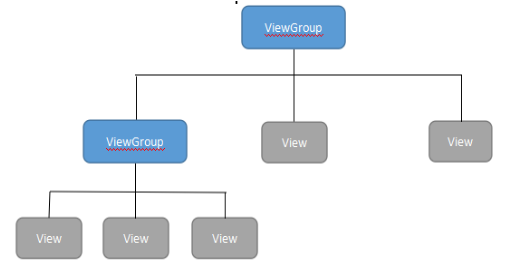

ViewGroup，是一种容器，可以包含View作为叶子节点，也可以包含比它层次低的ViewGroup，而子ViewGroup又可以包含比它层次低的叶子节点的View和ViewGroup。ViewGroup也就是视图组，是布局的基类，它也可以包含其他视图。如FrameLayout,LinearLayout,RelativeLayout等。UI组件的基本创建块是View类，我们在屏幕的一个矩形区域显示它的视图，并负责绘制和事件处理。View类是基本控件的基类，可以用来创建UI元素（如Imageview，button，文本textview等）。
如果让我们在一个界面上绘制一个矩形，我们第一个要知道矩形的位置，第二个要知道矩形的尺寸，也就是长和宽，只有这样我们才能准确的画出这个矩形。Android绘制图形的时候和我们人的思路是一样的，也要知道这两件事情。Android在绘制一个应用程序窗口的UI之前，我们首先要确定它里面的各个子UI组件在父UI组件里面的尺寸以及位置，而这个确定过程又称为测量过程和布局过程。测量、布局和绘制是Android应用程序窗口的UI渲染的三个阶段。测量阶段在函数measure中完成，简单的来说就是运用深度遍历的方法对一个视图树从上而下进行遍历，递归阶段，每个视图将自己尺寸规则传递给自己的子视图。测量阶段结束时，每个视图都已经保存了自己的测量规则。布局阶段发生在layout中,同测量阶段一样，采用深度遍历的方法，由上到下进行遍历。在布局阶段中，每个父UI组件会根据测量阶段中计算出来的尺寸放置其子UI组件。最后一个阶段，绘制阶段，它是通过遍历视图树并呈现视图树种有效区域内的每个UI组件而完成绘制。因为视图树是按深度优先遍历，也就是说父UI组件会在子UI组件之前被绘制，最后是按照顺序出现的的兄弟UI组件。

**2.SurfaceFlinger服务**

  SurfaceFlinger服务对我们来说很陌生，在这里也是很浅显的讲述其基本原理，它是运行在Android系统的System进程中负责管理Android系统的帧缓冲区的一个服务。Android设备的屏幕就被当做是一个帧缓冲区，而SurfaceFlinger服务绘制的界面时候就是通过向帧缓冲区输入内容来完成界面绘制的。SurfaceFlinger服务接收到Android应用程序窗口请求，然后创建了一个绘图表面，接着请求为该绘图表面创建图形缓冲区，接下来应用程序就会往这些请求好的图形缓冲区填充自己的UI数据，当填充完成之后，它就可以在次向SurfaceFlinger服务发送请求，请求将UI数据渲染到硬件帧缓冲区中去，最后的结果就是我们在屏幕上看到了应用程序窗口的UI。Android应用程序只有和SurfaceFlinger服务进行通信，才能够将自己的UI显示在Android的屏幕上，它们之间具体的关系看下图：

 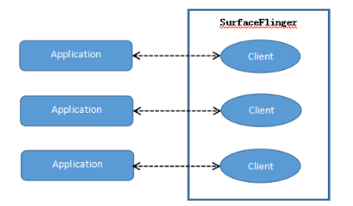
 
 通过上图我们可以看到，SurfaceFlinger服务和Android应用程序是一对一服务的，它们之间有一个连接，而这个连接是Binder对象来完成的。当应用程序与SurfaceFlinger服务建立连接的时候，Client对象被SurfaceFlinger服务创建的 ，当它们连接成功之后，Android应用程序就可以获得一个对应的Client对象的Binder接口，Android应用程序就可以用其来绘制自己的窗口界面了。
要想让SurfaceBinder来绘制自己的UI,Android应用程序需要将UI数据传递给SurfaceFlinger，包括绘制的区域以及位置信息等等。一个应用程序会有多个窗口，就会有多个UI数据，Android系统提供了一种匿名共享内存机制，它以驱动程序的形式实现在内核空间中。它有两个特点，一是作为内存管理系统的辅助，来管理不再使用的内存块，二是它可以用来实现进程间的内存共享(详细的内容不再概述）。每一个应用程序与SurfaceFlinger服务会通过一块匿名共享内存来方便传递UI数据，如下图所示:

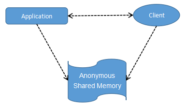

单个的匿名共享内存在传递多个窗口数据时缺乏有效的管理，所以一个更上层的更抽象的数据结构SharedClient产生了，它是匿名共享内存的抽象化，结构如下图所示：

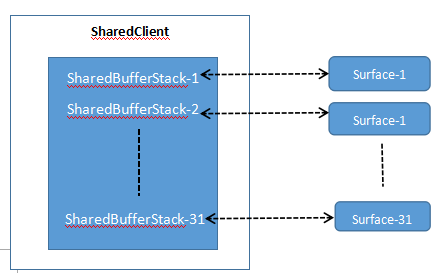

我们在上图中可以看到，每个SharedClient中不多于31个SharedBufferStack，每个窗口都对应一个SharedBufferStack。SharedBufferStack就是共享缓冲区堆栈,由Android应用程序和SurfaceFlinger程序共享，每一个SharedBufferStack就是一个缓冲区，只不过这个缓冲区需要按照一定规则进行访问。一个Android应用程序可能包含有多个界面，每一个SharedClient对应一个Android应用程序，也就是说一个应用程序包含的界面窗口不多于31个。

**3.渲染**

Android系统触发对UI进行渲染是通过每16ms发出一次VSYNC信号来实现的，所以在渲染过程中，只要保证16ms以内就能达到一个流畅的画面，用户就不会感觉到卡顿。如下图所示：

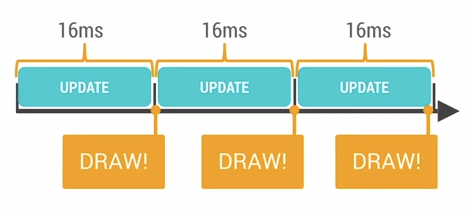

16ms也就是1000/60hz，相当于60fps，为什么会是16ms，这是人的生物构造决定的，超过60fps的画面更新的速度，人眼与大脑之间就无法感知。手动快速翻动书籍的帧率大概是12fps，我们明显感觉到这并不是非常流畅的。由于运动模糊的效果，24fps就会让我们感觉到连续线性的运动，同时也是电影胶圈通常使用的帧率。但是要想顺畅表现绚丽的画面内容至少在30fps以上，所以最合适的帧率就是60fps来达到想要的效果。
渲染是通过GPU和CPU共同完成的，CPU（测量-->布局--->记录--->执行）---->GPU(光栅化：计算每一个像素点的值）。UI组件转换到屏幕显示的原理过程：核心步骤：rasterization光栅化，其含义就是将图转化为一个个栅格组成的图象，每一个元素也就是意味着帧缓冲区中的一个像素。如下图所示：

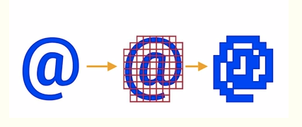

光栅化是一种非常消耗资源的活动，GPU就是为了解决这个问题而在上个世纪90年代引入的单独的图像处理单元。GPU使用一些特定的基础指令集（polygons多边形，textures 文理，images图像)，而CPU通过给GPU输入这些指令才能画东西到屏幕前，Android的OpenGLES。这意味着如果画一个按钮，会在CPU中先转化为polygons多边形、texture纹理，传递给GPU进行光栅化。过程如下图所示：

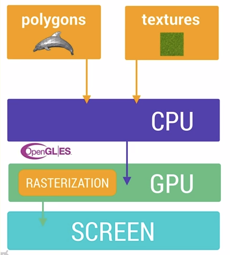

例如一张图片的显示，首先CPU经过计算，将其加载到内存，然后再将其传递给GPU，GPU再对其进行渲染。相比图片而言，文字的显示更加复杂，首先需要经过CPU将文字换算成纹理，然后GPU对处理后的结果进行渲染。

### **二．性能优化**

**1.Overdraw的检测与优化**

Overdraw(过度绘制)就是指在同一帧的时间内屏幕上的某个像素被重复绘制。在多层次复杂的UI结构里面，更容易出现过度绘制的问题，可能会存在一些绘制操作被不可见的UI进行，这会导致重复绘制某些像素。这会导致浪费大量的CPU以及GPU资源的浪费。在实际应用开发中，我们为了在设计上追求更华丽的视觉效果，就容易通过越来越多的层叠组件来实现自己想要的视觉效果。这也是容易导致大量的性能问题出现的原因，为了避免这个问题，我们必须尽量减少Overdraw的情况。在Android手机中，可以通过手机设置里面的开发者选项，选择Show GPU Overdraw的选项，然后我们就能观察UI上的过度绘制了情况了。

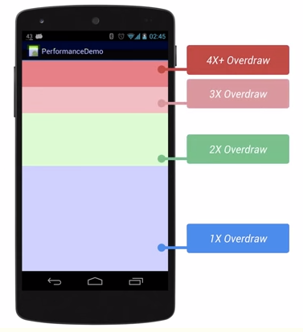

Overdraw情况分为4种不同的情况，蓝色，淡绿，淡红，深红。而我们开发者的目标就是尽量减少红色的区域，看到更多的蓝色区域。我检查了自己的天气预报项目，得到的结果如下图所示：

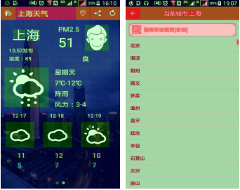

可以看到过度绘制的情况还是存在，有时候是因为UI布局存在大量重叠的部分，还有的时候是因为非必须的重叠背景。例如某个Activity有一个背景，然后里面的Layout有独立的背景，巧合的是子View又都有单独的背景。我们可以通过移除非必须背景颜色或者是背景图片，这就能够减少大量的红色Overdraw区域，增加蓝色区域的占比。Overdraw的处理办法之一就是移除不必要的背景颜色或者是北京图片，在我的天气预报中，Overdraw 最严重的就是这个界面中的返回键区域。那部分的代码布局如下，我们可以看到出现了重复定义背景颜色：

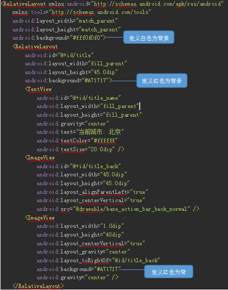

当我把第一个和最后一个重复的背景色删除之后，再去检测一下过度绘制，得到的结果如图：

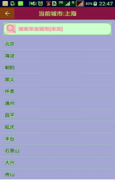

通过上图我们可以看到，过度绘制的情况有所改善，在以后的应用开发过程中，要注意过度绘制的情况。

**2.渲染性能检测*

除了上个查看过度渲染的工具之外，我们还可以打开手机里面的开发者选项，选择Profile GPU Rendering，选中On screen as bars的选项。然后手机屏幕上就会出现三个颜色组成的小柱状图,以及一条绿线，当你的应用程序在运行时,你会看到一排柱状图在屏幕上,从左到右动态地显示,每一个垂直的柱状图代表一帧的渲染,越长的垂直柱状图表示这一帧需要渲染的时间越长.随着需要渲染的帧数越来越多,他们会堆积在一起,这样你就可以观察到这段时间帧率的变化。
在上文中我们讲过系统每隔16ms发送一次信号，下图中的绿线代表16ms,要确保一秒内达到60fps,你需要确保这些帧的每一条线都在绿色的16ms标记线之下.任何时候你看到一个竖线超过了绿色的标记现,你就会看到你的动画有卡顿现象产生。

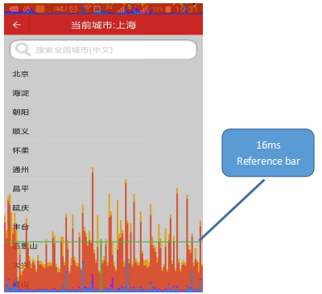

除了上个查看过度渲染的工具之外，我们还可以打开手机里面的开发者选项，看到有Profile GPU Rendering选项，然后再选中On screen as bars。打开我们的天气预报程序，你会发现手机屏幕上出现了三个颜色组成的小柱状图,以及一条绿线。而这些柱状图会从左到右动态地显示,每一个垂直的柱状图代表一帧的渲染,垂直柱状图越长就代表这一帧需要渲染的时间越长。我们可以看到，需要渲染的帧数越来越多，也会逐渐堆积在一起通过这些我们就可以观察到这段时间帧率的变化。
在上文中我们讲过系统每隔16ms发送一次信号，下图中的绿线代表16ms,也就是要确保一秒内达到60fps,只有这些帧的每一条线都在绿色的16ms标记线之下，用户看到我们的窗口时才不会觉得有卡顿现象产生。
每一条柱状图都由蓝-红-黄三种颜色组成，这些线是和Android系统的渲染流水过程以及它的实际运行帧数的时间关联。蓝色代表测量绘制的时间,也就是说它代表创建和更新你的DisplayList所需要的时间。Display List的本质是一个缓冲区，它里面记录了即将要执行的绘制命令序列。这些绘制命令最终会转化为Open GL命令由GPU执行。在Android中,一个视图首先被转换成GPU所熟悉的格式,也就是几条简单的绘图命令，这个过程完成后,系统会把其结果当作一个DisplayList对象送入缓存。红色代表执行的时间,也就是Display List被Android进行渲染的时间,为了将界面绘制到屏幕上,Android需要使用OpenGl ES的API接口来绘制Display List。数据被这些API发送到GPU,最终在屏幕上显示出来。视图越复杂,就会调用更复杂的OpenGl绘制指令。例如视图旋转,我们需要重新清理这个区域的视图,这样可能会影响这个视图下面的视图,因为这些视图都需要进行重新的绘制操作。橙色部分表示的是处理时间,简单解释就是CPU告诉GPU渲染一帧的地方,这个调用时是阻塞的,CPU只有等待GPU发出接到命令的回复之后才会做下一个工作,如果柱状图很高,也就意味着GPU负载太重,OpenGL命令需要去绘制和处理过多的视图。保持屏幕界面流畅的关键就是让这些垂直的柱状条尽量保持在绿线下面,当某个时候一旦超过绿线,就有丢失一帧的画面的风险。我的应用程序检测的结果如下：

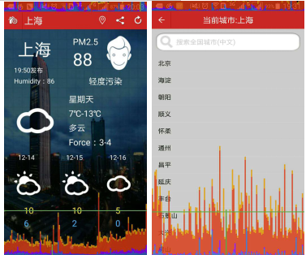

  可以看到，在主界面的渲染的时间大部分在16ms以下，可是在选择城市界面渲染的时间就不尽如人意，可能的原因就是因为这个界面的listview需要花费更多的时间来渲染。
 
**3.布局优化**

   在布局的时候我们要减少不必要的层次，Android SDK中包含hierarchy viewer这个工具，我们可以通过它查看Activity的布局，除此之外，还能查看每个View的属性以及measure、layout、draw的时间，如果耗时较多会用红色标记，中间的是黄色，耗时较少的显示绿色。这是我的天气预报项目的层次结构：
  
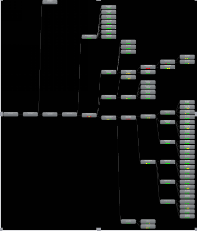
  
  我截取了其中一个，这是我主界面的视图，如下图所示：
  
  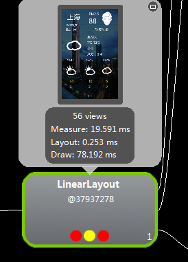
  
 从上图中我们可以看到图中的三个圆圈，这三个圈圈代表的是measure 、layout、draw三个阶段的速度。如果某个View上的圈是红色，那么说明这个View相对其他的View，该操作运行最慢。在这个视图中，Measure和draw的速度最慢。所以通过这个图，我们可以看到在自己的代码在哪个部分耗费了更多的时间来进行改善。并且从这个工具中，我们可以看到RelativeLayout的性能要优于LinearLayout的性能，Android自身也在进行改进，之前的版本中，LinearLayout是工程的默认xml中顶节点，而在4.0之后RelativeLayout已经成为默认的顶节点，因为RelativeLayout性能比LinearLayout更优化，LinearLayout嵌套才能实现的布局也能实现。所以我们要用RelativeLayout代替LineLayout。
4.0以下版本可通过hierarchy viewer查看，4.0及以上Android版本可通过手机当中的开发者选项，再选择显示布局边界打开页面布局显示，来查看看是否出现了一些没有必要的节点和嵌套。可以看到我的天气预报项目的布局如下：

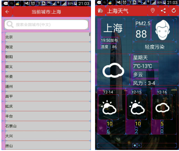

也能发现在主窗口中，出现了很多的嵌套，在以后的开发中，再能实现布局的情况下尽可能的避免过多的嵌套，以此来优化布局，提升性能。
关于Android渲染以及渲染性能优化的内容还有很多，我这里也只是讲述了一部分，如果在以后的开发过程中遇到app画面有卡顿的情况，可以通过使用上述我们讲的工具首先去检测问题出在哪里，然后按照上面提供的方法进行优化。