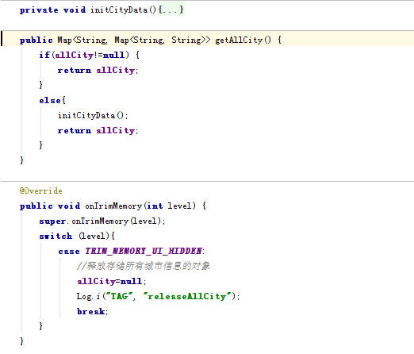
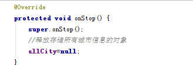
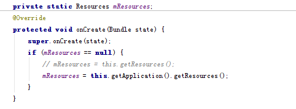
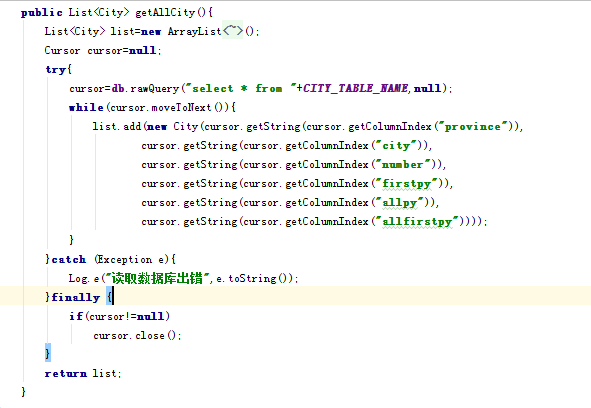
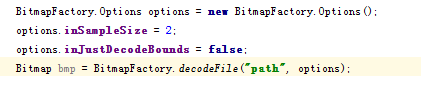
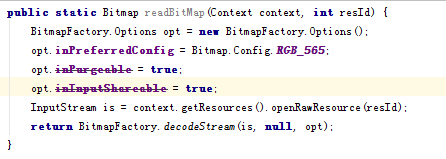

# Android应用开发内存优化技术（1501210983  司方豪）

#Android应用开发内存优化技术
1501210983 司方豪

##摘要: 
Android作为一种移动平台操作系统，在其上开发应用时候应该注意移动平台的特点，其中内存资源有限是移动平台的一大特征，为了保证应用能够流畅的运行，同时不会因为占用系统过多的资源而导致用户体验变差，开发安卓应用时候对内存进行优化就显得尤为重要。本文首先介绍了Android的内存管理机制，然后又从四个方面介绍了一些内存优化方法。
##关键字：
Android；内存优化；内存泄漏；Bitmap优化
##1.  Android内存管理机制
###1.1  应用级内存管理机制
Android系统是基于Linux内核开发的开源操作系统，为了用户体验更好，其对Linux的内存管理机制进行了优化，会在进程活动停止后把这些进程都保留在内存中，直到系统需要更多内存为止。这些保留在内存中的进程通常情况下不会影响整体系统的运行速度，并且当用户再次激活这些进程时，提升了进程的启动速度。
 	当系统内存不足时候，Android使用Low Memory killer杀死一些进程释放其内存。选择要杀死的进程的原则有两个：oom_adj和占用内存的大小，oom_adj代表进程的优先级，数值越大，优先级越高，对应每个oom_adj都有一个空闲内存的阀值。系统会对进程的重要性进行评估，并将重要性以“oom_adj”这个数值表示出来，赋予各个进程。Android Kernel每隔一段时间会检查当前内存是否低于某个阀值，如果是，则杀死oom_adj最大的进程，如果有2个以上的进程oom_adj相同，则杀死其中占用内存最多的进程。
###1.2  应用内部内存管理机制
安卓应用使用Java语言开发，因此也使用Java语言的内存管理机制。一般Java在内存分配时会涉及到寄存器（Registers）、栈（Stack）、堆（Heap）、静态域（static field）、常量池（constant pool）、非RAM存储。
其中，程序运行时最为活跃的是堆和栈。对于栈主要是系统自动管理的，当定义一个变量时，Java就在栈中为这个变量分配内存空间，当该变量退出该作用域后，Java会自动释放掉为该变量所分配的内存空间，该内存空间可以立即被另作他用。对于堆空间主要是在程序中使用new关键字来申请的，当堆中的new产生数组和对象超出其作用域后，它们不会被释放，只有在没有引用变量指向它们的时候才变成垃圾，不能再被使用。即使这样，所占内存也不会立即释放，而是等待被GC收走，因此堆空间的申请和释放是我们要注重关注的，而且很多内存相关问题比如泄露或者OOM都是因为对堆空间使用不当造成的。
##2.  优化方法
从上一章Android的内存管理机制部分可以看出，优化应用对内存的使用可以从两方面入手，一方面是如何保证在设备内存比较低的情况下，进程不被系统杀死从而提高进程的响应速度，提升用户体验；另一方面就是如何在系统运行时候合理使用内存，尽可能减少对内存资源的占用，避免内存泄露问题。下面就这两方面分别进行讨论。
###2.1  使用OnTrimMemory 回调
####2.1.1  OnTrimMemory 回调简介
OnTrimMemory是Android在4.0之后加入的一个回调，任何实现了ComponentCallbacks2接口的类都可以重写实现这个回调方法，我们常用的有Application、Activity、Fragement、Service和ContentProvider。OnTrimMemory的主要作用就是指导应用程序在不同的情况下进行自身的内存释放，以避免被系统直接杀掉，提高应用程序的用户体验。Android系统会根据不同等级的内存使用情况，调用这个函数，并传入对应的等级，一共分为以下七种情况：

1)	TRIM_MEMORY_UI_HIDDEN 表示应用程序的所有UI界面被隐藏了，即用户点击了Home键或者Back键导致应用的UI界面不可见。这种情况和onStop()方法是有很大区别的， onStop()方法只是当一个Activity完全不可见的时候就会调用，比如说用户打开了我们程序中的另一个Activity；但是TRIM_MEMORY_UI_HIDDEN回调只有当我们程序中的所有UI组件全部不可见的时候才会触发。因为因此，我们可以在onStop()方法中去释放一些Activity相关的资源，比如说取消网络连接或者注销广播接收器等，但是像UI相关的资源应该一直要等到TRIM_MEMORY_UI_HIDDEN这个回调之后才去释放，这样可以保证如果用户只是从我们程序的一个Activity回到了另外一个Activity，界面相关的资源都不需要重新加载，从而提升响应速度。而且onTrimMemory的TRIM_MEMORY_UI_HIDDEN等级是在onStop方法之前调用的。
下面三个等级是当我们的应用程序真正运行时的回调：

2)	TRIM_MEMORY_RUNNING_MODERATE 表示应用程序正常运行，并且不会被杀掉。但是目前手机的内存已经有点低了，系统可能会开始根据LRU缓存规则来去杀死进程了。

3)	TRIM_MEMORY_RUNNING_LOW 表示应用程序正常运行，并且不会被杀掉。但是目前手机的内存已经非常低了，我们应该去释放掉一些不必要的资源以提升系统的性能，同时这也会直接影响到我们应用程序的性能。

4)	TRIM_MEMORY_RUNNING_CRITICAL 表示应用程序仍然正常运行，但是系统已经根据LRU缓存规则杀掉了大部分缓存的进程了。这个时候我们应当尽可能地去释放任何不必要的资源，不然的话系统可能会继续杀掉所有缓存中的进程，并且开始杀掉一些本来应当保持运行的进程，比如说后台运行的服务。
当应用程序是缓存的，则会收到以下几种类型的回调：

5)	TRIM_MEMORY_BACKGROUND 表示手机目前内存已经很低了，系统准备开始根据LRU缓存来清理进程。这个时候我们的程序在LRU缓存列表的最近位置，是不太可能被清理掉的，但这时去释放掉一些比较容易恢复的资源能够让手机的内存变得比较充足，从而让我们的程序更长时间地保留在缓存当中，这样当用户返回我们的程序时会感觉非常顺畅，而不是经历了一次重新启动的过程。

6)	TRIM_MEMORY_MODERATE 表示手机目前内存已经很低了，并且我们的程序处于LRU缓存列表的中间位置，如果手机内存还得不到进一步释放的话，那么我们的程序就有被系统杀掉的风险了。

7)	TRIM_MEMORY_COMPLETE 表示手机目前内存已经很低了，并且我们的程序处于LRU缓存列表的最边缘位置，系统会最优先考虑杀掉我们的应用程序，在这个时候应当尽可能地把一切可以释放的东西都进行释放。
####2.1.2  OnTrimMemory回调中可以释放的资源
通常在架构阶段就要考虑清楚，我们有哪些东西是要常驻内存的，有哪些是伴随界面存在的．一般情况下，有下面几种资源需要进行释放：

1)	缓存：缓存包括一些文件缓存，图片缓存等，在用户正常使用的时候这些缓存很有作用，但当你的应用程序UI不可见的时候，这些缓存就可以被清除以减少内存的使用。
比如本次课程的天气预报项目中，选择城市的功能一般只有在用户最开始使用这个应用或者到达一个新的地方时候才会使用，因此在应用的UI完全隐藏之后，就可以释放掉储存全国所有城市以及城市代码信息的对象，如下图所示：


 
在MyApplication对象中通过initCityData方法从数据库中读取所有城市信息，并放入allCity对象中，在SelectCityActivity中通过getAllCity方法获得对这个对象的引用，当用户选择了城市之后，allCity这个对象就没有存在的意义了，因此在MyApplication对象中重写OnTrimMemory，在应用所有的UI不可见时候，释放对这个对象的引用，同时在SelectCityActivity的onStop方法中也释放对这个对象的引用，如下图所示：
 
 
 
这样就可以在保证功能的前提下，尽可能少占用内存资源。

2)	一些动态生成动态添加的View。 这些动态生成和添加的View且少数情况下才使用到的View，这时候可以被释放，下次使用的时候再进行动态生成即可。
###2.2  避免内存泄漏
####2.2.1  Context引起的内存泄漏
在Android中，有些对象是需要引用Context对象，安卓中的Activity、Application、Service都是Context的子类，其中Application Context的生命周期和应用的生命周期一样长， Activity Context的生命周期取决于Activity，Service也一样。如果一个长期生命的对象，并且这个对象需要一个Context，就要使用Application对象。因为如果使用Activity Context，即使这个Activity已经不再使用，它占用的内存资源还是不能得到释放，这样就造成了内存泄漏，可以通过调用Context.getApplicationContext()方法或者Activity.getApplication()方法来获得Application对象。比如下面这段代码中的Resources对象，将this.getResources()修改为this.getApplication().getResources()。修改以后，Resources对象拥有的是Application对象的引用。如果Activity被重新创建，第一次创建的Activity就可以被回收了。 



为了避免涉及到context的内存泄露，可以遵循以下几条原则：

1) 注意引用Context对象的生命周期，如果是长生命周期那么不能引用Activity Context，应该使用Application 
Context。

2) 避免静态对象引用短生命周期的Context。
####2.2.2  资源没有关闭引起的内存泄漏
程序中用到外部资源时候一般会把资源缓存在内存中，而这些资源在使用过之后如果没有及时释放就会造成内存资源的浪费，常见的情况有一下几种：

1)	查询数据库而没有关闭Cursor
在Android中，Cursor是很常用的一个对象，但在写代码是，经常会有人忘记调用close, 或者因为代码逻辑问题状况导致close未被调用，为避免这种情况的内存泄漏，可以使用以下几种方法：在Activity中，我们可以调用startManagingCursor或直接使用managedQuery让Activity自动管理Cursor对象，但需要注意的是，当Activity结束后，Cursor将不再可用；若操作Cursor的代码和UI不同步（如后台线程），那么需要先判断Activity是否已经结束，或者在调用OnDestroy前，先等待后台线程结束；虽然有Cursor.close()语句，但若出现异常，将会跳过close()，从而导致内存泄露，所以，我们的代码应该以如下的方式编写，在finally中调用close：
 
 

2)	调用registerReceiver后未调用unregisterReceiver().
在调用registerReceiver后，若未调用unregisterReceiver，那么Receiver将会一直被引用，其所占的内存是相当大的。

3)	未关闭InputStream/OutputStream
这种情况和Cursor类似，应该在finally中关闭。

4)	Bitmap使用后未调用recycle()
根据SDK的描述，调用recycle并不是必须的。但在实际使用时，Bitmap占用的内存是很大的，所以当我们不再使用时，尽量调用recycle()以释放资源。
####2.2.3  静态变量引起内存泄漏
静态变量的生命周期从所属的类被加载直到程序结束，如果使用静态变量指向一个短生命周期的对象，比如Activity，那么这个对象占用的内存将不会被释放知道程序结束，引用一个Android官网提供的例子：
```
private static Drawable sBackground;
@Override
protected void onCreate(Bundle state) {
super.onCreate(state);

TextView label = new TextView(this);
label.setText("Leaks are bad");

if (sBackground == null) {
sBackground = getDrawable(R.drawable.large_bitmap);
}
label.setBackgroundDrawable(sBackground);
setContentView(label);
}
```

当一个Drawable附加到一个 View上时，View会将其作为一个callback设定到Drawable上，因此上述的代码片段，意味着Drawable拥有一个TextView的引用，而TextView又拥有Activity（Context类型）的引用，换句话说，Drawable拥有了更多的对象引用，但是这个对象是静态的，即使Activity被销毁，内存仍然不会被释放。因此当屏幕切换方向时候，原Activity被销毁，但是由于静态的Drawable仍然有指向这个Activity的引用，所以仍然占用内存，此后的Activity也有同样的问题。
####2.2.4  线程引起的内存泄漏
因为运行中的线程是称之为垃圾回收根（GC Roots）对象的一种，不会被GC回收，所以线程中涉及的任何东西GC都不能回收（Anything reachable by a thread cannot be GC'd ），因此线程很容易造成内存泄露，考虑下面这段代码：
```
public class MyActivity extends Activity {      
@Override      
public void onCreate(Bundle savedInstanceState) {          
  super.onCreate(savedInstanceState);          
  setContentView(R.layout.main);          
  new MyThread().start();      
}        
private class MyThread extends Thread{          
@Override          
  public void run() {              
  super.run();    
    }      
  }  
}   
```
线程是以Activity的内部类形式实现的，所以MyThread中保存了Activity的一个引用，当MyThread的run函数没有结束时，MyThread是不会被销毁的，因此即使它所引用的Activity被销毁，这个Activity占用的内存也不会被释放。当我们开启该线程后，将设备的横屏变为了竖屏，一般情况下当屏幕转换时会重新创建Activity，这种情况下老的Activity仍然占用内存，就出现了内存泄露的问题。为了解决这种问题可以将将线程的内部类，改为静态内部类，或者在线程内部采用弱引用保存Activity引用。 
 	另外，Hanlder是线程与Activity通信的桥梁，如果处理不当，在程序结束时，线程并没有被销毁，而是一直在后台运行着，当我们重新启动应用时，又会重新启动一个线程，周而复始，你启动应用次数越多，开启的线程数就越多，你的机器就会变得越慢。 
```
public class ThreadDemo extends Activity {  
    private static final String TAG = "ThreadDemo";  
    private int count = 0;  
    private Handler mHandler =  new Handler();  
    private Runnable mRunnable = new Runnable() {    
        public void run() {  
            count++;  
            setTitle("" +count); 
            mHandler.postDelayed(mRunnable, 2000);  
        }          
    };  
    @Override  
    public void onCreate(Bundle savedInstanceState) {  
        super.onCreate(savedInstanceState);  
        setContentView(R.layout.main);   
        //通过Handler启动线程   
        mHandler.post(mRunnable);  
    }        
} 
```
所以我们在应用退出时，要将线程销毁，我们只要在Activity中的，onDestory()方法处理一下就可以了，如下代码所示: 
```
@Override  
  protected void onDestroy() {  
    mHandler.removeCallbacks(mRunnable);  
    super.onDestroy();  
  } 
```
###2.3  优化对BitMap的操作
1)	图片显示
需要根据需求去加载图片的大小。例如在列表中仅用于预览时加载缩略图，只有当用户点击具体条目想看详细信息的时候，这时另启动一个控件去显示整个图片。

2)	图片大小
直接使用ImageView显示bitmap会占用较多资源，特别是图片较大的时候，可能导致崩溃。使用BitmapFactory.Options设置inSampleSize, 这样做可以减少对系统资源的要求。属性值inSampleSize表示缩略图大小为原始图片大小的几分之一，即如果这个值为2，则取出的缩略图的宽和高都是原始图片的1/2，图片大小就为原始大小的1/4。


 
3)	图片像素
Android中图片有四种属性，分别是：
* ALPHA_8：每个像素占用1byte内存 
* ARGB_4444：每个像素占用2byte内存 
* ARGB_8888：每个像素占用4byte内存 （默认）
* RGB_565：每个像素占用2byte内存 

Android默认的颜色模式为ARGB_8888，这个颜色模式色彩最细腻，显示质量最高。但同样的，占用的内存也最大。 所以在对图片效果不是特别高的情况下使用RGB_565（565没有透明度属性），如下：


 
4)	图片回收
使用Bitmap过后，就需要及时的调用Bitmap.recycle()方法来释放Bitmap占用的内存空间，而不要等Android系统来进行释放。 
###2.4  其他优化方法
1)	对常量使用static final修饰符

static final int i = 100;

static final String s = "Hello, world!";

上面两句声明在成员变量初始化的时候，会将常量直接保存到类文件中。用到i的代码被直接替换成100，而使用s的会指向一个字符串常量，而不是使用成员变量。

2)	静态方法代替虚拟方法
如果不需要访问某对象的字段，将方法设置为静态，调用会加速15%到20%。这也是一种好的做法，因为你可以从方法声明中看出调用该方法不需要更新此对象的状态。

3)	避免创建不必要的对象
最常见的例子就是当你要频繁操作一个字符串时，使用StringBuffer代替String。
对于所有所有基本类型的组合：int数组比Integer数组好，这也概括了一个基本事实，两个平行的int数组比 (int,int)对象数组性能要好很多。
总体来说，就是避免创建短命的临时对象。减少对象的创建就能减少垃圾收集，进而减少对用户体验的影响。

4)	避免内部Getters/Setters
在Android中，虚方法调用的代价比直接字段访问高昂许多。通常根据面向对象语言的实践，在公共接口中使用Getters和Setters是有道理的，但在一个字段经常被访问的类中宜采用直接访问。

5)	避免使用浮点数
通常的经验是，在Android设备中，浮点数会比整型慢两倍。

6)	避免使用枚举
枚举变量非常方便,可以让你的API更出色，并能提供编译时的检查，但不幸的是它会牺牲执行的速度和并大幅增加文件体积。
##3.  总结
本文主要从两个方面总结了安卓应用开发的内存优化方法，首先是使用OnTrimMemory回调方法及时释放用不到的资源等，减少应用占用的内存，从而减少被系统杀死的风险，长时间驻留内存，提升应用的用户体验；另一方面通过防止内存泄露、优化对BitMap的操作和其他一些方法减少系统运行时的内存资源占用，来保证应用流畅运行，同时提高系统的可用性。
##参考文献：
http://www.2cto.com/kf/201108/101008.html
http://blog.csdn.net/a396901990/article/details/38707007
http://blog.csdn.net/jie1991liu/article/details/22645459
http://android.tgbus.com/Android/androidnews/201204/422735.shtml
http://www.android100.org/html/201507/22/167189.html


