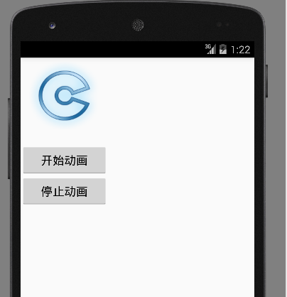

# Android中Animation介绍（1501210900 高鸿宾）


## 一、animation简介

&#160;&#160;&#160;&#160;&#160;&#160;&#160;Animation的意思是“动画”，在Android手机上做出漂亮的动态画面是让人非常兴奋的一件事情，也会为自己的APP增加不少亮点，Android中的Animation主要分为三种：Drawable Animation、View Animation、Property Animation下面将分别依次介绍三种Animation。


## 二、Drawable Animation

&#160;&#160;&#160;&#160;&#160;&#160;&#160;首先介绍Drawable Animatio，因为Drawable Animatio是三种里面最简单的，Drawable Animatio就是逐帧动画，也就是画面的每个帧按序显示，组成动态画面。

&#160;&#160;&#160;&#160;&#160;&#160;&#160;下面举一个简单的例子来体验一下Drawable Animation：

*主界面：activity_main.xml*

```
<LinearLayout xmlns:android="http://schemas.android.com/apk/res/android"
    android:layout_width="wrap_content"
    android:layout_height="wrap_content"
    android:orientation="vertical">

    <ImageView
        android:id="@+id/loading"
        android:layout_width="wrap_content"
        android:layout_height="wrap_content"
        android:gravity="center"
        android:padding="5px" />

    <Button android:id="@+id/buttonA"
        android:layout_width="fill_parent"
        android:layout_height="wrap_content"
        android:padding="5px"
        android:text="开始动画"
        android:gravity="center"
        />

    <Button android:id="@+id/buttonB"
        android:layout_width="fill_parent"
        android:layout_height="wrap_content"
        android:padding="5px"
        android:text="停止动画"
        />

</LinearLayout>
```
&#160;&#160;&#160;&#160;&#160;&#160;&#160;对应ImageView中的loading，下面是loading.xml的代码，
其中loading.xml的位置在res/drawable/loading.xml。也就是把loading.xml当做普通的图片一样处理。

*动画：loading.xml*

```
<?xml version="1.0" encoding="UTF-8"?>
<animation-list xmlns:android="http://schemas.android.com/apk/res/android" android:oneshot="false"
    android:layout_height="wrap_content"  android:layout_width="wrap_content">
    <item android:drawable="@drawable/login_loading_00" android:duration="150"/>
    <item android:drawable="@drawable/login_loading_01" android:duration="150"/>
    <item android:drawable="@drawable/login_loading_02" android:duration="150"/>
</animation-list>
```

&#160;&#160;&#160;&#160;&#160;&#160;&#160;loading.xml代码解析：整个动画包含三张静态图片，分别为login_loading_00.png、login_loading_01.png、login_loading_02.png，这三张图片也是存放在res/drawable文件夹下，三张图片必需放在<animation-list>下的<item>中，其中animation-list中的android:oneshot取值false或者true，当取值true表示动态图片只显示一次，当取值false表示动态图片会一直循环显示。item中的android：duration表示每张图片在动画中显示的时间，单位为毫秒。当加载这个动画是，画面会按照item的顺序一次将每张图片按规定时间显示出来，最终表现出动画的效果。

&#160;&#160;&#160;&#160;&#160;&#160;&#160;有时在<item>结点下还会包含<layer-list>,这样在图片显示时，被<layer-list>包含的多张图片会被重叠当做一帧同事显示。


*主活动：MainActivity.java*

```
import android.app.Activity;
import android.graphics.drawable.AnimationDrawable;
import android.os.Bundle;
import android.view.MotionEvent;
import android.view.View;
import android.view.Window;
import android.widget.Button;
import android.widget.ImageView;

public class MainActivity extends Activity implements View.OnClickListener {

    private AnimationDrawable loadingAnimation;
    private Button mShow, mStop;
    @Override
    protected void onCreate(Bundle savedInstanceState) {
        super.onCreate(savedInstanceState);
        requestWindowFeature(Window.FEATURE_NO_TITLE);
        setContentView(R.layout.activity_main);

        mShow = (Button) findViewById(R.id.buttonA);
        mStop = (Button) findViewById(R.id.buttonB);

        mShow.setOnClickListener( this);
        mStop.setOnClickListener( this);

        ImageView loadingImg = (ImageView) findViewById(R.id.loading);
        loadingImg.setBackgroundResource(R.drawable.loading);
        loadingAnimation = (AnimationDrawable) loadingImg.getBackground();
    }

    public void onClick(View v) {
        if (v == mShow){
            loadingAnimation.start();

        } else if (v == mStop){
            loadingAnimation.stop();
        }
    }
}

```

&#160;&#160;&#160;&#160;&#160;&#160;&#160;整个程序的运行结果为：




## 三、View Animation

&#160;&#160;&#160;&#160;&#160;&#160;&#160;
Drawable Animation是定义好每一帧图片，规定每一张图片显示的时间，这只是最初级的动画，而View Animation却可以定义更多的丰富的动态效果，例如：移动、旋转、放大缩小、背景亮度变化。

&#160;&#160;&#160;&#160;&#160;&#160;&#160;
在View Animation中：
alpha	表示渐变透明度动画效果，
scale	表示渐变尺寸伸缩动画效果，
translate	表示画面转换位置移动动画效果，
rotate	表示画面转移旋转动画效果。

&#160;&#160;&#160;&#160;&#160;&#160;&#160;
下面依然是举个简单的例子来帮助理解。

例子中使用animation1.xml来规定动画效果，animation1.xml的存放位置为res/anim/animation1.xml。

动画效果animation1.xml：

```
<set xmlns:android="http://schemas.android.com/apk/res/android"
    android:shareInterpolator="false"
    android:layout_height="wrap_content"
    android:layout_width="wrap_content">
    <scale
        android:interpolator="@android:anim/accelerate_decelerate_interpolator"
        android:fromXScale="1.0"
        android:toXScale="1.4"
        android:fromYScale="1.0"
        android:toYScale="0.6"
        android:pivotX="50%"
        android:pivotY="50%"
        android:fillAfter="false"
        android:duration="1000" />
    <set
        android:interpolator="@android:anim/accelerate_interpolator"
        android:startOffset="1000">
        <scale
            android:fromXScale="1.4"
            android:toXScale="0.0"
            android:fromYScale="0.6"
            android:toYScale="0.0"
            android:pivotX="50%"
            android:pivotY="50%"
            android:duration="400" />
        <rotate
            android:fromDegrees="0"
            android:toDegrees="60"
            android:toYScale="0.0"
            android:pivotX="50%"
            android:pivotY="50%"
            android:duration="400" />
    </set>

</set>
```
&#160;&#160;&#160;&#160;&#160;&#160;&#160;对一个图片的执行动画过程，先执行最外面的set标签里的内容，再依次执行内部嵌套set的内容，当一个set标签内有多个scale，rotate，alpha，rotate时，这几个动画效果是同时对图片起作用，而不是一次执行这四种效果。

&#160;&#160;&#160;&#160;&#160;&#160;&#160;
android:interpolator：指定动画插入器，常见的有加速减速插入器为：accelerate_decelerate_interpolator，加速插入器为accelerate_interpolator，减速插入器为decelerate_interpolator。   

主界面：activity_main.xml

```
<RelativeLayout xmlns:android="http://schemas.android.com/apk/res/android"
    xmlns:tools="http://schemas.android.com/tools"
    android:layout_width="match_parent"
    android:layout_height="match_parent"
    android:paddingBottom="@dimen/activity_vertical_margin"
    android:paddingLeft="@dimen/activity_horizontal_margin"
    android:paddingRight="@dimen/activity_horizontal_margin"
    android:paddingTop="@dimen/activity_vertical_margin"
    tools:context=".AnimaXmlActivity" >

    <ImageView
        android:id="@+id/Image"
        android:layout_width="wrap_content"
        android:layout_height="wrap_content"
        android:layout_centerInParent="true"
        android:src="@drawable/android" />

    <Button
        android:id="@+id/xml_btn"
        android:layout_width="match_parent"
        android:layout_height="wrap_content"
        android:layout_alignParentBottom="true"
        android:text="运动" />

</RelativeLayout>
```

主活动 main_activity.java

```
import android.app.Activity;
import android.os.Bundle;
import android.view.View;
import android.view.Window;
import android.view.animation.Animation;
import android.view.animation.AnimationUtils;
import android.widget.Button;
import android.widget.ImageView;

public class MainActivity extends Activity {

    private Button btn;
    private ImageView img;
    @Override
    protected void onCreate(Bundle savedInstanceState) {
        super.onCreate(savedInstanceState);
        requestWindowFeature(Window.FEATURE_NO_TITLE);
        setContentView(R.layout.activity_main);
        btn = (Button)findViewById(R.id.xml_btn);
        img = (ImageView)findViewById(R.id.Image);

        btn.setOnClickListener(new View.OnClickListener() {

            @Override
            public void onClick(View v) {
                Animation anim = AnimationUtils.loadAnimation(MainActivity.this, R.anim.animation1);
                img.startAnimation(anim); //对img执行动画效果
            }
        });
    }
}
```
执行效果：


下面依次对四种动画的参数进行解析：

alpha：	表示渐变透明度动画效果，参数如下：
```
<?xml version="1.0" encoding="utf-8"?>   
<set xmlns:android="http://schemas.android.com/apk/res/android">   
<alpha   
    android:fromAlpha="0.0" <!--表示开始时透明度，0.0表示完全透明，取值0-1之间-->   
    android:toAlpha="1.0"     <!--表示结束时透明度，1.0表示不透明，取值0-1之间-->
    android:duration="500"  />  
    <!--duration表示效果作用时间-->
</set>   

```

scale：	表示渐变尺寸伸缩动画效果，参数如下：
```
<?xml version="1.0" encoding="utf-8"?>   
<set xmlns:android="http://schemas.android.com/apk/res/android">   
<scale     
    android:interpolator= "@android:anim/decelerate_interpolator"         
    android:fromXScale="0.0"
    <!--fromXScale表示开始时X坐标的缩放倍数，0表示不显示-->
    android:toXScale="1.5"
    <!--toXScale表示结束时X坐标的缩放倍数，1.5表示X坐标最终为正常值得1.5倍-->
    android:fromYScale="0.0"     
    android:toYScale="1.5"     
    android:pivotX="50%" 
    <!--pivotX表示动画起始位置，相对于屏幕的百分比,50%表示x方向上动画从屏幕中间开始-->
    android:pivotY="50%"     
    android:startOffset="0" 
    <!--startOffset表示每次动画执行前停顿的时间，单位毫秒-->     
    android:duration="10000" 
    <!--duration动画效果的总共执行时间，但为毫秒-->
    android:repeatCount="1"     
    <!--repeatCount动画执行的次数 -->
    android:repeatMode="reverse"
    <!-- repeatMode，动画重复的模式，reverse为反向，当第偶次执行时，动画方向会相反.restart为重新执行，方向不变-->
     />   
</set>   
  

```
translate:	表示画面转换位置移动动画效果，参数如下：

```
<?xml version="1.0" encoding="utf-8"?>   
<set xmlns:android="http://schemas.android.com/apk/res/android">  
<translate   
    android:fromXDelta="320"
    <!--fromXDelta起始时X坐标,屏幕右下角的座标是X:320,Y:480 -->
    android:toXDelta="0"   
    <!--toXDelta结束时X坐标,屏幕左上角的座标是X:0,Y:0 -->
    android:fromYDelta="480"   
    android:toYDelta="0"   
    android:duration="10000" />   
</set> 
```

rotate:	表示画面转移旋转动画效果,参数如下：
```
<?xml version="1.0" encoding="utf-8"?>   
<set xmlns:android="http://schemas.android.com/apk/res/android">  
<rotate                                        
    android:interpolator="@android:anim/accelerate_decelerate_interpolator"   
    android:fromDegrees="300"
    <!--fromDegrees动画开始时的角度-->
    android:toDegrees="-360" 
    <!--toDegrees动画结束时物件的旋转角度,正代表顺时针-->
    android:pivotX="10%"   
    android:pivotY="100%"   
    android:duration="10000" />   
</set>   
  
```


## 四、Property Animation
&#160;&#160;&#160;&#160;&#160;&#160;&#160;
前面讲解了两种Animation，其中View Animation的动画效果比Drawable Animation的动画效果要丰富很多，但是View Animation只能针对根节点为View的对象进行操作，而且View Animation对对象的操作只是效果上的变化，对象的实际属性并没有发生变化，这里我们介绍一种应用更加广泛并且能真正改变对象的属性的方法。即Property Animation。

&#160;&#160;&#160;&#160;&#160;&#160;&#160;
Property Animation即可以通过xml文件实现动画效果，也有现成的类（ValueAnimator和ObjectAnimator）可以实现一些简单的动画效果。

### 4.1 ValueAnimator
&#160;&#160;&#160;&#160;&#160;&#160;&#160;
ValueAnimator可以通过设置计算属性和根据属性执行相应的动作。
举个例子吧，举完例子可以根据例子进行深入的学习。

*主界面：activity_main.xml*

```
<RelativeLayout xmlns:android="http://schemas.android.com/apk/res/android"
    xmlns:tools="http://schemas.android.com/tools"
    android:layout_width="wrap_content"
    android:layout_height="wrap_content"
    android:id="@+id/id_container" >

    <ImageView
        android:id="@+id/image"
        android:layout_width="wrap_content"
        android:layout_height="wrap_content"
        android:layout_centerInParent="true"
        android:src="@drawable/android"
        />

</RelativeLayout>  
```

*主活动：MainActivity*

```
import android.animation.ObjectAnimator;
import android.animation.ValueAnimator;
import android.app.Activity;
import android.os.Bundle;
import android.util.Log;
import android.view.View;
import android.view.animation.CycleInterpolator;
import android.widget.ImageView;

public class MainActivity extends Activity implements View.OnClickListener {
    private ImageView image;
    @Override
    protected void onCreate(Bundle savedInstanceState)
    {
        super.onCreate(savedInstanceState);
        setContentView(R.layout.activity_main);
        image=(ImageView)findViewById(R.id.image);
        image.setOnClickListener(this);
    }


    public void onClick(View view){
        ValueAnimator anim = ValueAnimator.ofFloat(0f, 1f);
        //通过ofFloat,ofInt,ofObject生成一个ValueAnimator实例。
        anim.setDuration(500);

        anim.addUpdateListener(new ValueAnimator.AnimatorUpdateListener() {//设置监听器
            public void onAnimationUpdate(ValueAnimator animation){
            //当值发生变化时，改变图片的透明度
                float cVal = (Float) animation.getAnimatedValue();
                image.setAlpha(cVal);
               
            }
        });

        anim.start();
    }

}

```
&#160;&#160;&#160;&#160;&#160;&#160;&#160;
结果是一个动态的图，文章中就不再贴图，读者可以自己把代码敲一遍，执行一遍代码看看效果。

&#160;&#160;&#160;&#160;&#160;&#160;&#160;
ValueAnimator还可以通过setInterpolator来设置插入器。
setEvaluator来设置计算器等，设置更丰富的属性，例如我们需要设置一个物体按照抛物线的曲线来运行时，可以在setEvaluator中设置，具体可参考如下代码。

*抛物线的计算器设置*

```
    valueAnimator.setEvaluator(new TypeEvaluator<PointF>()  
        {  
            @Override  
            public PointF evaluate(float fraction, PointF startValue,  
                    PointF endValue)  
            {  
                Log.e(TAG, fraction * 3 + "");  
                // x方向200px/s ，则y方向0.5 * 10 * t  
                PointF point = new PointF();  
                point.x = 200 * fraction * 3;  
                point.y = 0.5f * 200 * (fraction * 3) * (fraction * 3);  
                return point;  
            }  
        });  
```

### 4.2 ObjectAnimator

看过ObjectAnimator源代码，就会发现ObjectAnimator继承自ValueAnimator。
ObjectAnimator可以不用像ValueAnimator那样必需通过实现监视器来动画效果。

还是举一个例子：

主界面还用上面ValueAnimator的主界面，下面是具体的activity的代码。

*主活动：MainActivity.java*

```
import android.animation.ObjectAnimator;
import android.animation.ValueAnimator;
import android.app.Activity;
import android.os.Bundle;
import android.util.Log;
import android.view.View;
import android.view.animation.CycleInterpolator;
import android.widget.ImageView;

public class MainActivity extends Activity implements View.OnClickListener {
    private ImageView image;
    @Override
    protected void onCreate(Bundle savedInstanceState)
    {
        super.onCreate(savedInstanceState);
        setContentView(R.layout.activity_main);
        image=(ImageView)findViewById(R.id.image);
        image.setOnClickListener(this);
    }

    public void onClick(View view){
        if(view.getId()==R.id.image){
            ObjectAnimator.ofFloat(view,"alpha",0F,1F)
                    .setDuration(3000)
                    .start();
        }
    }

}
```

上面程序的运行效果，当点击图片时，3秒钟图片由不显示逐渐变为显示。


