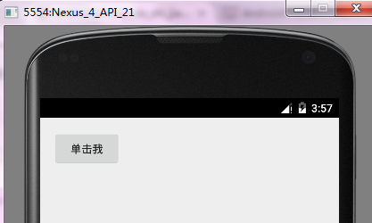
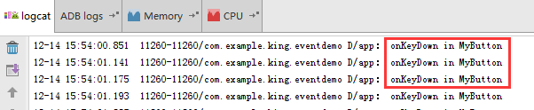

# Android中的事件处理机制（1501210707 王可颖）
不管是桌面应用还是手机应用程序，面对最多的就是用户，经常需要处理的就是用户动作——就是需要为用户动作提供响应，这种为用户动作提供响应的机制就是事件处理。

Android提供了强大的事件处理机制，包括两套事件处理机制：
 
* 基于监听的事件处理。
* 基于回调的事件处理。

对于基于监听的事件处理模型来说，主要做法就是为Android界面组件绑定特定的事件监听器。其中，事件源和事件监听器是分离的，当事件源上发生特定事件之后，该事件交给事件监听器来处理；

对于基于回调的事件处理模型来说，主要做法就是重写Android界面组件特定的回调方法，或者重写Activity的回调方法。事件源和事件监听器是统一的，当事件源发生特定事件后，该事件还是事件源本身负责处理。

##  1 基于监听的事件处理

在事件监听的处理模型中，主要涉及以下三类对象：
* Event Source（事件源）：事件发生的场所，通常就是各个组件，例如：按钮、窗口等。
* Event（事件）：事件封装了界面组件上发生的特定事情，通常就是一次用户操作。如果程序需要获得界面组件上所发生事件的相关信息，一般通过Event对象取得。
* Event Listener（事件监听器）：负责监听事件源发生的事件，并对各种事件做出相应的响应。

在基于事件监听的处理模型中，事件监听器必须实现事件监听器接口，Android为不同的界面组件提供了不同的监听器接口，这些接口通常以内部类的形式存在。以View类为例，它包含了如下几个内部类接口：
* View.onClickListener：单击事件的事件监听器必须实现的接口。
* View.onCreateContextMenuListener：创建上下文菜单事件的事件监听器必须实现的接口。
* View.onFocusChangedListener：焦点改变事件的事件监听器必须实现的接口。
* View.onKeyListener：按键事件的时间监听器必须实现的接口。
* View.onLangClickListener：长单击事件的事件监听器必须实现的接口。
* View.onTouchListener：触摸屏事件的事件监听器必须实现的接口。

所谓事件监听器，其实就是实现了特定接口的Java类的实例。在程序中实现事件监听器通常有以下几种形式：
* 内部类形式：将事件监听器类定义为当前类的内部类。
* 外部类形式：将事件监听器定义为一个外部类。
* Activity本身作为事件监听器类：让Activity本身实现监听器接口，并实现事件处理方法。
* 匿名内部类形式：使用匿名内部类创建事件监听器对象。


### 1.1 内部类作为事件监听器类

使用内部类可以在当前类中复用该监听器类；因为监听器类是外部类的内部类，所以可以自由访问外部类的所有界面组件。这也是内部类的两个优势。

```
public class MainActivity extends Activity {

    @Override
    protected void onCreate(Bundle savedInstanceState) {
        super.onCreate(savedInstanceState);
        setContentView(R.layout.activity_main);
        Button button = (Button) findViewById(R.id.button);
        button.setOnClickListener(new MyClickListner());
    }
    //单击事件的监听器（内部类）
    class MyClickListner implements View.OnClickListener{
        //事件处理器
        @Override
        public void onClick(View v) {
            Toast.makeText(MainActivity.this,"单击了按钮",Toast.LENGTH_SHORT).show();
        }
    }
}
```


###1.2 外部类作为事件监听器类

使用顶级类定义事件监听器类的形式比较少见，主要因为一下两个原因：

* 事件监听器属于特定的GUI界面，定义成外部类不利于提高程序的内聚性。
* 外部类形式的事件监听器不能自由访问创建GUI界面的类中的组件，编程不够简洁。

但如果某个事件监听器确实需要被多个GUI界面所共享，而且主要是完成某种业务逻辑的实现，则可以考虑使用外部类形式。下面的程序定义了一个外部事件监听器类，实现了发送短信的功能。
```
public class MySendListener implements View.OnLongClickListener {
    private Activity act;
    private EditText address;
    private EditText content;
    public MySendListener(Activity act, EditText address, EditText content) {
        this.act = act;
        this.address = address;
        this.content = content;
    }
    @Override
    public boolean onLongClick(View v) {
        String addressStr = address.getText().toString();
        String contentStr = content.getText().toString();
        // 获取短信管理器
        SmsManager smsManager = SmsManager.getDefault();
        // 创建发送短信的PendingIntent
        PendingIntent sentIntent = PendingIntent.getBroadcast(act, 0, new Intent(), 0);
        // 发送文本短信
        smsManager.sendTextMessage(addressStr, null, contentStr, sentIntent, null);
        Toast.makeText(act, "短信发送完成", Toast.LENGTH_LONG).show();
        return false;
    }
}
```
然后，在MainActivity中，为指定按钮的长单击事件绑定监听器，当用户长单击按钮时，程序触发监听器，其中包含的事件处理方法向指定手机发送短信。
```
public class MainActivity extends Activity {
    private Activity act;
    private EditText address;
    private EditText content;
    public MainActivity(Activity act, EditText address, EditText content) {
        this.act = act;
        this.address = address;
        this.content = content;
    }
    @Override
    protected void onCreate(Bundle savedInstanceState) {
        super.onCreate(savedInstanceState);
        setContentView(R.layout.activity_main);
        // 获取页面中收件人地址、短信内容
        address = (EditText)findViewById(R.id.address);
        content = (EditText)findViewById(R.id.content);
        Button bn = (Button)findViewById(R.id.send);
        // 使用外部类的实例作为事件监听器
        bn.setOnLongClickListener(new MySendListener(this, address, content));
    }
}
```


### 1.3 Activity本身作为事件监听器
这种形式非常简洁，直接在Activity类中定义事件处理器的方法。但这种做法有两个缺点：

* 可能造成程序结构混乱，Activity主要职责应该是完成界面初始化工作，但此时还需包含事件处理器的方法，从而引起混乱。
* 如果Activity界面类需要实现监听器接口，让人感觉比较怪异。

```
public class MainActivity extends Activity implements View.OnClickListener{
    @Override
    protected void onCreate(Bundle savedInstanceState) {
        super.onCreate(savedInstanceState);
        setContentView(R.layout.activity_main);
        Button button = (Button) findViewById(R.id.button);
        button.setOnClickListener(this);
    }
    @Override
    public void onClick(View v) {
        Toast.makeText(this,"单击了按钮",Toast.LENGTH_SHORT).show();
    }
}
```
程序中，Activity类实现了OnClickListner事件监听器接口。当为某个组件注册事件监听器对象时，直接使用this作为事件监听器对象即可。


###  1.4 匿名内部类作为事件监听器类

大部分时候，事件处理器没有什么复用价值（可复用代码通常被抽象成业务逻辑方法），因此大部分只临时使用一次，所以使用匿名内部类形式的事件监听器更合适。这种形式也是目前使用最广泛的事件监听器形式。

```
public class MainActivity extends Activity{
    @Override
    protected void onCreate(Bundle savedInstanceState) {
        super.onCreate(savedInstanceState);
        setContentView(R.layout.activity_main);
        Button button = (Button) findViewById(R.id.button);
        button.setOnClickListener(new View.OnClickListener() {
            @Override
            public void onClick(View v) {
                Toast.makeText(MainActivity.this,"单击了按钮",Toast.LENGTH_SHORT).show();
            }
        });
    }
}
```


---


“new监听器接口”或“new事件适配器”的形式就是用于创建匿名内部类形式的事件监听器。


### 1.5 直接绑定到标签

Android中还可以直接在界面布局文件中为指定标签绑定事件处理方法。

对于很多Android界面组件标签而言，它们都支持onClick等属性，属性值就是形如xxx(View source)的方法的方法名。

```
 <Button
        android:layout_width="wrap_content"
        android:layout_height="wrap_content"
        android:id="@+id/button"
        android:text="单击我"
        android:onClick="click"/>
```


---

```
public class MainActivity extends Activity{
    @Override
    protected void onCreate(Bundle savedInstanceState) {
        super.onCreate(savedInstanceState);
        setContentView(R.layout.activity_main);
    }
        //source参数代表事件源
     public void click(View source){
        Toast.makeText(MainActivity.this,"单击了按钮",Toast.LENGTH_SHORT).show();
    }
}
```


## 2 基于回调的事件处理

对于基于回调的事件处理模型来说，事件源和事件监听器是统一的，或者说事件监听器完全消失了。当用户在GUI组件上激发某个时间时，组件自己特定的方法将会负责处理该事件。

为了使用回调机制类处理GUI组件上所发生的事件，我们需要为该组件提供对应的事件处理方法，而Java又是一种静态语言，我们无法为某个对象动态地添加方法，因此，只能继承GUI组件类，并重写该类的事件处理方法实现。

Android为所有GUI组件都提供了一些事件处理的回调方法，包含以下方法：

（1）onKeyDown：

功能：该方法是接口KeyEvent.Callback中的抽象方法，所有的View全部实现了该接口并重写了该方法，该方法用来捕捉手机键盘被按下的事件。

声明：public boolean onKeyDown(int keyCode, KeyEvent event)

参数说明：
* 
参数keyCode：该参数为被按下的键值即键盘码，手机键盘中每个按钮都会有其单独的键盘码，在应用程序都是通过键盘码才知道用户按下的是哪个键。
* 
参数event：该参数为按键事件的对象，其中包含了触发事件的详细信息，例如事件的状态、事件的类型、事件发生的时间等。当用户按下按键时，系统会自动将事件封装成KeyEvent对象供应用程序使用。

返回值：该方法的返回值为一个boolean类型的变量，当返回true时，表示已经完整地处理了这个事件，并不希望其他的回调方法再次进行处理，而当返回false时，表示并没有完全处理完该事件，更希望其他回调方法继续对其进行处理，例如Activity中的回调方法。

（2）onKeyUp：

功能：该方法同样是接口KeyEvent.Callback中的一个抽象方法，并且所有的View同样全部实现了该接口并重写了该方法，onKeyUp方法用来捕捉手机键盘按键抬起的事件。

声明：public boolean onKeyUp(int keyCode, KeyEvent event)

参数说明：同onKeyDown

（3）onTouchEvent：

功能：该方法在View类中的定义，并且所有的View子类全部重写了该方法，应用程序可以通过该方法处理手机屏幕的触摸事件。

声明：public boolean onTouchEvent(MotionEvent event)

参数说明：
* 
参数event：参数event为手机屏幕触摸事件封装类的对象，其中封装了该事件的所有信息，例如触摸的位置、触摸的类型以及触摸的时间等。该对象会在用户触摸手机屏幕时被创建。

返回值：该方法的返回值机理与键盘响应事件的相同，同样是当已经完整地处理了该事件且不希望其他回调方法再次处理时返回true，否则返回false。

详细说明：
该方法并不像之前介绍过的方法只处理一种事件，一般情况下以下三种情况的事件全部由onTouchEvent方法处理，只是三种情况中的动作值不同。
* 
屏幕被按下：当屏幕被按下时，会自动调用该方法来处理事件，此时MotionEvent.getAction()的值为MotionEvent.ACTION_DOWN，如果在应用程序中需要处理屏幕被按下的事件，只需重写该回调方法，然后在方法中进行动作的判断即可。
* 
屏幕被抬起：当触控笔离开屏幕时触发的事件，该事件同样需要onTouchEvent方法来捕捉，然后在方法中进行动作判断。当MotionEvent.getAction()的值为MotionEvent.ACTION_UP时，表示是屏幕被抬起的事件。
* 
在屏幕中拖动：该方法还负责处理触控笔在屏幕上滑动的事件，同样是调用MotionEvent.getAction()方法来判断动作值是否为MotionEvent.ACTION_MOVE再进行处理。

（4）onTrackBallEvent：

功能：接下来将介绍的是手机中轨迹球的处理方法onTrackBallEvent。所有的View同样全部实现了该方法。

声明：public boolean onTrackballEvent(MotionEvent event)

详细说明：该方法的使用方法与前面介绍过的各个回调方法基本相同，可以在Activity中重写该方法，也可以在各个View的实现类中重写。

参数说明：
* 
参数event：参数event为手机轨迹球事件封装类的对象，其中封装了触发事件的详细信息，同样包括事件的类型、触发时间等，一般情况下，该对象会在用户操控轨迹球时被创建。

返回值：该方法的返回值与前面介绍的各个回调方法的返回值机制完全相同，因本书篇幅有限，不再赘述。

轨迹球与手机键盘的区别如下：

１）某些型号的手机设计出的轨迹球会比只有手机键盘时更美观，可增添用户对手机的整体印象。

２）轨迹球使用更为简单，例如在某些游戏中使用轨迹球控制会更为合理。

３）使用轨迹球会比键盘更为细化，即滚动轨迹球时，后台的表示状态的数值会变化得更细微、更精准。

提示：在模拟器运行状态下，可以通过F6键打开模拟器的轨迹球，然后便可以通过鼠标的移动来模拟轨迹球事件。

（5）onFocusChanged：

功能：前面介绍的各个方法都可以在View及Activity中重写，接下来介绍的onFocusChanged却只能在View中重写。该方法是焦点改变的回调方法，当某个控件重写了该方法后，当焦点发生变化时，会自动调用该方法来处理焦点改变的事件。

声明：protected void onFocusChanged(boolean gainFocus, int direction, Rect previouslyFocusedRect)

参数说明：
* 
参数gainFocus：参数gainFocus表示触发该事件的View是否获得了焦点，当该控件获得焦点时，gainFocus等于true，否则等于false。
* 
参数direction：参数direction表示焦点移动的方向，用数值表示，有兴趣的读者可以重写View中的该方法打印该参数进行观察。
* 
参数previouslyFocusedRect：表示在触发事件的View的坐标系中，前一个获得焦点的矩形区域，即表示焦点是从哪里来的。如果不可用则为null。

提示：

* 
焦点：焦点描述了按键事件（或者是屏幕事件等）的承受者，每次按键事件都发生在拥有焦点的View上。在应用程序中，我们可以对焦点进行控制，例如从一个View移动另一个View。下面列出一些与焦点有关的常用方法：

 * setFocusable方法：设置View是否可以拥有焦点。

 * isFocusable方法：监测此View是否可以拥有焦点。

 * setNextFocusDownId方法：设置View的焦点向下移动后获得焦点View的ID。

 * hasFocus方法：返回了View的父控件是否获得了焦点。

 * requestFocus方法：尝试让此View获得焦点。

 * isFocusableTouchMode方法：设置View是否可以在触摸模式下获得焦点，在默认情况下是不可用获得的。

下面，用一个简单的事例，师范基于回调的事件处理机制，通过自定义View来实现，重写该View的事件处理方法即可。

```
public class MyButton extends Button {
    public MyButton(Context context, AttributeSet attrs) {
        super(context, attrs);
    }

    @Override
    public boolean onKeyDown(int keyCode, KeyEvent event) {
        super.onKeyDown(keyCode, event);
        Log.d("app","onKeyDown in MyButton");
        return true;
    }
}
```


---

```
 <com.example.king.eventdemo.MyButton
        android:layout_width="wrap_content"
        android:layout_height="wrap_content"
        android:id="@+id/button"
        android:text="单击我" />
```

运行程序，先把焦点定位到按钮，单击模拟器任意键，可看到LogCat上的输出。





