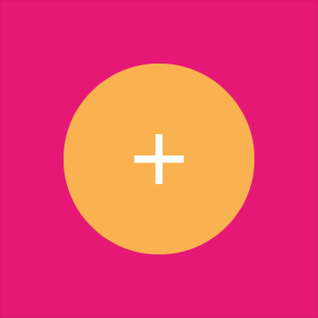
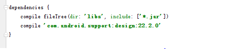
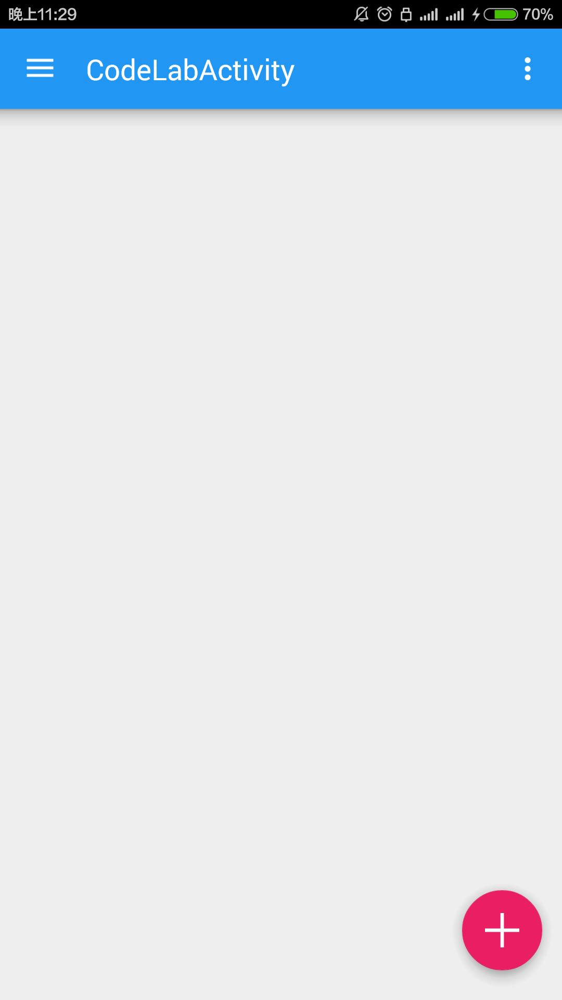
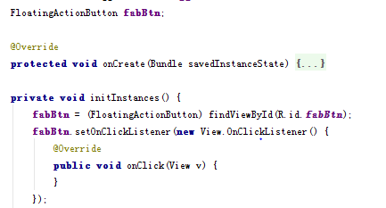
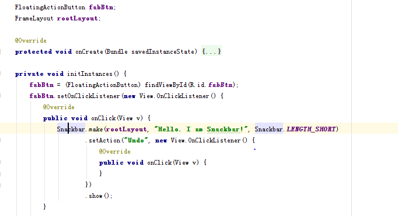

# Android Design Support Library 的使用  邱源-1501210973

**摘要**

**Material Design**是由谷歌的设计团队创建一种设计语言，旨在帮助设计师们创建易用性和实用性较强的网站和应用程序。

但是，在 Android 应用中Material Design是不容易实现的，因为材料设计的 UI 组件 如: Floating Action Button (FAB) 在低于 Android L 系统上是不可用的，我们只能选择使用由独立开发者公布出来的第三方库。

在2015.5.29的谷歌2015 I/O 大会时，谷歌宣布了一个今年最让人兴奋的支持库，名叫 **Android Design Support Library**，在这个单独的 library 里提供了一堆有用的材料设计 UI 组件。本篇技术文章介绍并研究了一些组件的使用方法和运行效果。


**关键字：安卓     Material Design    Android Design Support Library
**

---

## **1.Material Design**


Material Design是由谷歌的设计团队创建一种设计语言，旨在帮助设计师们创建易用性和实用性较强的网站和应用程序。这个概念基于一个不断更新的公开文档。该文档会随着域界以及技术更新而更新。

We challenged ourselves to create a visual language for our users that synthesizes the classic principles of good design with the innovation and possibility of technology and science. This is material design. This spec is a living document that will be updated as we continue to develop the tenets and specifics of material design.

**Material design的设计原则
**
 
**实体感就是(通过设计方式来表达)隐喻**

通过构建系统化的动效和空间合理化利用，并将两个理念合二为一，构成了实体隐喻。与众不同的触感是实体的基础，这一灵感来自我们对纸墨的研究，但是我们相信，随着科技的进步，应用前景将不可估量。

实体的表面和边缘提供基于真实效果的视觉体验，熟悉的触感让用户可以快速地理解和认知。实体的多样性可以让我们呈现出更多反映真实世界的设计效果，但同时又绝不会脱离客观的物理规律。

光效、表面质感、运动感这三点是解释物体运动规律、交互方式、空间关系的关键。真实的光效可以解释物体之间的交合关系、空间关系，以及单个物体的运动。


**鲜明、形象、深思熟虑**

新的视觉语言，在基本元素的处理上，借鉴了传统的印刷设计——排版、网格、空间、比例、配色、图像使用——这些基础的平面设计规范。在这些设计基础上下功夫，不但可以愉悦用户，而且能够构建出视觉层级、视觉意义以及视觉聚焦。精心选择色彩、图像、选择合乎比例的字体、留白，力求构建出鲜明、形象的用户界面，让用户沉浸其中。

Material Design 设计语言强调根据用户行为凸显核心功能，进而为用户提供操作指引。



**有意义的动画效果**

动画效果(简称动效)可以有效地暗示、指引用户。动效的设计要根据用户行为而定，能够改变整体设计的触感。动效应当在独立的场景呈现。通过动效，让物体的变化以更连续、更平滑的方式呈现给用户，让用户能够充分知晓所发生的变化。

动效应该是有意义的、合理的，动效的目的是为了吸引用户的注意力，以及维持整个系统的连续性体验。动效反馈需细腻、清爽。转场动效需高效、明晰。


-

Google在2015的IO大会上，给我们带来了更加详细的Material Design设计规范，同时，也给我们带来了全新的Android Design Support Library，在这个support库里面，Google给我们提供了更加规范的MD设计风格的控件。最重要的是，Android Design Support Library的兼容性更广，直接可以向下兼容到Android 2.2。

在项目中添加 Android Design Support Library的方式非常简单，在 app 的 build.gradle 文件下添加一行依赖代码:

```compile 'com.android.support:design:22.2.0'```




请注意 Design Support Library 依赖于 Support v4 和 AppCompat v7。一旦你在你的项目中添加这个 library，你也将获得一个这些 libraries 的组件的入口。

同时Activity 设置调整为材料设计风格的主题。

```
<item name="colorPrimary">#2196F3</item>
<item name="colorPrimaryDark">#1565C0</item>
<item name="colorAccent">#E91E63</item>
```


---

## **3.Floating Action Button**

Floating Action Button (FAB) 是悬浮响应式按钮，点击按钮后会产生墨水扩散效果的圆形按钮。平面设计中有个点线面的安排的概念，而FAB正是一个非常灵活且突出的点元素，FAB有跨越模块或分割线的条件，能起到“破形”的效果。圆形元素与分割线、卡片、各种bar的直线形成对比，让界面不会条条框框过于死板。它的存在让UI更热闹，丰富，所以毫不奇怪它为什么会变成材料设计的标志。

首先在布局文件中添加一个FAB，因为它需要一些父类来使它在屏幕的右下方位置对齐，所以要使用 FrameLayout 来包裹 FloatingActionButton。然后在 DrawerLayout 添加FAB控件，代码如下：

```
<android.support.v4.widget.DrawerLayout ...
    xmlns:app="http://schemas.android.com/apk/res-auto"
    ....>
    <FrameLayout
        android:id="@+id/rootLayout"
        android:layout_width="match_parent"
        android:layout_height="match_parent">
        <android.support.design.widget.FloatingActionButton
            android:id="@+id/fabBtn"
            android:layout_width="wrap_content"
            android:layout_height="wrap_content"
            android:layout_gravity="bottom|right"
            android:src="@drawable/ic_plus"
            app:fabSize="normal" />
    </FrameLayout>
    ...
</android.support.v4.widget.DrawerLayout>
```

使用android:src属性 来定义资源文件 ID（推荐 40dp 的清晰的 png 文件），而 app:fabSize="normal" 是用来定义 FAB 控件的大小的，normal 的意思是在大多数情况下标准尺寸为 56dp 的按钮，属性值设置为 mini 时控件的大小变成40dp。浮动操作按钮应至少放在距手机边缘 16dp 或电脑/台式机边缘 24dp 的地方。

在手机上运行效果如图：




关于按钮的颜色，FAB 一般使用强调色，想要修改时可以但是你可以重写 app:backgroundTint 属性来修改。


FAB按钮的点击事件和传统的按钮一样，可以通过 setOnClickListener() 处理点击事件，代码如下：





---

## **4.Snackbars与Toasts**

Snackbar 是一种针对操作的轻量级反馈机制，常以一个小的弹出框的形式，出现在手机屏幕下方或者桌面左下方。它们出现在屏幕所有层的最上方，包括浮动操作按钮。

它们会在超时或者用户在屏幕其他地方触摸之后自动消失。Snackbar 可以在屏幕上滑动关闭。当它们出现时，不会阻碍用户在屏幕上的输入，并且也不支持输入。屏幕上同时最多只能现实一个 Snackbar。

Android 也提供了一种主要用于提示系统消息的胶囊状的提示框 Toast。Toast 同 Snackbar 非常相似，但是 Toast 并不包含操作也不能从屏幕上滑动关闭，它的表现是作为 UI 的一部分而不是覆盖在屏幕上。

通常 Snackbar 的高度应该仅仅用于容纳所有的文本，而文本应该与执行的操作相关。Snackbar 中不能包含图标，操作只能以文本的形式存在。


与Toast的显示方式非常类似，在界面上显示一个Snackbar的代码如下，

```
Snackbar.make(someView, "Hello. I am Snackbar!", Snackbar.LENGTH_SHORT)
        .setAction("Undo", new View.OnClickListener() {
            @Override
            public void onClick(View v) {
            }
        }).show();
```

make() 的第一个参数是一个 View 或者一个 Layout，表示你想在哪里显示一个 Snackbar。setAction() 方法是用在设置显示在 Snackbar 的右侧的动作并有对应的监听。这个方法并不是必需的，可以移除。
代码如下：




