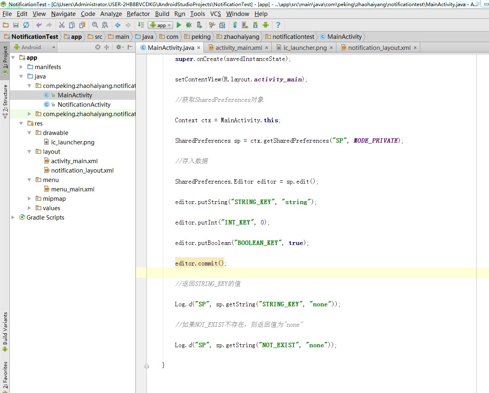

# Android中的数据存储  邱源-1501210973

**摘要**

一个完整的应用程序对于数据的操作是非常频繁的，安卓也不例外，数据存储在安卓开发过程也是使用非常频繁，不同的存储形式有着不同的特点，所以根据不同的行为选择不同存储方式也是一件比较重要的事情。在安卓开发中 ，经常使用的数据存储方式有5种，他们分别是使用SharedPreferences存储数据、使用文件存储数据、使用SQLite数据库存储、使用contenProvider存储数据以及使用网络存储数据。

**关键字：安卓 数据存储 数据库 文件 网络存储
**

---

	
## **1.SharedPreference存储数据**

SharedPreferences是一个轻量级的存储类，负责保存一些常用的配置例如窗口状态，一般在Activity中重载窗口状态onSaveInstanceState保存一般使用SharedPreferences完成，它完成Android平台常规的Long长整形、Int整形、String字符串型的保存。

SharedPreferences和Windows的INI配置文件有些相似，但它被划分多个权限，可以全局共享访问，android3提示最终是以xml方式来保存，整体效率上来说不是很高，对于常规的轻量级而言比SQLite要好，在存储量不大的情况下可以考虑使用自定义文件格式。xml 处理时Dalvik会通过自带的本地XML Parser解析，如XMLpull方式，这样有利于内存资源占用。它的本质是基于XML文件存储key-value键值对数据，通常用来存储一些简单的配置信息。

SharedPreferences文件都存储在/data/data/<包名>/shared_prefs目录下。

SharedPreferences对象本身只能获取数据而不支持存储和修改，存储修改是通过Editor对象实现。

SharedPreferences存储的具体实现如下： 　
1. 根据Context获取SharedPreferences对象
2. 利用edit()方法获取Editor对象。
3. 通过Editor对象存储key-value键值对数。
4. 通过commit()方法提交数据。

首先说明SharedPreferences存储方式，它是Android提供的用来存储一些简单配置信息的一种机制，实例如下：

数据的读取与写入的方法比较容易，写入的时候有些区别：首先调用edit()方法进入编辑状态，接着对数据进行修改，最后调用commit()方法将修改的数据提交。SharedPreferences采用了XML的格式将数据存储到设备中，在DDMS中的File Explorer中的/data/data/<package name>/shares_prefs目录下。以上面的数据存储结果为例，打开后可以看到一个user_info.xml的文件。

需要注意的是：使用SharedPreferences是有限制的：只能在同一个包内使用，不能在不同的包之间使用。
