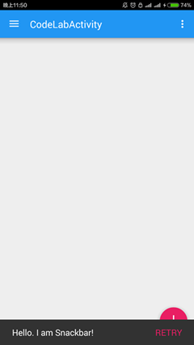
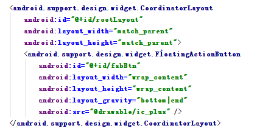
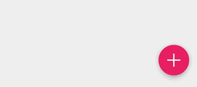
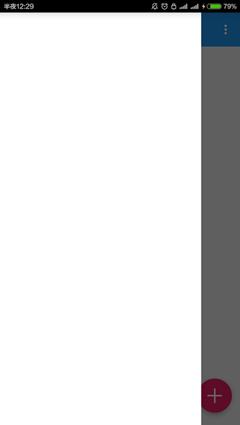
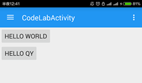
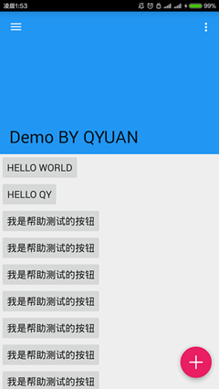
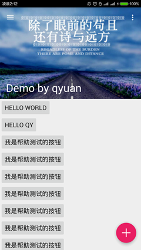
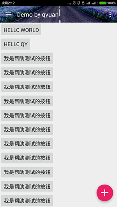
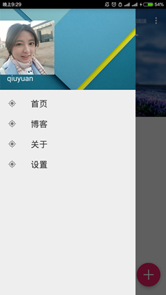

#Material Design实例- Android Design Support Library的使用  邱源-1501210973

**摘要**

**Material Design**是由谷歌的设计团队创建一种设计语言，旨在帮助设计师们创建易用性和实用性较强的网站和应用程序。

但是，在 Android 应用中Material Design是不容易实现的，因为材料设计的 UI 组件 如: Floating Action Button (FAB) 在低于 Android L 系统上是不可用的，我们只能选择使用由独立开发者公布出来的第三方库。

在2015.5.29的谷歌2015 I/O 大会时，谷歌宣布了一个今年最让人兴奋的支持库，名叫 **Android Design Support Library**，在这个单独的 library 里提供了一堆有用的材料设计 UI 组件。本篇技术文章介绍并研究了一些相关组件的使用方法和运行效果。


**关键字：Android   Material Design    Android Design Support Library
**

---

## **1.Material Design**


Material Design是由谷歌的设计团队创建一种设计语言，旨在帮助设计师们创建易用性和实用性较强的网站和应用程序。这个概念基于一个不断更新的公开文档。该文档会随着域界以及技术更新而更新。

Material Design突破了谷歌以往的所有设计，包括栅格、风格、布局等，谷歌将其特点概括为拟物和扁平的结合。和苹果以前的拟物设计并不尽相同，Material Design更关心系统反应的质感、层次、深度，和其他物体的叠放逻辑，比如打开页面时，新页面不是像以往那样直接跳转，而是从一个中心点扩展开来，并且利用原页面在底部的投影营造出立体空间感，告诉用户，页面从哪里来、到哪里去，形成一种操作逻辑。从某种程度上来说，Material Design更像是把交互界面变成了一张张有逻辑顺序的卡片纸。

We challenged ourselves to create a visual language for our users that synthesizes the classic principles of good design with the innovation and possibility of technology and science. This is material design. This spec is a living document that will be updated as we continue to develop the tenets and specifics of material design.

**Material design的设计原则
**
 
**实体感就是(通过设计方式来表达)隐喻**

通过构建系统化的动效和空间合理化利用，并将两个理念合二为一，构成了实体隐喻。与众不同的触感是实体的基础，这一灵感来自我们对纸墨的研究，但是我们相信，随着科技的进步，应用前景将不可估量。

实体的表面和边缘提供基于真实效果的视觉体验，熟悉的触感让用户可以快速地理解和认知。实体的多样性可以让我们呈现出更多反映真实世界的设计效果，但同时又绝不会脱离客观的物理规律。

光效、表面质感、运动感这三点是解释物体运动规律、交互方式、空间关系的关键。真实的光效可以解释物体之间的交合关系、空间关系，以及单个物体的运动。


**鲜明、形象、深思熟虑**

新的视觉语言，在基本元素的处理上，借鉴了传统的印刷设计——排版、网格、空间、比例、配色、图像使用——这些基础的平面设计规范。在这些设计基础上下功夫，不但可以愉悦用户，而且能够构建出视觉层级、视觉意义以及视觉聚焦。精心选择色彩、图像、选择合乎比例的字体、留白，力求构建出鲜明、形象的用户界面，让用户沉浸其中。

Material Design 设计语言强调根据用户行为凸显核心功能，进而为用户提供操作指引。


**有意义的动画效果**

动画效果(简称动效)可以有效地暗示、指引用户。动效的设计要根据用户行为而定，能够改变整体设计的触感。动效应当在独立的场景呈现。通过动效，让物体的变化以更连续、更平滑的方式呈现给用户，让用户能够充分知晓所发生的变化。

动效应该是有意义的、合理的，动效的目的是为了吸引用户的注意力，以及维持整个系统的连续性体验。动效反馈需细腻、清爽。转场动效需高效、明晰。


-

Google在2015的IO大会上，给我们带来了更加详细的Material Design设计规范，同时，也给我们带来了全新的Android Design Support Library，在这个support库里面，Google给我们提供了更加规范的MD设计风格的控件。最重要的是，Android Design Support Library的兼容性更广，直接可以向下兼容到Android 2.2。

在项目中添加 Android Design Support Library的方式非常简单，在 app 的 build.gradle 文件下添加一行依赖代码:

```compile 'com.android.support:design:22.2.0'```


请注意 Design Support Library 依赖于 Support v4 和 AppCompat v7。一旦你在你的项目中添加这个 library，你也将获得一个这些 libraries 的组件的入口。

同时Activity 设置调整为材料设计风格的主题。

```
<item name="colorPrimary">#2196F3</item>
<item name="colorPrimaryDark">#1565C0</item>
<item name="colorAccent">#E91E63</item>
```


---

## **3.Floating Action Button**

Floating Action Button (FAB) 是悬浮响应式按钮，点击按钮后会产生墨水扩散效果的圆形按钮。平面设计中有个点线面的安排的概念，而FAB正是一个非常灵活且突出的点元素，FAB有跨越模块或分割线的条件，能起到“破形”的效果。圆形元素与分割线、卡片、各种bar的直线形成对比，让界面不会条条框框过于死板。它的存在让UI更热闹，丰富，所以毫不奇怪它为什么会变成材料设计的标志。

首先在布局文件中添加一个FAB，因为它需要一些父类来使它在屏幕的右下方位置对齐，所以要使用 FrameLayout 来包裹 FloatingActionButton。然后在 DrawerLayout 添加FAB控件，代码如下：

```
<android.support.v4.widget.DrawerLayout ...
    xmlns:app="http://schemas.android.com/apk/res-auto"
    ....>
    <FrameLayout
        android:id="@+id/rootLayout"
        android:layout_width="match_parent"
        android:layout_height="match_parent">
        <android.support.design.widget.FloatingActionButton
            android:id="@+id/fabBtn"
            android:layout_width="wrap_content"
            android:layout_height="wrap_content"
            android:layout_gravity="bottom|right"
            android:src="@drawable/ic_plus"
            app:fabSize="normal" />
    </FrameLayout>
    ...
</android.support.v4.widget.DrawerLayout>
```

使用android:src属性 来定义资源文件 ID（推荐 40dp 的清晰的 png 文件），而 app:fabSize="normal" 是用来定义 FAB 控件的大小的，normal 的意思是在大多数情况下标准尺寸为 56dp 的按钮，属性值设置为 mini 时控件的大小变成40dp。浮动操作按钮应至少放在距手机边缘 16dp 或电脑/台式机边缘 24dp 的地方。

在手机上运行效果如图：


FAB按钮的点击事件和传统的按钮一样，可以通过 setOnClickListener() 处理点击事件，代码如下：


---

## **4.Snackbars与Toasts**

Snackbar 是一种针对操作的轻量级反馈机制，常以一个小的弹出框的形式，出现在手机屏幕下方或者桌面左下方。它们出现在屏幕所有层的最上方，包括浮动操作按钮。

它们会在超时或者用户在屏幕其他地方触摸之后自动消失。Snackbar 可以在屏幕上滑动关闭。当它们出现时，不会阻碍用户在屏幕上的输入，并且也不支持输入。屏幕上同时最多只能现实一个 Snackbar。

Android 也提供了一种主要用于提示系统消息的胶囊状的提示框 Toast。Toast 同 Snackbar 非常相似，但是 Toast 并不包含操作也不能从屏幕上滑动关闭，它的表现是作为 UI 的一部分而不是覆盖在屏幕上。

通常 Snackbar 的高度应该仅仅用于容纳所有的文本，而文本应该与执行的操作相关。Snackbar 中不能包含图标，操作只能以文本的形式存在。


与Toast的显示方式非常类似，在界面上显示一个Snackbar的代码如下，

```
Snackbar.make(someView, "Hello. I am Snackbar!", Snackbar.LENGTH_SHORT)
        .setAction("Undo", new View.OnClickListener() {
            @Override
            public void onClick(View v) {
            }
        }).show();
```

make() 的第一个参数是一个 View 或者一个 Layout，表示你想在哪里显示一个 Snackbar。setAction() 方法是用在设置显示在 Snackbar 的右侧的动作并有对应的监听。这个方法并不是必需的，可以移除。
代码如下：


运行程序，点击 FAB后看到的结果如下：



---

## **5.CoordinatorLayout **

CoordinatorLayout 实现了多种Material Design中提到的滚动效果。目前这个框架提供了几种不用写动画代码就能工作的方法，这些效果包括：
* 让浮动操作按钮上下滑动，为Snackbar留出空间。
* 扩展或者缩小Toolbar或者头部，让主内容区域有更多的空间。
* 控制哪个view应该扩展还是收缩，以及其显示大小比例，包括**视差滚动效果动画。**

现在将之前用到的包裹FAB的 FrameLayout 改成 CoordinatorLayout.



**结果**：现在 FAB 随着 Snackbar 的出现和消失而移动，而且Snackbar 现在能够滑动消失了.



---

## **6.Toolbar **
Toolbar是android L引入的一个新控件，可以理解为action bar的第二代：提供了action bar类似的功能，但是更灵活。不像actionbar那么固定，Toolbar更像是一般的View元素，可以被放置在view树体系的任意位置，可以应用动画，可以跟着scrollView滚动，可以与布局中的其他view交互。

从ActionBar切换到Toolbar需要在Activity定义的 AppTheme 的 style 属性把ActionBar隐藏掉。
```
<style name="AppTheme" parent="Theme.AppCompat.Light.DarkActionBar">
    <item name="windowActionBar">false</item>
    <item name="windowNoTitle">true</item>
</style>
```
然后在CoordinatorLayout中放一个Toolbar组件。并且定义一个 AppBar
Layout 包裹 住Toolbar。  最后在java文件中使用 setSupportActionBar(toolbar);
```
<android.support.v7.widget.Toolbar
        android:id="@+id/toolbar"
        android:layout_width="match_parent"
        android:layout_height="?attr/actionBarSize"
        android:background="?attr/colorPrimary"
        app:popupTheme="@style/ThemeOverlay.AppCompat.Light"
        app:theme="@style/ThemeOverlay.AppCompat.Dark.ActionBar" />
    <android.support.design.widget.FloatingActionButton
        ...>
        ```


运行程序，看到 Drawer Menu 覆盖在App Bar区域的顶部，而且应用栏区域下面的阴影现在回来了。



---

## **7.在Layout内填充内容 **

在 AppBarLayout 和 FAB 之间放置两个简单的按钮。

```
<LinearLayout
    android:layout_width="match_parent"
    android:layout_height="match_parent"
    android:orientation="vertical"
    app:layout_behavior="@string/appbar_scrolling_view_behavior">
    <Button
        android:layout_width="wrap_content"
        android:layout_height="wrap_content"
        android:text="Hello World"/>
    <Button
        android:layout_width="wrap_content"
        android:layout_height="wrap_content"
        android:text="Hello qy"/>
</LinearLayout>
```

运行程序，结果如下：


这些按钮都被放在了 Toolbar 下面，因为LinearLayout 没有被设计成与 CoordinatorLayout 协同工作。需要在 LinearLayout 添加一个属性告诉它的滚动行为，代码如下：

```
<LinearLayout
    ...
    app:layout_behavior="@string/appbar_scrolling_view_behavior"
    ...>
```

更改之后的运行结果：



---

## **8.使ToorBar可折叠 **

传统的ToorBar展开折叠的效果不是很好,Android Design Support Library 可以使ToorBar可以展开和折叠，菜单栏可以在这个过程中留在屏幕内。这个功能具体是通过 CollapsingToolbarLayout 实现的，与其他组件一样，过程非常简单容易，具体操作步骤如下：

* 用 CollapsingToolbarLayout 包裹 Toolbar。

* 从 Toolbar 中删除 layout_scrollFlags
* 为 CollapsingToolbarLayout 声明 layout_scrollFlags，并且将 layout_scrollFlags 设置成 scroll|exitUntilCollapsed

* 改变 AppBarLayout 扩张状态时的布局高度大小。这里我用的 256dp

代码如下
其中app:layout_collapseMode="pin"用来固定ToorBar，让它总是在屏幕的顶部。

```
<android.support.design.widget.AppBarLayout
    android:layout_width="match_parent"
    android:layout_height="256dp">
    <android.support.design.widget.CollapsingToolbarLayout
        android:id="@+id/collapsingToolbarLayout"
        android:layout_width="match_parent"
        android:layout_height="match_parent"
        app:layout_scrollFlags="scroll|exitUntilCollapsed">
        <android.support.v7.widget.Toolbar
            android:id="@+id/toolbar"
            android:layout_width="match_parent"
            android:layout_height="?attr/actionBarSize"
            android:background="?attr/colorPrimary"
            android:minHeight="?attr/actionBarSize"
            app:theme="@style/ThemeOverlay.AppCompat.Dark.ActionBar"
            app:popupTheme="@style/ThemeOverlay.AppCompat.Light"
            app:layout_collapseMode="pin"/>
    </android.support.design.widget.CollapsingToolbarLayout>
</android.support.design.widget.AppBarLayout>
```

要显示标题栏的文字，需在 Java 代码中手动设置 setTitle(String)。
```
CollapsingToolbarLayout collapsingToolbarLayout;
private void initInstances() {
    ...
    collapsingToolbarLayout = (CollapsingToolbarLayout) findViewById(R.id.collapsingToolbarLayout);
    collapsingToolbarLayout.setTitle("Design Library");
}
```



如果需要更改标题栏的文字的颜色，，只需要简单的为 AppBarLayout 声明 android:theme 属性就可以了，代码如下：
```
<android.support.design.widget.AppBarLayout
    ...
    android:theme="@style/ThemeOverlay.AppCompat.Dark.ActionBar">```

---

## **9.为ActionBar添加背景图片 **


由于CollapsingToolbarLayout 是继承自 FrameLayout的，所以只需要 轻松的添加一个 ImageView 作为 Toolbar 的背景图层，代码如下：

```
<ImageView
    android:layout_width="match_parent"
    android:layout_height="match_parent"
    android:scaleType="centerCrop"
    android:src="@drawable/header" />
<android.support.v7.widget.Toolbar
    ...
```
接下来，想要使蓝色的导航条取消显示，背景只显示我们设置的图片的话，把android:background="?attr/colorPrimary"去掉。

可以使用视差模式让它变得更优雅一些，需要声明 collapse ，代码如下：

```
<ImageView
   ...
   app:layout_collapseMode="parallax" />
   
```
通过声明属性 app:contentScrim 可以让ToorBar在收缩的时候自动的变化到普通的颜色，代码如下：
```
<android.support.design.widget.CollapsingToolbarLayout
    ...
    app:contentScrim="?attr/colorPrimary">
```

程序的运行结果：




---

## **9.Navigation Drawer**

        Navigation Drawer是从屏幕的左侧滑出，显示应用导航的视图。官方是这样定义的：
        The navigation drawer is a panel that displays the app’s main   
        navigation options on the left edge of the screen. It is hidden   
        most of the time, but is revealed when the user swipes a finger   
        from the left edge of the screen or, while at the top level 
        of the app, the user touches the app icon in the action bar.  

首先，为 Drawer Menu 创建一个标题视频布局文件

```
<?xml version="1.0" encoding="utf-8"?>
<FrameLayout xmlns:android="http://schemas.android.com/apk/res/android"
    android:layout_width="match_parent"
    android:layout_height="192dp"
    android:theme="@style/ThemeOverlay.AppCompat.Dark">
    <ImageView
        android:layout_width="match_parent"
        android:layout_height="match_parent"
        android:src="@drawable/header_bg"
        android:scaleType="centerCrop" />
    <ImageView
        android:layout_width="wrap_content"
        android:layout_height="wrap_content"
        android:src="@drawable/qyuan"
        android:layout_gravity="bottom"
        android:layout_marginBottom="36dp" />
    <TextView
        android:layout_width="match_parent"
        android:layout_height="wrap_content"
        android:layout_gravity="bottom"
        android:layout_margin="16dp"
        android:text="qiuyuan"
        android:textAppearance="@style/TextAppearance.AppCompat.Body1"/>
</FrameLayout>
```
然后创建一个菜单资源文件，代码如下：
```
<?xml version="1.0" encoding="utf-8"?>
<menu xmlns:android="http://schemas.android.com/apk/res/android">
    <group android:checkableBehavior="all">
        <item
            android:id="@+id/navItem1"
            android:icon="@drawable/ic_action_location_found_dark"
            android:title="首页"/>
        <item
            android:id="@+id/navItem2"
            android:icon="@drawable/ic_action_location_found_dark"
            android:title="博客"/>
        <item
            android:id="@+id/navItem3"
            android:icon="@drawable/ic_action_location_found_dark"
            android:title="关于"/>
        <item
            android:id="@+id/navItem4"
            android:icon="@drawable/ic_action_location_found_dark"
            android:title="设置"/>
    </group>
```

最后用NavigationView 与两个资源文件绑定起来，作为 Drawer Menu 的菜单区域，代码如下：
``` 
<android.support.design.widget.NavigationView
        android:id="@+id/navigation"
        android:layout_width="wrap_content"
        android:layout_height="match_parent"
        android:layout_gravity="start"
        app:headerLayout="@layout/nav_header"
        app:itemIconTint="#333"
        app:itemTextColor="#333"
        app:menu="@menu/navigation_drawer_items" />
</android.support.v4.widget.DrawerLayout>
```
点击运行，结果如下：



---

## **参考文献**

[](http://www.google.com/design/spec/material-design/)