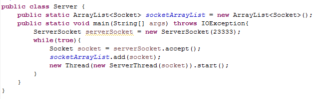

# Android Socket网络编程（1501211001 王宇）

1、简介

TCP/IP协议是一种可靠网络协议，通过在通信两端建立数据报套接字（Socket），从而形成网络虚拟链路。Android中用于网络通信的方法很多，这里主要介绍和简单实践使用标准JAVA接口的Socket方式进行通信的方法。

2、实践思路

构建一个简单的安卓“聊天室”App，分别创建实现数据包处理分发的SocketServer和运行于Android终端的SocketClient，以此学习和了解Socket通信过程。

3、SocketServer部分的实现

考虑到客户端需要与服务器端长时间保持通信连接，通常情况下一定会发生堵塞情况，所以服务器需要为每个接收到的Socket单独启动一条线程，每条线程专门负责为某一个客户端服务。为此，服务器维护一个Socket链表，在服务器持续等待接收客户端发送请求的过程中，将接收到的所有Socket添加到Socket链表中，并为每一个Socket启动一条线程承担所有通信任务（包括接收该Socket的数据，以及将该Socket携带的数据发送至Socket链表中的其余项来保证“即时聊天”的功能）。

Server代码如图：

ServerThread负责读取客户端Socket信息，并转发到其余socketList其余各项。注意在重写run()方法中，语句br.readLine()会导致阻塞。这也决定了我们通过多线程的方法来解决这个问题。代码如下：

4、SocketClient部分的实现

客户端即是Android App端，需要在主界面与用户交互，把用户输入信息写入Socket；同时在正常建立连接的情况下读取服务器发来的数据包，体现在主界面上。

客户端MainActivity中包含两个线程，一条clientThread用于后台信息发送接收，另一条主线程通过定义Handler处理子线程接收到的消息，将结果反馈给用户。MainActivity具体代码如图：

ClientThread具体实现如图：

注：生成Socket的ip地址由具体的服务器端运行环境决定。

5、运行结果

实验条件所限，最后只用两台不同手机进行试验。

6、总结

通过试验，发现Android中使用Java Socket套接字可以很方便进行网络通讯，与本地的数据流处理没有太大区别。需要注意的是需要在Android App上创建新的线程进行数据处理，而借助Handler与UI线程保持同步。