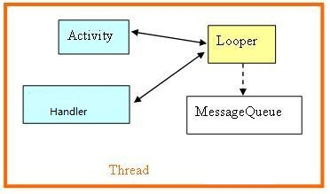
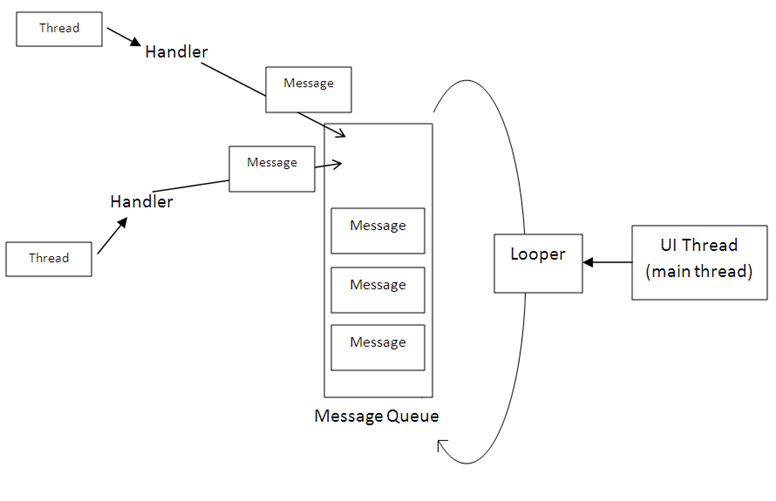
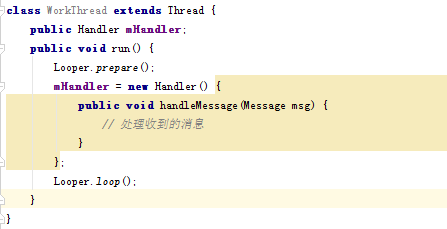

# Android中的消息传递

姓名：陈靖野

学号：1501210883

## 摘要

在android的activity中有各种各样的事件，而这些事件最终是转换为消息来处理的。在程序开发时，对于比较耗时的操作，比如需要远程网络访问、下载等操作时，一般情况下都会启动一个新的线程去操作。而不会放在UI线程去做，这样可以防止 android的5秒无响应导致的ANR异常，并尽可能减少用户的等待时间。在Android中，默认情况下，所有的操作都是在主线程中进行的，主线程负责与UI相关的事件。而在自己新建的线程中，不能对UI进行操作。因此Android提供了消息处理传递机制来解决这一问题。子线程中返回的结果可以通过Handler来处理，在主线程中定义 Handler，然后通过主线程handler把子线程中的消息发送到主线程对应的消息队列。在主线程中通过 handler.handlerMessage就可以处理消息了，并更新到UI了。本文将具体介绍Android中消息传递的过程。

## 正文

android中的消息系统涉及到：
 *  消息发送
 *  消息队列
 *  消息循环
 *  消息分发
 *  消息读取
  
消息对应的重要类有MessageQueue、Looper、Handler，它们分别对应着消息队列、消息循环和消息处理。

### 一、MessageQueue、Message、Looper、Handler简介

1.MessageQueue

消息队列，用来存放Handler发送过来的消息，使用FIFO规则执行，每个线程只能拥有一个MessageQueue。当然，存放Message并非实际意义的保存，而是将Message以链表的方式串联起来的，等待Looper的抽取。

MessageQueue是用来容纳Message队列的，其中的Message是由Looper来分发的，Message不能直接添加到MessageQueue中，而是要通过与Looper关联的Handler去添加。
创建一个线程的时候，并不会自动创建其MessageQueue。通常使用一个Looper对象对该线程的MessageQueue进行管理。主线程创建时，会创建一个默认的Looper对象，而Looper对象的创建，将自动创建一个MessageQueue。其他非主线程，不会自动创建Looper，要需要的时候，通过调用prepare函数来实现。

2.Message

消息对象，MessageQueue中的存放的对象，是线程之间传递信息的载体，包含了对消息的描述和任意的数据对象。一个MessageQueue中包含多个Message。 

这个类有几个比较重要的字段：

a.arg1和arg2：我们可以使用两个字段用来存放我们需要传递的整型值，在Service中，我们可以用来存放Service的ID。

b.obj：该字段是Object类型，我们可以让该字段传递某个多项到消息的接受者中。

c.what：这个字段可以说是消息的标志，在消息处理中，我们可以根据这个字段的不同的值进行不同的处理，类似于我们在处理Button事件时，通过switch(v.getId())判断是点击了哪个按钮。

在使用Message时，我们可以通过new Message()创建一个Message实例，但是Android更推荐我们通过Message.obtain()或者 Handler.obtainMessage()获取Message对象。这并不一定是直接创建一个新的实例，而是先从消息池中看有没有可用的 Message实例，存在则直接取出并返回这个实例。反之如果消息池中没有可用的Message实例，则根据给定的参数new一个新Message对象。 通过分析源码可得知，Android系统默认情况下在消息池中实例化10个Message对象。调用removeMessage()时，将Message从MessageQueue中删除，同时放入到消息池中。

3.Looper

MessageQueue的管理者。主要用来开启线程的消息循环，从MessageQueue中抽取Message执行。默认情况下，系统在启动的时候会为主线程创建消息循环。其他新创建的线程则没有，可以在该线程内调用Looper.prepare()来启用looper对象，然后调用Looper.loop()进入消息循环。每一个Looper对象和一个线程关联。通过调用Looper.myLooper()可以获得当前线程的Looper对象 。

Looper从MessageQueue中取出Message，然后交由Handler的handleMessage()进行处理。处理完成后，调用Message.recycle()将其放入Message Pool中。

4.Handler

Handler的作用主要有2个：

（1）发送消息。

（2）获取、处理消息。

基本原理：为了让主线程能及时处理子线程发送的消息，显然只能通过回调的方法来实现----开发者只要重写Handler类中的方法，当新启动的线程发送消息时，消息会发送至与之关联的MessageQueue，而Handler会不断的从MessageQuere中获取并处理消息-----这将导致Handler类中处理消息的方法被回调。

每个Handler实例都对应着一个线程和该线程的消息队列。当你创建一个Handler对象时，该Handler对象就属于创建它的线程，并和该线程的消息队列绑定，比如在主线程中创建Handler对象，那么该 Handler就只属于主线程，并且和主线程的消息队列绑定。这样，该Handler就可以发送消息到该消息队列并且处理该消息队列的消息了。

Handler可以将需要传递的信息封装成Message，通过调用handler 对象的obtainMessage()来实现。同时Handler可以将消息传递给Looper，这是通过Handler 对象的sendMessage()来实现的。继而由Looper将Message放入MessageQueue中。
当Looper对象看到MessageQueue中含有Message，就将其广播出去。该handler 对象收到该消息后，调用相应的handler 对象的handleMessage()方法对其进行处理。

Handler的实现主要是依靠下面的几个方法：

读取消息使用到的方法是; 
void handleMessage(Message msg) ，进程通过重写这个方法来处理消息。

final boolean hasMessage(int what), 检查消息队列中是否包含what属性为指定值的消息。

final boolean hasMessage(int what，Object object),减产队列中是否有指定值和指定对象的消息。

Message obtainMessage(): 获取消息，课被多种方式重载。

发送消息用到的方法有：

sendEmptyMessage(int what): 发送空消息；

final boolean sendEmptyMessageDelayed(int what, long delayMillis)：指定多少毫秒之后发送空消息

final boolean sendMessage(Message msg):立即发送消息

final boolean sendMessageDelayed(Message msg, long delayMillis)指定多少毫秒之后发送空消息

### 二、Handler、Message、Looper关系

首先将一个Message对象通过Handler发送到MessageQueue中，Looper负责从MessageQueue中取出Message，执行handleMessage中的方法体。
下面是消息机制中几个重要成员的关系图：

 

 

### 三、基本原理及步骤

前面提到，Android的消息队列和消息循环都是针对具体线程的，一个线程可以存在一个消息队列和消息循环，特定线程的消息只能分发给本线程，不能跨线程和跨进程通讯。但是创建的工作线程默认是没有消息队列和消息循环的，如果想让工作线程具有消息队列和消息循环，就需要在线程中先调用 Looper.prepare()来创建消息队列，然后调用Looper.loop()进入消息循环。下面是我们创建的工作线程：
 
 
 
这样一来，我们创建的工作线程就具有了消息处理机制了。

1.同线程内不同组件间的消息传递

Looper类用来管理特定线程内对象之间的消息交换(Message Exchange)。你的应用程序可以产生许多个线程。而一个线程可以有许多个组件，这些组件之间常常需要互相交换讯息。如果有这种需要，您可以替线程构造一个Looper对象，来担任讯息交换的管理工作。Looper对象会建立一个MessageQueue数据结构来存放各对象传来的消息(包括UI事件或System事件等)。每一个线程里可含有一个Looper对象以及一个
MessageQueue数据结构。在你的应用程序里，可以定义Handler的子类别来接收Looper所送出的消息。

2.子线程和主线程之间的消息传递

前面提到最多的是消息队列(MessageQueue)和消息循环(Looper)，但是我们看到每个消息处理的地方都有Handler的存在，Handler的作用是把消息加入特定的Looper所管理的消息队列中，并分发和处理该消息队列中的消息。构造Handler的时候可以指定一个Looper对象，如果不指定则利用当前线程的Looper对象创建。

一个Activity中可以创建出多个工作线程，如果这些线程把他们消息放入Activity主线程的消息队列中，那么消息就会在主线程中处理了。因为主线程一般负责视图组件的更新操作，对于不是线程安全的视图组件来说，这种方式能够很好的实现视图的更新。
那么，子线程如何把消息放入主线程的消息队列中呢？只要Handler对象以主线程的Looper创建，那么当调用Handler的sendMessage方法，系统就会把消息主线程的消息队列，并且将会在调用handleMessage方法时处理主线程消息队列中的消息。

对于子线程访问主线程的Handler对象，多个子线程都访问主线程的Handler对象，发送消息和处理消息的过程中不会出现数据的不一致，因为Handler对象管理的Looper对象是线程安全的，不管是添加消息到消息队列还是从消息队 列中读取消息都是同步保护的，所以不会出现数据不一致现象。

## 总结

最后，我们将Android中消息传递的过程归结为如下的基本步骤：

在被调用线程中完成以下内容：

（1）调用 Looper的prepare()方法为当前线程创建Looper对象，创建Looper对象时，它的构造器会创建与之配套的MessageQueue。

（2）有了Looper之后，创建Handler子类的实例，重写HandlerMessage()方法，该方法负责处理来自其它线程的消息。

（3）调用Looper的loop()方法启动Looper。

注：若被调用线程是主线程类，由于系统自动为主线程创建了Looper的实例，因此第一、三步骤可省略，而只需要做第2步即可。

在调用线程中完成：

（1）创建message，并填充内容。

（2）使用被调用类创建的Handler实例，调用sendMessage(Message msg)方法。

