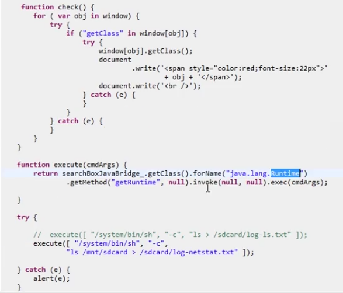
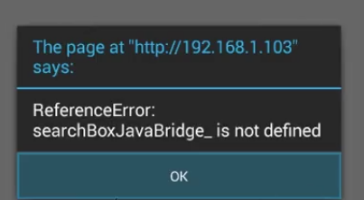

# Android中的WebView详解


## 姓名：徐鑫


##学号：1501210748


# 


# WebView简介


Webview是一款基于Android webkit内核的浏览器行为框架。在Android SDK中叫做Webview，属于常用组建的一种。Webview的作用是加载一些html页面的信息。
出于两点考虑我们要使用webview，一个是兼容已有的项目。比如说，淘宝网已经开发搭建好了网页平台，现在想要把它在移动端展示出来，如果重新开发就十分消耗人力物力，可以将已经建好的web页面信息直接在本地浏览器打开就可以了。第二点是webview可以随时的更新文本信息，也就是服务端开发的好处。一旦服务端发现有bug，可以随时地上线，这样客户端就可以马上展现出来，不会看出任何bug。但是平常开发android应用是非常苦恼的，一旦发现bug就不能修复了，只能在下一个版本进行修改。
实现一个最简单的webview的小例子如下所示：
在Manifest中添加访问网络的权限：

```
<uses-permission android:name="android.permission.INTERNET"/>```

在MainActivity中初始化webview控件，调用loadUrl方法指定将要访问的网络url：

```
package pku.ss.xuxin.web1;

import android.support.v7.app.AppCompatActivity;
import android.os.Bundle;
import android.webkit.WebView;

public class MainActivity extends AppCompatActivity {

    
    private WebView webView;

    @Override
    protected void onCreate(Bundle savedInstanceState) {
        super.onCreate(savedInstanceState);
        setContentView(R.layout.activity_main);
        webView= (WebView) findViewById(R.id.webView);
        webView.loadUrl("http://www.pku.edu.cn/");
    }
    }

```
运行这个小程序，发现在加载activity_main 的时候会自动跳转到系统默认的浏览器打开访问网站，这是因为loadUrl是使用默认浏览器的方式打开，如果想要在app界面中显示链接到的地址，就要重写webView方法
```

webView.setWebChromeClient(new WebChromeClient() {
    @Override
    public void onReceivedTitle(WebView view, String title) {
        super.onReceivedTitle(view, title);
    }
});


webView.setWebViewClient(new WebViewClient(){
    @Override
    public boolean shouldOverrideUrlLoading(WebView view, String url) {

        view.loadUrl(url);
        return super.shouldOverrideUrlLoading(view, url);
    }
});
```
通过view.loadUrl(url);让其在项目中加载url而不使用浏览器。


# 自定义WebView的title


我们都知道，一个网页是有一个title的描述的，为了把一个网页的title显示给客户端，需要在客户端做处理信息

为了在在布局文件中添加一个顶部的title，在activity_main中添加布局结构：
```
<RelativeLayout
    android:id="@+id/web_title_layout"
    android:layout_width="match_parent"
    android:layout_height="50dp">
<Button
    android:id="@+id/back"
    android:layout_alignParentLeft="true"
    android:layout_width="wrap_content"
    android:layout_height="40dp"
    android:text="返回"/>

    <Button
        android:id="@+id/refresh"
        android:layout_alignParentRight="true"
        android:layout_width="wrap_content"
        android:layout_height="40dp"
        android:text="刷新"/>

    <TextView
        android:id="@+id/title"
        android:layout_centerInParent="true"
        android:layout_width="wrap_content"
        android:layout_height="wrap_content" />

</RelativeLayout>
```


初始化组件：
```
private Button refresh;
private Button back;
private TextView title;
```
添加id：
```
back= (Button) findViewById(R.id.back);
refresh= (Button) findViewById(R.id.refresh);
title= (TextView) findViewById(R.id.textView);
```
给两个按钮添加监听事件：
```
class MyListener implements View.OnClickListener{

    @Override
    public void onClick(View v) {
        switch (v.getId()) {
            case R.id.refresh:
                webView.reload();
            case R.id.back:
                finish();
                break;
            default:
                break;
        }
        }
    }

refresh.setOnClickListener(new MyListener());
back.setOnClickListener(new MyListener());
```
重写onReceivedTitle方法
```
@Override
    public void onReceivedTitle(WebView view, String title) {
        titleview.setText(title);
        super.onReceivedTitle(view, title);
    }
});
```
我们可以看到，在加载页面的时候，百度页面的title信息已经显示在页面最上端：北京大学，点击刷新按钮可以重载webview页面，点击返回会结束该activity


# 使用WebView下载文件
我们平常使用浏览器搜索文件，在访问过程中可以下载自己所需要的文件，同样在使用webview时也可以下载文件，首先实例化一个接口
该接口的目的主要是通过该接口我们可以拿到当前浏览器的Url信息，通过这些信息去下载文件、MP3、图片等都可以。

通过

```
public void onDownloadStart(String url, String userAgent, String contentDisposition, String mimetype, long contentLength)```
方法可以拿到url信息，通过它就能把文件下载到本地

我们需要从网络下载文件必须要创建一个网络线程，此时需要创建一个HttpThread
重写run方法，在run方法中执行下载的操作

通过一个构造方法把url信息传入，否则无法拿到就不能进行下载

```
private String mUrl;
public HttpThread(String url){
    this.mUrl=url;
}
```
通过网络创建连接：

```
URL httpUrl=new URL(mUrl);```

接受输入流，发送输出流：

```
HttpURLConnection conn= (HttpURLConnection) httpUrl.openConnection();
conn.setDoInput(true);
conn.setDoOutput(true);
```

拿到url后，通过它实现下载的方式是重中之重，将要下载的文件会存放在SD卡上，这就需要在程序中判断SD卡是否存在

```
if(Environment.getExternalStorageState().equals(Environment.MEDIA_MOUNTED)){}```

拿到外置的存储目录：

```
downloadFile=Environment.getExternalStorageDirectory();```
文件写入SD卡的具体目录设置：
```
File sdFile=new File(downloadFile,"test.apk");```
至此，文件已经创建好了。接下来通过http得到这个流：
首先建一个6k的缓存，

```
byte[] b=new byte[6*1024];```
数据流的位置信息需要读出，使用len记录当前读到的内容在当前字节是多大一个长度。-1是标志一个流终止的标志
```
while ((len=in.read(b))!=-1)```
得到下载地址地流
```
InputStream in=conn.getInputStream();```
同样要创建输出流：
```
FileOutputStream out;
out=new FileOutputStream(sdFile);```
判断如果该流数据为空的情况下，就往这个流中去写入相关的数据，调用其write方法，写入缓存中，从0开始写，写到目前读到的位置上
```
while ((len=in.read(b))!=-1){
    if(out!=null){
        out.write(b,0,len);
    }```

完事之后要关闭输入流与输出流


```
if(out!=null){
    out.close();
}
if (in!=null){
    in.close();
}
```
这样，下载流的线程就全部写好了。
接下来，在MainActivity中new一个线程对象，将url传入

```
new HttpThread(url).start();```
设置监听方法：
```
webView.setDownloadListener(new MyDownload());```
判断如果该url的结尾是以“.apk”结尾的话，就下载这个文件
```
System.out.println("url---------->" + url);
if(url.endsWith(".apk")){
    new HttpThread(url).start();
}
```


可以查看结果，文件已经开始正常下载：


其实，调用系统的方式去下载会更加方便，无需自己再写：
```
Uri uri=Uri.parse(url);
Intent intent=new Intent(Intent.ACTION_VIEW);
startActivity(intent);
```
这样的下载方式会将下载进城显示在notification中，第二种方式比自己写的方法要快捷多了。


# WebView对错误码的处理

有的时候我们通过网络去访问一个html页面，但是如果突然间没有网络了，webview会导入一个错误页面，这个页面是一个系统默认的界面。一般通过两种策略处理这种错误情况，一种是加载一个本地html的错误页面，一种是纯native写一个错误页面
在setWebViewClient中重写onReceivedError方法，该方法只是回调在webview出现错误的时候，通过webview加载一个本地的url，在街面上显示404消息告知网络连接错误。
```
@Override
    public void onReceivedError(WebView view, int errorCode, String description, String failingUrl) {
        super.onReceivedError(view, errorCode, description, failingUrl);
        view.loadUrl("file:///android_asset/error.html");
    }
});
```


还有一种方式是通过native布局去展示一个错误页面的布局，首先加入一个textview布局
```
<TextView
    android:id="@+id/text_error"
    android:layout_width="match_parent"
    android:layout_height="match_parent"
    android:layout_alignTop="@+id/webView" />
```
初始化
```
private TextView mTextView_Error;
mTextView_Error= (TextView) findViewById(R.id.text_error);
```
同样在setWebViewClient中重写onReceivedError方法，通过setText的方法显示出自己创建的页面文字。然后把webview隐藏掉，使用setVisibility的方法。
```
@Override
public void onReceivedError(WebView view, int errorCode, String description, String failingUrl) {
    super.onReceivedError(view, errorCode, description, failingUrl);
  //  view.loadUrl("file:///android_asset/error.html");
    mTextView_Error.setText("404 error");
    webView.setVisibility(View.GONE);
}
```
这样一来，本地的错误页就已经展示出来了。


总体来说，WebView对错误码的处理有以下几种方式：

1.加载本地assert目录下文件（error.html）
webcontent.loadUrl（" file:///android_asset/error.html "）;

2.加载网络url（http:// www.pku.edu.cn）
webcontent.loadUrl（" http://www.pku.edu.cn "）;

3.加载 String 类型html
```
String
errorHtml = "<html><body><h1>Page not find!</h1></body></html>";
webcontent.loadData(errorHtml,
 "text/html", "UTF-8");
```
4.加载SD卡html:
```
webcontent.loadUrl（" content://com.android.htmlfileprovider/sdcard/kris.html "）;```


# WebView如何同步Cookie
在我们平常开发的过程中，经常会有这样的需求，客户端在用户登陆完之后会保存一个cookie信息，有些界面需要通过WebView去展示，这种情况下只需要将登录信息的cookie传给服务器，让服务器做一个标识，避免我们再次登录的情况。如果不把默认的cookie传给服务器，服务器就会让用户重新登陆，这样让用户在登陆完之后还要重新登陆会降低用户体验。为了解决此类问题，就需要实现客户端和WebView同步。Cookie是服务器端给存储客户端的一些信息，例如用户登录的时间、购物车等都是通过Cookie的方式去存储的。
在本地创建一个index网页，可以模拟登陆操作：


首先搭建一个取Cookie的接口类，继承一个Thread，该类的作用主要是模拟登陆

```
public class HttpCookie extends Thread{
    @Override
    public void run() {
        HttpClient client=new DefaultHttpClient();
        HttpPost post=new HttpPost("");
        List<NameValuePair>list=new ArrayList<NameValuePair>();
        list.add(new BasicNameValuePair("name", "nates"));
        list.add(new BasicNameValuePair("age", "12"));
        try{
            post.setEntity(new UrlEncodedFormEntity(list));
            HttpResponse response=client.execute(post);
            if(response.getStatusLine().getStatusCode()==200){
                AbstractHttpClient abstractHttpClient=(AbstractHttpClient) client;
                List<Cookie> cookie=abstractHttpClient.getCookieStore().getCookies();
                for(Cookie cookie:cookies){
                    System.out.println("name"+cookie.getName()+"age="+cookie.getValue());
                }
            }
        }catch (UnsupportedEncodingException e){
            e.printStackTrace();
        }catch (ClientProtocolExcention e){
            e.printStackTrace();
        }

    }
}
```
接下来要在主程序中调用，取出cookie，然后考虑和webview进行通信
```
new HttpCookie().start();```
为了和主程序进行通信，在主程序建立Handler，并构建构造函数，通过for(Cookie cookie:cookies)拿到一个Cookie，然后把这个Cookie返还给主线程，让主线程拿到cookie之后接受消息，直接通过WebView去加载，并把cookie设置上。
```
for(Cookie cookie:cookies){
    System.out.println("name"+cookie.getName()+"age="+cookie.getValue());

    Message message=new Message();
    System.out.println("cookie---------------"+cookie);
    message.obj=cookie;
    return;
}
```
主线程的Handler负责处理handleMessage方法
```
public void handleMessage(android.os.Message msg){
    String cookie=(String)msg.obj;
    CookieSyncManager.createInstance(MainActivity.this);
    CookieManager cookieManager=CookieManager.getInstance();
    cookieManager.setAcceptCookie(true);
    cookieManager.setCookie("", cookie);
    CookieSyncManager.getInstance().sync();
}
```
如果想和Web进行同步，就以这种方法进行实现。实现实现的免登录界面状态如下：


# WebView与javascript调用混淆

在平常开发时，WebView与javascript是可以相互调用的，但是我们把一个apk正式发布的时候，需要打一个release包，release包的作用就是把代码做混淆，但是如果一旦混淆之后，如果不加保护，webview与javascript就无法互相调用的。比如说，在javascript中调用一些本地的方法，但是一旦打了混淆包后，没有保护措施的话会发现调用的方法不起作用。下面通过具体代码说明这一问题：webview与javascript出了问题。
首先新建一个类映射javascript对象类，javascript调用类如下：

```
public class WebHost {
    public Context mContext;
    
    public WebHost(Context context){
        this.mContext=context;
    }
    
    public  void callJ
s(){
        Toast.makeText(mContext,"call from js",Toast.LENGTH_LONG).show();
    }
}
```
接下来在MainActivity中进行映射，把本地的java对象映射给javascript调用
```
webView.getSettings().setJavaScriptEnabled(true);
webView.addJavascriptInterface(new WebHost(this),"js");
```
在本地进行映射之后，还需要到web页面进行一个调用，在本地web页面创建一个button，调用call方法，call方法就是javascript的方法


调用js的callJs方法

```
fuction call(){
    js.callJs();
}
```


已经调用成功，说明javascript已经能够调用本地的callJs。
接下来叙述混淆包的问题，需要把演示事例项目webView_01整个项目打成一个混淆包，在cmd中执行命令ant clean relase，把之前的文件进行清空， 


然后执行ant clean release就打成了一个release包


找到对应的.apk release文件拖入虚拟机运行，可以看到，再点击calljava按钮的时候就不会打印Toast那句话了，这就是因为在混淆之后JS方法不能调用的问题，如果这样进行发布apk版本的话肯定是非常不合适的。


其实解决方法也是非常简单的，就是在混淆文件当中把JS调用的方法不混淆就可以了。打开res目录下的proguard.cfg文件，加上以下代码：
```
-keep public class pku.ss.xuxin.webview_01.WebHost{
 public<methods>; 
}
```
本段代码意思是保证这个包名下的类都不被混淆，通过这种方法再次打混淆包之后，这些方法就不再被混淆，js就可以找到这些方法正常调用。重新打混淆包之后进行测试

发现Toast可以进行正常打印了，这样就可以给javascript进行调用了。如果在平常开发中遇到webview与javascript调用进行混淆的时候，只需要在proguard文件中配置一下给javascript调用的java类不被混淆就可以了。


# WebView导致远程注入
WebView导致远程注入问题是一个很严峻的问题，某些情况下在某些版本的浏览器上去加载一些恶意的代码，可以拿到一些我们手机的信息，那么这样通过一个web页面就能拿到我们手机信息，通过执行恶意的命令拿到我们手机中的比如说联系人、通话、照片等信息，这样的情况是可以避免的。下面通过一个例子来说明webview是如何远程注入的
在本地有一个创建好的index.jsp文件，其中代码主要是遍历js的对象，拿到一个getclass，这是一个我们映射给js的java对象，然后通过反射区加载一个runtime类，去调用一些执行linux命令的方法。execute主要是列取当前sd卡的目录信息（想要改写execute也可以，比如说删除手机信息、给手机发送文件等等都是可以做到的）：


通过浏览器执行这个页面，单机回车，就会在本地扫出sd的目录，最上方框出的红色字体就是导致远程泄露的对象，拿到这个对象之后就可以执行反射的方法去执行linux命令。


在本地查找文件log-netstat.txt文件，是简单的ls一下sd卡里的文件夹。如下图所示：


这种情况是非常危险的，可以查看sd卡的目录也就说明可以进行很多其他的操作，给用户带来巨大的安全隐患。那么Google也已经意识到这样的问题了，在4.2版本之后，这个bug就已经修复了。为了验证，启动一个4.2以后的版本模拟器，还是运行之前的页面，回车后可以看到一下页面：


说明这个对象已经没有被定义了，说明在4.2版本之后，就已经修复了这个bug，无法再通过这个bug拿取用户的信息了。文件系统中也没有发现log-netstat.txt文件，说明已经解决了该漏洞。
出现远程注入问题可以通过以下方式去解决：

1、	浏览器厂商已经解决

2、	开发人员要避免该问题，就应该减少javascript的调用。

把所有javascript与webview的进行调用都通过自定义协议的方式去处理。也就是在本地根据一个url去定义一些规则，通过这些规则去调用本地客户端，间接的去避免这种直接通过webview调用javascript。


# WebView自定义协议拦截
通常来说，一般客户端人员需要跟前端人员进行协议上的约束，去定义一个协议去给js打开一个本地客户端，这个协议的定义方式有很多种，可以任意去定义，客户端只需要在截获url信息，根据参数信息取出相应的标识去打开本地的页面。下面是通过一个实例来解析：
在本地的index.jsp文件中添加一个超链接，告诉本地区打开一个activity，在本地客户端去解析这个url就可以了：
```
<a href=http://192.168.103.69:8080/webs/error.html?startActivity”> load page</a>```
创建一个新的SecondActivity，并加载新的布局文件。
```
public class SecondActivity extends Activity {
    @Override
    protected void onCreate(Bundle savedInstanceState) {
        super.onCreate(savedInstanceState);
        setContentView(R.id.second);
    }
}
```
在MainActivity中重写shouldOverrideUrlLoading方法，判断如果以?startActivity结尾的话就跳转SecondActivity：
```
@Override
public boolean shouldOverrideUrlLoading(WebView view, String url) {
    if(url.endsWith("?startActivity")){
        Intent intent=new Intent(MainActivity.this.SecondActivity.class);
        startActivity(intent);
        return true;
    }
    view.loadUrl(url);
    return super.shouldOverrideUrlLoading(view, url);
}
```


可以看到点击load page之后会打开secondActivity，证明自定义协议的例子已经成功了。
其实自定义协议主要用于约束于前端人员与客户端人员的通信方式，至于协议具体定义成什么样可以根据实际需求去制定。 

