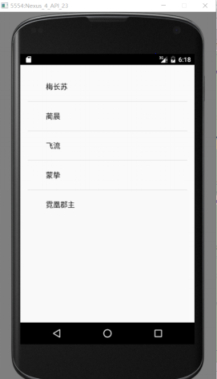
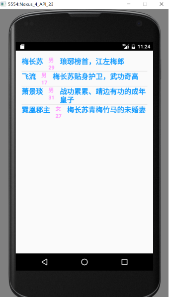

# Android中ListView的使用与优化(1501210925 姜昊)

作者：姜昊

学号：1501210925

学院：北京大学软件与微电子学院


## 摘要
ListView是Android控件中比较常用，比较难用的控件之一。ListView是一个用来纵向显示条目的视图,这些条目内容来自于与该ListView相关联的Adapter。手机通讯录、好友列表等面板的显示，都是用ListView控件实现的。  

关键字：ListView      Adapter       优化


## 正文
**1：引言**     
列表的显示需要三个元素：        
1．ListVeiw： 用来展示列表的View；      
2．Adapter：用来把数据映射到ListView上的中介；    
3．Data：具体的将被映射的字符串，图片，或者基本组件。   
**1.1：ListVeiw**     
一个ListView通常有两个职责。    
（1）将数据填充到布局；     
（2）处理用户的选择点击等操作。     
在布局文件中添加ListView控件：
```     
<ListView
    android:id="@+id/listview"
    android:layout_width="wrap_content"
    android:layout_height="wrap_content">
</ListView>```  
ListView的布局是由一条一条的Item组成的，每一个Item又是一个View。通过Adapter适配器将View添加到ListView中。
**1.2：Adapter**      
Adapter是连接后端数据和前端显示的适配器接口，是数据和UI（View）之间一个重要的纽带。在常见的View(List View,Grid View)等地方都需要用到Adapter。如下图直观的表达了Data、Adapter、View三者的关系：    
     
一个Adapter是View视图与数据之间的桥梁，Adapter提供对数据的访问，也负责为每一项数据产生一个对应的View。  
常用的Adapter有以下几种：   
* BaseAdapter是一个抽象类，继承它需要实现较多的方法，所以也就具有较高的灵活性；   
* ArrayAdapter支持泛型操作，最为简单，只能展示一行字；    
* SimpleAdapter有最好的扩充性，可以自定义出各种效果；     
* SimpleCursorAdapter可以适用于简单的纯文字型ListView，它需要Cursor的字段和UI的id对应起来。如需要实现更复杂的UI也可以重写其他方法。可以认为是SimpleAdapter对数据库的简单结合，可以方便地把数据库的内容以列表的形式展示出来。  

**2：ListView的实现**   
**2.1 ListView控件与ArrayAdapter适配器的实现**  
ArrayAdapter是android中自己定义好的一种适配器，将数据添加到自己定义的View中，View中只有一个TextView。具体步骤如下：   
1：定义要添加的数据，数据以数组形式存储，举例我们定义为String数组，用来存储人物姓名。   
```
String[] datelist ={"梅长苏","蔺晨","飞流","蒙挚","霓凰郡主"};```
2：创建ArrayAdapter对象，将数据添加到View中。   
```
ArrayAdapter arrayAdapter = new ArrayAdapter(MainActivity.this,
                        android.R.layout.simple_expandable_list_item_1,datelist);```    

在创建ArrayAdapter对象过程中就已经将数据添加到了View中。ArrayAdapter构造器如下：
```
public ArrayAdapter(Context context, @LayoutRes int resource, @NonNull T[] objects) {
    this(context, resource, 0, Arrays.asList(objects));
}```
在此构造器中，最终调用了ArrayAdapter的另一个构造器：
```
public ArrayAdapter(Context context, @LayoutRes int resource, @IdRes int textViewResourceId,
        @NonNull List<T> objects) {
    mContext = context;
    mInflater = LayoutInflater.from(context);
    mResource = mDropDownResource = resource;
    mObjects = objects;
    mFieldId = textViewResourceId;
}```
在此构造器中，将数据和View一一对应。    
第一个参数Context context是指创建ArrayAdapter的Activity，因此在此设为MainActivity.this。    
第二个参数int resource是指Item对应的布局文件，指要将数据以什么样的View显示在ListView中，此处使用android中自定义的一个View，当然我们可以自己定义我们想要的View，然后赋予第二个参数。   
其具体代码如下：
```
<?xml version="1.0" encoding="utf-8"?>
<TextView
    xmlns:android="http://schemas.android.com/apk/res/android"
    android:id="@android:id/text1"
    android:layout_width="match_parent"
    android:layout_height="?android:attr/listPreferredItemHeight"
android:paddingStart="?android:attr/expandableListPreferredItemPaddingLeft"
    android:textAppearance="?android:attr/textAppearanceListItem"
    android:gravity="center_vertical" />```

第三个参数T[] objects是指显示的数据。   
我们也可以用另一个构造器，第三个参数传入一个List：
```
public ArrayAdapter(Context context, @LayoutRes int resource, @NonNull List<T> objects)```
ArrayAdapter的使用就是基于这三步，其实总体来说，所有的Adapter适配器都是基于这三步。     
最终实现结果为：    
     
**2.2 ListView控件与SimpleAdapter适配器的实现**     
SimpleAdapter也是Android自己提供的一个Adapter适配器，SimpleAdapter可以使用我们自己定义的Item布局文件，首先来看一下SimpleAdapter的构造器： 
```
public SimpleAdapter(Context context, List<? extends Map<String, ?>> data,
        @LayoutRes int resource, String[] from, @IdRes int[] to) {
    mData = data;
    mResource = mDropDownResource = resource;
    mFrom = from;
    mTo = to;
    mInflater = (LayoutInflater) context.getSystemService(Context.LAYOUT_INFLATER_SERVICE);
}```
第一个参数 Context context是指当前的Activity，传入this即可；    
第二个参数 ```List<? extends Map<String,?>> data ``` 是指传入的数据类型必须是List集合，集合存放的数据类型必须是Map； 
第三个参数 int resource 是指View的布局文件，也就是要显示数据的View；    
第四个参数String[] from数据是以Map类型存放在List集合中，from参数是指存放在List中每条Map数据的键值集合；  
第五个参数int[] to是指每条Map类型的数据中的不同键值对应道不同的布局控件中。     
下面是SimpleAdapter的具体实现步骤：     
1：在Activity对应的布局文件中定义一个ListView控件。     
2：编写一个View 的布局文件，将数据以该View 的形式存放在ListView中，举例如下：
```
<?xml version="1.0" encoding="utf-8"?>
<LinearLayout
    xmlns:android="http://schemas.android.com/apk/res/android"
    android:orientation="horizontal"
    android:layout_width="match_parent"
    android:layout_height="match_parent"
    android:layout_margin="20dp"
    >
    <TextView
        android:id="@+id/name"
        android:layout_width="wrap_content"
        android:layout_height="wrap_content"
        android:text="姓名"
        android:textStyle="bold"
        android:textColor="#0e99ff"
        android:textSize="20sp"/>
    <LinearLayout
        android:layout_width="wrap_content"
        android:layout_height="wrap_content"
        android:orientation="vertical"
        android:layout_marginLeft="15dp"
        android:layout_marginRight="15dp">
        <TextView
            android:id="@+id/sex"
            android:layout_width="wrap_content"
            android:layout_height="wrap_content"
            android:text="性别"
            android:textStyle="bold"
            android:textColor="#ff99ff"
            android:textSize="15sp"/>
        <TextView
            android:id="@+id/age"
            android:layout_width="wrap_content"
            android:layout_height="wrap_content"
            android:text="年龄"
            android:textStyle="bold"
            android:textColor="#ff99ff"
            android:textSize="15sp"/>
    </LinearLayout>

    <TextView
        android:id="@+id/info"
        android:layout_width="wrap_content"
        android:layout_height="wrap_content"
        android:text="信息"
        android:textStyle="bold"
        android:textColor="#0e99ff"
        android:textSize="20sp"/>
</LinearLayout>```  
3:创建数据。创建List的集合存放Map类型的数据，并对其进行初始化。也可以从数据库中读取，存入List列表中。举例如下：
```
private HashMap<String,String> createDataItem(String name,String age,String sex,String info)
{
    HashMap<String,String> dataItem = new HashMap<String,String>();
    dataItem.put("name",name);
    dataItem.put("age",age);
    dataItem.put("sex",sex);
    dataItem.put("info",info);

    return dataItem;
}
private List<HashMap<String,String>> data = new ArrayList<HashMap<String,String>>();
data.add(createDataItem("梅长苏","29","男","琅琊榜首，江左梅郎"));
data.add(createDataItem("飞流","17","男","梅长苏贴身护卫，武功奇高"));
data.add(createDataItem("萧景琰","31","男","战功累累、靖边有功的成年皇子"));
data.add(createDataItem("霓凰郡主","27","女","梅长苏青梅竹马的未婚妻"));```
4：创建SimpleAdapter对象；
```
listview = (ListView)findViewById(R.id.listview);
String[] from = new String[]{"name","age","sex","info"};
int[] to = new int[]{R.id.name,R.id.age,R.id.sex,R.id.info};
data.add(createDataItem("梅长苏","29","男","琅琊榜首，江左梅郎"));
data.add(createDataItem("飞流","17","男","梅长苏贴身护卫，武功奇高"));
data.add(createDataItem("萧景琰","31","男","战功累累、靖边有功的成年皇子"));
data.add(createDataItem("霓凰郡主","27","女","梅长苏青梅竹马的未婚妻"));
SimpleAdapter simpleAdapter = new SimpleAdapter(MainActivity.this,data,R.layout.listview_item,from,to);```
5：设置适配器。
```
listview.setAdapter(simpleAdapter);```
结果显示为：    
     
显示有些简陋，具体细节可以根据自己的界面布局要求做具体调整。    
**2.3ListView控件与自定义适配器的实现**     
可能每一个条目中不会只有TextView，也可以有ImageView，此时我们需要用到自定义Adapter来实现。这是ListView中使用最多的一个Adapter适配器，可以根据自己的意愿去创建数据和数据的布局样式，使用方式灵活。下面我们来实现一下。  
1:首先我们先来创建我们需要的数据模型。创建一个人物类，包括的属性有人物照片id、人物姓名、人物年龄、人物性别、人物简介；
```
public class Person {
    private int image;
    private String name;
    private String age;
    private String sex;
    private String info;

    public Person(String name,String age,String sex,String info,int image)
    {
        this.name = name;
        this.age = age;
        this.sex = sex;
        this.info = info;
        this.image =image;
    }

    public int getImage() {
        return image;
    }

    public void setImage(int image) {
        this.image = image;
    }

    public String getName() {
        return name;
    }

    public void setName(String name) {
        this.name = name;
    }

    public String getAge() {
        return age;
    }

    public void setAge(String age) {
        this.age = age;
    }

    public String getSex() {
        return sex;
    }

    public void setSex(String sex) {
        this.sex = sex;
    }

    public String getInfo() {
        return info;
    }

    public void setInfo(String info) {
        this.info = info;
    }
}```

