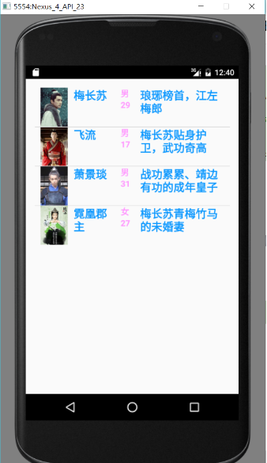
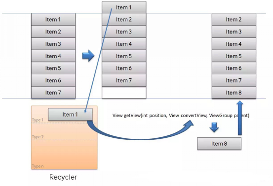

# Android中ListView的使用与优化(1501210925 姜昊)

作者：姜昊

学号：1501210925

学院：北京大学软件与微电子学院


## 摘要
ListView是Android控件中比较常用，比较难用的控件之一。ListView是一个用来纵向显示条目的视图,这些条目内容来自于与该ListView相关联的Adapter。手机通讯录、好友列表等面板的显示，都是用ListView控件实现的。  

关键字：ListView      Adapter       优化


## 正文
**1：引言**     
列表的显示需要三个元素：        
1．ListVeiw： 用来展示列表的View；      
2．Adapter：用来把数据映射到ListView上的中介；    
3．Data：具体的将被映射的字符串，图片，或者基本组件。   
**1.1：ListVeiw**     
一个ListView通常有两个职责。    
（1）将数据填充到布局；     
（2）处理用户的选择点击等操作。     
在布局文件中添加ListView控件：
```     
<ListView
    android:id="@+id/listview"
    android:layout_width="wrap_content"
    android:layout_height="wrap_content">
</ListView>```  
ListView的布局是由一条一条的Item组成的，每一个Item又是一个View。通过Adapter适配器将View添加到ListView中。
**1.2：Adapter**      
Adapter是连接后端数据和前端显示的适配器接口，是数据和UI（View）之间一个重要的纽带。在常见的View(List View,Grid View)等地方都需要用到Adapter。如下图直观的表达了Data、Adapter、View三者的关系：    
     
一个Adapter是View视图与数据之间的桥梁，Adapter提供对数据的访问，也负责为每一项数据产生一个对应的View。  
常用的Adapter有以下几种：   
* BaseAdapter是一个抽象类，继承它需要实现较多的方法，所以也就具有较高的灵活性；   
* ArrayAdapter支持泛型操作，最为简单，只能展示一行字；    
* SimpleAdapter有最好的扩充性，可以自定义出各种效果；     
* SimpleCursorAdapter可以适用于简单的纯文字型ListView，它需要Cursor的字段和UI的id对应起来。如需要实现更复杂的UI也可以重写其他方法。可以认为是SimpleAdapter对数据库的简单结合，可以方便地把数据库的内容以列表的形式展示出来。  

**2：ListView的实现**   
**2.1：ListView控件与ArrayAdapter适配器的实现**  
ArrayAdapter是android中自己定义好的一种适配器，将数据添加到自己定义的View中，View中只有一个TextView。具体步骤如下：   
1：定义要添加的数据，数据以数组形式存储，举例我们定义为String数组，用来存储人物姓名。   
```
String[] datelist ={"梅长苏","蔺晨","飞流","蒙挚","霓凰郡主"};```
2：创建ArrayAdapter对象，将数据添加到View中。   
```
ArrayAdapter arrayAdapter = new ArrayAdapter(MainActivity.this,
                        android.R.layout.simple_expandable_list_item_1,datelist);```    

在创建ArrayAdapter对象过程中就已经将数据添加到了View中。ArrayAdapter构造器如下：
```
public ArrayAdapter(Context context, @LayoutRes int resource, @NonNull T[] objects) {
    this(context, resource, 0, Arrays.asList(objects));
}```
在此构造器中，最终调用了ArrayAdapter的另一个构造器：
```
public ArrayAdapter(Context context, @LayoutRes int resource, @IdRes int textViewResourceId,
        @NonNull List<T> objects) {
    mContext = context;
    mInflater = LayoutInflater.from(context);
    mResource = mDropDownResource = resource;
    mObjects = objects;
    mFieldId = textViewResourceId;
}```
在此构造器中，将数据和View一一对应。    
第一个参数Context context是指创建ArrayAdapter的Activity，因此在此设为MainActivity.this。    
第二个参数int resource是指Item对应的布局文件，指要将数据以什么样的View显示在ListView中，此处使用android中自定义的一个View，当然我们可以自己定义我们想要的View，然后赋予第二个参数。   
其具体代码如下：
```
<?xml version="1.0" encoding="utf-8"?>
<TextView
    xmlns:android="http://schemas.android.com/apk/res/android"
    android:id="@android:id/text1"
    android:layout_width="match_parent"
    android:layout_height="?android:attr/listPreferredItemHeight"
android:paddingStart="?android:attr/expandableListPreferredItemPaddingLeft"
    android:textAppearance="?android:attr/textAppearanceListItem"
    android:gravity="center_vertical" />```

第三个参数T[] objects是指显示的数据。   
我们也可以用另一个构造器，第三个参数传入一个List：
```
public ArrayAdapter(Context context, @LayoutRes int resource, @NonNull List<T> objects)```
ArrayAdapter的使用就是基于这三步，其实总体来说，所有的Adapter适配器都是基于这三步。     
最终实现结果为：    
     
**2.2：ListView控件与SimpleAdapter适配器的实现**     
SimpleAdapter也是Android自己提供的一个Adapter适配器，SimpleAdapter可以使用我们自己定义的Item布局文件，首先来看一下SimpleAdapter的构造器： 
```
public SimpleAdapter(Context context, List<? extends Map<String, ?>> data,
        @LayoutRes int resource, String[] from, @IdRes int[] to) {
    mData = data;
    mResource = mDropDownResource = resource;
    mFrom = from;
    mTo = to;
    mInflater = (LayoutInflater) context.getSystemService(Context.LAYOUT_INFLATER_SERVICE);
}```
第一个参数 Context context是指当前的Activity，传入this即可；    
第二个参数 ```List<? extends Map<String,?>> data ``` 是指传入的数据类型必须是List集合，集合存放的数据类型必须是Map； 
第三个参数 int resource 是指View的布局文件，也就是要显示数据的View；    
第四个参数String[] from数据是以Map类型存放在List集合中，from参数是指存放在List中每条Map数据的键值集合；  
第五个参数int[] to是指每条Map类型的数据中的不同键值对应道不同的布局控件中。     
下面是SimpleAdapter的具体实现步骤：     
1：在Activity对应的布局文件中定义一个ListView控件。     
2：编写一个View 的布局文件，将数据以该View 的形式存放在ListView中，举例如下：
```
<?xml version="1.0" encoding="utf-8"?>
<LinearLayout
    xmlns:android="http://schemas.android.com/apk/res/android"
    android:orientation="horizontal"
    android:layout_width="match_parent"
    android:layout_height="match_parent"
    android:layout_margin="20dp"
    >
    <TextView
        android:id="@+id/name"
        android:layout_width="wrap_content"
        android:layout_height="wrap_content"
        android:text="姓名"
        android:textStyle="bold"
        android:textColor="#0e99ff"
        android:textSize="20sp"/>
    <LinearLayout
        android:layout_width="wrap_content"
        android:layout_height="wrap_content"
        android:orientation="vertical"
        android:layout_marginLeft="15dp"
        android:layout_marginRight="15dp">
        <TextView
            android:id="@+id/sex"
            android:layout_width="wrap_content"
            android:layout_height="wrap_content"
            android:text="性别"
            android:textStyle="bold"
            android:textColor="#ff99ff"
            android:textSize="15sp"/>
        <TextView
            android:id="@+id/age"
            android:layout_width="wrap_content"
            android:layout_height="wrap_content"
            android:text="年龄"
            android:textStyle="bold"
            android:textColor="#ff99ff"
            android:textSize="15sp"/>
    </LinearLayout>

    <TextView
        android:id="@+id/info"
        android:layout_width="wrap_content"
        android:layout_height="wrap_content"
        android:text="信息"
        android:textStyle="bold"
        android:textColor="#0e99ff"
        android:textSize="20sp"/>
</LinearLayout>```  
3:创建数据。创建List的集合存放Map类型的数据，并对其进行初始化。也可以从数据库中读取，存入List列表中。举例如下：
```
private HashMap<String,String> createDataItem(String name,String age,String sex,String info)
{
    HashMap<String,String> dataItem = new HashMap<String,String>();
    dataItem.put("name",name);
    dataItem.put("age",age);
    dataItem.put("sex",sex);
    dataItem.put("info",info);

    return dataItem;
}
private List<HashMap<String,String>> data = new ArrayList<HashMap<String,String>>();
data.add(createDataItem("梅长苏","29","男","琅琊榜首，江左梅郎"));
data.add(createDataItem("飞流","17","男","梅长苏贴身护卫，武功奇高"));
data.add(createDataItem("萧景琰","31","男","战功累累、靖边有功的成年皇子"));
data.add(createDataItem("霓凰郡主","27","女","梅长苏青梅竹马的未婚妻"));```
4：创建SimpleAdapter对象；
```
listview = (ListView)findViewById(R.id.listview);
String[] from = new String[]{"name","age","sex","info"};
int[] to = new int[]{R.id.name,R.id.age,R.id.sex,R.id.info};
data.add(createDataItem("梅长苏","29","男","琅琊榜首，江左梅郎"));
data.add(createDataItem("飞流","17","男","梅长苏贴身护卫，武功奇高"));
data.add(createDataItem("萧景琰","31","男","战功累累、靖边有功的成年皇子"));
data.add(createDataItem("霓凰郡主","27","女","梅长苏青梅竹马的未婚妻"));
SimpleAdapter simpleAdapter = new SimpleAdapter(MainActivity.this,data,R.layout.listview_item,from,to);```
5：设置适配器。
```
listview.setAdapter(simpleAdapter);```
结果显示为：    
     
显示有些简陋，具体细节可以根据自己的界面布局要求做具体调整。    
**2.3ListView控件与自定义适配器的实现**     
可能每一个条目中不会只有TextView，也可以有ImageView，此时我们需要用到自定义Adapter来实现。这是ListView中使用最多的一个Adapter适配器，可以根据自己的意愿去创建数据和数据的布局样式，使用方式灵活。下面我们来实现一下。  
1:首先我们先来创建我们需要的数据模型。创建一个人物类，包括的属性有人物照片id、人物姓名、人物年龄、人物性别、人物简介；
```
public class Person {
    private int image;
    private String name;
    private String age;
    private String sex;
    private String info;

    public Person(String name,String age,String sex,String info,int image)
    {
        this.name = name;
        this.age = age;
        this.sex = sex;
        this.info = info;
        this.image =image;
    }
    ······
}```
2：自定义Adapter，创建一个类继承BaseAdapter。BaseAdapter中有四个抽象的方法：public int getCount()，public Object getItem(int position)，public long getItemId(int position)，public View getView(int position,View convertView, ViewGroup viewGroup)，因此在我们继承BaseAdapter类后必须实现这四个方法。具体方法如下： 
```
public class MyAdapter extends BaseAdapter {

    private LayoutInflater mInflater;
    private List<Person> mData;
    private int resouceID;
    public MyAdapter(LayoutInflater inflater,int resouceID,List<Person> data)
    {
        this.mInflater = inflater;
        this.resouceID = resouceID;
        this.mData = data;
    }
    @Override
    public int getCount() {
        return mData.size();
    }

    @Override
    public Object getItem(int position) {
        return position;
    }

    @Override
    public long getItemId(int position) {
        return position;
    }

    @Override
    public View getView(int position, View convertView, ViewGroup parent) {
        View personView  = mInflater.inflate(resouceID, null);
        Person person = mData.get(position);//获取人物对象
        ImageView image= (ImageView)personView.findViewById(R.id.image);//获取每一个控件对象
        TextView  name = (TextView)personView.findViewById(R.id.name);
        TextView  age = (TextView)personView.findViewById(R.id.age);
        TextView  sex = (TextView)personView.findViewById(R.id.sex);
        TextView  info = (TextView)personView.findViewById(R.id.info);
        image.setImageResource(person.getImage());//将数据添加到布局控件中
        name.setText(person.getName());
        age.setText(person.getAge());
        sex.setText(person.getSex());
        info.setText(person.getInfo());

        return personView;
    }
}```
3：定义数据的布局方式，也就是数据的View，此过程在SimpleAdapter中已介绍，此处略过；  
4:在MainActivity中初始化数据，然后创建自定义的Adapter对象，通过setAdapter()方法将自定义的布局加载到ListView中。具体代码如下：    
```
private void initViews()
{
    listview = (ListView)findViewById(R.id.listview);
    data.add(new Person("梅长苏","29","男","琅琊榜首，江左梅郎",R.drawable.c001));
    data.add(new Person("飞流", "17", "男", "梅长苏贴身护卫，武功奇高",R.drawable.c002));
    data.add(new Person("萧景琰", "31", "男", "战功累累、靖边有功的成年皇子",R.drawable.c003));
    data.add(new Person("霓凰郡主", "27", "女", "梅长苏青梅竹马的未婚妻",R.drawable.c004));
    MyAdapter myAdapter = new MyAdapter(getLayoutInflater(),R.layout.listview_item,data);
    listview.setAdapter(myAdapter);
}```
结果展示：  
     
**3：ListView使用的优化**   
因为ArrayAdapter和Simplea是android中已定义好了的适配器，所以优化的空间不大。着重处理的是自定义Adapter适配器的优化。   
**3.1：convertView优化**    
使用自定义的adapter，会要重写getView方法，在getView方法产生给用户item的视图以及数据。有时候在ListView中显示的数据非常多，虽然手机的屏幕有限，数据可以通过滚动的方式显示。但如果大量的数据一次性加载完成，会降低数据的读取速度，增加占用的内存，那么可以通过convertView来解决这个问题。     
convertView是采用一种缓存的方式，数据加载时首先加载在手机屏幕上出现的View，当滑动手机屏幕时，会有View被划出屏幕，同时也会有新的View进入屏幕。此时convertView就将出屏的View保存下来作为下一个进入屏幕的新的View使用。        
Android中有个叫做Recycler的构件，如下： 
     
1：ListView先请求一个type1视图（getView），然后请求其他可见的item，convertView在getView中是null。   
2：当item1滚出屏幕，并且一个新的item从屏幕低端上来时，ListView再请求一个type1视图。convertView此时不再是null，它的值是item1。因此，只需设定新的数据然后返回convertView，不必新创建一个View，
所以对自定义的Adapter中getView 方法的优化如下： 
```
public View getView(int position, View convertView, ViewGroup parent) {
    if(convertView ==null){
        convertView = mInflater.inflate(resouceID, null);
    }
    Person person = mData.get(position);//获取人物对象
    ImageView image= (ImageView)convertView.findViewById(R.id.image);//获取每一个控件对象
    TextView  name = (TextView)convertView.findViewById(R.id.name);
    TextView  age = (TextView)convertView.findViewById(R.id.age);
    TextView  sex = (TextView)convertView.findViewById(R.id.sex);
    TextView  info = (TextView)convertView.findViewById(R.id.info);
    image.setImageResource(person.getImage());//将数据添加到布局控件中
    name.setText(person.getName());
    age.setText(person.getAge());
    sex.setText(person.getSex());
    info.setText(person.getInfo());

    return convertView;
}```        
**3.2：内部类ViewHolder优化**   
前面的getView方法会有一个缺点，就是每次在getVIew的时候，都需要重新的findViewById，重新找到控件，然后进行控件的赋值以及事件相应设置。这样其实在做重复的事情，因为geiview中，其实包含有这些控件，而且这些控件的id还都是一样的，也就是其实只要在view中findViewById一次，后面无需要每次都要findViewById了。此时可以定义一个内部类ViewHolder，通过ViewHolder将显示在ListView中的数据通过findViewById获取到然后在接下来不为空的convertView直接获取ViewHolder的Tag即可。这样可以不用每次都要findViewById了，减少了性能的消耗。同时重用了convertView，很大程度上的减少了内存的消耗。     
具体代码如下：
```
public View getView(int position, View convertView, ViewGroup parent) {
    ViewHolder viewHolder =null;
    Person person = mData.get(position);//获取人物对象
    if(convertView ==null){
        convertView = mInflater.inflate(resouceID, null);
        viewHolder = new ViewHolder();
        viewHolder.image= (ImageView)convertView.findViewById(R.id.image);//获取每一个控件对象
        viewHolder.name = (TextView)convertView.findViewById(R.id.name);
        viewHolder.age = (TextView)convertView.findViewById(R.id.age);
        viewHolder.sex = (TextView)convertView.findViewById(R.id.sex);
        viewHolder.info = (TextView)convertView.findViewById(R.id.info);
        //convertView为空时，ViewHolder将显示在ListView中的数据对应控件通过findViewById获得
        convertView.setTag(viewHolder);
    }
    else{
        //convertView不为空时，直接获取ViewHolder的Tag即可
        viewHolder =(ViewHolder)convertView.getTag();
    }
    viewHolder.image.setImageResource(person.getImage());//将数据添加到布局控件中
    viewHolder.name.setText(person.getName());
    viewHolder.age.setText(person.getAge());
    viewHolder.sex.setText(person.getSex());
    viewHolder.info.setText(person.getInfo());

    return convertView;
}
class ViewHolder
{
    ImageView image;
    TextView  name;
    TextView  age;
    TextView  sex;
    TextView  info;
}```    
**4:总结**  
ListView是android界面中非常常用的控件之一，其实ListView使用不难，难的地方在于与 其他控件的配合使用与交互。如全选与反选按钮的实现，list与右侧字母表顺序的结合，需要自己定义View控件来配合使用。因此，在使用控件的时候，应多思考控件是如何实现的，而不仅仅限于会用而已。多了解android界面后面做的工作和架构能使我们更好的把握控件，从而定义自己需要的控件。  

## 主要参考文档         

·[1]:http://my.oschina.net/u/1463230/blog/269252
·[2]:http://www.cnblogs.com/zhengbeibei/archive/2013/05/14/3078805.html


