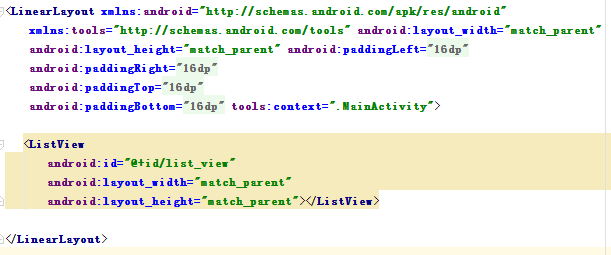

# Android中ListView异步加载图片乱序问题及解决办法（1501210985孙丛）

 ListView是Android所有常用原生控件中用法最为复杂的一个，用于处理元素太多时屏幕无法一次性全部展示的情况，但是在这个过程中ListView仅仅承担交互和展示工作，所需要的数据则来自于对应的Adapeter，Adapter可以说是连接ListView和数据源之间的桥梁。数据源的种类不是唯一的，这就涉及到了不同数据源的适配问题，但ListView不用去担心这个问题，因为Adapter是一个Interface(接口)，它的具体实现子类通过自己的具体代码去完成指定的功能及与指定数据源的适配操作，如ArrayAdapter是用于List类型的数据源和数组的适配，而SimpleCursorAdapter是用于游标类型的数据源适配。因为ListView使用的复杂性，在我们使用ListView加载图片时会遇到很多问题，其中有一个问题就是当我们使用ListView异步加载图片时会出现错位乱序的情况，这是一个常见的问题，那么我们该如何处理这个问题呢，解决问题前，我们首先来看一下这个问题。
 
实验过程：

一、要解决的问题

为了使问题重现，首先，我们搭建一个新的项目，然后新建一个Images类，在这个类里配置好所有图片将要用的URL地址(ListView从网络上请求图片)，这样就解决了数据源问题，将图片源设置好了。代码如下：

package pku.ss.suncong.listviewtest;

public class Images {
    public final static String[] imageUrls = new String[] {
            "http://img.my.csdn.net/uploads/201508/05/1438760758_3497.jpg",
            "http://img.my.csdn.net/uploads/201508/05/1438760758_6667.jpg",
            "http://img.my.csdn.net/uploads/201508/05/1438760757_3588.jpg",
            "http://img.my.csdn.net/uploads/201508/05/1438760756_3304.jpg",
            "http://img.my.csdn.net/uploads/201508/05/1438760755_6715.jpeg",
            "http://img.my.csdn.net/uploads/201508/05/1438760726_5120.jpg",
            "http://img.my.csdn.net/uploads/201508/05/1438760726_8364.jpg",
            "http://img.my.csdn.net/uploads/201508/05/1438760725_4031.jpg",
            "http://img.my.csdn.net/uploads/201508/05/1438760724_9463.jpg",
            "http://img.my.csdn.net/uploads/201508/05/1438760724_2371.jpg",
            "http://img.my.csdn.net/uploads/201508/05/1438760707_4653.jpg",
            "http://img.my.csdn.net/uploads/201508/05/1438760706_6864.jpg",
            "http://img.my.csdn.net/uploads/201508/05/1438760706_9279.jpg",
            "http://img.my.csdn.net/uploads/201508/05/1438760704_2341.jpg",
            "http://img.my.csdn.net/uploads/201508/05/1438760704_5707.jpg",
            "http://img.my.csdn.net/uploads/201508/05/1438760685_5091.jpg",
            "http://img.my.csdn.net/uploads/201508/05/1438760685_4444.jpg",
            "http://img.my.csdn.net/uploads/201508/05/1438760684_8827.jpg",
            "http://img.my.csdn.net/uploads/201508/05/1438760683_3691.jpg",
            "http://img.my.csdn.net/uploads/201508/05/1438760683_7315.jpg",
            "http://img.my.csdn.net/uploads/201508/05/1438760663_7318.jpg",
            "http://img.my.csdn.net/uploads/201508/05/1438760662_3454.jpg",
            "http://img.my.csdn.net/uploads/201508/05/1438760662_5113.jpg",
            "http://img.my.csdn.net/uploads/201508/05/1438760661_3305.jpg",
            "http://img.my.csdn.net/uploads/201508/05/1438760661_7416.jpg",
            "http://img.my.csdn.net/uploads/201508/05/1438760589_2946.jpg",
            "http://img.my.csdn.net/uploads/201508/05/1438760589_1100.jpg",
            "http://img.my.csdn.net/uploads/201508/05/1438760588_8297.jpg",
            "http://img.my.csdn.net/uploads/201508/05/1438760587_2575.jpg",
            "http://img.my.csdn.net/uploads/201508/05/1438760587_8906.jpg",
            "http://img.my.csdn.net/uploads/201508/05/1438760550_2875.jpg",
            "http://img.my.csdn.net/uploads/201508/05/1438760550_9517.jpg",
            "http://img.my.csdn.net/uploads/201508/05/1438760549_7093.jpg",
            "http://img.my.csdn.net/uploads/201508/05/1438760549_1352.jpg",
            "http://img.my.csdn.net/uploads/201508/05/1438760548_2780.jpg",
            "http://img.my.csdn.net/uploads/201508/05/1438760531_1776.jpg",
            "http://img.my.csdn.net/uploads/201508/05/1438760531_1380.jpg",
            "http://img.my.csdn.net/uploads/201508/05/1438760530_4944.jpg",
            "http://img.my.csdn.net/uploads/201508/05/1438760530_5750.jpg",
            "http://img.my.csdn.net/uploads/201508/05/1438760529_3289.jpg",
            "http://img.my.csdn.net/uploads/201508/05/1438760500_7871.jpg",
            "http://img.my.csdn.net/uploads/201508/05/1438760500_6063.jpg",
            "http://img.my.csdn.net/uploads/201508/05/1438760499_6304.jpeg",
            "http://img.my.csdn.net/uploads/201508/05/1438760499_5081.jpg",
            "http://img.my.csdn.net/uploads/201508/05/1438760498_7007.jpg",
            "http://img.my.csdn.net/uploads/201508/05/1438760478_3128.jpg",
            "http://img.my.csdn.net/uploads/201508/05/1438760478_6766.jpg",
            "http://img.my.csdn.net/uploads/201508/05/1438760477_1358.jpg",
            "http://img.my.csdn.net/uploads/201508/05/1438760477_3540.jpg",
            "http://img.my.csdn.net/uploads/201508/05/1438760476_1240.jpg",
            "http://img.my.csdn.net/uploads/201508/05/1438760446_7993.jpg",
            "http://img.my.csdn.net/uploads/201508/05/1438760446_3641.jpg",
            "http://img.my.csdn.net/uploads/201508/05/1438760445_3283.jpg",
            "http://img.my.csdn.net/uploads/201508/05/1438760444_8623.jpg",
            "http://img.my.csdn.net/uploads/201508/05/1438760444_6822.jpg",
            "http://img.my.csdn.net/uploads/201508/05/1438760422_2224.jpg",
            "http://img.my.csdn.net/uploads/201508/05/1438760421_2824.jpg",
            "http://img.my.csdn.net/uploads/201508/05/1438760420_2660.jpg",
            "http://img.my.csdn.net/uploads/201508/05/1438760420_7188.jpg",
            "http://img.my.csdn.net/uploads/201508/05/1438760419_4123.jpg",
    };
}

之后，我们就要来设置布局，在activity_main.xml布局中的LinearLayout中新添加一个ListView，用来存放所有的图片信息：

然后，定义一个image_item.xml布局来表示ListView中每一个子View的布局，其中只有一个ImageView控件来显示图片，默认情况下会显示一个默认图片，这样所有的布局就OK了：

<?xml version="1.0" encoding="utf-8"?>
<LinearLayout xmlns:android="http://schemas.android.com/apk/res/android"
    android:layout_width="match_parent" android:layout_height="match_parent">

    <ImageView
        android:id="@+id/image"
        android:layout_width="match_parent"
        android:layout_height="120dp"
        android:src="@drawable/empty_photo"
        android:scaleType="fitXY"/>

</LinearLayout>

数据源已经有了，布局也设好了，接下来，我们要新建ListView的适配器ImageAdapter，这样数据源和ListView之间才能进行数据交互。ImageAdapter类中有一个getView()方法，该方法先依据当前的位置信息拿到图片的URL地址，然后再使用inflate()这个方法将图片加载到image_item.xml布局中，并获得ImageView控件的实例，接着启动一个BitmapWorkerTask异步任务用于从网络上下载图片，最终将图片设置到ImageView上面。这个过程中为了避免图片占用过大的内存空间，我们采用了LruCache技术来进行内存控制管理，具体代码如下：
package pku.ss.suncong.listviewtest;

import android.content.Context;
import android.graphics.Bitmap;
import android.graphics.BitmapFactory;
import android.graphics.drawable.BitmapDrawable;
import android.os.AsyncTask;
import android.util.LruCache;
import android.view.LayoutInflater;
import android.view.View;
import android.view.ViewGroup;
import android.widget.ArrayAdapter;
import android.widget.ImageView;
import android.widget.ListView;

import java.net.HttpURLConnection;
import java.net.URL;

/**
 * Created by suc on 2015/12/14.
 */
public class ImageAdapter extends ArrayAdapter<String> {
    /**
     * 图片缓存技术的核心类，用于缓存所有下载好的图片，在程序内存达到设定值时会将最少最近使用的图片移除掉。
     */
    private LruCache<String, BitmapDrawable> mMemoryCache;
    
    public ImageAdapter(Context context, int resource, String[] objects) {
        super(context, resource, objects);
        // 获取应用程序最大可用内存
        int maxMemory = (int) Runtime.getRuntime().maxMemory();
        int cacheSize = maxMemory / 8;
        mMemoryCache = new LruCache<String, BitmapDrawable>(cacheSize) {
            @Override
            protected int sizeOf(String key, BitmapDrawable drawable) {
                    return drawable.getBitmap().getByteCount();
            }
        };
    }

    @Override
    public View getView(int position, View convertView, ViewGroup parent) {
        String url = (String) getItem(position);
        View view;
        if (convertView == null) {
            view = LayoutInflater.from(getContext()).inflate(R.layout.image_item, null);
        } else {
            view = convertView;
        }
        ImageView image = (ImageView) view.findViewById(R.id.image);
        BitmapDrawable drawable = getBitmapFromMemoryCache(url);
        if (drawable != null) {
            image.setImageDrawable(drawable);
        } else {
            BitmapWorkerTask task = new BitmapWorkerTask(image);
            task.execute(url);
        }
        return view;
    }

    /**
     * 将一张图片存储到LruCache中。
     *
     * @param key
     *            LruCache的键，这里传入图片的URL地址。
     * @param drawable
     *            LruCache的值，这里传入从网络上下载的BitmapDrawable对象。
     */
    public void addBitmapToMemoryCache(String key, BitmapDrawable drawable) {
        if (getBitmapFromMemoryCache(key) == null) {
            mMemoryCache.put(key, drawable);
        }
    }

    /**
     * 从LruCache中获取一张图片，如果不存在就返回null。
     *
     * @param key
     *            LruCache的键，这里传入图片的URL地址。
     * @return 对应传入键的BitmapDrawable对象，或者null。
     */
    public BitmapDrawable getBitmapFromMemoryCache(String key) {
        return mMemoryCache.get(key);
    }

    /**
     * 异步下载图片的任务。
     */
    class BitmapWorkerTask extends AsyncTask<String, Void, BitmapDrawable> {
        private ImageView mImageView;

        public BitmapWorkerTask(ImageView imageView) {
            mImageView = imageView;
        }

        @Override
        protected BitmapDrawable doInBackground(String... params) {
            String imageUrl = params[0];
            // 在后台开始下载图片
            Bitmap bitmap = downloadBitmap(imageUrl);
            BitmapDrawable drawable = new BitmapDrawable(getContext().getResources(), bitmap);
            addBitmapToMemoryCache(imageUrl, drawable);
            return drawable;
        }

        @Override
        protected void onPostExecute(BitmapDrawable drawable) {
            ImageView imageView = (ImageView) mListView.findViewWithTag(imageUrl);
            if (mImageView != null && drawable != null) {
                mImageView.setImageDrawable(drawable);
            }
        }

        /**
         * 建立HTTP请求，并获取Bitmap对象。
         *
         * @param imageUrl
         *            图片的URL地址
         * @return 解析后的Bitmap对象
         */
        private Bitmap downloadBitmap(String imageUrl) {
            Bitmap bitmap = null;
            HttpURLConnection con = null;
            try {
                URL url = new URL(imageUrl);
                con = (HttpURLConnection) url.openConnection();
                con.setConnectTimeout(5 * 1000);
                con.setReadTimeout(10 * 1000);
                bitmap = BitmapFactory.decodeStream(con.getInputStream());
            } catch (Exception e) {
                e.printStackTrace();
            } finally {
                if (con != null) {
                    con.disconnect();
                }
            }
            return bitmap;
        }

    }
}
最后，修改MainActivity中代码：
package pku.ss.suncong.listviewtest;

import android.app.Activity;
import android.os.Bundle;
import android.view.Menu;
import android.view.MenuItem;
import android.widget.ListView;

public class MainActivity extends Activity {

    private ListView listView;
    @Override
    protected void onCreate(Bundle savedInstanceState) {
        super.onCreate(savedInstanceState);
        setContentView(R.layout.activity_main);
        listView = (ListView) findViewById(R.id.list_view);
        ImageAdapter adapter = new ImageAdapter(this, 0, Images.imageUrls);
        listView.setAdapter(adapter);
    }

    @Override
    public boolean onCreateOptionsMenu(Menu menu) {
        // Inflate the menu; this adds items to the action bar if it is present.
        getMenuInflater().inflate(R.menu.menu_main, menu);
        return true;
    }

    @Override
    public boolean onOptionsItemSelected(MenuItem item) {
        // Handle action bar item clicks here. The action bar will
        // automatically handle clicks on the Home/Up button, so long
        // as you specify a parent activity in AndroidManifest.xml.
        int id = item.getItemId();

        //noinspection SimplifiableIfStatement
        if (id == R.id.action_settings) {
            return true;
        }

        return super.onOptionsItemSelected(item);
    }
}
还有在AndroidManifest.xml中要添加INTERNET权限：
<uses-permission android:name="android.permission.INTERNET" />
运行结果，我们会发现图片显示的位置有的有错误，而且图片会自动地变来变去，为什么会这样呢？
二、导致问题的原因

这是由ListView的工作原理导致的，因为不可能为每个图片都配置一个单独的ImageView控件，所以它借助RecycleBin机制实现了很好的生产者和消费者的模式，移出屏幕的子View将会很快被回收，并进入到RecycleBin当中进行缓存，然后新进入屏幕的子View则会优先利用从RecycleBin当中获取的缓存，这样的话不管我们有多少条数据需要显示，实际上屏幕上的子View其实也就来来回回那么几个。
每当界面上有新进入的元素时，就会调用getView()方法，来启动请求异步地从网络上获取图片，但是网络操作通常是比较慢的，当我们快速滑动ListView时就有可能出现某个位置上的元素进入屏幕后还没等图片下载完成，它就又被移出了屏幕，但是此时刚刚发起的图片请求有了响应，就会显示到当前位置上，可是我们已经移出了刚刚那个图片，当前位置应该被屏幕新进入的元素重新利用起来，当前显示的并不是我们现在想要的图片了，虽然他们位置不一样，但是因为共用一个ImageView实例，就会导致这样的图片乱序问题。
上面是移出元素时会发生图片乱序问题的解释，下面新进入元素也会有问题，屏幕上新进入的元素会发出一条网络请求来获取当前位置的图片，待图片下载完成后会配置到同样的ImageView上，所以就会出现先显示的是一张图片，一会儿又变成了另外一张图片的情况，也就是我们刚刚说的看到的图片会自动变来变去的情况。
以上就是导致问题出现的解释，既然已经知道了问题的原因，那我们该怎么解决这个问题呢？

三、解决办法

1.使用findViewWithTag

采用findViewWithTag来避免图片出现乱序的情况是一种比较通俗易懂的做法，顾名思义，这个方法就是根据Tag的名字来获取具备该Tag名的控件，先调用控件的setTag()方法来给控件配置一个Tag，然后我们再调用ListView的findViewWithTag()这个方法使用相同的Tag名来找回该控件。因为ListView中的ImageView控件都是重用的，移出屏幕的子View会很快被屏幕新进入的图片重新利用起来，这时getView()方法就会被再一次得到执行，而在getView()方法中会为这个ImageView控件设置一个新的Tag，这样老的Tag就会被覆盖掉，于是这时再调用findVIewWithTag()方法并传入老的Tag，返回的就会是null，而我们判断只有ImageView不等于null时才会设置图片，这样图片乱序的问题也就解决了。
方法确定了，那么我们来进行对问题的处理，我们只需要修改一下ImageAdapter类即可。需要定义一个mListView全局变量，然后修改getView()方法，在这个方法中判断全局变量mListView是否为空，若是就把参数parent赋值给它。getView()方法中还调用了ImageView的setTag()方法，并把当前位置图片的URL地址作为参数传了进去，这个是方便之后调用findViewWithTag()方法。之后需要修改BitmapWorkerTask的构造函数，这里不再是通过构造函数把ImageView的实例传进去了，而是在onPostExecute()方法当中通过ListView的findVIewWithTag()方法来去获取到ImageView控件的实例。判断下获取到的控件实例是否为空，若不为空就让图片显示到控件上。代码如下：
public class ImageAdapter extends ArrayAdapter<String> {
private ListView mListView;
    ......
public View getView(int position, View convertView, ViewGroup parent) {
        if (mListView == null) {
            mListView = (ListView) parent;
        }
        String url = (String) getItem(position);
        View view;
        if (convertView == null) {
            view = LayoutInflater.from(getContext()).inflate(R.layout.image_item, null);
        } else {
            view = convertView;
        }
        ImageView image = (ImageView) view.findViewById(R.id.image);
        image.setImageResource(R.drawable.empty_photo);
        image.setTag(url);
        BitmapDrawable drawable = getBitmapFromMemoryCache(url);
        if (drawable != null) {
            image.setImageDrawable(drawable);
        } else {
            BitmapWorkerTask task = new BitmapWorkerTask(image);
            task.execute(url);
        }
        return view;
    }
......
/**
* 异步下载图片的任务。
*/
class BitmapWorkerTask extends AsyncTask<String, Void, BitmapDrawable> {
        String imageUrl;
        private ImageView mImageView;

        public BitmapWorkerTask(ImageView imageView) {
            mImageView = imageView;
        }

        @Override
        protected BitmapDrawable doInBackground(String... params) {
            imageUrl = params[0];
            // 在后台开始下载图片
            Bitmap bitmap = downloadBitmap(imageUrl);
            BitmapDrawable drawable = new BitmapDrawable(getContext().getResources(), bitmap);
            addBitmapToMemoryCache(imageUrl, drawable);
            return drawable;
        }

        @Override
        protected void onPostExecute(BitmapDrawable drawable) {
            ImageView imageView = (ImageView) mListView.findViewWithTag(imageUrl);
            if (mImageView != null && drawable != null) {
                mImageView.setImageDrawable(drawable);
            }
        }
       ......
对问题进行解决后，运行结果如下：

   

2.使用弱引用关联
这种解决方案的本质是让ImageView和BitmapWorkerTask中建立一个双向关联，互相持有对方的引用，再通过适当的逻辑判断来解决图片乱序问题，这种双向关联为了防止内存泄露，采用弱引用的方式建立。
如何建立双向弱引用关联呢？BitmapWorkerTask指向ImageView的弱引用关联可以通过在BitmapWorkerTask中增加一个构造函数，并以ImageView作为其中的一个参数然后使用WeakReference对ImageView进行了一层包装来间接持有ImageView的引用；而ImageView指向BitmapWorkerTask的弱引用关联需要借助自定义AsyncDrawable类的方式来实现，它继承自BitmapDrawable，重写AsyncDrawable的构造函数，并将BitmapWorkerTask传入，这样就有了AsyncDrawable指向BitmapWorkerTask的关联，而AsyncDrawable可以通过ImageView的setImageDrawable()方法设置到ImageView中，这样ImageView就和AsyncDrawable关联起来了，这样通过AsyncDrawable就有了ImageView指向BitmapWorkerTask的弱引用关联。
有了关联了，现在要通过逻辑判断来防止出现图片乱序的情况，我们可以通过两个方法，一个是用getBitmapWorkerTask()方法，该方法可以依据传入的ImageView来获得它相对应的BitmapWorkerTask，内部的逻辑就是先获取ImageView相对应的AsyncDrawable，再通过AsyncDrawable获取对应的BitmapWorkerTask。另外一个是getAttachedImageView()方法，该方法直接通过BitmapWorkerTask获取当前所关联的ImageView，然后调用getBitmapWorkerTask()方法来获得该ImageView所对应的BitmapWorkerTask，最后判断，若获得的BitmapWorkerTask等于this，即若是当前的BitmapWorkerTask，则将ImageView返回，否则返回null。最后，在onPostExecute()方法当中，只需使用getAttachedImageView()方法获得的ImageView来显示图片就OK了。需要修改ImageAdapter后的代码如下：
public class ImageAdapter2 extends ArrayAdapter<String> {

        private ListView mListView;

        private Bitmap mLoadingBitmap;

        /**
         * 图片缓存技术的核心类，用于缓存所有下载好的图片，在程序内存达到设定值时会将最少最近使用的图片移除掉。 
         */
        private LruCache<String, BitmapDrawable> mMemoryCache;

        public ImageAdapter(Context context, int resource, String[] objects) {
            super(context, resource, objects);
            mLoadingBitmap = BitmapFactory.decodeResource(context.getResources(),
                    R.drawable.empty_photo);
            // 获取应用程序最大可用内存  
            int maxMemory = (int) Runtime.getRuntime().maxMemory();
            int cacheSize = maxMemory / 8;
            mMemoryCache = new LruCache<String, BitmapDrawable>(cacheSize) {
                @Override
                protected int sizeOf(String key, BitmapDrawable drawable) {
                    return drawable.getBitmap().getByteCount();
                }
            };
        }

        @Override
        public View getView(int position, View convertView, ViewGroup parent) {
            if (mListView == null) {
                mListView = (ListView) parent;
            }
            String url = getItem(position);
            View view;
            if (convertView == null) {
                view = LayoutInflater.from(getContext()).inflate(R.layout.image_item, null);
            } else {
                view = convertView;
            }
            ImageView image = (ImageView) view.findViewById(R.id.image);
            BitmapDrawable drawable = getBitmapFromMemoryCache(url);
            if (drawable != null) {
                image.setImageDrawable(drawable);
            } else if (cancelPotentialWork(url, image)) {
                BitmapWorkerTask task = new BitmapWorkerTask(image);
                AsyncDrawable asyncDrawable = new AsyncDrawable(getContext()
                        .getResources(), mLoadingBitmap, task);
                image.setImageDrawable(asyncDrawable);
                task.execute(url);
            }
            return view;
        }

        /**
         * 自定义的一个Drawable，让这个Drawable持有BitmapWorkerTask的弱引用。 
         */
        class AsyncDrawable extends BitmapDrawable {

            private WeakReference<BitmapWorkerTask> bitmapWorkerTaskReference;

            public AsyncDrawable(Resources res, Bitmap bitmap,
                                 BitmapWorkerTask bitmapWorkerTask) {
                super(res, bitmap);
                bitmapWorkerTaskReference = new WeakReference<BitmapWorkerTask>(
                        bitmapWorkerTask);
            }

            public BitmapWorkerTask getBitmapWorkerTask() {
                return bitmapWorkerTaskReference.get();
            }

        }

        /**
         * 获取传入的ImageView它所对应的BitmapWorkerTask。 
         */
        private BitmapWorkerTask getBitmapWorkerTask(ImageView imageView) {
            if (imageView != null) {
                Drawable drawable = imageView.getDrawable();
                if (drawable instanceof AsyncDrawable) {
                    AsyncDrawable asyncDrawable = (AsyncDrawable) drawable;
                    return asyncDrawable.getBitmapWorkerTask();
                }
            }
            return null;
        }

        /**
         * 取消掉后台的潜在任务，当认为当前ImageView存在着一个另外图片请求任务时 
         * ，则把它取消掉并返回true，否则返回false。 
         */
        public boolean cancelPotentialWork(String url, ImageView imageView) {
            BitmapWorkerTask bitmapWorkerTask = getBitmapWorkerTask(imageView);
            if (bitmapWorkerTask != null) {
                String imageUrl = bitmapWorkerTask.imageUrl;
                if (imageUrl == null || !imageUrl.equals(url)) {
                    bitmapWorkerTask.cancel(true);
                } else {
                    return false;
                }
            }
            return true;
        }

        /**
         * 将一张图片存储到LruCache中。 
         *
         * @param key
         *            LruCache的键，这里传入图片的URL地址。 
         * @param drawable
         *            LruCache的值，这里传入从网络上下载的BitmapDrawable对象。 
         */
        public void addBitmapToMemoryCache(String key, BitmapDrawable drawable) {
            if (getBitmapFromMemoryCache(key) == null) {
                mMemoryCache.put(key, drawable);
            }
        }

        /**
         * 从LruCache中获取一张图片，如果不存在就返回null。 
         *
         * @param key
         *            LruCache的键，这里传入图片的URL地址。 
         * @return 对应传入键的BitmapDrawable对象，或者null。 
         */
        public BitmapDrawable getBitmapFromMemoryCache(String key) {
            return mMemoryCache.get(key);
        }

        /**
         * 异步下载图片的任务。 
         *
         * @author guolin
         */
        class BitmapWorkerTask extends AsyncTask<String, Void, BitmapDrawable> {

            String imageUrl;

            private WeakReference<ImageView> imageViewReference;

            public BitmapWorkerTask(ImageView imageView) {
                imageViewReference = new WeakReference<ImageView>(imageView);
            }

            @Override
            protected BitmapDrawable doInBackground(String... params) {
                imageUrl = params[0];
                // 在后台开始下载图片  
                Bitmap bitmap = downloadBitmap(imageUrl);
                BitmapDrawable drawable = new BitmapDrawable(getContext().getResources(), bitmap);
                addBitmapToMemoryCache(imageUrl, drawable);
                return drawable;
            }

            @Override
            protected void onPostExecute(BitmapDrawable drawable) {
                ImageView imageView = getAttachedImageView();
                if (imageView != null && drawable != null) {
                    imageView.setImageDrawable(drawable);
                }
            }

            /**
             * 获取当前BitmapWorkerTask所关联的ImageView。 
             */
            private ImageView getAttachedImageView() {
                ImageView imageView = imageViewReference.get();
                BitmapWorkerTask bitmapWorkerTask = getBitmapWorkerTask(imageView);
                if (this == bitmapWorkerTask) {
                    return imageView;
                }
                return null;
            }

            /**
             * 建立HTTP请求，并获取Bitmap对象。 
             *
             * @param imageUrl
             *            图片的URL地址 
             * @return 解析后的Bitmap对象
             */
            private Bitmap downloadBitmap(String imageUrl) {
                Bitmap bitmap = null;
                HttpURLConnection con = null;
                try {
                    URL url = new URL(imageUrl);
                    con = (HttpURLConnection) url.openConnection();
                    con.setConnectTimeout(5 * 1000);
                    con.setReadTimeout(10 * 1000);
                    bitmap = BitmapFactory.decodeStream(con.getInputStream());
                } catch (Exception e) {
                    e.printStackTrace();
                } finally {
                    if (con != null) {
                        con.disconnect();
                    }
                }
                return bitmap;
            }

        }

    } 
    
    以上就是关于ListView异步加载图片乱序的问题。谢谢！
