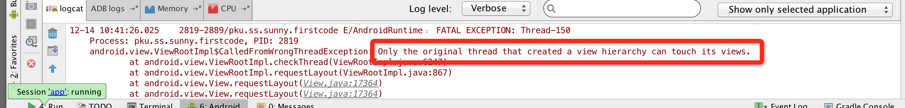

# Android中service的用法和地位

### 1501210986  孙晴

## 1.服务是什么
    
* 服务(Service)是Android中实现程序后台运行的解决方案,它非常适合用于去执行那 些**不需要和用户交互**而且还要求**长期运行**的任务。服务的运行不依赖于任何用户界面,即使 当程序被切换到后台,或者用户打开了另外一个应用程序,服务仍然能够保持正常运行。不过需要注意的是,服务并不是运行在一个独立的进程当中的,**而是依赖于创建服务时所在的应用程序进程**。当某个应用程序进程被杀掉时,所有依赖于该进程的服务也会停 止运行。另外,服务并不会自动开启线程,所有的代码 都是默认运行在主线程当中的。也就是说,我们需要在服务的内部手动创建子线程,并在这 里执行具体的任务,否则就有可能出现主线程被阻塞住的情况。我们就先来了解一下关于 Android 多线程编程的知识。

## 2.Android 多线程编程

* 多线程编程的重要性：

    当我们需要执行一些耗时操作,比如说发起一条网络请求时,考虑到网速等其他原因,服务器未必会立刻响应我们的请求,如果 不将这类操作放在子线程里去运行,就会导致主线程被阻塞住,从而影响用户对软件的正常使用。
   

### 2.1 线程的基本用法

定义一个线程只需要新建一个类继承自 Thread,然后重写父类的 run()方法,并在里面 编写耗时逻辑即可,如下所示:

        class MyThread extends Thread {
        @Override
            public void run() {
            // 处理具体的逻辑 
            }
        }
        
那么该如何启动这个线程呢?其实也很简单,只需要 new 出 MyThread 的实例,然后调 用它的 start()方法,这样 run()方法中的代码就会在子线程当中运行了,如下所示:

        new MyThread().start();
当然,使用继承的方式耦合性有点高,更多的时候我们都会选择使用实现 Runnable 接 口的方式来定义一个线程,如下所示:

        class MyThread implements Runnable {
        @Override
            public void run() {
            // 处理具体的逻辑 
            }
        }
如果使用了这种写法,启动线程的方法也需要进行相应的改变,如下所示:

        MyThread myThread = new MyThread();
        new Thread(myThread).start();
        
可以看到,Thread 的构造函数接收一个 Runnable 参数,而我们 new 出的 MyThread 正是 一个实现了 Runnable 接口的对象,所以可以直接将它传入到 Thread 的构造函数里。接着调用 Thread 的 start()方法,run()方法中的代码就会在子线程当中运行了。 当然,如果你不想专门再定义一个类去实现 Runnable 接口,也可以使用匿名类的方式,
这种写法更为常见,如下所示:

        new Thread(new Runnable() {
            @Override
            public void run() {
            // 处理具体的逻辑 
            }
        }).start();

### 2.2 在子线程中更新UI
和许多其他的 GUI 库一样,Android 的 UI 也是线程不安全的。也就是说,如果想要更新应用程序里的UI 元素,则必须在主线程中进行,否则就会出现异常。
眼见为实,让我们通过一个具体的例子来验证一下吧。新建一个 AndroidThreadTest项目,然后修改 activity_test_update_ui.xml 中的代码：

    <RelativeLayout xmlns:android="http://schemas.android.com/apk/res/android" android:layout_width="match_parent" android:layout_height="match_parent" >
            <Button
                android:id="@+id/change_text"
                android:layout_width="match_parent"
                android:layout_height="wrap_content"
                android:text="Change Text" />
            <TextView
                android:id="@+id/text"
                android:layout_width="wrap_content"
                android:layout_height="wrap_content"
                android:layout_centerInParent="true"
                android:text="Hello world"
                android:textSize="20sp" />
    </RelativeLayout>
布局文件中定义了两个控件,TextView 用于在屏幕的正中央显示一个 Hello world 字符串,Button 用于改变 TextView 中显示的内容,我们希望在点击 Button 后可以把 TextView 中 显示的字符串改成 Nice to meet you。
接下来修改 activity_test_update_ui 中的代码,如下所示:

    public class TestUpdateUi extends Activity implements OnClickListener {
            private TextView text;
            private Button changeText;
            @Override
            protected void onCreate(Bundle savedInstanceState) {
                super.onCreate(savedInstanceState);
                setContentView(R.layout.activity_main);
                text = (TextView) findViewById(R.id.text);
                changeText = (Button) findViewById(R.id.change_text);
                changeText.setOnClickListener(this);
            }
            @Override
            public void onClick(View v) {
                switch (v.getId()) {
                case R.id.change_text:
                    new Thread(new Runnable() {
                        @Override
                        public void run() {
                            text.setText("Nice to meet you");
                        }
                    }).start();
                    break;
                default:
                    break; 
                }
            } 
    }

可以看到,我们在 Change Text 按钮的点击事件里面开启了一个子线程,然后在子线程 中调用 TextView 的 setText()方法将显示的字符串改成 Nice to meet you。代码的逻辑非常简 单,只不过我们是在子线程中更新 UI 的。现在运行一下程序,并点击Change Text 按钮,程序果然崩溃了,如图 

由此证实了 Android 确实是不允许在子线程中进行 UI 操作的。但是有些时候,我们必 须在子线程里去执行一些耗时任务,然后根据任务的执行结果来更新相应的 UI 控件，对于这种情况,Android 提供了一套异步消息处理机制,完美地解决了在子线程中进行 UI 操作的问题。

修改 MainActivity 中的代码,如下所示:

    
    public class MainActivity extends Activity implements OnClickListener {
        public static final int UPDATE_TEXT = 1;
        private TextView text;
        private Button changeText;
        private Handler handler = new Handler() {
            public void handleMessage(Message msg) {
                switch (msg.what) {
                    case UPDATE_TEXT:
                        text.setText("Nice to meet you"); break;
                    default:
                        break;
    } }
    };
    ......
    
        @Override
        public void onClick(View v) {
            switch (v.getId()) {
                case R.id.change_text:
                    new Thread(new Runnable() {
                        @Override
                         public void run() {
                            Message message = new Message();
                            message.what = UPDATE_TEXT; handler.sendMessage(message); // 将Message对象发送出去
                        }
                    }).start();
                    break;
                default:
                    break;
             }
        }
    }
    
这里我们先是定义了一个整型常量 UPDATE_TEXT,用于表示更新 TextView 这个动作。 然后新增一个 Handler 对象,并重写父类的 handleMessage 方法,在这里对具体的 Message 进行处理。如果发现 Message 的 what 字段的值等于 UPDATE_TEXT,就将 TextView 显示的 内容改成 Nice to meet you。
下面再来看一下 Change Text 按钮的点击事件中的代码。可以看到,这次我们并没有在 子线程里直接进行 UI 操作,而是创建了一个 Message(android.os.Message)对象,并将它 的 what 字段的值指定为 UPDATE_TEXT,然后调用 Handler 的 sendMessage()方法将这条 Message 发送出去。很快,Handler 就会收到这条 Message,并在 handleMessage()方法中对它 进行处理。注意此时 handleMessage()方法中的代码就是在主线程当中运行的了,所以我们可 以放心地在这里进行 UI 操作。接下来对 Message 携带的 what 字段的值进行判断,如果等于 UPDATE_TEXT,就将 TextView 显示的内容改成 Nice to meet you。
现在重新运行程序,可以看到屏幕的正中央显示着 Hello world。然后点击一下 Change Text 按钮,显示的内容着就被替换成 Nice to meet you,如图

这样就掌握了 Android 异步消息处理的基本用法,使用这种机制就可以出色地解 决掉在子线程中更新 UI 的问题。我们就来 分析一下 Android 异步消息处理机制到底是如何工作的。

 

