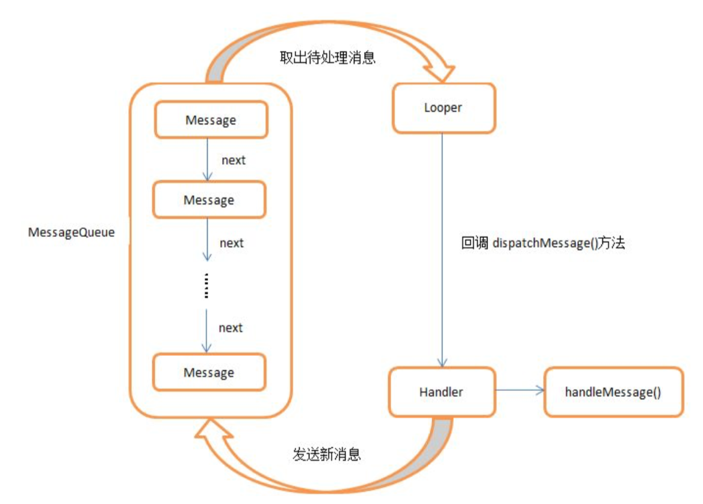

# Android中service的用法和地位

### 1501210986  孙晴

## 1.服务是什么
    
* 服务(Service)是Android中实现程序后台运行的解决方案,它非常适合用于去执行那 些**不需要和用户交互**而且还要求**长期运行**的任务。服务的运行不依赖于任何用户界面,即使 当程序被切换到后台,或者用户打开了另外一个应用程序,服务仍然能够保持正常运行。不过需要注意的是,服务并不是运行在一个独立的进程当中的,**而是依赖于创建服务时所在的应用程序进程**。当某个应用程序进程被杀掉时,所有依赖于该进程的服务也会停 止运行。另外,服务并不会自动开启线程,所有的代码 都是默认运行在主线程当中的。也就是说,我们需要在服务的内部手动创建子线程,并在这 里执行具体的任务,否则就有可能出现主线程被阻塞住的情况。我们就先来了解一下关于 Android 多线程编程的知识。

## 2.Android 多线程编程

* 多线程编程的重要性：

    当我们需要执行一些耗时操作,比如说发起一条网络请求时,考虑到网速等其他原因,服务器未必会立刻响应我们的请求,如果 不将这类操作放在子线程里去运行,就会导致主线程被阻塞住,从而影响用户对软件的正常使用。
   

### 2.1 线程的基本用法

定义一个线程只需要新建一个类继承自 Thread,然后重写父类的 run()方法,并在里面 编写耗时逻辑即可,如下所示:

        class MyThread extends Thread {
        @Override
            public void run() {
            // 处理具体的逻辑 
            }
        }
        
那么该如何启动这个线程呢?其实也很简单,只需要 new 出 MyThread 的实例,然后调 用它的 start()方法,这样 run()方法中的代码就会在子线程当中运行了,如下所示:

        new MyThread().start();
当然,使用继承的方式耦合性有点高,更多的时候我们都会选择使用实现 Runnable 接 口的方式来定义一个线程,如下所示:

        class MyThread implements Runnable {
        @Override
            public void run() {
            // 处理具体的逻辑 
            }
        }
如果使用了这种写法,启动线程的方法也需要进行相应的改变,如下所示:

        MyThread myThread = new MyThread();
        new Thread(myThread).start();
        
可以看到,Thread 的构造函数接收一个 Runnable 参数,而我们 new 出的 MyThread 正是 一个实现了 Runnable 接口的对象,所以可以直接将它传入到 Thread 的构造函数里。接着调用 Thread 的 start()方法,run()方法中的代码就会在子线程当中运行了。 当然,如果你不想专门再定义一个类去实现 Runnable 接口,也可以使用匿名类的方式,
这种写法更为常见,如下所示:

        new Thread(new Runnable() {
            @Override
            public void run() {
            // 处理具体的逻辑 
            }
        }).start();

### 2.2 在子线程中更新UI
和许多其他的 GUI 库一样,Android 的 UI 也是线程不安全的。也就是说,如果想要更新应用程序里的UI 元素,则必须在主线程中进行,否则就会出现异常。
眼见为实,让我们通过一个具体的例子来验证一下吧。新建一个 AndroidThreadTest项目,然后修改 activity_test_update_ui.xml 中的代码：

    <RelativeLayout xmlns:android="http://schemas.android.com/apk/res/android" android:layout_width="match_parent" android:layout_height="match_parent" >
            <Button
                android:id="@+id/change_text"
                android:layout_width="match_parent"
                android:layout_height="wrap_content"
                android:text="Change Text" />
            <TextView
                android:id="@+id/text"
                android:layout_width="wrap_content"
                android:layout_height="wrap_content"
                android:layout_centerInParent="true"
                android:text="Hello world"
                android:textSize="20sp" />
    </RelativeLayout>
布局文件中定义了两个控件,TextView 用于在屏幕的正中央显示一个 Hello world 字符串,Button 用于改变 TextView 中显示的内容,我们希望在点击 Button 后可以把 TextView 中 显示的字符串改成 Nice to meet you。
接下来修改 activity_test_update_ui 中的代码,如下所示:

    public class TestUpdateUi extends Activity implements OnClickListener {
            private TextView text;
            private Button changeText;
            @Override
            protected void onCreate(Bundle savedInstanceState) {
                super.onCreate(savedInstanceState);
                setContentView(R.layout.activity_main);
                text = (TextView) findViewById(R.id.text);
                changeText = (Button) findViewById(R.id.change_text);
                changeText.setOnClickListener(this);
            }
            @Override
            public void onClick(View v) {
                switch (v.getId()) {
                case R.id.change_text:
                    new Thread(new Runnable() {
                        @Override
                        public void run() {
                            text.setText("Nice to meet you");
                        }
                    }).start();
                    break;
                default:
                    break; 
                }
            } 
    }

可以看到,我们在 Change Text 按钮的点击事件里面开启了一个子线程,然后在子线程 中调用 TextView 的 setText()方法将显示的字符串改成 Nice to meet you。代码的逻辑非常简 单,只不过我们是在子线程中更新 UI 的。现在运行一下程序,并点击Change Text 按钮,程序果然崩溃了,如图 

由此证实了 Android 确实是不允许在子线程中进行 UI 操作的。但是有些时候,我们必 须在子线程里去执行一些耗时任务,然后根据任务的执行结果来更新相应的 UI 控件，对于这种情况,Android 提供了一套异步消息处理机制,完美地解决了在子线程中进行 UI 操作的问题。

修改 MainActivity 中的代码,如下所示:

    
    public class MainActivity extends Activity implements OnClickListener {
        public static final int UPDATE_TEXT = 1;
        private TextView text;
        private Button changeText;
        private Handler handler = new Handler() {
            public void handleMessage(Message msg) {
                switch (msg.what) {
                    case UPDATE_TEXT:
                        text.setText("Nice to meet you"); break;
                    default:
                        break;
    } }
    };
    ......
    
        @Override
        public void onClick(View v) {
            switch (v.getId()) {
                case R.id.change_text:
                    new Thread(new Runnable() {
                        @Override
                         public void run() {
                            Message message = new Message();
                            message.what = UPDATE_TEXT; handler.sendMessage(message); // 将Message对象发送出去
                        }
                    }).start();
                    break;
                default:
                    break;
             }
        }
    }
    
这里我们先是定义了一个整型常量 UPDATE_TEXT,用于表示更新 TextView 这个动作。 然后新增一个 Handler 对象,并重写父类的 handleMessage 方法,在这里对具体的 Message 进行处理。如果发现 Message 的 what 字段的值等于 UPDATE_TEXT,就将 TextView 显示的 内容改成 Nice to meet you。
下面再来看一下 Change Text 按钮的点击事件中的代码。可以看到,这次我们并没有在 子线程里直接进行 UI 操作,而是创建了一个 Message(android.os.Message)对象,并将它 的 what 字段的值指定为 UPDATE_TEXT,然后调用 Handler 的 sendMessage()方法将这条 Message 发送出去。很快,Handler 就会收到这条 Message,并在 handleMessage()方法中对它 进行处理。注意此时 handleMessage()方法中的代码就是在主线程当中运行的了,所以我们可 以放心地在这里进行 UI 操作。接下来对 Message 携带的 what 字段的值进行判断,如果等于 UPDATE_TEXT,就将 TextView 显示的内容改成 Nice to meet you。
现在重新运行程序,可以看到屏幕的正中央显示着 Hello world。然后点击一下 Change Text 按钮,显示的内容着就被替换成 Nice to meet you,如图

这样就掌握了 Android 异步消息处理的基本用法,使用这种机制就可以出色地解 决掉在子线程中更新 UI 的问题。我们就来 分析一下 Android 异步消息处理机制到底是如何工作的。

### 2.3 异步消息处理机制
Android 中的异步消息处理主要由四个部分组成,Message、Handler、MessageQueue 和 Looper。其中 Message 和 Handler 在上一小节中我们已经接触过了,而 MessageQueue 和 Looper 还是全新的概念,下面对这四个部分进行一下简要的介绍。
1. Message

    Message 是在线程之间传递的消息,它可以在内部携带少量的信息,用于在不同线
程之间交换数据。上一小节中我们使用到了 Message 的 what 字段,除此之外还可以使 用 arg1 和 arg2 字段来携带一些整型数据,使用 obj 字段携带一个 Object 对象。
2. Handler
    
    Handler 顾名思义也就是处理者的意思,它主要是用于发送和处理消息的。发送消 息一般是使用 Handler 的 sendMessage()方法,而发出的消息经过一系列地辗转处理后, 最终会传递到 Handler 的 handleMessage()方法中。
3. MessageQueue

    MessageQueue 是消息队列的意思,它主要用于存放所有通过 Handler 发送的消息。 这部分消息会一直存在于消息队列中,等待被处理。每个线程中只会有一个 MessageQueue 对象。
4. Looper

    Looper 是每个线程中的 MessageQueue 的管家,调用 Looper 的 loop()方法后,就会 进入到一个无限循环当中,然后每当发现 MessageQueue 中存在一条消息,就会将它取出,并传递到 Handler 的 handleMessage()方法中。每个线程中也只会有一个 Looper 对象。 
    
了解了 Message、Handler、MessageQueue 以及 Looper 的基本概念后,我们再来对异步消息处理的整个流程梳理一遍。
* 
需要在主线程当中创建一个 Handler 对象,并重写 handleMessage()方法。
* 
当子线程中需要进行 UI 操作时,就创建一个 Message 对象,并 通过 Handler 将这条消息发送出去。
* 
这条消息会被添加到 MessageQueue 的队列中等待被处理,而 Looper 则会一直尝试从 MessageQueue 中取出待处理消息
* 
分发回 Handler 的 handleMessage()方法中。

由于 Handler 是在**主线程**中创建的,所以此时 handleMessage()方 法中的代码也会在主线程中运行,于是我们在这里就可以安心地进行 UI 操作了。整个异步消息处理机制的流程示意图如图所示

一条 Message 经过这样一个流程的辗转调用后,也就从子线程进入到了主线程,从不能 更新 UI 变成了可以更新UI,整个异步消息处理的核心思想也就是如此。

### 2.4 AsyncTask
为了更加方便我们在子线程中对 UI 进行操作,Android 还提供了另外一些好用的工具,AsyncTask 就是其中之一。借助 AsyncTask,即使对异步消息处理机制完全不了解, 也可以十分简单地从子线程切换到主线程。当然,AsyncTask 背后的实现原理也是基于异步 消息处理机制的,只是 Android 帮我们做了很好的封装而已。
首先来看一下 AsyncTask 的基本用法,由于 AsyncTask 是一个抽象类,所以如果我们想 使用它,就必须要创建一个子类去继承它。在继承时我们可以为 AsyncTask 类指定三个泛型 参数,这三个参数的用途如下。
1. Params
在执行 AsyncTask 时需要传入的参数,可用于在后台任务中使用。
2. Progress
后台任务执行时,如果需要在界面上显示当前的进度,则使用这里指定的泛型作为进度单位。
3. Result
当任务执行完毕后,如果需要对结果进行返回,则使用这里指定的泛型作为返回值 类型。

因此,一个最简单的自定义 AsyncTask 就可以写成如下方式:

    class DownloadTask extends AsyncTask<Void, Integer, Boolean> {
    ......
    }
这里我们把 AsyncTask 的第一个泛型参数指定为 Void,表示在执行 AsyncTask 的时候不 需要传入参数给后台任务。

第二个泛型参数指定为 Integer,表示使用整型数据来作为进度显 示单位。

第三个泛型参数指定为 Boolean,则表示使用布尔型数据来反馈执行结果。

当然,目前我们自定义的 DownloadTask 还是一个空任务,并不能进行任何实际的操作, 我们还需要去重写 AsyncTask 中的几个方法才能完成对任务的定制。经常需要去重写的方法 有以下四个。
1. onPreExecute()
这个方法会在后台任务开始执行之前调用,用于进行一些界面上的**初始化操作**,比如显示一个进度条对话框等。
2. doInBackground(Params...)
这个方法中的所有代码都会在**子线程中运行**,我们应该在这里去处理所有的耗时任务。任务一旦完成就可以通过 return 语句来将任务的执行结果返回,如果 AsyncTask 的 第三个泛型参数指定的是 Void,就可以**不返回任务执行结果**。注意,在这个方法中是**不可以进行 UI 操作**的,如果需要更新 UI 元素,比如说反馈当前任务的执行进度,可以调 用 publishProgress(Progress...)方法来完成。
3. onProgressUpdate(Progress...)
当在后台任务中调用了 publishProgress(Progress...)方法后,这个方法就会很快被调
用,方法中携带的参数就是在后台任务中传递过来的。在这个方法中可以对 UI 进行操 作,利用参数中的数值就可以对界面元素进行相应地更新。
4. onPostExecute(Result)
当后台任务执行完毕并通过 return 语句进行返回时,这个方法就很快会被调用。返 回的数据会作为参数传递到此方法中,可以利用返回的数据来进行一些 UI 操作,比如 说提醒任务执行的结果,以及关闭掉进度条对话框等。
因此,一个比较完整的自定义 AsyncTask 就可以写成如下方式:

    class DownloadTask extends AsyncTask<Void, Integer, Boolean> {
        @Override 
        protected void onPreExecute() { 
            progressDialog.show(); // 显示进度对话框
        }
        @Override
        protected Boolean doInBackground(Void... params) {
            try {
                while (true) {
                    int downloadPercent = doDownload(); // 这是一个虚构的方法 publishProgress(downloadPercent);
                    if (downloadPercent >= 100) {
                    break; 
                    }
                }
            } catch (Exception e) {
                return false;
            }
            return true;
        }
        @Override
        protected void onProgressUpdate(Integer... values){
            // 在这里更新下载进度
            progressDialog.setMessage("Downloaded " + values[0] + "%");
        }
        @Override
        protected void onPostExecute(Boolean result) {
        progressDialog.dismiss(); // 关闭进度对话框 // 在这里提示下载结果
            if (result) {
                Toast.makeText(context, "Download succeeded",
                Toast.LENGTH_SHORT).show();
            } 
            else {
                Toast.makeText(context, " Download failed",
                Toast.LENGTH_SHORT).show();
            }
        } 
    }
    
在这个 DownloadTask 中,我们在 doInBackground()方法里去执行具体的下载任务。这个 方法里的代码都是在子线程中运行的,因而不会影响到主线程的运行。注意这里虚构了一个 doDownload()方法,这个方法用于计算当前的下载进度并返回,我们假设这个方法已经存在 了。在得到了当前的下载进度后,下面就该考虑如何把它显示到界面上了,由于 doInBackground()方法是在子线程中运行的,在这里肯定不能进行 UI 操作,所以我们可以调 用 publishProgress()方法并将当前的下载进度传进来,这样 onProgressUpdate()方法就会很快 被调用,在这里就可以进行 UI 操作了。
当下载完成后,doInBackground()方法会返回一个布尔型变量,这样 onPostExecute()方 法就会很快被调用,这个方法也是在主线程中运行的。然后在这里我们会根据下载的结果来 弹出相应的 Toast 提示,从而完成整个 DownloadTask 任务。
简单来说,使用 AsyncTask 的诀窍就是,在 doInBackground()方法中去执行具体的耗时 任务,在 onProgressUpdate()方法中进行 UI 操作,在 onPostExecute()方法中执行一些任务的 收尾工作。
  如果想要启动这个任务,只需编写以下代码即可:
    new DownloadTask().execute();
以上就是 AsyncTask 的基本用法,怎么样,是不是感觉简单方便了许多?我们并不需要 去考虑什么异步消息处理机制,也不需要专门使用一个 Handler 来发送和接收消息,只需要 调用一下 publishProgress()方法就可以轻松地从子线程切换到 UI 线程了。
## 3.服务的基本用法

### 3.1 定义一个服务

新建一个项目,然后在这个项目中
新增一个名为 MyService 的类,并让它继承自Service,代码如下所示:

    public class MyService extends Service {
            @Override
            public IBinder onBind(Intent intent) {
                return null;
            }
    }

目前 MyService 中可以算是空空如也,但有一个 onBind()方法特别醒目。这个方法是 Service 中唯一的一个抽象方法,所以必须要在子类里实现。
既然是定义一个服务,自然应该在服务中去处理一些事情了,那处理事情的逻辑应该写在哪里呢?这时就可以重写 Service 中的另外一些方法了,如下所示: 

    @Override
    public void onCreate() {
        super.onCreate();
    }
    @Override
    public int onStartCommand(Intent intent, int flags, int startId) {
        return super.onStartCommand(intent, flags, startId);
    }
    @Override
    public void onDestroy() {
        super.onDestroy();
    }
可以看到,这里我们又重写了 onCreate()、onStartCommand()和 onDestroy()这三个方法, 它们是每个服务中最常用到的三个方法了。其中 onCreate()方法会在**服务创建**的时候调用, onStartCommand()方法会在每次**服务启动**的时候调用,onDestroy()方法会在**服务销毁**的时候调用。
通常情况下,如果我们希望服务一旦启动就立刻去执行某个动作,就可以将逻辑写在 onStartCommand()方法里。而当服务销毁时,我们又应该在 onDestroy()方法中去回收那些不再使用的资源。
另外需要注意,每一个服务都需要在 AndroidManifest.xml 文件中进行注册才能生效,AndroidManifest.xml文件,代码如下所示:

    <service android:name=".MyService" >
    </service>
      
### 3.2 启动和停止服务
定义好了服务之后,接下来就应该考虑如何去启动以及停止这个服务。主要是借助 Intent 来实现的,修改 activity_test_service.xml 中的代码,如下所示:
    
    <Button
        android:id="@+id/start_service"
        android:layout_width="match_parent"
        android:layout_height="wrap_content"
        android:text="Start Service" />
    <Button
        android:id="@+id/stop_service"
        android:layout_width="match_parent"
        android:layout_height="wrap_content"
        android:text="Stop Service" />
TestService

    public class TestService extends Activity implements View.OnClickListener {
        private Button startService;
        private Button stopService;
        @Override
        protected void onCreate(Bundle savedInstanceState) {
            super.onCreate(savedInstanceState);
            setContentView(R.layout.activity_test_service);
            startService = (Button) findViewById(R.id.start_service);
            stopService = (Button) findViewById(R.id.stop_service);
            startService.setOnClickListener(this);
            stopService.setOnClickListener(this);
        }
        @Override
        public void onClick(View v) {
            switch (v.getId()) {
                case R.id.start_service:
                    Intent startIntent = new Intent(this, MyService.class); startService(startIntent); // 启动服务
                    break;
                case R.id.stop_service:
                    Intent stopIntent = new Intent(this, MyService.class); stopService(stopIntent); // 停止服务
                    break;
                default:
                    break;
            } 
        }
    }
    
可以看到,这里在 onCreate()方法中分别获取到了 Start Service 按钮和 Stop Service 按钮的实例,并给它们注册了点击事件。
然后在 Start Service 按钮的点击事件里,我们构建出了 一个 Intent 对象,并调用 startService()方法来启动 MyService 这个服务。在 Stop Serivce 按钮 的点击事件里,我们同样构建出了一个 Intent 对象,并调用 stopService()方法来停止 MyService 这个服务。**startService()和 stopService()方法都是定义在 Context 类**中的,所以我们在活动里 可以直接调用这两个方法。注意,这里完全是由活动来决定服务何时停止的,如果没有点击 Stop Service 按钮,服务就会一直处于运行状态。那服务有没有什么办法让自已停止下来呢? 当然可以,只需要在 MyService 的任何一个位置调用 **stopSelf()方法**就能让这个服务停止下来了。
在 MyService 的几个方法中加入打印日志
点击一下 Start Service 按钮,再点击 Stop Service 按钮,观察 LogCat 中的打印日志

onCreate()方法是在服务第一次创建的时候调用的,而 onStartCommand()方法则在 每次启动服务的时候都会调用,由于刚才我们是第一次点击 Start Service 按钮,服务此时还 未创建过,所以两个方法都会执行,之后如果你再连续多点击几次 Start Service 按钮,你就 会发现只有onStartCommand()方法可以得到执行了。  

### 3.3 活动和服务进行通信
在活动中指挥服务去干什么,服务就去干什么。需要借助 onBind()方法，比如在 MyService 里提供一个下载功能,然后在活动中可以决定何时开 始下载,以及随时查看下载进度。实现这个功能的思路是创建一个专门的Binder对象来对下载功能进行管理,修改 MyService 中的代码,如下所示:

    private DownloadBinder mBinder = new DownloadBinder();
        class DownloadBinder extends Binder {
            public void startDownload() {
                Log.d("MyService", "startDownload executed");
            }
            public int getProgress() {
                Log.d("MyService", "getProgress executed");
                return 0;
            }
        }
        @Override
        public IBinder onBind(Intent intent) {
            return mBinder;
        }
      
可以看到,这里我们新建了一个 DownloadBinder 类,并让它继承自 Binder,然后在它的内部提供了开始下载以及查看下载进度的方法。当然这只是两个模拟方法,并没有实现真 正的功能,我们在这两个方法中分别打印了一行日志。
接着,在 MyService 中创建了 DownloadBinder 的实例,然后在 **onBind()方法里返回了这个实例**,这样 MyService 中的工作就全部完成了。在活动中**调用服务里的这些方法**。首先需要在布局文件里新增两个按钮,修改 activity_main.xml 中的代码,加入两个按钮

        <Button
            android:id="@+id/bind_service"
            android:layout_width="match_parent"
            android:layout_height="wrap_content"
            android:text="Bind Service" />
        <Button
            android:id="@+id/unbind_service"
            android:layout_width="match_parent"
            android:layout_height="wrap_content"
            android:text="Unbind Service" />
这两个按钮分别是用于绑定服务和取消绑定服务的,那到底谁需要去和服务绑定呢?当然就是活动了。当一个活动和服务绑定了之后,就可以调用该服务里的 Binder 提供的方法了。 修改 TestService 中的代码,如下所示:

    private Button bindService;
    private Button unbindService;
    private MyService.DownloadBinder downloadBinder;
    private ServiceConnection connection = new ServiceConnection() {
        @Override
        public void onServiceDisconnected(ComponentName name) {
        }
        @Override
        public void onServiceConnected(ComponentName name, IBinder service) {
            downloadBinder = (MyService.DownloadBinder) service;
            downloadBinder.startDownload();
            downloadBinder.getProgress();
        }
    };
    
oncreate里
    
    bindService = (Button) findViewById(R.id.bind_service);
        unbindService = (Button) findViewById(R.id.unbind_service);
        bindService.setOnClickListener(this);
        unbindService.setOnClickListener(this);
        
onclick事件

            case R.id.bind_service:
                Intent bindIntent = new Intent(this, MyService.class);
                bindService(bindIntent, connection, BIND_AUTO_CREATE); // 绑定服务
                break;
            case R.id.unbind_service:
                unbindService(connection); // 解绑服务
                break;      
      
      
      
      
      
      
      
      
      
      
      
      
      
      
        
 
 
 

